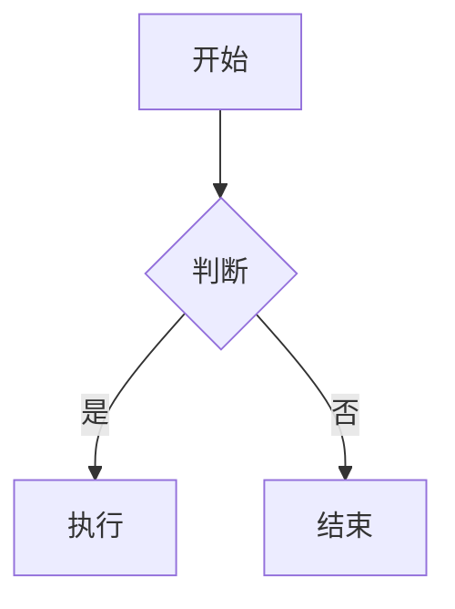

---

date: 2026-03-17
lastmod: 2026-03-18
title: '第一篇测试文章'

mermaid: true
math: true
tags:
  - 标签1
  - 标签2
categories:
  - 目录1
  - 目录2    

---

# 第一篇测试文章

## 二级测试标题

### 三级测试标题


这是正文测试
666666666666666666666

22222222222222222233333333333333333333333333


## 字体强调设置

*斜体测试 CTRL+i*

**加粗测试 ctrl+b**

*我是斜体*
**我是粗体**
***我是粗斜体***
~~我是删除线~~
<u>我是下划线</u>
==我是高亮标记==


## 列表设置

1. 一级列表
   1. 次级列表
   2. 次级列表2
2. 二级列表
3. 三级列表
4. 四级列表


- 无序列表
   - 次级无序列表 
- 无序列表2

## 任务事项

- [x] 已完成任务
- [ ] 未完成任务
- [ ] 待办事项


## 图片粘贴测试
图片粘贴测试

*图片测试*

## 公式测试

ctrl+M+M
段落插入公式

$$
公式测试  \lim_{x\to \infin}\frac{sin(t)}{x}=1
$$


ctrl+m正文插入公式 $\lim_{x\to \infin}\frac{sin(t)}{x}=1$  测试


## 表格测试

alt+shift+f快捷键自动格式化
默认左对齐
| 左对齐 | 居中 | 右对齐 |
|:----- |:---:| -----:|
| 内容   | 内容 | 内容  |


| 张三 | 李四 | 王五 |
| ---- | ---- | ---- |
| 3    | 4    | 5    |


## 链接粘贴测试

这是一个[链接](https://www.bilibili.com/video/av540702386/)


https://www.bilibili.com/video/av540702386/

[链接文字](https://www.bilibili.com/video/av540702386/)
[带提示的链接](https://www.bilibili.com/video/av540702386/ "鼠标悬停提示")

## 代码块测试


这是插入正文`std::cout<<"hello world"<<endl;`的代码

下面是代码块
```cpp
srd::cout<<"hello world"<<endl;
```


```python
s = “Python 语法高亮”print
```


```javascript
var s = “JavaScript 语法高亮”;
警报;
```

## 分割线


下面是分割线

---

这是分割线

这也是分割线
***


## 引用

引用：在需要有用的一行前加上>

>我是引用
>我是引用
>我是引用


> 一级引用
>> 二级引用
>>> 三级引用

## 其他小技巧

这里需要注释[^1]
[^1]: 这是脚注的详细说明


<!-- 这段内容不会显示在预览里 -->

<details>
<summary>点击展开查看</summary>
这里是折叠起来的内容
</details>


-
- 下面是流程图 / 时序图（Mermaid）



```
1. **强制换行**：行尾加 **两个空格** 再回车
2. **空格缩进**：用 `&emsp;` 表示中文全角空格
3. **特殊符号转义**：在 `* # _ ~ [ ] ( )` 前加 `\` 即可正常显示
4. **目录自动生成**：很多编辑器输入 `[toc]` 可自动生成目录
```

如果你常用某一款软件（比如 Typora、VSCode、语雀、GitHub），我可以再给你一份**对应平台专属的 MD 快捷键+技巧**。


## md文档发表

https://www.limfx.pro/ReadArticle/57/yi-zhong-xie-zuo-de-xin-fang-fa

