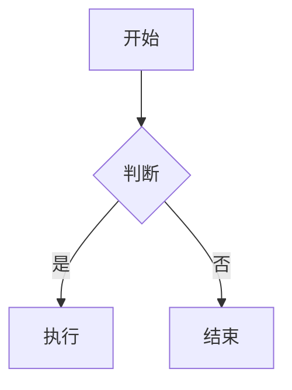

---

date: 2026-03-17
lastmod: 2026-03-18
title: '第一篇测试文章'

mermaid: true
math: true
tags:

categories:


---

# 第一篇测试文章

## 二级测试标题

### 三级测试标题


这是正文测试
666666666666666666666

22222222222222222233333333333333333333333333


## 字体强调设置

*斜体测试 CTRL+i*

**加粗测试 ctrl+b**

*我是斜体*
**我是粗体**
***我是粗斜体***
~~我是删除线~~
<u>我是下划线</u>
==我是高亮标记==


## 列表设置

1. 一级列表
   1. 次级列表
   2. 次级列表2
2. 二级列表
3. 三级列表
4. 四级列表


- 无序列表
   - 次级无序列表 
- 无序列表2

## 任务事项

- [x] 已完成任务
- [ ] 未完成任务
- [ ] 待办事项


## 快捷键测试

 `<kbd>自定义按键</kbd>，如：`

 
<kbd>ctrl</kbd>+<kbd>c</kbd>

## 图片粘贴测试
图片粘贴测试

*图片测试*

## 公式测试

ctrl+M+M
段落插入公式

$$
公式测试  \lim_{x\to \infin}\frac{sin(t)}{x}=1
$$


ctrl+m正文插入公式 $\lim_{x\to \infin}\frac{sin(t)}{x}=1$  测试


## 表格测试

alt+shift+f快捷键自动格式化
默认左对齐
| 左对齐 | 居中  | 右对齐 |
| :----- | :---: | -----: |
| 内容   | 内容  |   内容 |


| 张三 | 李四 | 王五 |
| ---- | ---- | ---- |
| 3    | 4    | 5    |


## 链接粘贴测试

这是一个[链接](https://www.bilibili.com/video/av540702386/)


https://www.bilibili.com/video/av540702386/

[链接文字](https://www.bilibili.com/video/av540702386/)
[带提示的链接](https://www.bilibili.com/video/av540702386/ "鼠标悬停提示")

## 代码块测试


这是插入正文`std::cout<<"hello world"<<endl;`的代码

下面是代码块
```cpp
srd::cout<<"hello world"<<endl;
```


```python
s = “Python 语法高亮”print
```


```javascript
var s = “JavaScript 语法高亮”;
警报;
```

## 分割线


下面是分割线

---

这是分割线

这也是分割线
***


## 引用

引用：在需要有用的一行前加上>

>我是引用
>我是引用
>我是引用


> 一级引用
>> 二级引用
>>> 三级引用

## 其他小技巧

这里需要注释[^1]
[^1]: 这是脚注的详细说明


<!-- 这段内容不会显示在预览里 -->



这里是折叠起来的内容



<details>
<summary>点击展开查看</summary>
这里是折叠起来的内容
</details>


-
- 下面是流程图 / 时序图（Mermaid）



```
1. **强制换行**：行尾加 **两个空格** 再回车
2. **空格缩进**：用 `&emsp;` 表示中文全角空格
3. **特殊符号转义**：在 `* # _ ~ [ ] ( )` 前加 `\` 即可正常显示
4. **目录自动生成**：很多编辑器输入 `[toc]` 可自动生成目录
```

如果你常用某一款软件（比如 Typora、VSCode、语雀、GitHub），我可以再给你一份**对应平台专属的 MD 快捷键+技巧**。


## md文档发表

https://www.limfx.pro/ReadArticle/57/yi-zhong-xie-zuo-de-xin-fang-fa


---

title: Markdown 语法指南
date: 2026-01-25
description: 展示基本 Markdown 语法和 HTML 元素格式的示例文章。
tags:
    - markdown
    - css
    - html
    - themes
categories:
    - Documentation
image: pawel-czerwinski-8uZPynIu-rQ-unsplash.jpg

---

这篇文章提供了可以在 Hugo 内容文件中使用的基本 Markdown 语法示例，同时也展示了 Hugo 主题中基本 HTML 元素是否应用了 CSS 装饰。

<!--more-->

## 标题 (Headings)

以下 HTML `<h1>`—`<h6>` 元素代表了六个级别的章节标题。`<h1>` 是最高级别，而 `<h6>` 是最低级别。

### H3
#### H4
##### H5
###### H6

## 段落 (Paragraph)

Xerum, quo qui aut unt expliquam qui dolut labo. Aque venitatiusda cum, voluptionse latur sitiae dolessi aut parist aut dollo enim qui voluptate ma dolestendit peritin re plis aut quas inctum laceat est volestemque commosa as cus endigna tectur, offic to cor sequas etum rerum idem sintibus eiur? Quianimin porecus evelectur, cum que nis nust voloribus ratem aut omnimi, sitatur? Quiatem. Nam, omnis sum am facea corem alique molestrunt et eos evelece arcillit ut aut eos eos nus, sin conecerem erum fuga. Ri oditatquam, ad quibus unda veliamenimin cusam et facea ipsamus es exerum sitate dolores editium rerore eost, temped molorro ratiae volorro te reribus dolorer sperchicium faceata tiustia prat.

Itatur? Quiatae cullecum rem ent aut odis in re eossequodi nonsequ idebis ne sapicia is sinveli squiatum, core et que aut hariosam ex eat.

## 引用 (Blockquotes)

引用元素代表从另一个来源引用的内容，可以选择带有引用说明（必须在 `footer` 或 `cite` 元素内），也可以选择带有行内更改（如注释和缩写）。

### 不带出处的引用

> Tiam, ad mint andaepu dandae nostion secatur sequo quae.
> **注意**：你可以在引用中使用 *Markdown 语法*。

### 带有出处的引用

> 不要通过共享内存来通信，而要通过通信来共享内存。<br>
> — <cite>Rob Pike[^1]</cite>

[^1]: 以上引用摘自 Rob Pike 在 2015 年 11 月 18 日 Gopherfest 期间的[演讲](https://www.youtube.com/watch?v=PAAkCSZUG1c)。

### 带提示的引用

> [!NOTE]
> 突出显示用户在快速浏览时也应注意的信息。

> [!TIP]
> 可选信息，帮助用户更顺利地完成任务。

> [!IMPORTANT]
> 用户成功所必需的关键信息。

> [!WARNING]
> 由于潜在风险而需要用户立即关注的关键内容。

> [!CAUTION]
> 某个操作可能带来的负面后果。

> [!NOTE] 自定义标题
> 如果你想使用自定义标题，可以在方括号后面添加标题文本，如上所示。

## 表格 (Tables)

表格虽然不是 Markdown 核心规范的一部分，但 Hugo 出箱即用地支持它们。

   | 姓名  | 年龄 |
   | ----- | ---- |
   | Bob   | 27   |
   | Alice | 23   |

### 表格内的行内 Markdown

| 斜体      | 加粗     | 代码   |
| --------- | -------- | ------ |
| *italics* | **bold** | `code` |

| A                                                        | B                                                                                                             | C                                                                                                                                    | D                                                 | E                                                          | F                                                                    |
| -------------------------------------------------------- | ------------------------------------------------------------------------------------------------------------- | ------------------------------------------------------------------------------------------------------------------------------------ | ------------------------------------------------- | ---------------------------------------------------------- | -------------------------------------------------------------------- |
| Lorem ipsum dolor sit amet, consectetur adipiscing elit. | Phasellus ultricies, sapien non euismod aliquam, dui ligula tincidunt odio, at accumsan nulla sapien eget ex. | Proin eleifend dictum ipsum, non euismod ipsum pulvinar et. Vivamus sollicitudin, quam in pulvinar aliquam, metus elit pretium purus | Proin sit amet velit nec enim imperdiet vehicula. | Ut bibendum vestibulum quam, eu egestas turpis gravida nec | Sed scelerisque nec turpis vel viverra. Vivamus vitae pretium sapien |

## 代码块 (Code Blocks)
### 使用反引号的代码块

```html
<!doctype html>
<html lang="en">
<head>
  <meta charset="utf-8">
  <title>Example HTML5 Document</title>
</head>
<body>
  <p>Test</p>
</body>
</html>
```

### 使用四个空格缩进的代码块

    <!doctype html>
    <html lang="en">
    <head>
      <meta charset="utf-8">
      <title>Example HTML5 Document</title>
    </head>
    <body>
      <p>Test</p>
    </body>
    </html>

### Diff 代码块

```diff
[dependencies.bevy]
git = "https://github.com/bevyengine/bevy"
rev = "11f52b8c72fc3a568e8bb4a4cd1f3eb025ac2e13"
- features = ["dynamic"]
+ features = ["jpeg", "dynamic"]
```

### 单行代码块

```html
<p>A paragraph</p>
```

## 列表类型 (List Types)

### 有序列表

1. 第一项
2. 第二项
3. 第三项

### 无序列表

* 列表项
* 另一项
* 还有一项

### 嵌套列表

* 水果
  * 苹果
  * 橘子
  * 香蕉
* 乳制品
  * 牛奶
  * 奶酪

## 其他元素 — abbr, sub, sup, kbd, mark

<abbr title="Graphics Interchange Format">GIF</abbr> 是一种位图图像格式。

H<sub>2</sub>O

X<sup>n</sup> + Y<sup>n</sup> = Z<sup>n</sup>

按 <kbd>CTRL</kbd> + <kbd>ALT</kbd> + <kbd>Delete</kbd> 结束会话。

大多数<mark>蝾螈</mark>是夜行性的，捕食昆虫、蠕虫和其他小型生物。


