---

date: 2026-03-21
lastmod: 2026-03-21
title: '【C语言】01 - 什么是C语言'

mermaid: true
math: true
tags:
  - 基础语法

categories:
  - C
   

---


# 计算机原理


## 计算机如何运行


用“厨房做饭”类比：

- 厨师（CPU）负责计算和指挥
- 灶台和锅（CPU内部）是厨师做菜（执行操作）的地方
- 临时放菜的菜板（CPU缓存）是存放即将下锅的食材（CPU待操作数据）的地方
- 厨房内放食材的桌子（内存）等待厨师（CPU）取用
- 冰箱（硬盘）存放食材（数据）
- 厨师按照菜谱（程序）一步步操作
- 厨师做好菜了端上餐桌（程序执行完毕输出结果）

## 计算机语言怎么来的
我们想吃什么菜需要用人类的语言和厨师交流；想要计算机做什么，也需要一种双方都能理解的语言——这就是**编程语言**。

### 机器语言与打孔纸带
最早的计算机使用打孔纸带输入程序。有孔代表1，无孔代表0，一条指令就是一串0和1的组合，例如 10110000 01100001。  
对于计算机来说，这些0和1是它唯一能理解的语言——**机器语言**。但对于人类，满纸的0和1就像天书，不仅难写，更难改。

### 汇编语言
为了让编程不那么痛苦，人们给每条机器指令起了简短的英文名，比如把 10110000 叫做 MOV（移动）。  
这样，上面那条指令就变成了 MOV AL, 61h。这种用助记符代替二进制指令的语言就是**汇编语言**。  
虽然可读性提高了，但每一条汇编指令仍然对应一条机器指令，写程序时还是得关心CPU内部的寄存器、内存地址等细节，而且不同CPU的汇编语言不通用。

### 高级语言的诞生
汇编语言已经比机器语言好很多，但用它写程序仍然像是在“事无巨细地指挥每一个动作”。

对于厨师（CPU）做菜来说汇编语言写的菜谱（程序）就像在事无巨细指挥所有步骤

使用汇编语言指挥厨师切菜
- 向前走五步，向左走三步，拿起土豆
- 向右走两步，把土豆放在距离菜板一端10cm的位置
- 拿起距离菜板20cm菜刀
- 用菜刀切下距离土豆一头1cm的地方
- 用菜刀切下距离土豆一头2cm的地方
- 用菜刀切.....

光指挥切菜就要耗费不少功夫，其他更复杂的事也需要更多的指令。为了更方便人机交流，后来就诞生了各种高级语言,c,Python，Java，C++，C#，JavaScript，Visual Basic等都是后来人们发明出的各种计算机语言，这些人能看懂、接近自然语言的编程语言都被称为高级语言

具体内容可看[视频](https://www.bilibili.com/video/BV1NN4y1s7AM "编程语言到底是如何演化至今的，你知道吗？【编程语言发展史｜仿生之旅】")自行扩展
 

# C语言入门

## 为什么从C开始

这是TIOBE发布的语言排行
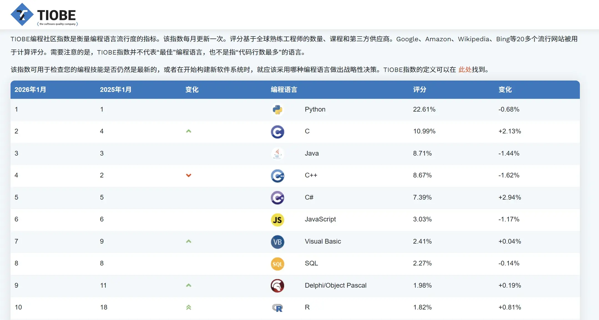
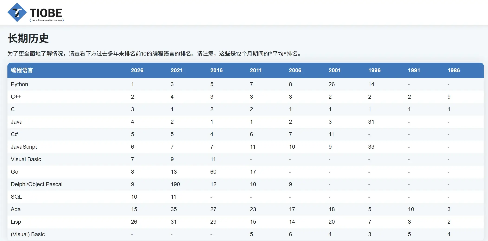


可以发现Python,c,Java,C++长期占据前四位，Python虽然目前排在第一，语法也简单易懂，但是封装程度较高，不适合学习计算机底层原理。
这4个语言里，C最早诞生，很多操作系统（如Linux）、嵌入式系统、数据库都是用C写的，从C开始上手学习可以更好地理解计算机底层原理。

## 如何开始写C语言

C语言是一门编译型计算机语言，C语言源代码都是文本文件，理论上鼠标右键点击新建文本文档就可以动手了
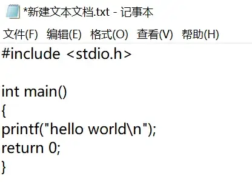

但是文本文件无法直接执行，需要有编译器充当人类和计算机之间的“翻译官”，把对应的C语言代码“翻译”为机器指令给CPU执行，在Windows上最后生成的可执行程序是.exe文件。
C语言代码是放在.c为后缀的文件中的，编译器拿到一个或多个.c文件，先翻译成目标文件（`.obj`），再经过**链接器**把多个目标文件和库合并，最后生成可执行文件。

目前主流的编译器有：
- **GCC** (GNU Compiler Collection) – 开源，跨平台
- **Clang/LLVM** – 苹果主导，编译速度快
- **MSVC** (Microsoft Visual C++) – 微软的编译器，对 Windows 平台支持最好


MSVC是微软的编译器，对于Windows 平台支持较好，故在Windows系统下优先选择MSVS上手

<!-- <details>
<summary>什么是Visual Studio</summary>
集成开发环境（IDE）是把编写代码、编译代码、调试代码、管理项目 等开发过程中需要的所有工具，都整合到一个可视化界面里的 “一站式工作台”  。
Visual Studio（简称 VS）是微软推出的集成开发环境（IDE），是 Windows 平台下开发 C/C++、C#、VB.NET等语言的首选工具，是目前功能最全面、生态最完善的商业级 IDE 之一。  
Visual Studio Community版本免费，功能完整，支持大多数开发场景，无商业使用限制（非企业级），适合	学生、开源开发者、个人使用
</details> -->



集成开发环境（IDE）是把编写代码、编译代码、调试代码、管理项目 等开发过程中需要的所有工具，都整合到一个可视化界面里的 “一站式工作台”  。
Visual Studio（简称 VS）是微软推出的集成开发环境（IDE），是 Windows 平台下开发 C/C++、C#、VB.NET等语言的首选工具，是目前功能最全面、生态最完善的商业级 IDE 之一。  
Visual Studio Community版本免费，功能完整，支持大多数开发场景，无商业使用限制（非企业级），适合	学生、开源开发者、个人使用



###   Visual Studio的安装使用
先在微软的[官网](https://visualstudio.microsoft.com/zh-hans/downloads/)下载免费的Visual Studio Community


只需要勾选 “使用C++的桌面开发”就足够学习使用
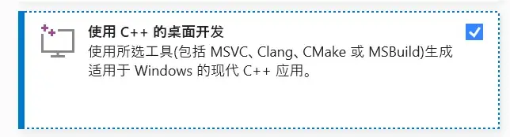

> 遇到登陆界面点跳过，不登陆微软账户也可使用


### 动手创建第一个C语言程序
安装好后打开 Visual Studio，点击“创建新项目”：
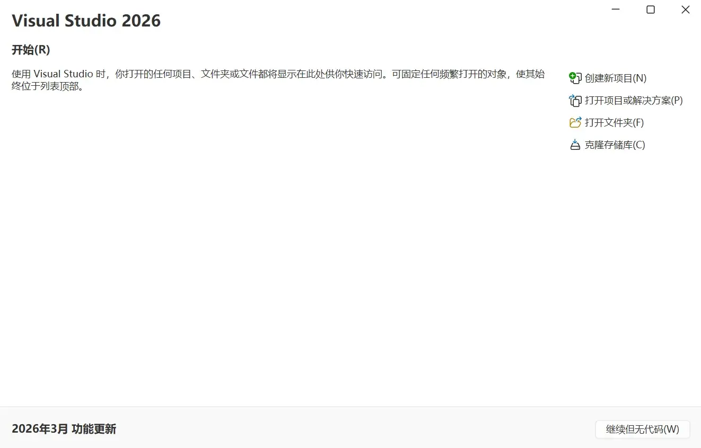

在模板中搜索“空项目”，双击打开：
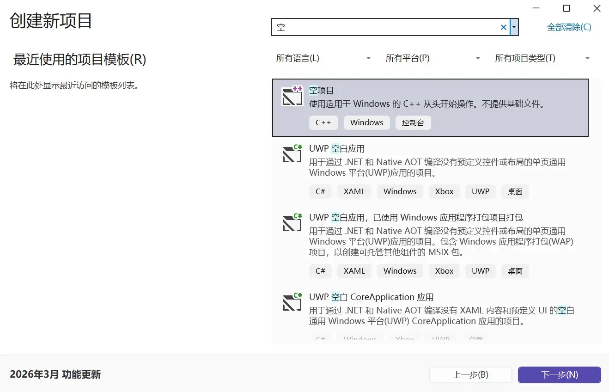

按需求给项目起名，选择合适的文件夹存放项目文件，点击“创建”：
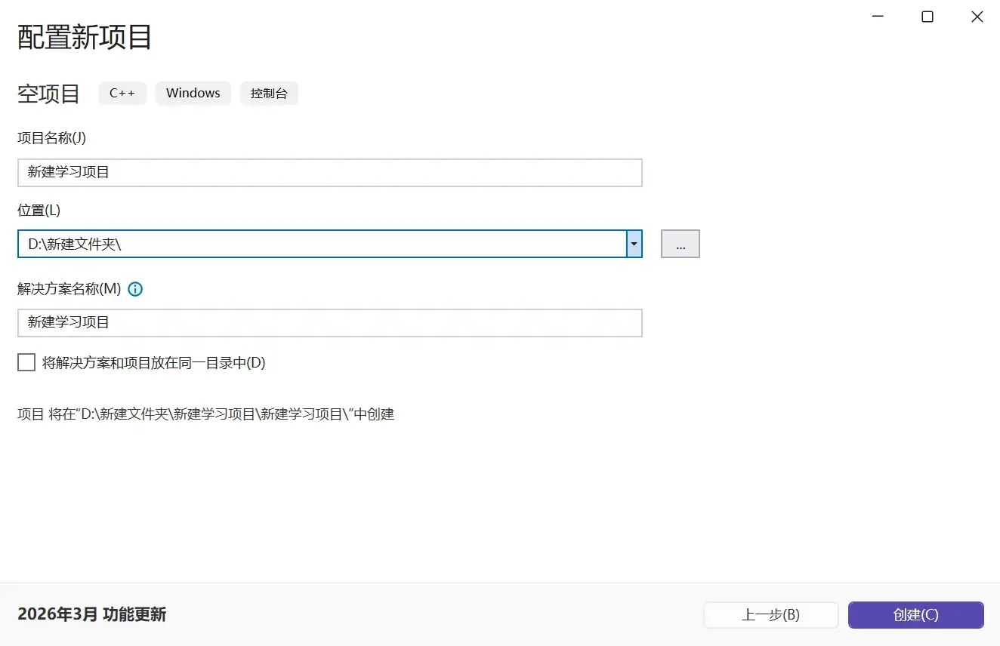

这样一个空项目就创建完毕了，接下来我们需要给项目添加一个源文件。
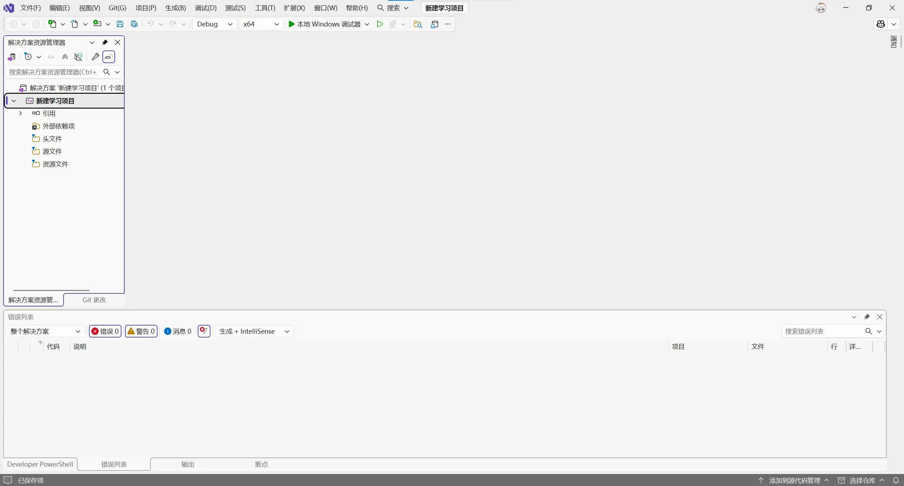


右键源文件文件夹，选择添加>新建项
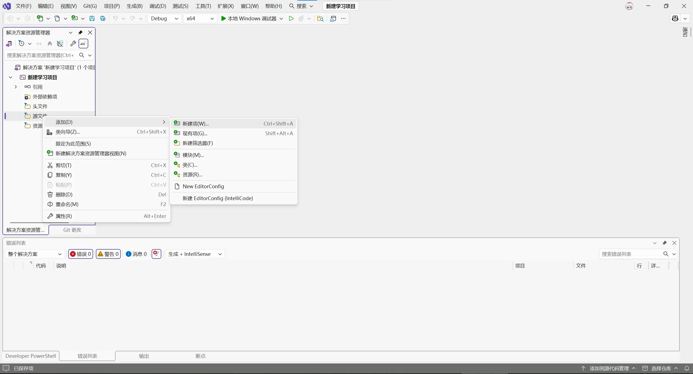


给文件起一个名字，**一定要把后缀名 `.cpp` 改成 `.c`**，这样 Visual Studio 才会按 C 语言规则编译。然后点击“添加”：


若点击了显示所有模板步骤也一样，起名+修改后缀为.c，然后添加
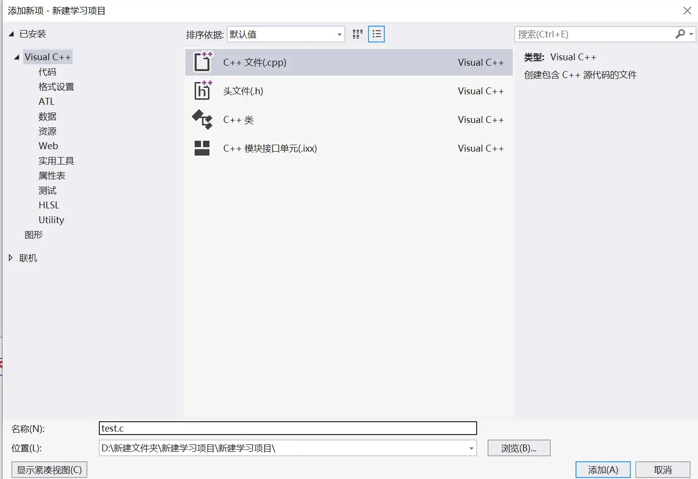


我们的第一个.c文件就创建好了，可以在里面写 C 语言代码了：
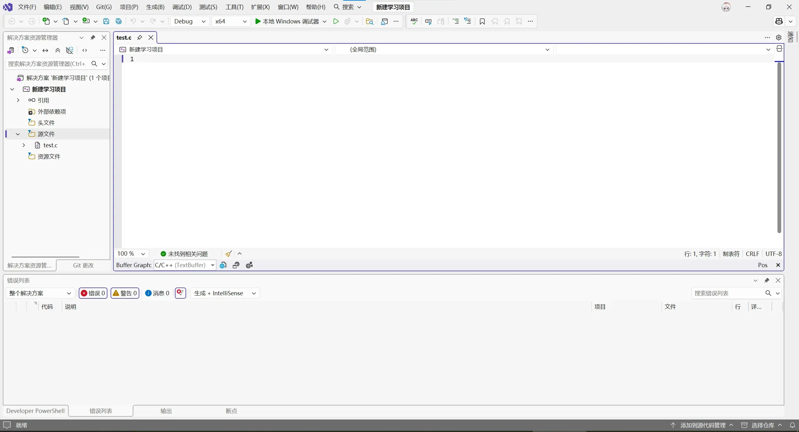

写入以下代码
```c
#include <stdio.h>
int main()
{
	printf("Hello, World!\n");
	return 0;
}
```
点击开始执行或使用ctrl+F5快捷键执行下面的代码
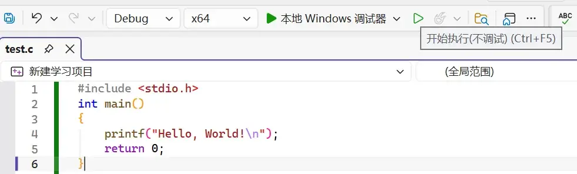

执行完毕后我们得到了输出"Hello, World!"
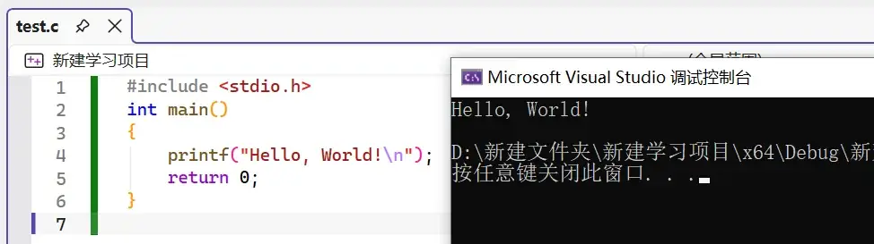

自此，我们得到了第一个C语言程序，今后创造的所有奇迹，均以这行小小的 *Hello, World!* 为起点