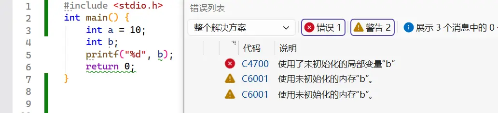

---

date: 2026-03-23
lastmod: 2026-03-23
title: '【C语言】03 - C语言数据类型，变量和运算符'


tags:
  - 基础语法

categories:
  - C
   

---

# C语言数据类型，变量和运算符


## 数据类型


### 基本数据类型

#### 整型（整数类型）

```c
short       //短整型
int         //整型
long        //长整型
long long   //长长整型
```

#### 浮点型（小数类型）
```c
float          //单精度浮点型
double         //双精度浮点型
long double    //长双精度浮点型
```

#### 字符型
字符实际上存储的是对应的 ASCII 码值。
```c
char    //字符型
```

### 数据在内存中的存储

- **位（bit）**：比特位，最小的单位，值为 0 或 1。
- **字节（byte）**：8 个比特位组成一个字节。
- 一个字节可以表示 0~255（无符号）或 -128~127（有符号）之间的整数。

不同数据占用的字节数不同，这就是 **数据类型** 的作用——告诉编译器：这个变量需要多大的内存，以及如何解释这些二进制数据。

#### `sizeof` 运算符

`sizeof` 是一个 **编译时运算符**（在 C99 之后，变长数组的 `sizeof` 在运行时计算），用于计算类型或变量所占的字节数。
```c
#include <stdio.h>

int main() {
    int a = 10;
    printf("int 类型的大小：%zu\n", sizeof(int));
    printf("变量 a 的大小：%zu\n", sizeof (a=a+5));   //sizeof 编译时运算,(a=a+5)不会被执行
    return 0;
}
```
`sizeof` 的返回值类型是 `size_t`，通常是一个无符号整型，用 %zu 打印（C99 引入）。

运行以下代码可以看到各种类型在内存中所占的字节数
```c
#include <stdio.h>

int main() {
    printf("char         : %zu\n", sizeof(char));
    printf("unsigned char: %zu\n", sizeof(unsigned char));
    printf("short        : %zu\n", sizeof(short));
    printf("int          : %zu\n", sizeof(int));
    printf("unsigned int : %zu\n", sizeof(unsigned int));
    printf("long         : %zu\n", sizeof(long));
    printf("long long    : %zu\n", sizeof(long long));
    printf("float        : %zu\n", sizeof(float));
    printf("double       : %zu\n", sizeof(double));
    printf("long double  : %zu\n", sizeof(long double));
    return 0;
}
```
VS2026下的运行结果
```
char         : 1
unsigned char: 1
short        : 2
int          : 4
unsigned int : 4
long         : 4
long long    : 8
float        : 4
double       : 8
long double  : 8
```

#### 什么是原码、反码、补码

计算机只会做加法，没有专门的减法器。为了实现减法（如 `a - b`），我们把它转化为加法：`a + (-b)`。  
因此，**我们需要一种能够将负数和正数统一用加法运算的编码方式**。

原码、反码、补码就是三种不同的二进制编码方案，用来表示有符号整数。  
其中，**补码**是目前计算机普遍采用的方式。

---

##### 原码（Sign-Magnitude）

**原码**是最直观的表示法：用最高位（最左边）表示符号（0 为正，1 为负），其余位表示数值的绝对值。

以 8 位二进制为例：

| 十进制 | 原码二进制 |
|--------|------------|
| +1     | 00000001   |
| -1     | 10000001   |
| +0     | 00000000   |
| -0     | 10000000   |
| +127   | 01111111   |
| -127   | 11111111   |

**特点**：
- 简单直观，人类容易理解。
- 存在 **正零** 和 **负零** 两种表示，浪费了一个编码。
- 加法规则复杂（需要先判断符号），计算机硬件实现成本高。

由于原码在运算时麻烦，计算机并不直接使用原码存储整数（但浮点数的尾数部分有时采用类似思想）。

---

##### 反码（Ones‘ Complement）

**反码**的规则：  
- 正数的反码与原码相同。
- 负数的反码是对其原码的数值位（除符号位外）逐位取反（0 变 1，1 变 0）。

仍以 8 位为例：

| 十进制 | 原码 | 反码 |
|--------|------|------|
| +1     | 00000001 | 00000001 |
| -1     | 10000001 | 11111110 |
| +0     | 00000000 | 00000000 |
| -0     | 10000000 | 11111111 |

**特点**：
- 解决了原码运算的部分问题，但仍有 **正零** 和 **负零**。
- 加法时，如果最高位有进位，需要循环进位（端回进位），硬件实现仍然复杂。
- 现代计算机也很少使用反码。

---

##### 补码（Two‘s Complement）

**补码**是目前所有现代计算机存储有符号整数的标准方式。

**规则**：
- 正数的补码与原码相同。
- 负数的补码 = 其反码 + 1（在反码的基础上加 1）。
- 补码的符号位同样是最高位，0 为正，1 为负。

8 位补码示例：

| 十进制 | 原码 | 反码 | 补码 |
|--------|------|------|------|
| +1     | 00000001 | 00000001 | 00000001 |
| -1     | 10000001 | 11111110 | 11111111 |
| +0     | 00000000 | 00000000 | 00000000 |
| -0     | 10000000 | 11111111 | 00000000 （溢出，舍去进位） |
| +127   | 01111111 | 01111111 | 01111111 |
| -127   | 11111111 | 10000000 | 10000001 |
| -128   | 无法表示 | 无法表示 | 10000000 |

**关键点**：
- **只有一个 0**（所有位为 0），`10000000` 被用来表示 **-128**，因此范围比原码多一个负数。
- 补码的加法规则非常简单：直接进行二进制加法，溢出舍弃最高位，结果就是正确的补码值。  
  例如：`-1 + 1` = `11111111 + 00000001 = 1 00000000`，舍去进位后得到 `00000000`（0）。

---

##### 补码的优势

1. **加法器统一**：无需区分正负，直接相加即可，硬件实现简单。
2. **唯一零表示**：避免了浪费，也让判断零更容易。
3. **范围对称**：例如 8 位补码范围是 `-128 ~ 127`，负数比正数多一个，没有浪费编码。
4. **减法转化为加法**：`a - b` 等价于 `a + (-b)`，直接用加法器计算。


#### signed 与 unsigned 的内存表示


在计算机中，整数以 **补码** 形式存储。  
- 对于 `signed` 类型，最高位（最左边）是符号位：0 表示正数或零，1 表示负数。
- 对于 `unsigned` 类型，所有位都用来表示数值，没有符号位。


以 8 位 `char` 为例：

| 二进制 | unsigned char 值 | signed char 值 |
|--------|------------------|----------------|
| 00000000 | 0 | 0 |
| 00000001 | 1 | 1 |
| ... | ... | ... |
| 01111111 | 127 | 127 |
| 10000000 | 128 | -128 |
| 10000001 | 129 | -127 |
| ... | ... | ... |
| 11111111 | 255 | -1 |

**关键点**：
- 相同的二进制序列，解释为 `unsigned` 或 `signed` 时，得到的数值不同。
- `unsigned` 类型只能表示非负数，但能表示的最大正数比同长度的 `signed` 大一倍（因为节省了符号位）。


| 类型 | 大小（字节） | 有符号范围 | 无符号范围 |
|------|--------------|------------|------------|
| `signed char` | 1 | -128 ~ 127 | — |
| `unsigned char` | 1 | — | 0 ~ 255 |
| `signed short` | 2 | -32768 ~ 32767 | — |
| `unsigned short` | 2 | — | 0 ~ 65535 |
| `signed int` | 4 | -2147483648 ~ 2147483647 | — |
| `unsigned int` | 4 | — | 0 ~ 4294967295 |
| `signed long` | 4 或 8（取决于平台） | 依平台而定 | — |
| `unsigned long` | 4 或 8 | — | 依平台而定 |

**注意**：
- `char` 的符号性由实现定义。如果需要明确的 1 字节无符号整数，用 `unsigned char`；需要有符号，用 `signed char`。
- 若不加任何修饰，`int` 就是 `signed int`。
- 当确信变量不会为负数时，使用 `unsigned` 可以获得更大的最大值。例如数组索引、大小、计数器等。

不同平台的数据类型最大最小值可能不同，C语言在头文件`limits.h` 中说明了整型类型的取值范围,头文件`float.h`这个中说明浮点型类型的取值范围。
当我们需要某种类型的极值时，可以使用以下头文件中定义好的常量
- `SCHAR_MIN` ，`SCHAR_MAX` ： `signed char` 的最小值和最大值。
- `SHRT_MIN ` ,`SHRT_MAX` ：`short` 的最小值和最大值。
- `INT_MAX`,`INT_MIN` ：`int` 的最小值和最大值。
- `LONG_MIN` ， `LONG_MAX` ： `long` 的最小值和最大值。
- `LLONG_MIN` ， `LLONG_MAX` ： `long long` 的最小值和最大值。
- `UCHAR_MAX` ： `unsigned char` 的最大值。
- `USHRT_MAX` : `unsigned short` 的最大值。
- `UINT_MAX` : `unsigned int` 的最大值。
- `ULoNG_MAX` : `unsigned long` 的最大值。
- `ULLoNG_MAX` : `unsigned long long` 的最大值。


## 变量

### 变量是什么？

**变量**，顾名思义，就是值可以改变的量,与此对应不变的值称为**常量**
在内存中，变量对应一块存储空间，我们可以通过变量名来读写这块空间。

你可以把变量想象成一个 **带标签的盒子**：
- 标签就是变量名（比如 `age`）。
- 盒子的大小由数据类型决定（比如 `int` 盒子能装一个整数）。
- 盒子里的内容就是变量的值（比如 `18`）。

```c
int a=10;   // 变量a的名字是'a'，类型是int，在内存中占4个字节，这里的10是常量
int b;
```
如上面的代码，定义变量时可以同时赋初值，称为初始化，若不初始化，则变量的值具体是什么则由编译器决定
```c
int b;
printf("%d", b);
```
在Visual Studio2026的环境下，使用未初始化的`b`会报错无法运行，建议创建变量时要初始化。



### 变量的分类

C 语言中，变量按作用域和生命周期可以分为两大类：局部变量 和 全局变量。

#### 局部变量

局部变量定义在函数内部（包括 `main` 函数）或代码块（`{}`）中。

特点：
- 作用域：从定义处开始，到所在的代码块结束。离开代码块后无法访问。
- 生命周期：进入代码块时创建，退出代码块时销毁。
- 未初始化时，值取决于编译器行为（不同平台可能不同）。
- 
不同函数中的局部变量可以同名，互不影响。
局部变量通常存储在 `栈` 中。

#### 全局变量
全局变量定义在所有函数外部（通常在文件开头）。
特点：
- 作用域：整个程序（从定义处到文件结束），可以被所有函数访问。
- 生命周期：从程序启动到结束。
- 未初始化时，默认值为 0（对于数值类型）或 '\0'（对于字符）。

如果局部变量与全局变量同名，在局部作用域内，会优先使用局部变量。
```c
int a = 10;   // 全局变量
int main() {
    int a = 20;   // 局部变量，覆盖全局变量
    printf("%d\n", a);   // 输出 20
    return 0;
}
```

#### 全局变量和局部变量在内存中的存储
内存中划分了很多区域
- 局部变量是放在内存的栈区
- 全局变量是放在内存的静态区
- 堆区是用来动态内存管理的


#### 作用域与生命周期

| 变量类型 | 作用域                 | 生命周期                | 默认初始值 |
| -------- | ---------------------- | ----------------------- | ---------- |
| 局部变量 | 定义它的代码块内       | 进入代码块 → 退出代码块 | 随机值     |
| 全局变量 | 整个程序（定义处开始） | 程序开始 → 程序结束     | 0          |
局部变量生命周期结束就销毁，所以局部变量生命周期结束就不要访问了
```c
// 错误示例：在作用域外访问局部变量
int main() {
    {
        int a = 20;
    }
    // printf("%d\n", a);   // 错误！a 已超出作用域
    return 0;
}
```

## 操作符

### 算术操作符

 


#### +,-,*,/，%
以下是加减乘除以及取模运行的示例
```c
int a = 2+3;     
int b = 30-25;
int c = 2*3; 

int d = 31/5;     //除法符号'/'两边是整数时，会抛弃结果的小数部分返回整数，这里d的值为6
int e = 5/6;      // 5小于6，整数部分为0，抛弃小数，e的值为0

int f = 31%5;     //整数的取模运算只取整除后的余数部分，31除5，得6余数为1，f的值为1
int g = 31%-5;    //取模运算结果的符号只看第一个数的正负，g的值为1
int h = -31%5;    //                                  h的值为-1      
int i = -31%-5;   //                                  i的值为-1 

```

#### 赋值'='
赋值操作符可以连续赋值
```c
int a = 2+3;  
int b = 4;
int c = b = a+6;
```
一般不建议连续赋值，写出的代码不容易理解，建议拆开
```c
int a = 2+3; 
int b = 4;
b = a+6;    
int c = b;
```

当我们需要对一个数自身进行操作时，可以使用复合赋值符
```c
int a =4; 
a += 6；       //等价于   a = a+6;
int  b = 7 ;
b-=5 ;        //等价于    b = b-5;
int c = 4; 
c *=5         //等价于    c = c*5;
int d = 10;
d /= 5;      //等价于     d = d/5; 
```


#### 单目操作符： ++,--,+,-
类似于上面的复合赋值，单目操作符只对一个数进行操作
```c
int a =4; 
a++；       //等价于   a +=1 ;
++a；       //等价于   a +=1 ;
            //--操作符同理
```

当`++`或`--`在操作数前面时，是先进行+1或-1，再使用操作数，当`++`或`--`在操作数后面时，是先使用操作数再进行+1或-1
```c
int a =4; 
int b = a++；       //先使用a给b赋值，b为4，a再+1 ;
int c = ++a；       //先给a+1，a的值为6，再赋值给c
                    //--操作符同理
```

单独使用`+`或`-`可以改变正负
```c
int a =4; 
int b = -4；
int c = +a；       //+(+a)最后c是正数
int d = +b；       //+(-b)最后d是负数
int e = -a；       //-(+a)最后e是负数
int e = -a；       //-(-b),负负得正，最后e是正数
```
可以发现，`+`运算符对结果没影响，`-`运算符可以改变正负

### 强制类型转换
在括号里面填上类型，如`(int)`,`(char)`,强制类型转换
```c
double  a = 3.14159;
int b = a;           //这里b和a的类型不同，编译器会警告
int c =(int)a;        //进行强制类型转换，会丢弃a的小数部分保留整数
```
强扭的瓜不甜，强制类型转换可能会丢失信息，要慎用

