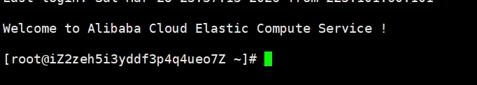

---

date: 2026-03-28T00:00:00+08:00
lastmod: 2026-03-30T00:00:00+08:00
title: '【Linux】02 - Linux基础命令'


tags:
  - 基础命令

categories:
  - Linux
   

---


# Linux基础命令

## 登录Linux

### Xshell的下载和使用
假如使用的是云服务器，我们可以使用Xshell这个终端软件来登录Linux。

[点击链接下载](https://www.xshell.com/zh/free-for-home-school/)Xshell，Xshell是商业软件，个人可免费使用，下载后选择安装目录安装，打开时遇到免费注册的弹窗可填邮箱注册或者点下面的“后来”按钮跳过。

打开Xshell后，输入 `ssh root@云服务器的IP`，这时会提示输入密码(password)，输入密码时不会在屏幕上显示，输入完了按回车确认，如果不知道密码可在云服务器厂商的控制面板处重置密码后再使用Xshell登录，注意**一定要设置复杂一点的密码**，有黑客会 24 小时不间断扫描所有IP，如果密码过于简单会很容易被黑客破解，黑客进入我们的服务器后会偷偷干坏事，所有**一定要设置复杂的密码**。


### cmd命令行登录
使用windows的cmd命令行也可以登录，使用win+R快捷键打开运行窗口，输入cmd，点确定，一样使用 `ssh root@云服务器的IP`这条命令，输入命令按回车键后会有确认的提示，输入yes，这时会提示输入密码(password)，输入密码时不会在屏幕上显示，输入完了按回车确认。

### 登录成功
当出现Welcome to Alibaba Cloud（不同厂商的提示不同）等提示时，说明登录成功，下面的`[root@iZ2zeh5i3yddf3p4q4ueo7Z ~]#`中，root是用户名，root代表管理员用户，@后面的是服务器名，可自己修改。



## 添加用户指令

使用管理员用户登录后，输入`adduser 这里填要加入的用户名`来添加一个用户，输入`passwd 这里填用户名`来修改对应用户的密码，设置好后，登录时就可以用刚刚添加的新用户登录。
```bash
[root@iZ2zeh5i3yddf3p4q4ueo7Z ~]# adduser newuser  #添加新用户
[root@iZ2zeh5i3yddf3p4q4ueo7Z ~]# passwd newuser   #设置用户的密码
Changing password for user newuser.
New password:              
Retype new password:         #输入两次相同的密码
passwd: all authentication tokens updated successfully.
```
如果不想要这个用户了，可以输入`userdel -r 这里填用户名`来删除对应的用户。
```bash
[root@iZ2zeh5i3yddf3p4q4ueo7Z ~]# userdel -r newuser  #删除对应的用户             
```

## pwd指令
输入`pwd`，可以查看当前所处的目录，每次登录时所处的目录是当前用户的家目录
```bash
[root@iZ2zeh5i3yddf3p4q4ueo7Z ~]# pwd
/root                          #当前用户是管理员用户root，登录后在/root目录下
[root@iZ2zeh5i3yddf3p4q4ueo7Z ~]# 
```

```bash
[user1@iZ2zeh5i3yddf3p4q4ueo7Z ~]$ pwd
/home/user1                    #当前用户是普通用户user1，登录后在/home/user1目录下
[user1@iZ2zeh5i3yddf3p4q4ueo7Z ~]$ 
```

## whoami指令
输入`whoami`，可以查看当前登录的用户是哪个。
```bash
[root@iZ2zeh5i3yddf3p4q4ueo7Z test]# whoami
root                                      #显示当前登录的用户是root
[root@iZ2zeh5i3yddf3p4q4ueo7Z test]# 
```


## clear指令
输入`clear`可以清屏。

## mkdir指令
输入`mkdir 新建目录名`可以新建一个目录（文件夹）。
```bash
[root@iZ2zeh5i3yddf3p4q4ueo7Z ~]# mkdir test  #新建名字为test的新目录
```
### -p选项
使用`mkdir -p 多层/目录/结构`可以同时创建多层目录。
```bash
[root@iZ2zeh5i3yddf3p4q4ueo7Z test]# mkdir -p 111/222/333/444    #创建多层结构
[root@iZ2zeh5i3yddf3p4q4ueo7Z test]# tree 111
111
└── 222
    └── 333
        └── 444

3 directories, 0 files
[root@iZ2zeh5i3yddf3p4q4ueo7Z test]# 
```


## cd指令
输入`cd 指定目录名`可以进入指定目录（文件夹）。
```bash
[root@iZ2zeh5i3yddf3p4q4ueo7Z ~]# cd test        #进入test目录
[root@iZ2zeh5i3yddf3p4q4ueo7Z test]# pwd
/root/test
[root@iZ2zeh5i3yddf3p4q4ueo7Z test]# 
```
### ~
输入`cd ~`可以直接进入当前用户的家目录。
```bash
[root@iZ2zeh5i3yddf3p4q4ueo7Z donk666]# cd ~
[root@iZ2zeh5i3yddf3p4q4ueo7Z ~]# pwd
/root                                      #进入/root目录
[root@iZ2zeh5i3yddf3p4q4ueo7Z ~]# 
```
```bash
[user1@iZ2zeh5i3yddf3p4q4ueo7Z ~]$ cd ~
[user1@iZ2zeh5i3yddf3p4q4ueo7Z ~]$ pwd
/home/user1                                #进入/home/user1  目录
[user1@iZ2zeh5i3yddf3p4q4ueo7Z ~]$ 
```

### -
输入`cd -`可以进入最近所处的目录。
```bash
[root@iZ2zeh5i3yddf3p4q4ueo7Z ~]# cd /root/test/donk666
[root@iZ2zeh5i3yddf3p4q4ueo7Z donk666]# cd ~
[root@iZ2zeh5i3yddf3p4q4ueo7Z ~]# pwd
/root
[root@iZ2zeh5i3yddf3p4q4ueo7Z ~]# cd -
/root/test/donk666                   #回到/root/test/donk666目录
[root@iZ2zeh5i3yddf3p4q4ueo7Z donk666]# 
```


## 显示当前目录下的文件ls指令
输入`ls`显示当前目录下的文件。
```bash
[root@iZ2zeh5i3yddf3p4q4ueo7Z test]# ls  #当前目录是空目录，所以什么都没有
[root@iZ2zeh5i3yddf3p4q4ueo7Z test]# 
```

```bash
[root@iZ2zeh5i3yddf3p4q4ueo7Z test]# mkdir donk666
[root@iZ2zeh5i3yddf3p4q4ueo7Z test]# ls
donk666                                      #创建一个新目录后，输入ls就显示出来了
[root@iZ2zeh5i3yddf3p4q4ueo7Z test]# 
```


### -l选项
一个命令后接` -命令行选项`代表命令行的不同选项，输入`ls -l`比`ls`命令可以多显示文件的属性，同时`ls -l`也可以简写为`ll`。**Linux中一切皆文件**，输入`ls -l`或`ll`显示文件的第一个字符就代表这个文件在Linux里面的属性，如第一个字符是`d`，代表这个文件是目录，Linux系统内核不以文件后缀名区分文件属性，运行的其他工具（如gcc编译器，压缩包解压工具等）才区分后缀名。
```bash
[root@iZ2zeh5i3yddf3p4q4ueo7Z test]# ls -l
total 4
drwxr-xr-x 2 root root 4096 Mar 29 00:29 donk666   #第一个字符是d，这是一个目录文件
[root@iZ2zeh5i3yddf3p4q4ueo7Z test]# 
```

### -a选项
`-a`选项代表显示包括**隐藏文件**在内的所有文件，大部分命令行的选项非常自由，`ls -l -a`,`ls -a -l`,`ls -la`,`ls -al`执行效果都是一样的，怎么方便顺手就怎么用。
```bash
[root@iZ2zeh5i3yddf3p4q4ueo7Z test]# ls -la
total 12
drwxr-xr-x  3 root root 4096 Mar 29 00:40 .      #当前目录
dr-xr-x---. 7 root root 4096 Mar 29 00:16 ..     #上级目录
drwxr-xr-x  2 root root 4096 Mar 29 00:29 donk666
-rw-r--r--  1 root root    0 Mar 29 00:40 niko.txt
[root@iZ2zeh5i3yddf3p4q4ueo7Z test]# 
```

在Linux中，系统会为每个目录创建两个隐藏文件，`.`代表的是当前目录，`..`代表上级目录，可以使用`cd .`进入当前目录，`cd ..`回退到上级目录，一直使用`cd ..`可以回退到`/`目录，也就是Linux系统的根目录，windows中使用\代表路径分隔符，Linux中使用/代表路径分隔符，Linux的文件结构是一颗从根目录`/`开始的多叉树结构，叶子节点一定是普通文件或空目录，非叶子节点一定是非空目录；以`/`开始定位一个文件称为绝对路径，以非`/`为参照位置定位文件称为相对路径，

使用`ls`还可以显示指定目录下的文件
```bash
[root@iZ2zeh5i3yddf3p4q4ueo7Z test]# ls /home  #使用绝对路径，显示home目录下的文件
admin  user1
[root@iZ2zeh5i3yddf3p4q4ueo7Z test]# 
```
```bash
[root@iZ2zeh5i3yddf3p4q4ueo7Z ~]# ls /root/test  #使用绝对路径，显示/root/test目录下的文件
donk666  niko.txt
[root@iZ2zeh5i3yddf3p4q4ueo7Z ~]# 
```
```bash
[root@iZ2zeh5i3yddf3p4q4ueo7Z test]# cd donk666
[root@iZ2zeh5i3yddf3p4q4ueo7Z donk666]# pwd
/root/test/donk666
[root@iZ2zeh5i3yddf3p4q4ueo7Z donk666]# ll ../niko.txt    #使用相对路径，显示上级目录里的niko.txt文件
-rw-r--r-- 1 root root 0 Mar 29 00:40 ../niko.txt
[root@iZ2zeh5i3yddf3p4q4ueo7Z donk666]# 
```
### -d选项
使用`-d`选项可以只查看目录文件本身，不查看目录内的其他文件
```bash
[root@iZ2zeh5i3yddf3p4q4ueo7Z test]# ls -d /root/test
/root/test                                          #-d只查看了目录文件
[root@iZ2zeh5i3yddf3p4q4ueo7Z test]# ls /root/test
donk666  niko.txt                                   #没有-d显示目录下的所有文件   
[root@iZ2zeh5i3yddf3p4q4ueo7Z test]# ls -ld /root/test
drwxr-xr-x 3 root root 4096 Mar 29 00:40 /root/test     #加上-l查看目录文件的属性
[root@iZ2zeh5i3yddf3p4q4ueo7Z test]# 
```

## 新建文件touch指令
输入`touch 文件名.文件后缀`可以在当前目录创建一个普通文件，不能创建目录。
```bash
[root@iZ2zeh5i3yddf3p4q4ueo7Z test]# touch niko.txt  #新建一个txt文件
[root@iZ2zeh5i3yddf3p4q4ueo7Z test]# ll
total 4
drwxr-xr-x 2 root root 4096 Mar 29 00:29 donk666     #第一个字符是d，这是一个目录文件
-rw-r--r-- 1 root root    0 Mar 29 00:40 niko.txt    #第一个字符是-，这是一个普通文件
[root@iZ2zeh5i3yddf3p4q4ueo7Z test]# 
```


## tree指令
使用`tree 目录`可以以树形查看目录的结构，如果显示`-bash: tree: command not found`,可以使用`yum install -y tree`或其他方式（如apt等）安装`tree`命令。
```bash
[root@iZ2zeh5i3yddf3p4q4ueo7Z test]# tree 111
111
└── 222
    └── 333
        └── 444

3 directories, 0 files
[root@iZ2zeh5i3yddf3p4q4ueo7Z test]# 
```


## which指令
`which`可以查看查看命令的完整路径，会去 PATH 环境变量指定的目录下查找指令。
```bash
[root@iZ2zeh5i3yddf3p4q4ueo7Z test]# which ls
alias ls='ls --color=auto'
	/usr/bin/ls
[root@iZ2zeh5i3yddf3p4q4ueo7Z test]# which touch
/usr/bin/touch
[root@iZ2zeh5i3yddf3p4q4ueo7Z test]# which cd
/usr/bin/cd
[root@iZ2zeh5i3yddf3p4q4ueo7Z test]# which ll
alias ll='ls -l --color=auto'
	/usr/bin/ls
[root@iZ2zeh5i3yddf3p4q4ueo7Z test]# 
```
`alias`是指给命令起别名，比如`ll`就是`ls -l --color=auto`的别名。


**Linux中一切皆文件**，可以看到各种指令实际上就是文件，命令等同于可执行文件，我们也可以使用C/C++写出自己的命令。


## 删除空目录rmdir指令
使用`rmdir 目录名`可以删除一个空目录
```bash
[root@iZ2zeh5i3yddf3p4q4ueo7Z test]# tree 111
111
└── 222
    └── 333
        └── 444
#删除前

[root@iZ2zeh5i3yddf3p4q4ueo7Z 333]# pwd
/root/test/111/222/333
[root@iZ2zeh5i3yddf3p4q4ueo7Z 333]# rmdir 444
[root@iZ2zeh5i3yddf3p4q4ueo7Z 333]# tree /root/test/111
/root/test/111
└── 222
    └── 333
#删除后 
```


## 删除rm指令
`rm 文件或目录名`命令可以同时删除文件或目录


### -f
使用`-f`选项代表强制删除
### -r
`-r`代表递归删除


```bash
#删除前
[root@iZ2zeh5i3yddf3p4q4ueo7Z 333]# tree /root/test/111
/root/test/111
└── 222
    └── 333

[root@iZ2zeh5i3yddf3p4q4ueo7Z 333]# cd /root/test
#删除后
[root@iZ2zeh5i3yddf3p4q4ueo7Z test]# rm -rf 111  #-rf代表递归并强制删除指定目录
[root@iZ2zeh5i3yddf3p4q4ueo7Z test]# tree .
.
├── donk666
└── niko.txt

1 directory, 1 file
[root@iZ2zeh5i3yddf3p4q4ueo7Z test]# 
```


使用通配符`*`可以快速匹配相应的文件
```bash
# 删除所有 .log 后缀的文件
rm *.log

# 删除所有文件名以 file 开头的文件
rm file*
```


> [!WARNING]
> **警告**：`rm -rf` 是极高危操作，特别是以下命令会删除整个系统，**切勿执行**：
> ```bash
> rm -rf /          # 删除根目录下所有内容（会毁灭系统）
> rm -rf /*         # 同上
> rm -rf /home/xxx/ # 注意末尾的/，会删除目录内容而非目录本身
> ```
> 


## man指令
使用`man 指令`可以查看对应指令的使用方式，man手册分为9章，可以通过`man 1`,`man 2`...查看


```bash

[root@iZ2zeh5i3yddf3p4q4ueo7Z test]# man ls   #查看ls指令


LS(1)                                     User Commands                                    LS(1)

NAME
       ls - list directory contents

SYNOPSIS
       ls [OPTION]... [FILE]...

DESCRIPTION
       List information about the FILEs (the current directory by default).  Sort entries alpha‐
       betically if none of -cftuvSUX nor --sort is specified.

       Mandatory arguments to long options are mandatory for short options too.

       -a, --all
              do not ignore entries starting with .

       -A, --almost-all
              do not list implied . and ..

       --author
        #按 q 键退出，或按 Ctrl+C 中断
```


```bash
[root@iZ2zeh5i3yddf3p4q4ueo7Z test]# man 1 which    #查看第一章which命令


WHICH(1)                             General Commands Manual                            WHICH(1)

NAME
       which - shows the full path of (shell) commands.

SYNOPSIS
       which [options] [--] programname [...]

DESCRIPTION
       Which takes one or more arguments. For each of its arguments it prints to stdout the full
       path of the executables that would have been executed when this argument had been entered
       at the shell prompt. It does this by searching for an executable or script in the direc‐
       tories listed in the environment variable PATH using the same algorithm as bash(1).

       This man page is generated from the file which.texinfo.

OPTIONS
       --all, -a
           Print all matching executables in PATH, not just the first.

 Manual page which(1) line 1 (press h for help or q to quit)

        #按 q 键退出，或按 Ctrl+C 中断

```


## 拷贝cp指令
使用`cp 源文件或目录 目标文件或目录`，同一目录下不能存在同名文件。

```bash
[root@iZ2zeh5i3yddf3p4q4ueo7Z test]# ll
total 8
drwxr-xr-x 2 root root 4096 Mar 29 02:11 111
drwxr-xr-x 2 root root 4096 Mar 29 00:29 donk666
-rw-r--r-- 1 root root    0 Mar 29 00:40 niko.txt
[root@iZ2zeh5i3yddf3p4q4ueo7Z test]# cp niko.txt niko666.txt       #将 niko.txt 复制一份，命名为 niko666.txt
[root@iZ2zeh5i3yddf3p4q4ueo7Z test]# ll
total 8
drwxr-xr-x 2 root root 4096 Mar 29 02:11 111
drwxr-xr-x 2 root root 4096 Mar 29 00:29 donk666
-rw-r--r-- 1 root root    0 Mar 29 02:21 niko666.txt
-rw-r--r-- 1 root root    0 Mar 29 00:40 niko.txt
[root@iZ2zeh5i3yddf3p4q4ueo7Z test]# 
```
将 niko.txt 复制一份，命名为 niko666.txt


```bash
[root@iZ2zeh5i3yddf3p4q4ueo7Z test]# ll
total 8
drwxr-xr-x 2 root root 4096 Mar 29 02:11 111
drwxr-xr-x 2 root root 4096 Mar 29 00:29 donk666
-rw-r--r-- 1 root root    0 Mar 29 02:21 niko666.txt
-rw-r--r-- 1 root root    0 Mar 29 00:40 niko.txt
[root@iZ2zeh5i3yddf3p4q4ueo7Z test]# cp niko.txt ./donk666     #将 niko.txt 复制到 ./donk666 目录下，文件名不变。 
[root@iZ2zeh5i3yddf3p4q4ueo7Z test]# tree .
.
├── 111
├── donk666
│   └── niko.txt
├── niko666.txt
└── niko.txt

2 directories, 3 files
[root@iZ2zeh5i3yddf3p4q4ueo7Z test]# 
```
将 niko.txt 复制到 ./donk666 目录下，文件名不变。

```bash
[root@iZ2zeh5i3yddf3p4q4ueo7Z test]# cp niko.txt niko666.txt ./111 #将niko.txt ,niko666.txt全部复制到目标目录./111中。
[root@iZ2zeh5i3yddf3p4q4ueo7Z test]# tree .
.
├── 111
│   ├── niko666.txt
│   └── niko.txt
├── donk666
│   └── niko.txt
├── niko666.txt
└── niko.txt

2 directories, 5 files
[root@iZ2zeh5i3yddf3p4q4ueo7Z test]# 
```
将niko.txt ,niko666.txt全部复制到目标目录./111中。


### -r,-f选项
使用`-r`选项可以递归拷贝目录,`-f`强制覆盖复制。

```bash
cp -r /home/user/documents /home/user/backup/
```
将 documents 目录（及其所有子文件和子目录）复制到 backup 目录下，新目录名为 documents。
如果希望将 documents 目录下的内容复制到 backup 目录（不创建 documents 这一层），可以写成：
```bash
cp -r /home/user/documents/. /home/user/backup/
```
注意末尾的 / 和 .，表示复制目录内的内容。


## cat指令
`cat`指令就是在读取键盘输入显示在屏幕上,使用`cat 指定文件`可以显示指定文件内的内容。
```bash
[root@iZ2zeh5i3yddf3p4q4ueo7Z 111]# cat donk.txt 
11111111111
22222222222
33333333333333
4444444444444444
[root@iZ2zeh5i3yddf3p4q4ueo7Z 111]# 
```
### tac
反过来的`tac`指令可以倒着查看文件，常用于查看日志文件。
```bash
[root@iZ2zeh5i3yddf3p4q4ueo7Z 111]# tac donk.txt 
4444444444444444
33333333333333
22222222222
11111111111
[root@iZ2zeh5i3yddf3p4q4ueo7Z 111]# 
```

### <输入重定向

加上输入重定向`<`如`cat < 指定文件`就是指定`cat`从指定文件中读取而不是默认从键盘文件中读取。

## echo指令
使用`echo '对应的字符串'`可以输出字符串到屏幕上，屏幕和键盘在Linux里也算文件，系统会自动帮我们打开，使用`echo`就是在往屏幕文件里面写入字符串。
```bash
[root@iZ2zeh5i3yddf3p4q4ueo7Z test]# echo nikonikoni
nikonikoni
[root@iZ2zeh5i3yddf3p4q4ueo7Z test]# 
```

### >输出重定向
使用`echo '对应的字符串' > 指定文件`可以把字符串输入到指定文件内，输入时若文件不存在则新建一个，重定向时会先清空文件内容再写入，若没有对应字符串输入就会清空文件不写入。
```bash 
[root@iZ2zeh5i3yddf3p4q4ueo7Z test]# echo 'nikonikoni' > niko.txt   #将'nikonikoni' 写入 niko.txt中
[root@iZ2zeh5i3yddf3p4q4ueo7Z test]# cat niko.txt
nikonikoni
[root@iZ2zeh5i3yddf3p4q4ueo7Z test]# echo 'do666nk' > niko.txt      #先清空niko.txt，再写入'do666nk'
[root@iZ2zeh5i3yddf3p4q4ueo7Z test]# cat niko.txt
do666nk
[root@iZ2zeh5i3yddf3p4q4ueo7Z test]# > niko.txt                    #不输入对应字符串就是清空文件
[root@iZ2zeh5i3yddf3p4q4ueo7Z test]# cat niko.txt
[root@iZ2zeh5i3yddf3p4q4ueo7Z test]# 
```

如果不想清空文件可以使用追加重定向`>>`，就不会清空文件，
```bash 
[root@iZ2zeh5i3yddf3p4q4ueo7Z test]# echo 'nikonikoni' >>niko.txt
[root@iZ2zeh5i3yddf3p4q4ueo7Z test]# echo 'nikonikoni' >>niko.txt
[root@iZ2zeh5i3yddf3p4q4ueo7Z test]# echo 'nikonikoni' >>niko.txt
[root@iZ2zeh5i3yddf3p4q4ueo7Z test]# echo 'nikonikoni' >>niko.txt
[root@iZ2zeh5i3yddf3p4q4ueo7Z test]# cat niko.txt 
nikonikoni
nikonikoni
nikonikoni
nikonikoni
[root@iZ2zeh5i3yddf3p4q4ueo7Z test]# 
```

终端也是一个文件，在/dev/pts目录下可以看到，使用`echo`就是在往终端文件里写入，如果指定终端文件，还可以实现在其他终端上输出对应字符串。
```bash 
[root@iZ2zeh5i3yddf3p4q4ueo7Z pts]# pwd
/dev/pts
[root@iZ2zeh5i3yddf3p4q4ueo7Z pts]# ll
total 0
crw--w---- 1 root tty  136, 0 Mar 29 23:05 0
c--------- 1 root root   5, 2 Mar 27 23:06 ptmx       #c开头代表这是一个字符文件
[root@iZ2zeh5i3yddf3p4q4ueo7Z pts]# 
```
c开头代表这是一个字符文件，如键盘，显示器，终端等，输入的数据具有顺序性。

## 移动mv指令

使用`mv 源文件或目录 目标文件或目录`来移动文件或目录。
```bash 
[root@iZ2zeh5i3yddf3p4q4ueo7Z test]# ls
111  donk666  niko666.txt  niko.txt
[root@iZ2zeh5i3yddf3p4q4ueo7Z test]# mv niko.txt ./111  #移动niko.txt到111目录
[root@iZ2zeh5i3yddf3p4q4ueo7Z test]# cd 111
[root@iZ2zeh5i3yddf3p4q4ueo7Z 111]# ls
niko.txt
[root@iZ2zeh5i3yddf3p4q4ueo7Z 111]# 
```
`mv 指定文件或目录 新名字`指令还可以用来给文件或目录重命名。
```bash 
[root@iZ2zeh5i3yddf3p4q4ueo7Z 111]# ls
niko.txt
[root@iZ2zeh5i3yddf3p4q4ueo7Z 111]# mv niko.txt donk.txt     #重命名 niko.txt 为 donk.txt
[root@iZ2zeh5i3yddf3p4q4ueo7Z 111]# ls
donk.txt
[root@iZ2zeh5i3yddf3p4q4ueo7Z 111]# 
```


## 时间相关指令

### date指令
使用`date`可以直接显示系统时间。
```bash 
[root@iZ2zeh5i3yddf3p4q4ueo7Z 111]# date
Sun Mar 29 23:28:54 CST 2026     
[root@iZ2zeh5i3yddf3p4q4ueo7Z 111]# 
```
输出的时间可以指定格式，如`date "+%Y-%m-%d %H:%M:%S"`就是自定义格式：年-月-日 时:分:秒
```bash 
[root@iZ2zeh5i3yddf3p4q4ueo7Z 111]# date "+%Y-%m-%d %H:%M:%S"
2026-03-29 23:31:04
[root@iZ2zeh5i3yddf3p4q4ueo7Z 111]# 
```
`date "+%s"`显示Unix 时间戳，Unix 时间戳是从 1970 年 1 月 1 日 00:00:00 UTC 开始，到当前时刻所经过的秒数（不考虑闰秒）。
```bash 
[root@iZ2zeh5i3yddf3p4q4ueo7Z 111]# date "+%s"
1774798376
[root@iZ2zeh5i3yddf3p4q4ueo7Z 111]# 
```

### cal指令
使用`cal 年份`可以查看对应的日历。
```bash 
[root@iZ2zeh5i3yddf3p4q4ueo7Z 111]# cal 2026
                               2026                               

       January               February                 March       
Su Mo Tu We Th Fr Sa   Su Mo Tu We Th Fr Sa   Su Mo Tu We Th Fr Sa
             1  2  3    1  2  3  4  5  6  7    1  2  3  4  5  6  7
 4  5  6  7  8  9 10    8  9 10 11 12 13 14    8  9 10 11 12 13 14
11 12 13 14 15 16 17   15 16 17 18 19 20 21   15 16 17 18 19 20 21
18 19 20 21 22 23 24   22 23 24 25 26 27 28   22 23 24 25 26 27 28
25 26 27 28 29 30 31                          29 30 31

        April                   May                   June        
Su Mo Tu We Th Fr Sa   Su Mo Tu We Th Fr Sa   Su Mo Tu We Th Fr Sa
          1  2  3  4                   1  2       1  2  3  4  5  6
 5  6  7  8  9 10 11    3  4  5  6  7  8  9    7  8  9 10 11 12 13
12 13 14 15 16 17 18   10 11 12 13 14 15 16   14 15 16 17 18 19 20
19 20 21 22 23 24 25   17 18 19 20 21 22 23   21 22 23 24 25 26 27
26 27 28 29 30         24 25 26 27 28 29 30   28 29 30
                       31
        July                  August                September     
Su Mo Tu We Th Fr Sa   Su Mo Tu We Th Fr Sa   Su Mo Tu We Th Fr Sa
          1  2  3  4                      1          1  2  3  4  5
 5  6  7  8  9 10 11    2  3  4  5  6  7  8    6  7  8  9 10 11 12
12 13 14 15 16 17 18    9 10 11 12 13 14 15   13 14 15 16 17 18 19
19 20 21 22 23 24 25   16 17 18 19 20 21 22   20 21 22 23 24 25 26
26 27 28 29 30 31      23 24 25 26 27 28 29   27 28 29 30
                       30 31
       October               November               December      
Su Mo Tu We Th Fr Sa   Su Mo Tu We Th Fr Sa   Su Mo Tu We Th Fr Sa
             1  2  3    1  2  3  4  5  6  7          1  2  3  4  5
 4  5  6  7  8  9 10    8  9 10 11 12 13 14    6  7  8  9 10 11 12
11 12 13 14 15 16 17   15 16 17 18 19 20 21   13 14 15 16 17 18 19
18 19 20 21 22 23 24   22 23 24 25 26 27 28   20 21 22 23 24 25 26
25 26 27 28 29 30 31   29 30                  27 28 29 30 31

```

## find指令
`which`只会在指定目录下查找指令，`find`可以在任意目录下查找，`find`支持非常多的选项，可以根据需求自由使用。
```bash 
[root@iZ2zeh5i3yddf3p4q4ueo7Z test]# find ~ -name *.txt     #区分大小写查找当前目录下所有的txt文件
/root/test/niko666.txt
[root@iZ2zeh5i3yddf3p4q4ueo7Z test]# 
```
以下是一些常用的`find`使用示例

```bash 
# 当前目录下查找 .conf 文件
find . -name "*.conf"

# 根目录下查找（忽略大小写）名为 readme 的文件
find / -iname "readme*"

# 查找完全匹配 test.txt 的文件
find /home -name "test.txt"

# 查找所有目录
find . -type d

# 查找所有普通文件
find . -type f

# 查找所有符号链接
find /usr/bin -type l

# 查找大于 100MB 的文件
find /var -size +100M

# 查找小于 1KB 的文件
find . -size -1k

# 查找正好 500 字节的文件
find . -size 500c

# 查找最近 7 天内修改过的文件
find . -type f -mtime -7

# 查找超过 30 天未访问的文件
find . -type f -atime +30

# 查找最近 1 小时内状态改变的文件
find . -cmin -60

# 查找权限为 755 的目录
find . -type d -perm 755

# 查找属于 www-data 用户的文件
find /var/www -user www-data

# 查找没有写权限的文件
find . -type f ! -perm -u=w

# 查找 .log 或 .out 文件
find . -name "*.log" -o -name "*.out"

# 查找大于 10M 且不是 .bak 的文件
find . -size +10M -a ! -name "*.bak"

# 查找目录中大小超过 1G 的普通文件并显示详情
find /home -type f -size +1G -ls
```
选项非常多，掌握平时最常用`-name`选项就可以了。


## 日志相关指令


### less指令
`less 指定的日志`指令可以用来查看指定的日志文件，支持上下翻，`more`也可以用，但不支持上翻，只能往下，不推荐。
```bash
less /var/log/syslog
# 在 less 中按 / 搜索，按 n 跳转下一个，按 q 退出
```

### head – 查看文件头部
```bash
# 查看前 20 行
head -n 20 /var/log/auth.log
```


### tail – 查看文件尾部
```bash
# 查看最后 100 行
tail -n 100 /var/log/syslog

# 实时跟踪新写入的日志（-f, follow）
tail -f /var/log/nginx/access.log

# 同时跟踪多个文件
tail -f /var/log/nginx/{access,error}.log
```

### 读取文件中间的某行内容
假如某个日志文件中有许多行，可以使用组合命令快速定位到某行。
这个指令`head -1000 log.txt | tail -10`的意思是读取`log.txt`的前1000行，通过管道`|`传给`tail -10`指令,管道`|`左边产生数据，右边接受数据，我们可以使用管道`|`来进行命令的组合，来达成我们的目标。


## grep指令
行文本过滤工具`grep`可以进行文本搜索。
```bash
# 查找包含 "ERROR" 的行
grep "ERROR" /var/log/app.log

# 忽略大小写（-i），并显示行号(-n)
grep -ni "warning" /var/log/syslog

# 递归搜索整个 /var/log 目录下的所有文件
grep -r "Failed password" /var/log/

# 查找不包含 "INFO" 的行（反向匹配）
grep -v "INFO" app.log

# 统计匹配行数
grep -c "error" app.log
```


## 打包压缩相关指令
系统中没有相关的指令可以先安装。
### zip
使用`zip -r 压缩包名.zip 指定目录`来把指定目录递归打包压缩。

### unzip 
使用`unzip 指定的压缩包.zip`来把压缩包解压到当前目录，使用`unzip 指定的压缩包.zip -d 指定的目录`可以解压到指定目录下。

### tar
`tar`指令有很多选项:
- -c：建立一个压缩文件的参数指令(create 的意思);
- -x：解开一个压缩文件的参数指令！
- -t：查看tarfile里面的文件！
- -z：是否同时具有gzip 的属性？亦即是否需要用gzip 压缩？
- -j：是否同时具有bzip2的属性？亦即是否需要用bzip2压缩?
- -v：压缩的过程中显示文件！这个常用，但不建议用在背景执行过程！
- -f：使用档名，请留意，在f之后要立即接档名喔！不要再加参数！
- -C：解压到指定目录

一般使用`tar -czf 文件名.tgz 要压缩的文件或目录`来压缩，`tar -xzf 文件名.tgz`可以解压到当前目录下，使用`tar -xzf 文件名.tgz -C 解压到指定目录`来解压到指定目录。


## 文件传输相关指令
系统中没有相关的指令可以先安装。

### sz
使用`sz 指定的文件名`可以把Linux上的指定文件下载到本地。

### rz
使用`rz`可以在本地选择文件上传到Linux里。

### scp
使用`scp 指定文件 用户名@目标IP:目标机器的指定路径`来实现两台Linux机器之间的文件传输。
传输时会要求输入目标服务器密码。


## 计算器bc指令
使用`bc`指令可以快速进入一个小计算器，ctrl+d快捷键可以退出。

## uname指令
使用`uname -a`可以查看全部系统核心信息
```bash
[root@iZ2zeh5i3yddf3p4q4ueo7Z test]# uname -a
Linux iZ2zeh5i3yddf3p4q4ueo7Z 3.10.0-1160.119.1.el7.x86_64 #1 SMP Tue Jun 4 14:43:51 UTC 2024 x86_64 x86_64 x86_64 GNU/Linux
[root@iZ2zeh5i3yddf3p4q4ueo7Z test]# 
```
按空格拆开就是：

- Linux 内核名称
- iZ2zeh5i3yddf3p4q4ueo7Z 服务器主机名（云服务器默认生成的名字）
- 3.10.0-1160.119.1.el7.x86_64 内核版本：
- 3.10.0：内核大版本
- el7：表示 CentOS 7 / RHEL 7
- x86_64：64 位系统
- #1 SMP Tue Jun 4 14:43:51 UTC 2024内核编译时间：2024 年 6 月 4 日编译SMP 表示支持多核 CPU


- x86_64 x86_64 x86_64依次是：
  - 机器硬件架构
  - 处理器类型
  - 硬件平台
  - 全是 x86_64 → 标准64 位 x86 服务器
-  GNU/Linux操作系统类型


## 常用快捷键

### 上下按键
上下按键在Linux当中存储的是历史命令，通过按上下键我们可以查看我们最近敲的命令。
### Tab键
Tab按键--具有『命令补全』和『档案补齐』的功能。
### Ctrl+C
停止当前程序。
### Ctrl+D
退出命令操作。
### Ctrl+R
Linux会记录历史命令，使用ctrl+r快捷键可以搜索历史命令。

## 关机指令
语法：`shutdown 选项`
常见选项：
- -h：将系统的服务停掉后，立即关机。
- -r：在将系统的服务停掉之后就重新启动
- -tsec：-t后面加秒数，亦即『过几秒后关机』的意思

云服务器除非出现异常或者需要维护等其他情况，一般永不关机。