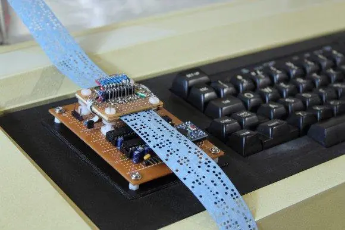
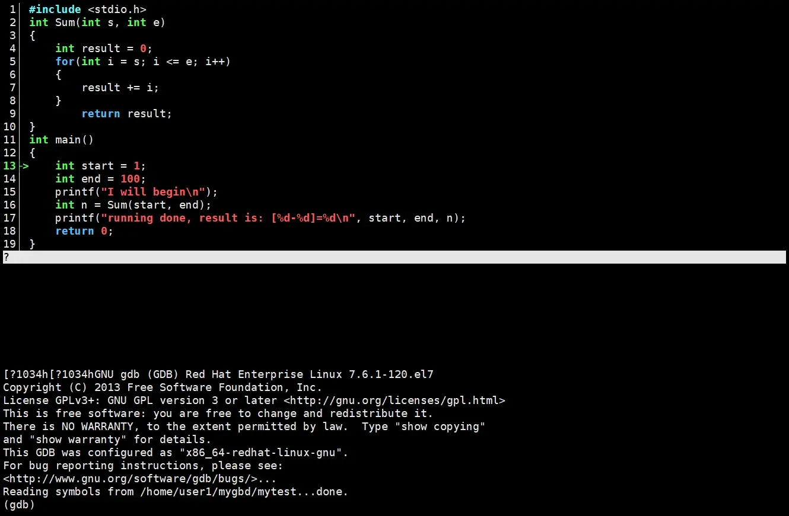
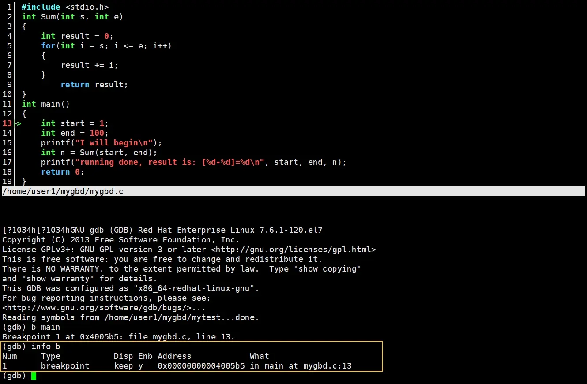
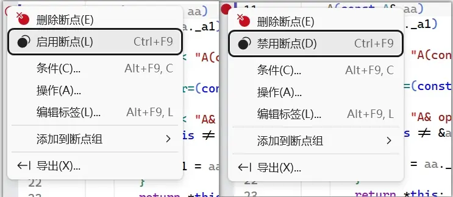
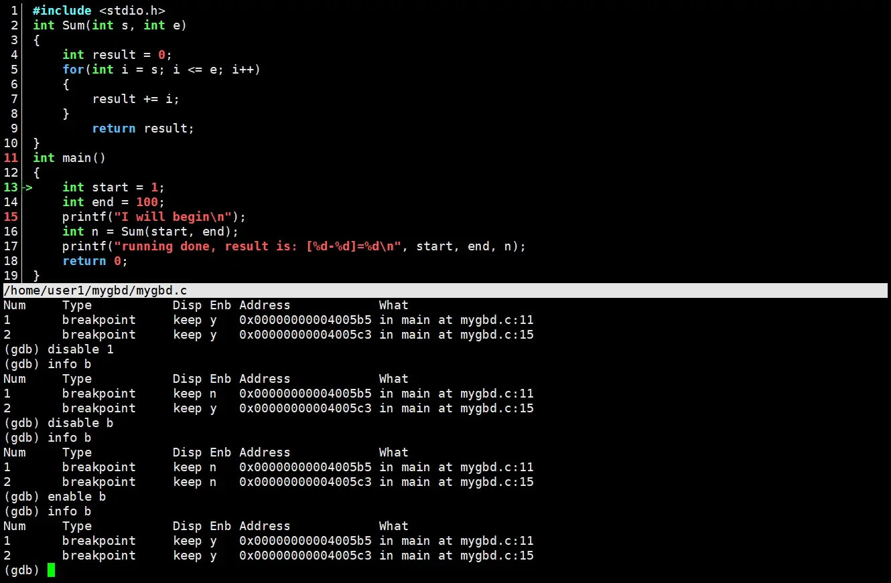
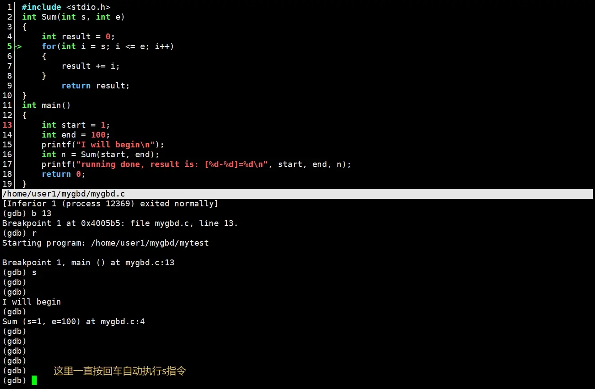
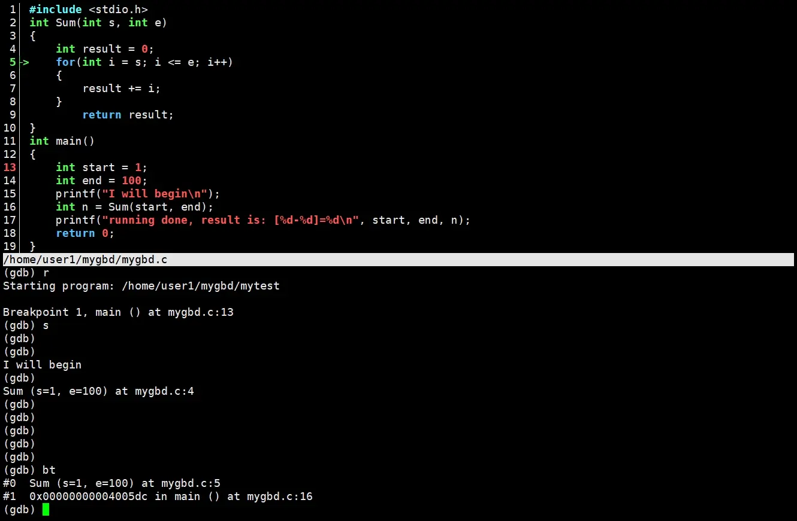

---

date: 2026-03-31T00:00:00+08:00
lastmod: 2026-04-05T00:00:00+08:00
title: '【Linux】04 - Linux开发工具'


tags:
  - vim
  - 包管理器
  - gcc
  - Makefile
  - git
  - gdb

categories:
  - Linux
   

---


#  Linux开发工具

## 包管理器

Linux中安装软件有三种方法
1. 源码安装（编译环境配置复杂，很少使用）
2. 软件包安装（下载打包好的rpm软件包，但是依赖库可能不齐，还需要我们自己下载）
3. 包管理器安装（最常用，自动安装软件和依赖库）

包管理器类似手机上的应用商店，选择我们需要的软件就能直接下载。在CentOS系统中，默认的包管理器是yum，ubuntu系统中默认的包管理器是apt。安装软件就是拷贝文件到系统的一些目录内，所以安装时需要root权限。


手机上的应用商店下载的服务器由相应的手机厂商提供，包管理器的下载由相应的开源社区提供，各个开发者把源码以及编译好的软件发布到社区里，社区提供下载服务。
开源本质是一种商业模式，当开源社区里面的一些软件成为各大商业公司必备的软件时，这些公司肯定不希望社区消失，所以社区发布募捐时会有不少公司提供资金支持。  
开源本质是一种商业模式，各大公司如微软谷歌开源各种项目等也是为了建立生态。

我们在安装系统时，系统内部也内置了下载连接，如CentOS系统中内置了CentOS的链接，ubuntu系统中内置了ubuntu的链接。
各个社区往往是国外的，国内下载速度会比较慢，所以国内相应的社区也建立了相应镜像源，相当于把国外社区的软件拷贝一份过来为国内提供下载服务，常用的镜像源有清华大学开源软件镜像，网易163镜像，阿里云镜像等。

> [!TIP]
> Linux的开源社区固然很成功，但不是所有的开源项目都能像Linux项目一样成功，想要了解更多可以观看这个[视频](https://www.bilibili.com/video/BV1FhjBzeEt2)

### yum具体操作
关于yum/apt的所有操作必须保证主机(虚拟机)网络畅通!!!可以通过ping指令验证
```bash
ping www.baidu.com 
```
#### 查看软件包
通过`yum list`命令可以罗列出当前一共有哪些软件包.由于包的数目可能非常之多，这里我们需要使用`grep`命令只筛选出我们关注的包.例如:
```bash
[root@iZ2zeh5i3yddf3p4q4ueo7Z ~]# yum list | grep lrzsz  
lrzsz.x86_64                             0.12.20-36.el7                @base    
[root@iZ2zeh5i3yddf3p4q4ueo7Z ~]# 
```
#### 安装软件

通过yum，我们可以通过很简单的一条命令安装 lrzsz 软件包。
```bash
sudo yum install -y lrzsz
```
yum/apt会自动找到都有哪些软件包需要下载，这时候敲"y"确认安装,出现"complete"字样或者中间未出现报错，说明安装完成。

- 安装软件时由于需要向系统目录中写入内容，一般需要sudo或者切到root账户下才能完成
- yum/apt安装软件只能一个装完了再装另一个，不能同时运行两个yum/apt进程，正在yum/apt安装一个软件的过程中，如果再尝试用yum/apt安装另外一个软件，yum/apt会报错，可以在一条命令中列出多个软件包一次性安装。。
- 如果yum/apt报错，询问chatGPT豆包DeepSeek等AI寻找解决方法。

#### 卸载软件
一条命令可以完成卸载 lrzsz 软件包。
```bash
sudo yum remove [-y] lrzsz  
```

#### 安装源

CentOS安装源路径：
```bash
$ ll /etc/yum.repos.d/
total 16
-rw-r--r-- 1 root root  676 Oct  8 20:47 CentOS-Base.repo # 标准源
-rw-r--r-- 1 root root 230 Aug 27 10:31 epel.repo         #扩展源
```

Ubuntu安装源路径:
```bash
$ cat /etc/apt/sources.list   # 标准源
$ ll /etc/apt/sources.list.d/ # 扩展源
```
下载过慢可以通过修改下载源到国内镜像源解决，询问chatGPT豆包DeepSeek等AI寻找修改方法。


## vim编辑器

### vim是什么

之前我们用的VS2026是集成开发环境（IDE），包含了各种各样的工具，如编辑器编译器链接器等等。  

vim是一个编辑器，只能编辑代码，vim是一个加强版的vi编辑器，vi已经非常老了所以我们使用vim。  
大多数Linux发行版默认安装 vim 或 vi，vim是一款使用成本比较高的编辑器，vim的操作是按照一些只有26个字母加10个数字加shift键空格键ctrl键等功能键的键盘设计的。


### vim的上手尝试

可以使用如下指令来查看vim的版本
```bash
vim --version
```

直接使用vim指令可以打开vim
```bash


[user1@iZ2zeh5i3yddf3p4q4ueo7Z 111]$ vim


~                                                                                                  
~                                                                                                  
~                                                                                                  
~                                        VIM - Vi IMproved                                         
~                                                                                                  
~                                         version 7.4.629                                          
~                                    by Bram Moolenaar et al.                                      
~                                Modified by <bugzilla@redhat.com>                                 
~                           Vim is open source and freely distributable                            
~                                                                                                  
~                                  Become a registered Vim user!                                   
~                         type  :help register<Enter>   for information                            
~                                                                                                  
~                         type  :q<Enter>               to exit                                    
~                         type  :help<Enter>  or  <F1>  for on-line help                           
~                         type  :help version7<Enter>   for version info                           
~                                                                                                  
~                                                                                                  
~                                                                                                  
                                                                                 0,0-1         All
```

使用`shift+:`快捷键进入底下的命令行，输入q表示退出，按回车键就退出vim了，或者按两下**大写**的`ZZ`快捷键来退出。

新建一个文件，使用vim进入就可以编辑代码了

```bash
[user1@iZ2zeh5i3yddf3p4q4ueo7Z 111]$ touch test.c   #新建一个.c文件
[user1@iZ2zeh5i3yddf3p4q4ueo7Z 111]$ vim test.c     #使用vim进入编辑
```


编辑代码
```c
#include<stdio.h>

int main()
{
        printf("hello world\n");
        return 0;
}
```

编辑完成后，先按Esc键，然后使用`shift+:`快捷键进入底下的命令行，输入wq表示保存退出，按回车键就退出vim了。


```bash
[user1@iZ2zeh5i3yddf3p4q4ueo7Z 111]$ vim test.c
[user1@iZ2zeh5i3yddf3p4q4ueo7Z 111]$ cat test.c
#include<stdio.h>

int main()
{
	printf("hello world\n");
	return 0;
}
[user1@iZ2zeh5i3yddf3p4q4ueo7Z 111]$ 
```
可以看到我们的代码就编辑完成了,可以使用gcc来编译代码。

```bash
[user1@iZ2zeh5i3yddf3p4q4ueo7Z 111]$ vim test.c 
[user1@iZ2zeh5i3yddf3p4q4ueo7Z 111]$ gcc test.c   #使用gcc来编译test.c文件
[user1@iZ2zeh5i3yddf3p4q4ueo7Z 111]$ ls
222  a.out  test.c                                #编译后生成a.out文件
[user1@iZ2zeh5i3yddf3p4q4ueo7Z 111]$ ./a.out      #执行a.out文件，打印hello world
hello world
[user1@iZ2zeh5i3yddf3p4q4ueo7Z 111]$ 
```


### vim的多模式

vim本质是一款多模式的编辑器，常用的有命令模式，底行模式，插入模式

1. 命令模式  
打开vim，默认为命令模式
2. 插入模式  
在命令模式下，按一下`i`键，就进入了插入（INSERT）模式，按`a`或者`o`键也可以进入。
在插入模式按一下Esc键就回到了命令模式。

3. 底行模式  
在命令模式下，使用`shift+:`快捷键就进入了底行模式。  在底行模式中输入w代表保存，输入q代表退出，输入wq表示保存退出。  
vim的默认配置不显示行号，可以在底行输入`set nu`来设置显示行号。  
在底行模式按一下Esc键就回到了命令模式。


底行模式和插入模式之间无法直接切换，需要在命令模式中转一下。


#### 插入模式
- 按`i`切换进入插入模式『insertmode」，按`i`进入插入模式后是从光标当前位置开始输入文件；
- 按`a`进入插入模式后，是从目前光标所在位置的下一个位置开始输入文字;
- 按`o`进入插入模式后，是插入新的一行，从首开始输入文字。


#### 命令模式
命令模式的核心在于快速编辑，拥有很多的快捷键。


- 移动光标快捷键
  - `gg`，光标快速回到第一行
  - `shift+g`，光标快速移动到文件结尾
  - `数字+shift+g`，光标快速移动到对应行号
  - `shift+$(数字4)`，光标快速移动到行尾
  - `shift+^(数字6)`，光标快速移动到此行开头
  - `h`，光标左移
  - `j`，光标下移
  - `k`，光标上移
  - `l`，光标右移
  - 光标移动时可以加上数字，如`3+j`，`6+i`等，就可以控制光标每次移动的距离
  - `w`，光标跳到下个单词的开头
  - `b`，光标回到上个单词的开头
  - `e`，光标跳到下个单词的字尾
  - 光标调整也支持加上数字跳转
  - `ctrl+b`，屏幕往“后”移动一页
  - `ctrl+f`，屏幕往“前”移动一页
  - `ctrl+u`，屏幕往“后”移动半页
  - `ctrl+d`，屏幕往“前”移动半页


- 复制粘贴操作
  - `yy`，复制当前行
  - `数字+yy`，复制往下数相应的n行，例如，「6+yy」表示复制从光标所在的该行“往下数”6行文字。
  - `p`，在光标所在位置下一行粘贴


- 撤销上一次操作
  - `u`，表示撤销
  - `ctrl+r`，可以撤销撤销，`u`和`ctrl+r`可以相互撤销，一旦退出文件编辑，无法撤销，只是保存没有q退出可以撤销


- 剪切和删除操作
  - `dd`，剪切当前行，也可以作为删除
  - `数字+dd`，剪切往下数相应的n行，例如，「6+dd」表示剪切从光标所在的该行“往下数”6行文字。
  - `x`，每按一次，删除光标所在位置的一个字符，相当于word文档里的del键删除
  - `数字+x`，删除对应的n个字符，例如，`20+X`表示删除光标所在位置的“前”20个字符
  - `shift+X`，每按一次，删除光标所在位置的前一个字符，相当于word文档里的退格键删除
  - `数字+shift+X`，删除光标所在位置的n个字符，例如，`20+shift+x`表示删除光标所在位置的前面的“前”20个字符
  - 
  


- 替换操作
  - `r`，替换光标所在处的字符。
  - `shift+r`，替换光标所到之处的字符，直到按下「ESC」键为止。
  - `shift+r`也可以称为**替换模式**
  - `shift+~`，可以快速切换大小写，按住shift多次按~可以一直往后切换大小写

- 批量化注释操作
  1. `ctrl+v`，可以进行光标的区域选择,称为**视图模式**
  2. 在视图模式下，选择需要注释的区域，然后按`shift+i`快捷键，进入插入模式
  3. 使用`//`注释一行，按Esc，会回到命令模式，并批量化注释之前选中的行


- 查找操作
  - `shift+#`,会高亮文件内所有和光标当前单词相同的单词
  - `n`，在所有高亮的单词之间跳转


#### 底行模式
在命令模式下，使用`shift+:`快捷键就进入了底行模式。

- 常用命令
  - `w`，保存
  - `q`,退出
  - `!+`，强制执行，如`!q`强制退出，`!w`，强制保存
  - `set nu`，设置显示行号。


- `! 命令`，可以在不退出vim的情况下执行Linux命令，
- `%s/被替换的单词/要替换的单词/`，可以进行批量化替换
- `vs 文件名`，可以进行多个文件分屏操作，光标在哪边就操作哪边，在左边时输入w保存的就是左边，在右边输入q退出的就是右边
- `ctrl+w+w`，可以切换分屏的光标


#### vim其他技巧

在命令行中使用`vim 指定文件 +行号`，打开时光标就自动换到对应行。

使用`!v`，会自动执行最近的以`vim`开头的指令


### vim的配置

在目录/etc/下面，有个名为vimrc的文件，这是系统中公共的vim配置文件，对所有用户都有效。
每个用户的家目录下都有vim的配置文件`.vimrc`，没有可以创建一个；各个用户的`.vimrc`相互独立，配置公共的vimrc会影响所有用户，配置自己的vim就行了，不会互相干扰。
```bash
[user1@iZ2zeh5i3yddf3p4q4ueo7Z 111]$ cd ~                    #进入家目录
[user1@iZ2zeh5i3yddf3p4q4ueo7Z ~]$ ls -al
total 32
drwx------  3 user1 user1 4096 Apr  1 01:41 .
drwxr-xr-x. 4 root  root  4096 Mar 29 00:02 ..
drwxrwxrwx  3 user1 user1 4096 Apr  1 01:41 111
-rw-------  1 user1 user1 1084 Apr  1 01:24 .bash_history
-rw-r--r--  1 user1 user1   18 Nov 25  2021 .bash_logout
-rw-r--r--  1 user1 user1  193 Nov 25  2021 .bash_profile
-rw-r--r--  1 user1 user1  231 Nov 25  2021 .bashrc
-rw-------  1 user1 user1 1721 Apr  1 01:41 .viminfo         
[user1@iZ2zeh5i3yddf3p4q4ueo7Z ~]$ touch .vimrc            #没有配置文件可以创建一个
[user1@iZ2zeh5i3yddf3p4q4ueo7Z ~]$ vim .vimrc              #使用vim进入配置文件编辑
```

进入`.vimrc `可以输入以下常用配置项测试一下  
- 设置语法高亮：syntax on
- 显示行号：set nu
- 设置缩进的空格数为4：set shiftwidth=4


vim还有很多配置项，处理配置vimrc还可以下载插件，不过下载插件进行配置比较复杂耗时，可以下载别人已经做好的配置文件使用。


如果是CentOS系统，可以进入gitee的这个[项目](https://gitee.com/HGtz2222/VimForCpp)，往下滑找到一键安装命令

```bash
curl -sLf https://gitee.com/HGtz2222/VimForCpp/raw/master/install.sh -o ./install.sh && bash ./install.sh
```
想在哪个用户下让vim配置生效, 就在哪个用户下执行这个指令. 强烈 "不推荐" 直接在 root 下执行。

如果需要卸载，在安装了 VimForCpp 的用户下执行以下命令就能卸载了
```bash
bash ~/.VimForCpp/uninstall.sh
```

这个vim配置还有很多功能，可以进入[项目主页](https://gitee.com/HGtz2222/VimForCpp)进行查看。


## gcc/g++编译器

gcc只能用来编译C语言，g++既能编译C又能编译C++，两个的选项完全相同。


gcc编译文件命令有两种写法
```bash
gcc  代码文件 -o 生成的可执行程序名称

gcc -o  生成的可执行程序名称  代码文件1 代码文件2 代码文件3等代码文件
```
两种写法都是`-o`后面跟着生成的可执行程序名称，顺序不能反。

gcc/g++在编译时代码时有四个步骤。
1. 预处理（进行宏替换/去注释/条件编译/头文件展开等）
2. 编译（生成汇编）
3. 汇编（生成机器可识别代码）
4. 链接（生成可执行文件或库文件）


### 编译的四个步骤

#### 预处理
预处理功能主要包括宏定义，文件包含，条件编译，去注释等。
预处理指令是以#号开头的代码行。

选项“-E”，该选项的作用是让gcc在预处理结束后停止编译过程。
选项“-o”是指目标件，“.i”件为已经过预处理的C原始程序。  
示例: `gcc -E test.c -o test.i`
```bash
[user1@iZ2zeh5i3yddf3p4q4ueo7Z 111]$ cat test.c            #cat打印test.c源码内容

#include<stdio.h>
#define yibai 100
#define N
int main()
{
    //我是注释
	printf("hello world\n");
	printf("hello ,%d\n",yibai);
#ifdef N
    printf("NNNNNN\n");
#else 
    printf("not N\n");
#endif

	return 0;
}
[user1@iZ2zeh5i3yddf3p4q4ueo7Z 111]$ gcc -E test.c -o test.i        #对hello world代码进行预处理


```

```bash
[user1@iZ2zeh5i3yddf3p4q4ueo7Z 111]$ vim test.i             #使用vim查看


#vim界面
#######################################################################################
825 extern char *ctermid (char *__s) __attribute__ ((__nothrow__ , __leaf__));
826 # 913 "/usr/include/stdio.h" 3 4
827 extern void flockfile (FILE *__stream) __attribute__ ((__nothrow__ , __leaf__));
828 
829 
830 
831 extern int ftrylockfile (FILE *__stream) __attribute__ ((__nothrow__ , __leaf__)) ;
832 
833 
834 extern void funlockfile (FILE *__stream) __attribute__ ((__nothrow__ , __leaf__));
835 # 943 "/usr/include/stdio.h" 3 4
836 
837 # 2 "test.c" 2
838                                  #上面是展开的头文件
839 
840 int main()
841 {
842                                  #把注释变成空格删除注释
843  printf("hello world\n");
844  printf("hello ,%d\n",100);      #宏替换
845                                  #条件编译
846     printf("NNNNNN\n");
847 
848 
849 
850 
851  return 0;                                                                                     
852 }
 
```
可以发现预处理结束后代码一个简单的hello world源代码变成了八百多行的代码，变多的部分是头文件展开，宏替换去注释条件编译也都执行完成了。


#### 编译

在这个阶段中，gcc首先要检查代码的规范性、是否有语法错误等，以确定代码的实际要做的工作，在检查无误后，gcc把代码翻译成汇编语言。
用户可以使用“-S”选项来进行查看，该选项只进行编译而不进行汇编，生成汇编代码。  
示例： `gcc -S test.i -o test.s `          

```bash
[user1@iZ2zeh5i3yddf3p4q4ueo7Z 111]$ gcc -S test.i -o test.s      #汇编文件后缀一般是.s
[user1@iZ2zeh5i3yddf3p4q4ueo7Z 111]$ vim test.s                   #查看test.s文件


#vim界面
#######################################################################################
  1     .file   "test.c"
  2     .section    .rodata
  3 .LC0:
  4     .string "hello world"
  5 .LC1:
  6     .string "hello ,%d\n"
  7 .LC2:
  8     .string "NNNNNN"
  9     .text
 10     .globl  main
 11     .type   main, @function
 12 main:
 13 .LFB0:
 14     .cfi_startproc
 15     pushq   %rbp
 16     .cfi_def_cfa_offset 16
 17     .cfi_offset 6, -16
 18     movq    %rsp, %rbp                                                                         
 19     .cfi_def_cfa_register 6
 20     movl    $.LC0, %edi
 21     call    puts
 22     movl    $100, %esi
 23     movl    $.LC1, %edi
 24     movl    $0, %eax
 25     call    printf
 26     movl    $.LC2, %edi
 27     call    puts
 28     movl    $0, %eax
 29     popq    %rbp
 30     .cfi_def_cfa 7, 8
 31     ret
 32     .cfi_endproc
 33 .LFE0:
 34     .size   main, .-main
 35     .ident  "GCC: (GNU) 4.8.5 20150623 (Red Hat 4.8.5-44)"
 36     .section    .note.GNU-stack,"",@progbits
```
这时就生成了汇编文件。


#### 汇编
汇编阶段是把编译阶段生成的“S”文件转成目标文件，
读者在此可使选项“-c”就可看到汇编代码已转化为“o”二进制目标代码了。 
`.o` 文件全称叫**可重定位目标文件**，在windows的VS2026中在这一步也会生成`.obj`文件

示例: `gcc -c test.s -o test.o`
```bash
[user1@iZ2zeh5i3yddf3p4q4ueo7Z 111]$ gcc -c test.s -o test.o  
[user1@iZ2zeh5i3yddf3p4q4ueo7Z 111]$ vim test.o

#vim界面
#######################################################################################
 1 ^?ELF^B^A^A^@^@^@^@^@^@^@^@^@^A^@>^@^A^@^@^@^@^@^@^@^@^@^@^@^@^@^@^@^@^@^@^@H^C^@^@^@^@^@^@^@^@    ^@^@@^@^@^@^@^@@^@^M^@^L^@UH<89>å¿^@^@^@^@è^@^@^@^@¾d^@^@^@¿^@^@^@^@¸^@^@^@^@è^@^@^@^@¿^    @^^ @^@è^@^@^@^@¸^@^@^@^@]Ãhello world^@hello ,%d
  2 ^@NNNNNN^@^@GCC: (GNU) 4.8.5 20150623 (Red Hat 4.8.5-44)^@^@^T^@^@^@^@^@^@^@^AzR^@^Ax^P^A^[^L^G    ^H<90>^A^@^@^\^@^@^@^\^@^@^@^@^@^@^@3^@^@^@^@A^N^P<86>^BC^M^Fn^L^G^H^@^@^@^@^@^@^@^@^@^@^@^@^@^    @^@^@^@^@^@^@^@^@^@^@^@^@^@^A^@^@^@^D^@ñÿ^@^@^@^@^@^@^@^@^@^@^@^@^@^@^@^@^@^@^@^@^C^@^A^@^@^@^@    ^@^@^@^@^@^@^@^@^@^@^@^@^@^@^@^@^@^C^@^C^@^@^@^@^@^@^@^@^@^@^@^@^@^@^@^@^@^@^@^@^@^C^@^D^@^@^@^    @^@^@^@^@^@^@^@^@^@^@^@^@^@^@^@^@^@^C^@^E^@^@^@^@^@^@^@^@^@^@^@^@^@^@^@^@^@^@^@^@^@^C^@^G^@^@^@    ^@^@^@^@^@^@^@^@^@^@^@^@^@^@^@^@^@^@^C^@^H^@^@^@^@^@^@^@^@^@^@^@^@^@^@^@^@^@^@^@^@^@^C^@^F^@^@^    @^@^@^@^@^@^@^@^@^@^@^@^@^@^@^H^@^@^@^R^@^A^@^@^@^@^@^@^@^@^@3^@^@^@^@^@^@^@^M^@^@^@^P^@^@^@^@^    @^@^@^@^@^@^@^@^@^@^@^@^@^@^@^R^@^@^@^P^@^@^@^@^@^@^@^@^@^@^@^@^@^@^@^@^@^@^@^@test.c^@main^@pu    ts^@printf^@^@^@^@^@^@^@^@^E^@^@^@^@^@^@^@
  3 ^@^@^@^E^@^@^@^@^@^@^@^@^@^@^@
  4 ^@^@^@^@^@^@^@^B^@^@^@
  5 ^@^@^@üÿÿÿÿÿÿÿ^T^@^@^@^@^@^@^@
  6 ^@^@^@^E^@^@^@^L^@^@^@^@^@^@^@^^^@^@^@^@^@^@^@^B^@^@^@^K^@^@^@üÿÿÿÿÿÿÿ#^@^@^@^@^@^@^@
  7 ^@^@^@^E^@^@^@^W^@^@^@^@^@^@^@(^@^@^@^@^@^@^@^B^@^@^@                                          
  8 ^@^@^@üÿÿÿÿÿÿÿ ^@^@^@^@^@^@^@^B^@^@^@^B^@^@^@^@^@^@^@^@^@^@^@^@.symtab^@.strtab^@.shstrtab^@.r    ela.text^@.data^@.bss^@.rodata^@.comment^@.note.GNU-stack^@.rela.eh_frame^@^@^@^@^@^@^@^@^@^@^@@   ^@^@^@^@^@^@^@^@^@^@^@^@^@^@^@^@^@^@^@^@^@^@^@^@^@^@^@^@^@^@^@^@^@^@^@^@^@^@^@^@^@^@^@^@^@^@^@^^   @^@^@^@^@^@^@^@^@^@^@^@^@^@ ^@^@^@^A^@^@^@^F^@^@^@^@^@^@^@^@^@^@^@^@^@^@^@@^@^@^@^@^@^@^@3^@^@^^   @^@^@^@^@^@^@^@^@^@^@^@^@^A^@^@^@^@^@^@^@^@^@^@^@^@^@^@^@^[^@^@^@^D^@^@^@@^@^@^@^@^@^@^@^@^@^@^^   @^@^@^@^@8^B^@^@^@^@^@^@<90>^@^@^@^@^@^@^@
  9 ^@^@^@^A^@^@^@^H^@^@^@^@^@^@^@^X^@^@^@^@^@^@^@&^@^@^@^A^@^@^@^C^@^@^@^@^@^@^@^@^@^@^@^@^@^@^@s^    @^@^@^@^@^@^@^@^@^@^@^@^@^@^@^@^@^@^@^@^@^@^@^A^@^@^@^@^@^@^@^@^@^@^@^@^@^@^@,^@^@^@^H^@^@^@^C^    @^@^@^@^@^@^@^@^@^@^@^@^@^@^@s^@^@^@^@^@^@^@^@^@^@^@^@^@^@^@^@^@^@^@^@^@^@^@^A^@^@^@^@^@^@^@^@^    @^@^@^@^@^@^@1^@^@^@^A^@^@^@^B^@^@^@^@^@^@^@^@^@^@^@^@^@^@^@s^@^@^@^@^@^@^@^^^@^@^@^@^@^@^@^@^@    ^@^@^@^@^@^@^A^@^@^@^@^@^@^@^@^@^@^@^@^@^@^@9^@^@^@^A^@^@^@0^@^@^@^@^@^@^@^@^@^@^@^@^@^@^@<91>^    @^@^@^@^@^@^@.^@^@^@^@^@^@^@^@^@^@^@^@^@^@^@^A^@^@^@^@^@^@^@^A^@^@^@^@^@^@^@B^@^@^@^A^@^@^@^@^@    ^@^@^@^@^@^@^@^@^@^@^@^@^@^@¿^@^@^@^@^@^@^@^@^@^@^@^@^@^@^@^@^@^@^@^@^@^@^@^A^@^@^@^@^@^@^@^@^^   @^@^@^@^@^@^@W^@^@^@^A^@^@^@^B^@^@^@^@^@^@^@^@^@^@^@^@^@^@^@À^@^@^@^@^@^@^@8^@^@^@^@^@^@^@^@^@^^   @^@^@^@^@^@^H^@^@^@^@^@^@^@^@^@^@^@^@^@^@^@R^@^@^@^D^@^@^@@^@^@^@^@^@^@^@^@^@^@^@^@^@^@^@È^B^@^^   @^@^@^@^@^X^@^@^@^@^@^@^@
```
可以看到是一堆乱码，说明是已经成为二进制文件了。

`.o`文件是无法直接执行的，因为我们的代码中还有很多的库没有链接，所以没法执行。


#### 链接

在成功编译之后，就进入了链接阶段，把需要的库链接上。  


示例：`gcc test.o -o hello`
```bash
[user1@iZ2zeh5i3yddf3p4q4ueo7Z 111]$ gcc test.o -o hello     #生成可执行程序hello
[user1@iZ2zeh5i3yddf3p4q4ueo7Z 111]$ ./hello
hello world
hello ,100
NNNNNN
```


使用`ldd +可执行文件`可以查看可执行文件依赖哪些库。
```bash
[user1@iZ2zeh5i3yddf3p4q4ueo7Z 111]$ ldd hello
	linux-vdso.so.1 =>  (0x00007ffd2b322000)
	libc.so.6 => /lib64/libc.so.6 (0x00007f9eec2cc000)           #链接C标准库
	/lib64/ld-linux-x86-64.so.2 (0x00007f9eec69a000)
[user1@iZ2zeh5i3yddf3p4q4ueo7Z 111]$ 
```

---

前三个过程的选项看键盘左上角，连起来刚好是Esc键，生成的文件后缀连起来正好是镜像文件.iso后缀。


### 条件编译应用场景

同一个软件可能会发布社区免费版专业收费版等不同版本，使用条件编译，可以在编译时选择编译出哪个版本，这样就不需要维护同一个软件不同版本的两份代码了。

gcc可以在编译命令里加上宏
```bash
[user1@iZ2zeh5i3yddf3p4q4ueo7Z def]$ cat def.c
#include<stdio.h>

int main()
{
#ifdef N
    printf("收费版\n");
#else
    printf("免费版\n");
#endif 

}
[user1@iZ2zeh5i3yddf3p4q4ueo7Z def]$ gcc def.c -o nodef
[user1@iZ2zeh5i3yddf3p4q4ueo7Z def]$ ./nodef 
免费版
[user1@iZ2zeh5i3yddf3p4q4ueo7Z def]$ gcc def.c -o defN -DN  #在编译命令里加上宏就不用进入vim修改代码了
[user1@iZ2zeh5i3yddf3p4q4ueo7Z def]$ ./defN 
收费版
```
使用条件编译，在gcc编译命令里加上不同的宏就可以编译出不同的版本了。

---

Linux系统内核也使用条件编译来实现代码裁剪，比如一些设备运行Linux不需要网络功能，可以使用条件编译裁剪掉网络相关的代码，有些设备内存很小，可以裁剪掉一些不需要的功能；使用条件编译就可以根据需求来调整内核。

---

有一些软件需要跨平台运行，要求在window，Linux或苹果MACOS下都能运行，可以使用条件编译来调整编译时编译出哪个平台的版本。


### 为什么要先编译成汇编再转成二进制机器码

在计算机被发明出来的最开始，人们使用一排排开关来控制计算机，但是不断开关开关挺麻烦的，而且效率也很低，于是发明了打孔纸带来控制计算机。





编程的本质就是在控制计算机，最早的程序员就是在这些纸带上打孔来进行编程，纸带上的孔洞就代表着二进制的机器码，但是直接操作这些孔洞来编程对于人类来说还是太困难了，于是后来的人们就发明了汇编语言。汇编语言的一条条指令就约等于二进制机器码指令的助记符，解决了只能用二进制编程的问题。

再后来，C语言被发明出来了，为什么C语言选择转换成汇编再转二进制机器码呢？   
想象一下，假如你是C语言的发明人，有两条技术路线可以选择，一条是把C语言直接转为二进制机器码，另一条是转成汇编再转机器码，怎么选？


C语言的发明者选择了转成汇编再转机器码，因为当时汇编语言发展了多年，汇编语言转机器码已经很成熟了，转成汇编再转机器码实现难度比较低，如果选择C语言直接转成机器码，需要更多的工作，难度也更高，转换成汇编相当于站在了巨人的肩膀上，由巨人解决了一部分难题。


### 编译器的自举

C语言转换为机器码需要编译器，那么编译器哪里来的呢？  
C语言的编译器是汇编写的，那么汇编语言的编译器是谁写的呢？

最早的汇编语言诞生了，但是没有编译器，所以最早的汇编语言编译器只能由二进制编程来实现。有了第一个汇编编译器后，就能使用汇编语言来写一个汇编语言编译器，这就是**编译器的自举**。  
有了汇编编译器，就可以用汇编写一个C语言编译器，有了第一个C语言编译器，C语言就能自己写自己的编译器。后来诞生的其他语言，如c++,java，python等也使用C语言或者其他语言来写自己的第一个编译器，再通过第一个编译器来完成自举的过程。


### 库

C语言站着汇编巨人的肩膀上，我们使用C语言编写程序，也要站在巨人的肩膀上，但是巨人不止一个怎么办，所以就有了链接。链接就是把别人写好的库和我们的代码连到一起生成可执行程序，有时候一个复杂的项目需要链接很多库，有了这些库我们就不需要自己实现相关的逻辑代码，站在巨人的肩膀上，就可以专注于自己需要实现的部分。

库是一套方法或者数据集，为我们开发提供最基本的保证(基本接口，功能，加速我们二次开发)

Windows下，动态库后缀是`.dll`，静态库后缀是`.lib`。
Linux系统中安装的库放在/usr/lib64目录下，Linux的库有一套命名规律，库文件都是lib开头，中间是库名，`.so`后缀是动态库，`.a`结尾是静态库。

#### 动态库
动态库内部有实现的方法，我们编写的程序会使用库中的方法，链接就是让我们的程序能在库中找到方法，执行目标方法时需要跳转到库中执行，执行完毕再返回。动态链接的过程只是在地址上产生关联。


比如张三在学校里安排自己的计划，早上9点学语文，10点学数学等等，张三计划好了中午去上网，但是学校没有机子，想要上网需要去旁边的前进网吧（动态库），为了能够执行计划，张三需要记住（动态链接）网吧的地址。执行计划（代码）时，到了上网时间，需要根据网吧的地址前往网吧上网（库跳跃），上网结束时就返回学校（库函数返回）。  
前进网吧（动态库）是所有学生共享的，所以也可以称为共享库。校长发现学校里的学生总是莫名其妙变少，就想办法让前进网吧破产关门了，这时学校里所有需要执行上网的计划（代码）全部都无法上网了。


#### 静态库
静态链接就是将库中的需要的实现方法拷贝一份到源代码中。
静态库只有在链接的时候有用，一旦形成可执行程序，静态库可以不再需要。


前进网吧没了之后，张三想办法从前进网吧老板那里买了（拷贝）一台机器放到学校里，到了计划执行上网的时候，就直接使用在学校里的机器，这就是静态链接。其他同学看见张三之后也有样学样，都买了（拷贝）机器放在学校里，有前进网吧的时候所有学生都只需要记住网吧的地址，没有前进网吧的时候由于每个人都各种带了一台机器，所以就要使用更多地方放机器。  
所以静态链接的程序会占用更多空间。


#### 动静态库对比

1. 动态库形成的可执行程序体积一定很小
2. 可执行程序对静态库的依赖度小，动态库不能缺失
3. 程序运行，需要加载到内存，静态链接的，会在内存中出现大量的重复代码。
4. 动态链接，比较节省内存和磁盘资源


gcc和g++默认采用的是动态链接。
```bash
[user1@iZ2zeh5i3yddf3p4q4ueo7Z 222]$ cat testlib.c 
#include<stdio.h>

int main()
{
        printf("hello world\n");
        return 0;
}
[user1@iZ2zeh5i3yddf3p4q4ueo7Z 222]$ gcc testlib.c  -o share     #默认动态链接
[user1@iZ2zeh5i3yddf3p4q4ueo7Z 222]$ file share 
share: ELF 64-bit LSB executable, x86-64, version 1 (SYSV), dynamically linked (uses shared libs), for GNU/Linux 2.6.32, BuildID[sha1]=ebc50de43b7df0d04ca0cfd4d8f8db8c1bc02619, not stripped
[user1@iZ2zeh5i3yddf3p4q4ueo7Z 222]$ 
```
使用`file`指令可以查看文件详细信息，可以看到使用的是动态链接`(uses shared libs)`。


编译命令带上-static选项就是使用静态链接。    
一般我们的云服务器，C/C++的静态库并没有安装，可以使用下面的命令安装
```bash
yum install glibc-static libstdc++-static -y
#Centos 使用yum，ubuntu用的是apt
```


```bash
[user1@iZ2zeh5i3yddf3p4q4ueo7Z 222]$ gcc testlib.c  -o static -static
[user1@iZ2zeh5i3yddf3p4q4ueo7Z 222]$ file static 
static: ELF 64-bit LSB executable, x86-64, version 1 (GNU/Linux), statically linked, for GNU/Linux 2.6.32, BuildID[sha1]=6784e28d38c9b95e591445cb0e0b60ce718bba4c, not stripped
[user1@iZ2zeh5i3yddf3p4q4ueo7Z 222]$ 
```
使用`file`指令查看，可以看到使用静态链接`statically linked`。


可以看到相同的源代码，生成的静态链接的可执行文件体积是动态链接的一百多倍。
```bash
[user1@iZ2zeh5i3yddf3p4q4ueo7Z 222]$ ll
total 864
drwxrwxr-x 2 user1 user1   4096 Mar 31 00:56 333
-rwxrwxr-x 1 user1 user1   8360 Apr  1 21:26 share
-rwxrwxr-x 1 user1 user1 861296 Apr  1 21:35 static
-rw-rw-r-- 1 user1 user1     85 Apr  1 21:21 testlib.c
[user1@iZ2zeh5i3yddf3p4q4ueo7Z 222]$ 
```

---
动静态库最大的区别在运行时。  
Linux里一切皆文件，动态库也是文件，程序运行需要的动态库也需要一起加载到内存里，只要动态库首次加载了，其他程序如果需要相同的动态库，会直接跳转到内存中的动态库。
动态库的本质是把语言层面公共的代码，在内存中未来只出现一份。  

> [!TIP]
> Linux里的命令是用C语言写的，都是动态链接到C语言库中，假如删除C语言库，Linux命令就无法执行了，不信的话可以试一下。


#### 从技术上理解库


库的本质就是把众多.o文件打包起来的文件。假如我们直接写了一个库，让别人使用的同时又不想暴露源代码，就可以把源文件编译成.o文件，C语言在连接阶段会把所有.o文件链接起来生成可执行程序。当源文件很多时候把.o文件打包起来就形成了库文件。我们要使用这些库文件，所以汇编阶段会生成.o文件然后再进行链接，链接的本质就是把所有的.o文件进行合并。


## 自动化构建-make/Makefile


### 什么是make/Makefile

- make是一条命令，makefile是一个文件，两个搭配使用，完成项目自动化构建。
- make是一个命令工具，是一个解释makefile中指令的命令工具，一般来说，多数的IDE都有这个命令，比如：Delphi的make，Visual C++的nmake，Linux下GNU的make。可见，makefile都成为了一种在工程方面的编译方法。
- 一个工程中的源文件不计数，其按类型、功能、模块分别放在若干个目录中，makefile定义了一系列的规则来指定，哪些文件需要先编译，哪些文件需要后编译，哪些件需要重新编译，甚于进行更复杂的功能操作
- makefile带来的好处就是“自动化编译”，一旦写好，只需要一个make命令，整个工程完全自动编译，极大的提高了软件开发的效率。
- 会不会写makefile，从一个侧面说明了一个人是否具备完成大型工程的能力


如果源文件非常多，一个一个手动编译非常麻烦，可以使用make/Makefile来自动化编译  
```bash
[user1@iZ2zeh5i3yddf3p4q4ueo7Z 123]$ touch makefile   #创建makefile文件，首字母也可以大写Makefile
[user1@iZ2zeh5i3yddf3p4q4ueo7Z 123]$ vim makefile     #vim打开makefile进行编辑


#vim界面
#######################################################################################
  1 code:code.c                     #可执行文件code依赖源文件code.c
  2     gcc -o code code.c          #第二行必须以TAB键开头，不能按空格                                                                             
~
``` 
编辑保存好之后，只需要使用`make`指令就能完成编译。

```bash
[user1@iZ2zeh5i3yddf3p4q4ueo7Z 123]$ make
gcc -o code code.c
[user1@iZ2zeh5i3yddf3p4q4ueo7Z 123]$ ./code 
hello world
[user1@iZ2zeh5i3yddf3p4q4ueo7Z 123]$ 
```
### 依赖关系和依赖方法

在上面的makefile文件中，第一行的`code:code.c`称为依赖关系，第二行的`gcc -o code code.c`我们称为依赖方法。


<!-- 比如到月底了，儿子给爸打电话说，爸我是你儿子（表明依赖关系），我依赖于你，所以给我打点钱（依赖方法）。依赖关系和依赖方法都具备，就能达到目的（收到钱）。
为什么不给舍友他爸打电话，因为跟舍友他爸没有依赖关系，依赖关系错误就办不成事。为什么不打电话说让爸来帮忙考试，因为没法来考试，这是依赖方法错误事也办不成。 -->

很多事情都能从依赖关系和依赖方法的角度分析，例如：
1. 点外卖：你与外卖平台之间建立了“我下单你接单”的依赖关系，接着依赖方法就是支付成功并填写正确的收货地址，骑手按地址送达你才能吃上饭；如果你拿舍友的手机下单（关系错了）外卖就会送到舍友那里，或者你把地址填成“火星”（方法错了）骑手根本送不到，最终都得饿肚子。
2. 取快递：取件码与你的手机号绑定形成了正确的依赖关系，依赖方法则是去对应的驿站出示取件码或扫码开柜；要是你拿着别人的取件码去取（关系错）驿站不会给你，或者你跑到快递分拣中心大喊“我要取件”（方法错）人家也不会理你，只有关系和方法都对才能顺利拿到包裹。
3. 去医院看病：你挂了某位医生的号，就建立了医患依赖关系，接下来依赖方法就是医生给你开处方、你取药并遵医嘱执行；如果你挂的是牙科却去看头疼（关系错）会被转诊，或者医生开了抗生素你却回家喝醋（方法错）只会加重病情，只有找对医生并用对治疗方式病才能好。
4. 组队打游戏：你和四位队友构成了“同一队伍”的依赖关系，依赖方法就是五个人各司其职配合推塔；如果你随机匹配到了对面阵营却还给自己原队伍送人头（关系错）就变成了内鬼，或者队友都在推高地你却独自在野区采蘑菇（方法错）必然导致团灭，唯有关系与方法同时正确才能拿下胜利。
5. 洗衣机洗衣服：洗衣机和电源、水管正常连接是设备就绪的依赖关系，依赖方法就是放入衣服、添加洗衣液并按启动键；如果你把衣服塞进烤箱想“烤干”（关系错）或者洗衣机里没放洗衣液就空转（方法错），前者可能烧坏衣服，后者洗了半天还是脏的，只有关系成立且方法正确才能得到干净的衣服。


只有依赖关系和依赖方法都正确了，才能办成事。


### 项目清理

- 工程是需要被清理的
- 像clean这种，没有被第一个目标文件直接或间接关联，那么它后面所定义的命令将不会被自动执行，不过，我们可以显示要make执行。即命令一“make clean”，以此来清除所有的目标文件，以便重编译。
- 但是一般我们这种clean的目标文件，我们将它设置为伪目标,用.PHONY修饰，伪目标的特性是，总是被执行的。
- 可以将我们的code目标文件声明成伪目标，测试一下。


```bash
[user1@iZ2zeh5i3yddf3p4q4ueo7Z 123]$ vim makefile 

#vim界面
#######################################################################################
  1 code:code.c
  2     gcc -o code code.c
  3 .PHONY:clean
  4 clean:                                                                                                             
  5     rm -f code
```
编辑好后，使用`make clean`指令就能删除code可执行文件了。
make命令扫描makefile文件时，默认形成第一个目标文件。
如果把`code`的依赖关系和方法与`clean`的依赖关系和方法调换位置，`make`指令就是执行`rm -f code`,`make code`才会执行`gcc -o code code.c`。


尝试把`.PHONY:clean`删除，发现`make clean`还是能执行，那么`.PHONY:`的作用是什么？

`.PHONY:`是一种类似建议的关键字，来建议`clean`,作用叫伪目标，表示目标总是被执行，对应的依赖方法和关系。  
我们在使用`make`编译的时候，发现只能执行一次，第二第三次无法执行
```bash
[user1@iZ2zeh5i3yddf3p4q4ueo7Z 123]$ make
gcc -o code code.c                            #只执行一次
[user1@iZ2zeh5i3yddf3p4q4ueo7Z 123]$ make
make: `code' is up to date.                   #无法执行
[user1@iZ2zeh5i3yddf3p4q4ueo7Z 123]$ make
make: `code' is up to date.
[user1@iZ2zeh5i3yddf3p4q4ueo7Z 123]$ 
```
既然`.PHONY`可以修饰`clean`，那么我们给`code`也加上试试看

```bash
#vim界面
#######################################################################################
  1 .PHONY:code
  2 code:code.c
  3     gcc -o code code.c
  4 .PHONY:clean                                                                                                         
  5 clean:  
  6     rm -f code
```
```bash
[user1@iZ2zeh5i3yddf3p4q4ueo7Z 123]$ make
gcc -o code code.c                            
[user1@iZ2zeh5i3yddf3p4q4ueo7Z 123]$ make
gcc -o code code.c    
[user1@iZ2zeh5i3yddf3p4q4ueo7Z 123]$ make
gcc -o code code.c    
```
可以发现`.PHONY`可以修饰后相应的依赖关系和方法总是能执行了。但是为什么一般不使用`.PHONY`修饰生成目标可执行文件呢？  
`make`只能执行一次是因为源代码没有修改，只有源代码修改后才需要编译，如果源文件很多只修改了其中的几个就节约了编译时间，gcc编译时默认老代码不重新编译。

那么`make`指令如何知道哪个新哪个旧呢？
使用`stat 指定文件`指令可以查看文件时间相关的属性。
```bash
[user1@iZ2zeh5i3yddf3p4q4ueo7Z 123]$ stat code.c
  File: ‘code.c’
  Size: 77        	Blocks: 8          IO Block: 4096   regular file
Device: fd01h/64769d	Inode: 927956      Links: 1
Access: (0664/-rw-rw-r--)  Uid: ( 1001/   user1)   Gid: ( 1001/   user1)
Access: 2026-04-01 22:50:35.913431071 +0800
Modify: 2026-04-01 22:50:22.941880878 +0800
Change: 2026-04-01 22:50:22.941880878 +0800
 Birth: -
[user1@iZ2zeh5i3yddf3p4q4ueo7Z 123]$  
```
文件等于内容加属性，如果修改了文件内容，则Modify修改时间会改变，如果修改了文件属性，那么Change时间会改变，如果只是查看文件，Access时间被更新。  
尝试修改文件内容，发现Modify和Change都改变了，因为修改了文件内容，文件大小也变化了，所以都改变了，大部分情况下修改文件内容会让Modify和Change都改变。如果只修改属性（让修改文件权限），那么Change时间就改变了，Modify保持不变。  

如果查看文件，Access时间被更新，在Linux系统中，查看文件操作要比修改文件操作多得多，如果每次查看文件都修改Access时间，那么会造成很多的磁盘io操作，所以当查看到了一定次数Access时间才会修改，具体次数不同系统有差异。


`make`通过查看可执行文件和源文件的Modify时间差异来判断新旧的，可执行文件是通过源文件编译生成的，Modify时间一定比源文件晚，如果源文件的Modify时间比可执行时间晚，那么源文件一定被修改过。  
`touch`指令可以修改文件的时间属性，原本`make`只能执行一次，使用`touch`指令修改时间后`make`就能继续执行了。


加上`.PHONY`的本质就是告诉`gcc -o code code.c`忽略新旧对比直接执行。所以一般不使用`.PHONY`来修饰生成可执行文件，因为我们需要不编译没修改过的源文件来节约编译时间，使用`.PHONY`来修饰`clean`来保证每次清理都是干净的，不出现其他奇怪的错误。


### make推导过程


make是如何工作的，在默认的方式下，也就是我们只输入make命令。那么：
- make会在当前目录下找名字叫“Makefile”或“makefile”的文件。
- 如果找到，它会找文件中的第一个目标文件（target），在下面的例子中，他会找到code这个文件，并把这个文件作为最终的目标文件。
- 如果 code文件不存在，或是 code 所依赖的后面的code.o文件的文件修改时间要比code这个文件新（可以用touch测试），那么，他就会执行后面所定义的命令来生成code 这个文件。
- 如果 code 所依赖的 code.o文件不存在，那么 make 会在当前文件中找目标为code.o文件的依赖性，如果找到则再根据那一个规则生成code.o文件。（这有点像一个堆栈的过程）
- 当然，你的C文件和H文件是存在的啦，于是 make 会生成code.o文件，然后再用code.o 文件声明make 的终极任务，也就是执行文件code了。
- 这就是整个make的依赖性，make会一层又一层地去找文件的依赖关系，直到最终编译出第一个目标文件。
- 在找寻的过程中，如果出现错误，比如最后被依赖的文件找不到，那么make就会直接退出，并报错，而对于所定义的命令的错误，或是编译不成功，make根本不理。
- make只管文件的依赖性，即，如果在我找了依赖关系之后，冒号后面的文件还是不在，那么对不起，我就不工作啦。


```bash
#vim界面
#######################################################################################
  1 code:code.o
  2     gcc code.o -o code                                                                                          
  3 code.o: code.s
  4     gcc -c code.s -o code.o
  5 code.s: code.i
  6     gcc -S code.i -o code.s
  7 code.i: code.c
  8     gcc -E code.c -o code.i
  9 
 10 .PHONY:clean
 11 clean:
 12     rm -f *.i *.s *.o  code     
```

可以理解为makefile在自己的内部会维护一个类似栈一样的东西。


`make`指令从上到下扫描，发现依赖关系`code:code.o`，依赖方法需要`code.o`，但是`code.o`不存在，所以将依赖方法`gcc -E code.o -o code `入栈，根据依赖关系检测`code.s`，也不存在，将`gcc -c code.s -o code.o`入栈，发现不存在一律入栈，`gcc -S code.i -o code.s`也入栈，直到`gcc -E code.c -o code.i`，发现`code.c`存在，执行依赖方法`gcc -E code.c -o code.i`，执行完后再依次出栈并执行。这就是makefile在执行时推导的基本规则。


### make/Makefile的使用

makefile也支持类似宏一样的用法。
```bash
#vim界面
#######################################################################################
  1 BIN=code
  2 CC=gcc
  3 #SRC=$(shell ls *.c)
  4 SRC=$(wildcard *.c)
  5 OBJ=$(SRC:.c=.o)
  6 LFLAGS=-o
  7 FLAGS=-c
  8 RM=rm -f
  9 
 10 $(BIN):$(OBJ)
 11     @$(CC) $(LFLAGS) $@ $^
 12     @echo "linking ... $^ to $@"
 13 %.o:%.c
 14     @$(CC) $(FLAGS) $<
 15     @echo "compiling ... $< to $@"
 16 
 17 .PHONY:clean
 18 clean:
 19     $(RM) $(OBJ) $(BIN)  
```
一上来就是这些东西谁看得懂啊，但是我们仔细研究一下就会发现，和C语言的宏不能说是完全相似，只能说一模一样。

下面是示例makefile的逐行介绍
- `BIN=code`：一般使用变量 `BIN`来定义可执行程序，表示最终生成的可执行文件名，`BIN=code`就是把变量 `BIN`的值设为 `code`，表示生成的可执行文件名是`code`。
- `CC=gcc`：定义变量 CC，值为 gcc，指定使用的 C 编译器。
- `SRC=$(shell ls *.c)`和`SRC=$(wildcard *.c)`：makefile内支持使用`shell`的命令，使用`shell ls *.c`命令来获取当前目录下所有后缀为`.c`的文件，使用makefile内置的`wildcard`也可以获取，这里二选一即可。
- `OBJ=$(SRC:.c=.o)`：定义变量 OBJ，将 SRC 中每个单词的 .c 后缀替换为 .o，得到对应的目标文件列表（如 code1.o code2.o）。
- `LFLAGS=-o`：定义变量 LFLAGS，值为 -o，链接时用于指定输出文件名的选项。
- `FLAGS=-c`：定义变量 FLAGS，值为 -c。
- `RM=rm -f`：定义变量 RM，值为 rm -f，用于清理。
- `$(BIN):$(OBJ)`：`$` 是 Makefile 中引用变量或自动变量的前缀，`$(BIN):$(OBJ)`进行C语言类似宏的替换后就变成`code:code.o`，表示依赖关系。
- `@$(CC) $(LFLAGS) $@ $^`：`$@`是自动变量，表示当前目标（`$(BIN)`，即`code`），`$^`也是自动变量，表示所有依赖（`$(OBJ)`，即code1.o code2.o ...等文件）
- `@echo "linking ... $^ to $@"`：输出链接提示信息，开头的`@`表示执行时不回显该命令，如果删除`@`执行时就会同步显示出执行的指令，在这里有`@`就会执行echo指令，输出`linking ... $^ to $@`(这里的`$@`和`$^`也会被替换)；如果删除了开头的`@`，那么会显示`echo "linking ... $^ to $@"`这条指令本身，然后再执行这条指令，输出`linking ... $^ to $@`。
- `%.o:%.c`：`%.o`和`%.c`表示把当前路径下的所有.o和.c文件依次展开，假如有100个文件会根据这组关系把依赖关系自动形成100份，任何 .o 文件都依赖于同名的 .c 文件，在使用-c选项时如果不设置文件名，gcc编译器会默认生成同名的.o后缀文件。
- `@$(CC) $(FLAGS) $<`：编译 .c 文件，`$<` 代表依赖列表中的第一个文件，这里依赖列表只有一个文件，所以 `$<` 就是唯一的依赖，对展开的依赖.c文件，一个一个的交给gcc。
- `@echo "compiling ... $< to $@"`：和上面的类似,输出编译提示信息。
- `.PHONY:clean`：`.PHONY`表示目标总是被执行，`.PHONY:clean`声明 `clean` 是一个伪目标（phony target），即使存在名为 `clean` 的文件，也会执行该目标的命令
- `clean:`：定义目标 clean，没有依赖。
- `$(RM) $(OBJ) $(BIN) `：进行替换后就是`rm -f 所有.o文件 可执行程序`，把当前目录下的所有.o文件和可执行文件清理掉。


```bash
[user1@iZ2zeh5i3yddf3p4q4ueo7Z 123]$ ls
code1.c  code2.c  code3.c  code4.c  code5.c  code.c  makefile
[user1@iZ2zeh5i3yddf3p4q4ueo7Z 123]$ make
compiling ... code3.c to code3.o
compiling ... code5.c to code5.o
compiling ... code2.c to code2.o
compiling ... code.c to code.o
compiling ... code4.c to code4.o
compiling ... code1.c to code1.o
linking ... code3.o code5.o code2.o code.o code4.o code1.o to code
[user1@iZ2zeh5i3yddf3p4q4ueo7Z 123]$ ls
code     code1.o  code2.o  code3.o  code4.o  code5.o  code.o
code1.c  code2.c  code3.c  code4.c  code5.c  code.c   makefile
[user1@iZ2zeh5i3yddf3p4q4ueo7Z 123]$ make clean 
rm -f code3.o code5.o code2.o code.o code4.o code1.o code          #这里回显了指令，因为$(RM) $(OBJ) $(BIN) 开头没有加上@   
[user1@iZ2zeh5i3yddf3p4q4ueo7Z 123]$ ls                                   
code1.c  code2.c  code3.c  code4.c  code5.c  code.c  makefile
[user1@iZ2zeh5i3yddf3p4q4ueo7Z 123]$ 
```
这样我们就完成了自动化构建，不需要再手动一个个编译了。


除了上面的例子之外，makefile还有更多用法。


## 尝试实现命令行版进度条


### 回车换行

现在我们使用的键盘是传承于打字机的，打字机刚诞生的时候都是纯机械结构。在机械打字机上，纸张被固定在一个可左右滑动的金属架子上，这个部件被称为字车，当一行文字输入完毕，打字员需要执行两个关键操作，这些操作后来被整合到一个机械装置中：回车（Carriage Return），将已经移到最左侧的字车推回（或拉回）最右侧，使打字位置对准纸张的左边界；换行（Line Feed，简称 LF）：通过转动滚筒（Platen）使纸张向上滚动一行，准备输入新的内容。


现代计算机系统中回车符（\r） 和换行符（\n） 就来源于打字机的回车和换行。在C语言中我们使用`\n`就能换行是编译器把`\n`解析成为了`\r+\n`。


### 缓冲区问题

运行以下代码
```c
#include <stdio.h>
int main()
{
printf("hello world!\n");
sleep(3);
return 0;
}
```
可以发现先打印出hello world!，然后休眠了3秒程序结束。
```bash
[user1@iZ2zeh5i3yddf3p4q4ueo7Z 222]$ gcc -o test test.c
[user1@iZ2zeh5i3yddf3p4q4ueo7Z 222]$ ./test 
hello world!
[user1@iZ2zeh5i3yddf3p4q4ueo7Z 222]$       #打印hello world!后3秒才出现这行
```


再运行以下代码
```c
#include <stdio.h>
int main()
{
printf("hello world!");
sleep(3);
return 0;
}
```
可以发现程序结束运行的时候才打印出hello world!
```bash
[user1@iZ2zeh5i3yddf3p4q4ueo7Z 222]$ gcc -o test test.c
[user1@iZ2zeh5i3yddf3p4q4ueo7Z 222]$ ./test 
hello world![user1@iZ2zeh5i3yddf3p4q4ueo7Z 222]$       #3秒后才同时出现hello world![user1@iZ2zeh5i3yddf3p4q4ueo7Z 222]$
```
难道程序先执行`sleep(3);`，然后再执行`printf("hello world!");`吗？
C语言程序是从上到下执行的，执行`sleep(3);`的时候`printf("hello world!");`一定已经执行完毕了，没有显示hello world是因为hello world先放在了缓冲区，3秒后程序结束自动刷新缓冲就显示出来了。`printf("hello world!\n");`能先显示是因为有`\n`触发了行刷新。

我们可以使用`fflush`函数来立即刷新
```c
#include <stdio.h>
int main()
{
printf("hello world!");
fflush(stdout);
sleep(3);
return 0;
}
```
这时候就可以先显示出hello world了
```bash
[user1@iZ2zeh5i3yddf3p4q4ueo7Z 222]$ gcc -o test test.c
[user1@iZ2zeh5i3yddf3p4q4ueo7Z 222]$ ./test 
hello world![user1@iZ2zeh5i3yddf3p4q4ueo7Z 222]$       #这里是先显示出hello world!然后3秒后才出现[user1@iZ2zeh5i3yddf3p4q4ueo7Z 222]$
```


### 简单的倒计时

我们可以先从一个简单的倒计时开始
```c
#include <stdio.h>      
    
int main()    
{    
    int i = 9;    
    while(i >= 0)    
    {    
        printf("%d\n", i);                                                                                                                            
        i--;    
        sleep(1);    
    }    
    printf("\n");  
    return 0;    
}
```

```bash
[user1@iZ2zeh5i3yddf3p4q4ueo7Z process]$ gcc -o test test.c
[user1@iZ2zeh5i3yddf3p4q4ueo7Z process]$ ./test 
9
8
7
6
5
4
3
2
1
0

[user1@iZ2zeh5i3yddf3p4q4ueo7Z process]$ 
```
可以看见倒计时数字一个一个出现，但是我们怎么让倒计时的数字都显示在同一行呢？我们可以把`\n`换成`\r`回车就可以让字符都在一行了。换成`\r`后不会触发行刷新，所以还需要加入函数`fflush(stdout);`来刷新。

这个倒计时的时间太少了，我们延长一下
```c
#include <stdio.h>      
#include <unistd.h>              //使用usleep函数包含头文件unistd.h
int main()    
{    
    int i = 20;    
    while(i >= 0)    
    {    
        printf("%d\r", i);
        fflush(stdout);         //刷新缓存                                                                                                                    
        i--;    
        usleep(100000);         //sleep函数的单位是秒，usleep函数的单位是微秒
    }    
    printf("\n");  
    return 0;    
}
```
```bash
[user1@iZ2zeh5i3yddf3p4q4ueo7Z process]$ ./test 
00                                              #倒计时10后显示的是90，80，70...
[user1@iZ2zeh5i3yddf3p4q4ueo7Z process]$ 
```
显示器只认识字符，显示的都是字符，倒计时10后显示的是90，80，70等等，倒计时到个位数时10后面的0没有被刷新掉，我们可以修改一下，改成`printf("%2d\r", i);`输出位宽显示2位。

```bash
[user1@iZ2zeh5i3yddf3p4q4ueo7Z process]$ ./test 
 0
[user1@iZ2zeh5i3yddf3p4q4ueo7Z process]$ 
```
到个位数时显示的数字是靠右的，我们可以再修改一下，改成`printf("%-2d\r", i);`靠左对齐。  
这样这个倒计时显示就正常了。


### 进度条的实现

我们需要一个能显示百分比数字，还有加载转圈动画的进度条。
```bash
[######## 进度条本体                    ][实时百分比%][由|\-/循环显示的加载转圈动画]
```

创建`process.h`和`process.c`，声明和实现分离
```c
//头文件process.h   
#pragma once
#include <stdio.h>
void process();
```

```c
//实现文件process.c   
#include "process.h"
#include <string.h>
#include <unistd.h>
#define STYLE '#'
#define NUM 101
void process()
{
}
```

```c
//main.c调用进度条   
#include "process.h"
#include <stdio.h>
#include <unistd.h>
int main()
{
    process();                                                                                                     
    return 0;
}
```


这时我们可以在`process()`函数内部实现进度条
```c
void process()
{
    char buffer[NUM];                      //数组填101是因为字符串最后有\0
    memset(buffer,0,sizeof(buffer));       //buffer全部设置0
    const char *label="|/-\\";             //把动画字符储存在数组里
    int cnt = 0;
    int len = strlen(label);
    while(cnt<=100)                        //进度条需要显示100%的进度，所以循环条件cnt<=100
    {
        printf("[%-100s][%d%%][%c]\r",buffer,cnt,label[cnt%len]);       //%-100调整输出位宽为100，靠左对齐，label[cnt%len]循环播放动画
        fflush(stdout);                                                                                                                            
        buffer[cnt]= STYLE;                //将定义好的STYLE（这里是#）填入buffer
        cnt++;
        usleep(100000);                    //这里的单位是微秒
    }
    printf("\n");                          //进度条结束换行，不然会被命令覆盖，不信可删除尝试一下
}
```

这样就实现了简单的进度条了


---

但是这个进度条只是单独的在跑，我们平时见到进度条都是在加载时，比如上传下载有进度条，安装或打开软件有进度条，进度条的进度与任务进度是同步的，我们需要让进度条能够被其他程序调用。

在头文件声明一个新的进度条函数
```c
//头文件process.h   
#pragma once
#include <stdio.h>
void process();
void FlushProcess(double total, double current);
```


我们需要实现`FlushProcess`函数的具体逻辑，`double total, double current`两个浮点数代表总量和当前进度。
```c
void FlushProcess(double total, double current)
{
    char buffer[NUM];                      
    memset(buffer,0,sizeof(buffer));       
    const char *label="|/-\\";             
    int len = strlen(label);                  //前面的部分与process函数相似

    static int cnt = 0;                 //使用静态变量，因为进度条不动时传入的 total 和 current相同时加载动画也要能转，
    int num = (int)(current*100/total); // 计算进度条百分比，传入的是浮点数，需要转换为整型
    int i = 0;
    for(; i < num; i++)                 //for(int i=0)需要C99标准，可以在编译命令里设置-std=c99，或者在for外定义i
    {
    buffer[i] = STYLE;                  //这里将对应百分比的#填入buffer
    }
    double rate = current/total;
    cnt %= len;               
    printf("[%-100s][%.2f%%][%c]\r", buffer, rate*100, label[cnt]);
    cnt++;
    fflush(stdout);
}
```


> [!TIP]
> 如果设置了-std=c99那么使用usleep编译器会警告，可以文件开头加上`#define _GNU_SOURCE`


在在Download函数里调用`FlushProcess`函数测试
```c
//main.c调用进度条   
#define _GNU_SOURCE    //使用-std=c99时加上宏
#include "process.h"
#include <stdio.h>
#include <unistd.h>
void Download()   //模拟下载
{
    //模拟下载
    double total = 1024.0;
    double speed = 1.0;
    double current = 0;

    while(current <= total)
    {
    FlushProcess(total, current);           //调用进度条
    usleep(3000); 
    current += speed;
    }
    current -= speed;
    printf("\ndownload %.2lfMB Done\n", current);
    
}                                                                                                    


int main()
{
    Download();                                                                                                    
    return 0;
}
```
这样其他函数就可以调用进度条了


printf函数还支持调整打印出字符的颜色，我们可以修改百分比的颜色
```c
printf("\r[ \033[1;32;40m%-100s\033[0m ][ \033[1;33m%.2f%%\033[0m ][ \033[1;31;5m%c\033[0m ]",buffer, rate * 100, label[cnt]);
```


下面是完整代码示例
```c
//头文件process.h   
#pragma once
#include <stdio.h>
void process();
void FlushProcess(double total, double current);
```
```c
//实现文件process.c   
[user1@iZ2zeh5i3yddf3p4q4ueo7Z process]$ cat process.c
#include "process.h"
#include <string.h>
#include <unistd.h>
#define STYLE '#' 
#define NUM 101

void process()
{
    char buffer[NUM];                      //数组填101是因为字符串最后有\0
    memset(buffer,0,sizeof(buffer));       //buffer全部设置0
    const char *label="|/-\\";             //把动画字符储存在数组里
    int cnt = 0;
    int len = strlen(label);
    while(cnt<=100)                        //进度条需要显示100%的进度，所以循环条件cnt<=100
    {
        printf("[%-100s][%d%%][%c]\r",buffer,cnt,label[cnt%len]);       //%-100调整输出位宽为100，靠左对齐，label[cnt%len]循环播放动画
        fflush(stdout);                                                                                                                            
        buffer[cnt]= STYLE;                //将定义好的STYLE（这里是#）填入buffer
        cnt++;
        usleep(100000);                    //这里的单位是微秒
    }
    printf("\n");                          //进度条结束换行，不然会被命令覆盖，不信可删除尝试一下
}

void FlushProcess(double total, double current)
{
    char buffer[NUM];                      
    memset(buffer,0,sizeof(buffer));       
    const char *label="|/-\\";             
    int len = strlen(label);                  //前面的部分与process函数相似

    static int cnt = 0; 
    int num = (int)(current*100/total); // 计算进度条百分比，传入的是浮点数，需要转换为整型
    int i = 0;
    for(; i < num; i++)                 //for(int i=0)需要C99标准，可以在编译命令里设置-std=c99，或者在for外定义i
    {
    buffer[i] = STYLE;                  //这里将对应百分比的#填入buffer
    }
    double rate = current/total;
    cnt %= len;               
    printf("[%-100s][%.2f%%][%c]\r", buffer, rate*100, label[cnt]);
    //printf("\r[ \033[1;32;40m%-100s\033[0m ][ \033[1;33m%.2f%%\033[0m ][ \033[1;31;5m%c\033[0m ]",buffer, rate * 100, label[cnt]);
    cnt++;
    fflush(stdout);
}
```

```c
//main.c调用进度条   
#define _GNU_SOURCE    //使用-std=c99时加上宏
#include "process.h"
#include <stdio.h>
#include <unistd.h>
void Download()   //模拟下载
{
    //模拟下载
    double total = 1024.0;
    double speed = 1.0;
    double current = 0;

    while(current <= total)
    {
    FlushProcess(total, current);           //调用进度条
    usleep(3000); 
    current += speed;
    }
    current -= speed;
    printf("\ndownload %.2lfMB Done\n", current);
    
}                                                                                                    


int main()
{
    process();
    Download();                                                                                                    
    return 0;
}
```
```bash
#makefile 文件
BIN=testprocessbar
SRC=$(wildcard *.c)
OBJ=$(SRC:.c=.o)

$(BIN):$(OBJ)
	gcc -o $@ $^
%.o:%.c
	gcc -c $< -std=c99

.PHONY:
clean:
	rm -f $(OBJ) $(BIN)
```


## git

### 版本控制器git

写代码、写文档的时候，你是不是经常这样：
- 改完一段代码发现改坏了，想回到昨天能跑的那个版本，但已经找不到了。
- 和同学一起做项目，把代码传来传去，最后搞不清哪个是最新的。
- 想看看一周前写的某一段内容，但文件早就覆盖了。

版本控制器 就是帮你解决这些问题的工具。它像一个“时光机 + 多人协作管家”：
- 每次修改都可以保存为一个“快照”（类似游戏存档），以后随时可以跳回任意一个存档。
- 多人可以同时改同一个文件，工具会帮你们合并，不会互相覆盖。
- 可以看到谁、什么时候、为什么改了某一行代码。

简单说：没有版本控制器 → 到处是“最终版_v2_最终版_再也不改了.doc”
有了版本控制器 → 所有历史清清楚楚，随意回溯。

为了能够更方便我们管理这些不同版本的文件，便有了版本控制器。所谓的版本控制器，就是能让你了解到一个文件的历史，以及它的发展过程的系统。通俗的讲就是一个可以记录工程的每一次改动和版本迭代的一个管理系统，同时也方便多人协同作业。
目前最主流的版本控制器就是Git。Git可以控制电脑上所有格式的文件，例如doc、excel、dwg、dgn、rvt等等。对于我们开发人员来说，Git最重要的就是可以帮助我们管理软件开发项目中的源代码文件！

### git诞生的历史

Git 由 Linux 之父 Linus Torvalds 在 2005 年创建。

Linux 内核之前使用的是BitKeeper来进行版本控制，BitKeeper是商业软件，不过同意给Linux社区免费使用，但是后来因为某些原因BitKeeper 收回了免费使用权（好奇原因的可以自己搜索，有不少的介绍视频）。Linus 需要一个新的系统来管理庞大的 Linux 内核源码（数万开发者、数百万行代码）。他的目标非常明确：
- 速度快（像 Linux 内核这样的巨型项目也要秒级响应）
- 支持非线性开发（大量并行分支）
- 完全分布式
- 能够有效处理大型项目（良好的数据完整性保护）

2005 年 4 月，Linus 亲自编写出 Git 的第一个版本，几天后就开始自托管。同年 6 月，Linux 内核 2.6.12 版本使用 Git 发布。此后，Git 迅速被开源社区接纳，并成为 GitHub、GitLab 等平台的底层技术。

取名 Git 源于英式俚语，意为“不招人待见的人”或“无用的人”——这是 Linus 的自嘲。


> [!TIP]
> 传说Linus本人只用了仅仅几天就写出了git的第一个版本，这是真的！Linus 自己说过：“我写 Git 的时候，脑子里其实已经构思了好几年。” 。他本身就是 Linux 内核的作者，对文件系统、性能、分布式系统极为了解，并且目标极其明确——就是解决 Linux 内核开发遇到的痛点。而且 Git 早期的很多基础组件（如 diff、patch）已经有成熟实现，他只需要把它们高效地整合起来。所以表面上是几天就写出来了，但是背后是Linus在长期使用BitKeeper管理Linux 项目积累的经验等等共同作用才让git几天内就诞生了。

### git的下载安装

Windows 系统：
1. 打开浏览器，访问 https://git-scm.com/
2. 点击下载 Windows 版的安装程序（.exe 文件），下载完成后双击安装，一路点“下一步”（使用默认选项即可）
3. 安装完成后，在开始菜单里找到 Git Bash（一个看起来像黑框的命令行工具），打开 Git Bash，输入 git --version，如果显示版本号（比如 git version 2.x.x），就说明安装成功啦。

Linux 系统：
在CentOS下使用yum安装，ubuntu等其他系统使用如apt等其他包管理器安装。
```bash
yum install git
```

安装好后可以查看版本号确认安装成功。
```bash
git --version
```

### 创建远端仓库

下载安装好git后并不意味着可以高枕无忧了，git确实可以进行任意版本的回溯，但是管理的文件不是100%安全，可能会遭遇各种意外导致文件丢失，比如电脑着火爆炸了，发大水电脑被淹了，龙虾OpenClaw不小心执行rm -f /*把根目录清空了等等。为了避免意外情况发生，我们可以把本地由git管理的文件推送到远端进行保存。

github，gitee等网站都是依托git来进行代码托管的平台。我们可以先注册账号，在网站上新建仓库，使用git把代码推送到仓库里，同时我们还可以使用远程仓库进行多人协作。

以下是在 GitHub 上创建新项目的步骤：

1. 注册/登录：访问 github.com，注册账号或登录已有账号。
2. 新建仓库：点击页面右上角的 + 号，选择 New repository。
3. 填写仓库信息：
    - Repository name：项目名称（如 my-first-project）。
    - Description（可选）：简短描述。
    - Public / Private：选择公开或私有（免费用户可创建公开仓库，私有仓库现也免费但有限制）。
    - Initialize this repository with：可选勾选 Add a README file、.gitignore 或选择许可证。如果勾选了 README，仓库会有一个初始文件。
4. 点击 Create repository，完成创建。
5. 获取仓库地址：创建后会显示仓库的 HTTPS 或 SSH 克隆地址（例如 https://github.com/你的用户名/my-first-project.git）。


如果本地已经有 Git 仓库可以使用下面的命令来推送到远端仓库
```bash
git remote add origin https://github.com/你的用户名/my-first-project.git
git branch -M main
git push -u origin main
```


如果本地还没有代码，可以先克隆远程仓库：
```bash
git clone https://github.com/你的用户名/my-first-project.git
```


### git三板斧

####  git add —— 将文件添加到暂存区
暂存区（Staging Area）相当于一个临时保存区，用来挑选哪些改动将要被提交。

```bash
# 添加单个文件
git add 文件名

# 添加所有修改/新增的文件
git add .

# 添加所有文件（包括删除）
git add -A
```
常用 `git status` 查看哪些文件在工作区、暂存区。

#### git commit —— 将暂存区内容提交到本地仓库
每一次提交都会生成一个唯一的哈希 ID，并记录作者、时间和日志信息。
```bash
# 提交并附上简短说明
git commit -m "本次提交的日志"

# 如果跳过暂存区（直接提交所有已跟踪文件的修改），可以使用 -a
git commit -a -m "跳过 git add"
```
提交日志非常重要，当以后出现问题时可以根据日志内容查找问题出处，需要版本回退时可以根据日志查找需要回退的版本。


#### git push —— 将本地提交推送到远程仓库

push 把本地仓库的历史同步到 GitHub（或其他远程服务器），供他人拉取或备份。
```bash
# 推送到远程 origin 仓库的 main 分支
git push origin main

# 首次推送时设置上游分支（之后可以直接 git push）
git push -u origin main
```


### 其他命令
- git clone：完整复制一个远程仓库到本地（首次获取代码时使用）。
- git pull：从远程仓库拉取最新代码并合并到本地（相当于 git fetch + git merge）。git规定两个人无法同时修改一个文件，当发现无法push到远端提示冲突时，可以先`git pull`合并以后再提交。远端仓库，相比较与任何人，都是最新的。为什么git会有冲突？这是提醒本地用户，你要和远端仓库进行同步了！


### .gitignore
git管理的是源文件，如.c文件.cpp文件等。
在项目中，经常会有一些文件不应该被放进 Git 仓库，例如：
- 编译产生的中间文件（.o、.exe）
- 依赖文件夹（Node.js 的 node_modules）
- 本地配置文件（.env、config.local）
- 日志文件（*.log）
- 操作系统自动生成的文件（.DS_Store 等）

如果不管它们，每次 git status 都会看到一堆无关文件，而且不小心提交后别人也会下载到你本地的垃圾文件，造成混乱。


.gitignore是一个 告诉 Git 哪些文件不要跟踪、不要提交 的配置文件。  
在仓库的根目录下新建一个文本文件，文件名必须是 .gitignore（注意最前面有个点）。  
在文件里一行一条规则，告诉 Git 忽略哪些文件/文件夹。
```.gitignore
# 注释以 # 开头

# 忽略所有 .log 结尾的文件
*.log

# 忽略 node_modules 这个文件夹（整目录）
node_modules/

# 忽略根目录下的 .env 文件
/.env

# 不忽略特殊文件（用 ! 取反），比如虽然忽略了所有 .log，但保留 important.log
*.log
!important.log
```
注意
- .gitignore 文件本身需要提交到仓库（因为团队所有人都应该遵守相同的忽略规则）。
- 如果某个文件已经被 Git 跟踪了，想停止跟踪，需要先删除缓存：`git rm --cached 文件名`然后再把它写到 .gitignore 里。

总结：.gitignore 就是给 Git 的“黑名单”，告诉它哪些文件不要管。

### git进阶教程
关于git网上还有很多优质的视频教程，可以观看详细了解。
[【给傻子的Git教程】](https://www.bilibili.com/video/BV1Hkr7YYEh8) https://www.bilibili.com/video/BV1Hkr7YYEh8


Git官网里有一本书Git Pro，里面详细介绍了git的各种使用方法，可以前往[观看](https://git-scm.com/book/zh/v2)或[下载](https://github.com/progit/progit2-zh/releases/download/2.1.77/progit.pdf)


## gdb
当代码出现bug了，我们就需要调试来解决bug。调试的本质就是找到问题，查看代码上下文。

软件发布有两种模式，debug模式和release 模式，Linux里gcc或g++编译出的二进制程序，默认是release模式。要使用gdb调试，必须在源代码生成二进制程序的时候，加上-g选项。


使用gcc编译以下程序。
```c
#include <stdio.h>
int Sum(int s, int e)
{
    int result = 0;
    for(int i = s; i <= e; i++)
    {
        result += i;
    }
        return result;
}
int main()
{
    int start = 1;
    int end = 100;
    printf("I will begin\n");
    int n = Sum(start, end);
    printf("running done, result is: [%d-%d]=%d\n", start, end, n);
    return 0;
}
```

不带-g选项默认生成release版。
```bash
[user1@iZ2zeh5i3yddf3p4q4ueo7Z mygbd]$ gcc -o mytest mygbd.c -std=c99
[user1@iZ2zeh5i3yddf3p4q4ueo7Z mygbd]$ ll
total 20
-rw-rw-r-- 1 user1 user1  347 Apr  5 15:39 mygbd.c
-rwxrwxr-x 1 user1 user1 8440 Apr  5 15:40 mytest
```

加上-g选项生成debug版。
```bash
[user1@iZ2zeh5i3yddf3p4q4ueo7Z mygbd]$ gcc -o mytest mygbd.c -std=c99 -g
[user1@iZ2zeh5i3yddf3p4q4ueo7Z mygbd]$ ll
total 20
-rw-rw-r-- 1 user1 user1  347 Apr  5 15:39 mygbd.c
-rwxrwxr-x 1 user1 user1 9720 Apr  5 15:58 mytest
```
可以发现因为附带了调试信息，生成的可执行文件体积更大了。


程序要调试，必须是debug模式，编译时就要加上-g选项。


### gdb的基础使用

如果没有安装gdb，可以使用指令先安装。
```bash
sudo yum install gdb 
```

使用`gdb 指定的文件`来进入gdb调试
```bash
[user1@iZ2zeh5i3yddf3p4q4ueo7Z mygbd]$ gdb mytest 
GNU gdb (GDB) Red Hat Enterprise Linux 7.6.1-120.el7
Copyright (C) 2013 Free Software Foundation, Inc.
License GPLv3+: GNU GPL version 3 or later <http://gnu.org/licenses/gpl.html>
This is free software: you are free to change and redistribute it.
There is NO WARRANTY, to the extent permitted by law.  Type "show copying"
and "show warranty" for details.
This GDB was configured as "x86_64-redhat-linux-gnu".
For bug reporting instructions, please see:
<http://www.gnu.org/software/gdb/bugs/>...
Reading symbols from /home/user1/mygbd/mytest...done.
(gdb) 
```

gdb自动记录最新的一条输入指令，直接按回车键会执行最新的一条输入指令。


在gdb调试时，使用`list`查看源代码，同时`list`可以简写为`l`
```bash
(gdb) list
4	    int result = 0;
5	    for(int i = s; i <= e; i++)
6	    {
7	        result += i;
8	    }
9	        return result;
10	}
11	int main()
12	{
13	    int start = 1;
(gdb) l                            #list可以简写为l，或者直接按回车键会继续执行list
14	    int end = 100;
15	    printf("I will begin\n");
16	    int n = Sum(start, end);
17	    printf("running done, result is: [%d-%d]=%d\n", start, end, n);
18	    return 0;
19	}
(gdb) 
```

使用`list 文件名:行号`或`l 文件名:行号`可以从指定文件的某行开始显示
```bash
(gdb) l 1                            #当前目录下只有一个源文件可以忽略文件名，指定从第1行开始显示
1	#include <stdio.h>
2	int Sum(int s, int e)
3	{
4	    int result = 0;
5	    for(int i = s; i <= e; i++)
6	    {
7	        result += i;
8	    }
9	        return result;
10	}
(gdb) 
```

显示了对应的源代码，可以使用`break 文件名:行号`来打断点，`break`可以简写为`b`
```bash
(gdb) b 15
Breakpoint 1 at 0x4005c3: file mygbd.c, line 15.
(gdb) 
```
打完断点让程序运行起来使用`run`指令，`run`可以简写为`r`
```bash
(gdb) r
Starting program: /home/user1/mygbd/mytest 

Breakpoint 1, main () at mygbd.c:15
15	    printf("I will begin\n");                #跑到断点处停下来了
(gdb) 
```
让程序运行完毕使用`continue`指令，作用是从当前位置开始连续执行程序，`continue`可以简写为`c`
```bash
(gdb) c
Continuing.
I will begin
running done, result is: [1-100]=5050
[Inferior 1 (process 12077) exited normally]
(gdb) 
```

退出gdb调试使用`quit`指令，`quit`可以简写为`q`
```bash
(gdb) q
[user1@iZ2zeh5i3yddf3p4q4ueo7Z mygbd]$ 
```


#### cgdb
哎呀，这gdb也太难用了，都是啥玩意啊看都看不懂。  
为了解决gdb难用的问题我们可以使用cgdb，cgdb和gdb的使用方法是一样，不同的是cgdb可以看到调试的过程，更方便。

使用以下指令安装cgdb
```bash
sudo yum install -y cgdb
```

安装好后，使用`cgdb 指定的文件`进入cgdb调试。进入之后


上面是代码界面，下面是gdb调试界面，这就是cgdb。


### gdb的指令


#### list
`list`可以简写为`l`。

- `list/l`，显示源代码，从上次位置开始，每次列出10行
- `list/l 函数名`，列出指定函数的源代码
- `list/l文件名:行号`，列出指定文件的源代码

#### run
`run`可以简写为`r`。  

`run`，从程序开始连续执行

#### 断点相关操作
`break`可以简写为`b`。

没有打断点，使用`r`指令会让程序直接跑完，为了调试我们需要先打断点。断点的本质是把代码进行块级划分，以块为单位快速定位问题区域。

使用`break/b 文件名:行号`来指定行号打断点，`break/b 函数名`在函数开头设置断点，打上断点后对应的行号会变成红色，使用`info/i b`可以查看所有已设置的断点。


断点有不同的属性

如果我们需要删除断点，可以使用`delete/d b 断点编号`来删除，断点编号就是Num列下对应的数字。只有在创建断点时使用行号，对断点进行其他操作时都使用断点编号。gdb不退出，断点编号依次递增。


每个断点都有自己的开关，VS里的ctrl+F9快捷键就是禁用或启用断点的，当我们不需要这个断点又不想删除时可以暂时禁用。



在gdb里，使用`disable breakpoints`来关闭所有断点，`disable 断点编号`关闭指定断点；`enable breakpoints`打开所有断点，`enable 断点编号`打开指定断点。



查看断点属性时Enb列对应的断点的启用禁用，y为启用n为禁用，设置断点时都是默认启用的。
#### step和next
`step`可以简写为`s`，`next`可以简写为`n`。


`step`对应的是VS里的逐语句F11，`next`对应的是VS里的逐过程F10。


gdb自动记录最新的一条输入指令，直接按回车键会执行最新的一条输入指令，所以不需要一直手动输入`s`或`n`。




#### backtrace
`backtrace`可以简写为`bt`。

`backtrace/bt`可以查看查看当前执行栈的各级函数调用及参数。



#### finish

`finish`可以执行到当前函数返回，然后停止，可以在想直接运行完毕当前函数时使用。 

#### print
`print`可以简写为`p`。

`p 变量名`可以打印指定变量的值，`p 表达式`可以打印表达式的值。


#### continue
`continue`可以简写为`c`。

`continue/c`指令是从当前位置开始连续执行程序。程序运行到断点处没有出现问题时，我们可以使用`c`指令来继续运行到下一个断点。


#### until


`until 行号`指令可以快速执行到指定行号，相当于局部范围内快速执行。在验证某一循环代码块内部没问题的时候可以使用这个指令跳出循环。


#### display和undisplay

`display 变量名`指令可以跟踪显示指定变量的值（每次停止时），使用`undisplay 变量名`可以取消对指定编号的变量的跟踪显示。

#### info
`info`可以简写为`i`

`info/i locals`可以查看当前栈帧的局部变量值，也就是一个函数内所有的临时变量。


#### quit
使用`quit`指令退出gdb。


### gdb的小技巧

#### watch

运行gdb时可以使用`watch 表达式（如变量）`执行时监视一个表达式（如变量）的值。如果监视的表达式在程序运行期间的值发生变化，GDB会暂停程序的执行，并通知使用者。

> [!TIP]
> 如果你有一些变量不应该修改，但是你怀疑它修改导致了问题，你可以watch它，如果变化了，就会通知你.


#### set var确定问题原因

在调试时我们想修改某个变量的值，但是调试界面没法直接修改代码，这是可以使用`set var 变量名=值`指令来修改相应的变量。


#### 条件断点

我们可以设置断点在某种条件下触发，这就是条件断点。
例如，使用`b 9 if i == 30`指令来设置条件断点， 9是行号，表示新增断点的位置，后面是断点的条件。  
我们也可以给已经存在的断点新增条件，例如`condition 2 i==30`指令的作用是给2号断点，新增条件i==30。


> [!TIP]
> - 条件断点添加常见两种方式：1.新增2.给已有断点追加注意两者的语法有区别，不要写错了。
> - 新增：`b行号/文件名:行号/函数名 if i == 30(条件)`
> - 给已有断点追加：`condition 2 i==30`，其中2是已有断点编号，没有if
> - cgbd 分屏操作按ESC键进入代码屏，按上下键可以查看代码，按i键回到gdb屏


