---

date: 2026-04-06T00:00:00+08:00
lastmod: 2026-04-06T00:00:00+08:00
title: '【Linux】05 - 进程概念'


tags:
  - 进程
  - 冯诺依曼体系结构
  - 操作系统

categories:
  - Linux
   

---


# 进程概念

## 冯诺依曼体系结构

我们常见的计算机，如笔记本电脑，学校机房里运行XP系统的电脑。我们不常见的计算机，如服务器等，大部分都遵守冯诺依曼体系。
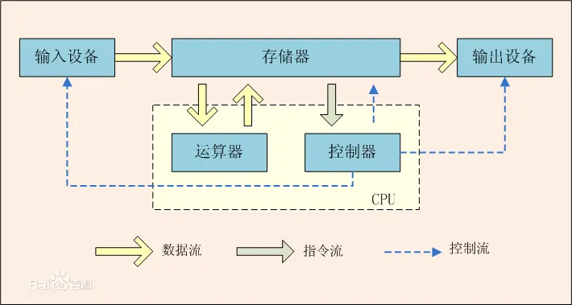

截至目前，我们所认识的计算机，都是由一个个的硬件组件组成
- 输入设备：包括键盘，鼠标，话筒，摄像头，磁盘，网卡等
- 输出设备：显示器，磁盘，网卡，打印机等
- 中央处理器(CPU)：含有运算器和控制器等


### 冯诺依曼体系为什么要有内存

当代CPU非常复杂，简化一下，CPU=运算器+控制器。图中的存储器指的是内存。在冯诺依曼体系中，输入和输出设备都叫外设，磁盘既是输入设备又是输出设备，对磁盘的操作称为IO(input/output)操作。

程序运行之前储存在磁盘里，软件要运行，必须加载到内存，因为冯诺依曼体系中CPU获取和输出数据只能在内存中运行，加载的过程本质是IO操作，数据是从一个设备“拷贝”到另一个设备，冯诺依曼体系的效率由设备“拷贝”的效率决定，CPU在数据层面，只和内存打交道。
 

在计算机的世界里，存储离CPU越近，速度越快，空间越小，成本越高。
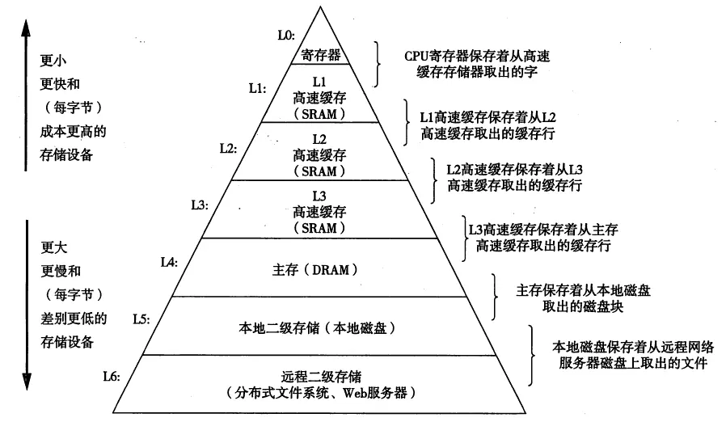

冯诺依曼体系为什么要有内存，因为CPU的运算速度非常快，外设跟不上，假如没有内存的话CPU99%的时间都在等待外设输入和输出数据，这样效率非常低。那为什么不把外设造得和CPU一样快呢，因为这样成本很高，沙特的石油佬都不一定能买几台，当代计算机是性价比的产物，在性能和价格之间找到的平衡。


### 从硬件方面理解数据流动
假如张三要和李四要在电脑上使用QQ微信飞书钉钉电子邮件等方式进行沟通，那么他们的消息数据是如何流动的？

张三要和李四的计算机都是冯诺依曼体系。首先张三要启动聊天软件，本质就是把软件加载到内存中，然后使用输入设备（键盘，麦克风等）输入他要发送的消息，输入设备再把消息拷贝到内存中，CPU读取内存中的消息数据，根据聊天软件的代码进行数据的封装加密等工作，然后再写入内存中，最后交给网卡，通过网络发送消息数据。发送后李四的网卡（输入设备）先拿到数据，然后把数据拷贝到内存中，CPU执行解密等操作再把数据写入内存，最后数据进入输出设备（显示器，耳机等）被李四看到。  
假如张三和李四需要传输文件或者其他东西，也是一样的过程，

所有的软件本质都是在处理存储器和内存之间的关系，各种算法都是在处理内存中的数据。

## 操作系统
一个基本的程序集合，被称为操作系统（OS）  
操作系统是一款进行软硬件管理的软件，操作系统包括：
- 操作系统内核（进程管理，内存管理，文件管理，驱动管理）
- 其他程序（例如函数库，shell程序等等）


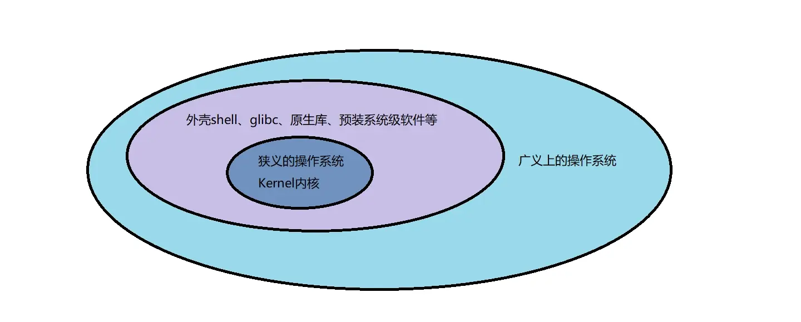

狭义上操作系统就是内核，但是只有一个内核用户用不了，所以从广义上来说操作系统由内核和各种各种外壳程序组成。
手机上的安卓底层也是Linux，安卓也是由内核和其他各种外围的软件组成。


### 设计操作系统的目的
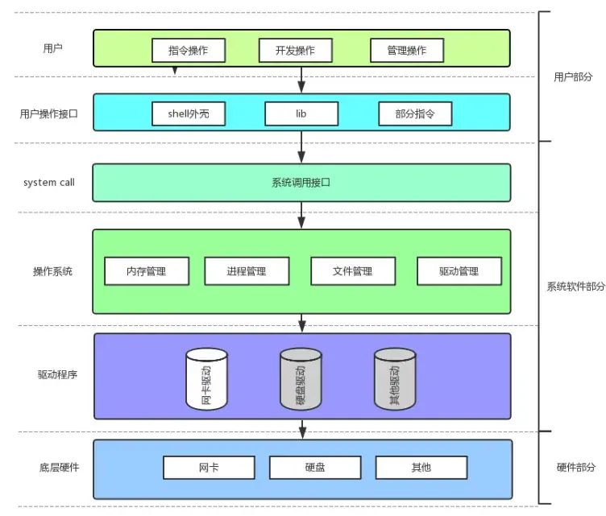

底层的硬件部分是冯诺依曼体系结构，操作系统向下要与硬件交互，管理所有的软硬件资源，向上给用户提供一个良好稳定的运行环境。

1. 计算机的软硬件体系是层状结构，不同层之间高内聚低耦合，CPU出问题换CPU，内存出问题换内存，操作系统出问题换系统，用户出问题换电脑，各个部分相对独立。
2. 要访问操作系统，必须使用系统调用，其实就是使用系统提供的函数。
3. 我们的程序只要访问了硬件，那么它必须贯穿整个操作系统。
4. 我们平时会使用各种库，库可能在底层封装了系统调用。


### 操作系统的管理
操作系统在结构中是承上启下的作用，是一款纯正的“搞管理”的软件。

想象一下，学校里有学生，班主任，校长。校长是管理者，学生是被管理者，校长有决策权，决定要干什么事情，班主任负责执行。在计算机里操作系统就是校长，驱动就是班主任，底层硬件就是学生。  
要管理，管理者可以不和被管理者见面。比如校长只需要问一下班主任就能知道谁迟到了谁没来上课。管理者可以根据数据进行管理，数据由中间层获取。  
学校所有学生的信息都汇总在一张execl表格里，表格信息由班主任填写，校长需要一批成绩最好的学生参加竞赛，就只需要按表格的成绩列排序，需要免费劳动力搬东西，就只需要在表格里筛选21班的所有男生，校长对学生的管理就是对execl表格数据增删查改的管理。后来老校长退休了，新校长上任，学校扩建了招收了更多学生，新校长发现execl表格效率太低了，自己写了一个新的学生管理系统，定义了一个结构体struct_stu，把学生的属性包含在内，再用结构体内的指针把学生数据连起来，最后就得到了一个学生链表，对学生的管理就变成了对学生链表数据增删查改的管理。  
校长创建学生链表的过程就是建模的过程，校长管理学生我们称为**先描述，再组织**，**先描述，再组织**，我们可以对任何管理场景进行建模。  


操作系统怎么管理硬件的？操作系统可以在自己的内部**先描述，再组织**，把各种硬件统一使用一个类，包含硬件的所有属性，然后再管理各个硬件代表的对象，这样对硬件的管理就变成了对硬件结构体对象进行增删查改的管理。为什么基本所有编程语言都会提供“类”，因为“类”解决的是先描述的问题。为什么C++还提供了STL容器的各种库，因为要解决再组织的问题。操作系统使用**先描述，再组织**来管理硬件，操作系统对硬件的管理就变成了对相应硬件的数据进行管理，操作系统里充满了大量的数据结构和与该数据结构对应的算法。

### 理解系统调用
操作系统要向上提供对应的服务，操作系统不相信任何用户或者人。  
类似与银行，既不相信客户又要提供服务，所有银行会有一个个窗口柜台来给客户办理用户。


操作系统也有系统提供的系统调用，就像银行的窗口一样，用户通过系统调用来和操作系统交互。  
在开发角度，操作系统对外会表现为一个整体，但是会暴露自己的部分接口，供上层开发使用，这部分由操作系统提供的接口，叫做系统调用。
Linux系统是C语言写的，提供的系统调用其实就是C函数，函数的输入参数就是用户要给操作系统的，返回值就是操作系统给用户的。系统调用的本质是用户和操作系统之间进行某种数据交互。

有些客户比如老年人，进银行里啥也不会，银行网点里为了帮助这些客户就有了大堂经理。操作系统里也有各种库，外壳，指令来帮助用户进行操作。  
系统调用在使用上，功能比较基础，对用户的要求相对也比较高，所以，有心的开发者可以对部分系统调用进行适度封装，从而形成库，有了库，就很有利于更上层用户或者开发者进行二次开发。库函数和系统调用就形成了上下层的关系，库函数访问了硬件就一定使用了系统调用。


## 进程

### 基本概念与基本操作
#### 什么是进程

课本概念：程序的一个执行实例，正在执行的程序等
内核观点：担当分配系统资源（CPU时间，内存）的实体。
当前：进程=内核数据结构(task_struct)+自己的程序代码和数据

~~进程介绍完毕，可以看下一节了~~


---


可执行程序在没运行时在磁盘里，运行时加载到内存中，这个可执行程序的代码和数据就在内存里，那这个就是进程了吗？
内存中一定会同时加载了很多软件程序，在这些软件还没加载到内存前，内存中就已经加载了操作系统，电脑开机的那一段时间就是在加载操作系统。要是让软件自己随意加载到内存里那计算机岂不是乱套了，所以操作系统必然要对多个被加载到内存中的程序进行管理。操作系统如何管理呢？**先描述，再管理**。操作系统自己搞一个struct结构体，里面有程序的代码地址，数据地址，优先级，id，状态，指向下一个struct的指针等属性，每当有程序要加载，就根据结构体创建一个对象，把程序的属性填进去，每个结构体对象都有指针指向对应的代码和数据，于此同时，还有指针指向下一个结构体对象，这样操作系统就有了一个包含所有加载到内存里程序对象的链表，我们把这个链表称作**进程列表**，对进程的管理，就变成了对链表的增删查改。

所以进程不仅仅是加载到内存里的代码和数据，操作系统里进程列表的节点加上对应的代码和数据才是进程。进程=内核数据结构(task_struct)+自己的程序代码和数据。我们把操作系统自己搞的struct结构体叫做**PCB**，PCB是个统称，所有操作系统里类似的这个东西都叫PCB，用中文说这个结构体叫做**进程控制块**。

Linux是一款具体的操作系统，这个PCB在Linux里具体叫做struct task_struct{}，在Linux里，进程=PCB(task_struct)+自己的程序代码和数据。PCB就约等于一个人的简历，一个人要找工作，其实是他的简历在找工作，简历本质是对一个人的描述，把简历投给公司就相当于把自己的属性投给过去了。面试排队是一份简历在一摞简历里排队，面试官拿简历依次面试一个个人，面试官就是CPU，而面试官拿出来的一份份简历就是队列，面试官调度某人筛选某人淘汰某人本质是把简历进行筛选淘汰。所以一个可执行程序加载到内存中它自己是最不重要的，最重要的是操作系统要创建对应的PCB来描述它。


#### task_struct

task_struct里面有什么？

内容分类
- 标示符：描述本进程的唯一标示符，用来区别其他进程。
- 状态：任务状态，退出代码，退出信号等。优先级：相对于其他进程的优先级。
- 程序计数器：程序中即将被执行的下一条指令的地址。
- 内存指针：包括程序代码和进程相关数据的指针，还有和其他进程共享的内存块的指针
- 上下文数据：进程执行时处理器的寄存器中的数据[休学例子，要加图CPU，寄存器]。
- I/O状态信息:包括显示的I/O请求，分配给进程的I/0设备和被进程使用的文件列表。
- 记账信息：可能包括处理器时间总和，使用的时钟数总和，时间限制，记账号等。
- 其他信息，具体详细信息之后介绍


我们可以在Linux内核源代码中找到`task_struct`

这个[网页](https://elixir.bootlin.com/linux/v2.6.18/source/include/linux/sched.h#L767)，或者在Linux内核官方网站的这个[网页](https://git.kernel.org/pub/scm/linux/kernel/git/torvalds/linux.git/tree/include/linux/sched.h?h=v2.6.18&id=3752aee96538b582b089f4a97a26e2ccd9403929)，以及在github的这个[网页](https://github.com/torvalds/linux/blob/v2.6.18/include/linux/sched.h)都可以查看Linux2.6.18版本内核源代码里task_struct的定义。

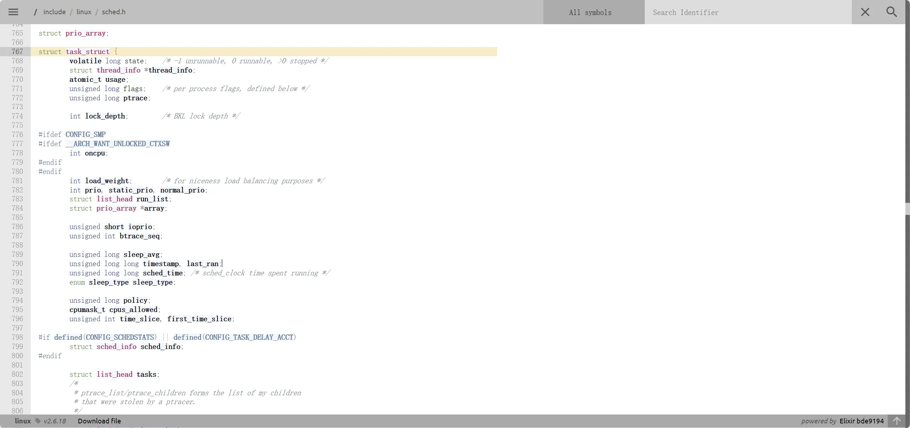
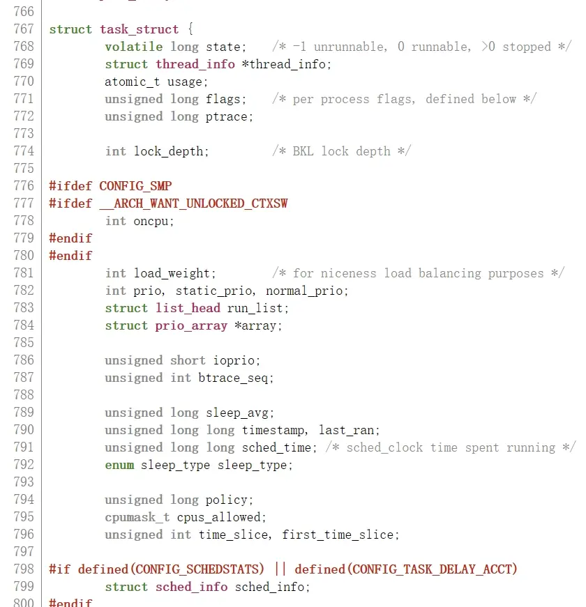
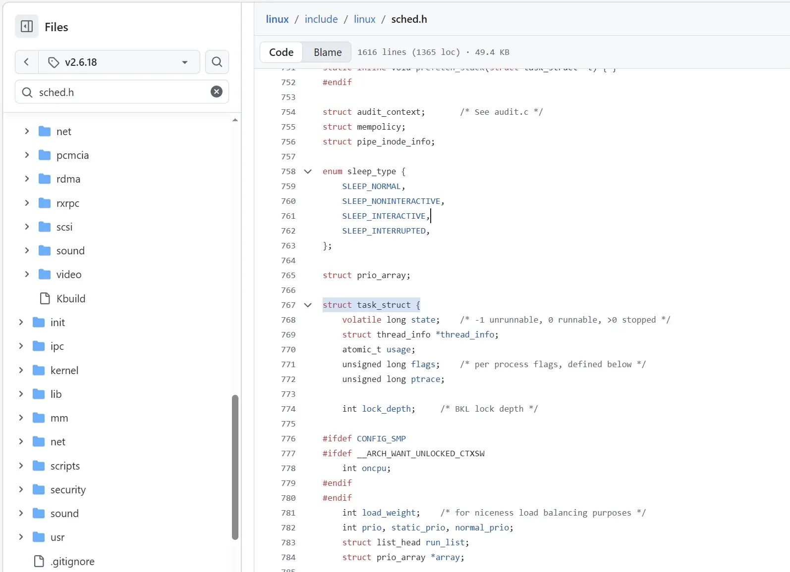


往下能看见`struct list_head tasks;`，说明Linux里是用双链表管理PCB的
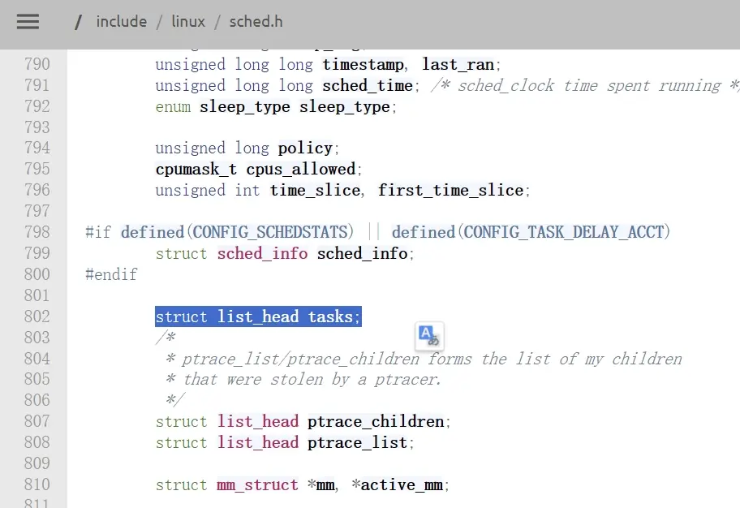


还有父子进程等等，往下还能看到更多信息
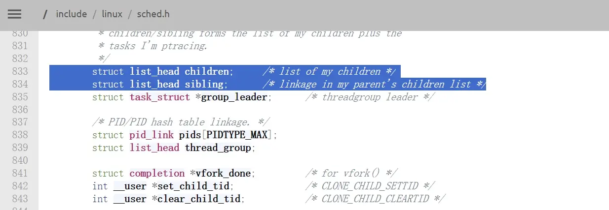

#### 查看进程


可执行程序可以通过`getpid()`系统调用来获取进程id (PID)，使用 `getppid()`系统调用获取父进程id (PPID)
```c
#include <stdio.h>
#include <sys/types.h>
#include <unistd.h>
int main()
{
    while(1)
    {
    printf("pid: %d\n", getpid());
    printf("ppid: %d\n", getppid());
    sleep(1)
    }

    return 0;
}
```
```bash
[user1@iZ2zeh5i3yddf3p4q4ueo7Z ~]$ gcc -o task task.c 
[user1@iZ2zeh5i3yddf3p4q4ueo7Z ~]$ ./task 
pid: 15229
ppid: 30400
pid: 15229
ppid: 30400
pid: 15229
ppid: 30400
pid: 15229
ppid: 30400
^C
[user1@iZ2zeh5i3yddf3p4q4ueo7Z PCB]$ 
```


我们历史上执行的所有的指令，工具，自己的程序，运行起来，全部都是进程。

使用`ps axj`指令可以展示系统内的所有进程
```bash
[user1@iZ2zeh5i3yddf3p4q4ueo7Z ~]$ ps axj
 PPID   PID  PGID   SID TTY      TPGID STAT   UID   TIME COMMAND
    0     1     1     1 ?           -1 Ss       0   0:16 /usr/lib/systemd/systemd --switched-root --system --deserialize
    0     2     0     0 ?           -1 S        0   0:00 [kthreadd]
    2     4     0     0 ?           -1 S<       0   0:00 [kworker/0:0H]
    2     6     0     0 ?           -1 S        0   0:05 [ksoftirqd/0]
    2     7     0     0 ?           -1 S        0   0:00 [migration/0]
    2     8     0     0 ?           -1 S        0   0:00 [rcu_bh]
    2     9     0     0 ?           -1 S        0   7:32 [rcu_sched]
    2    10     0     0 ?           -1 S<       0   0:00 [lru-add-drain]
    2    11     0     0 ?           -1 S        0   0:02 [watchdog/0]
    2    12     0     0 ?           -1 S        0   0:02 [watchdog/1]
    2    13     0     0 ?           -1 S        0   0:00 [migration/1]
    2    14     0     0 ?           -1 S        0   0:05 [ksoftirqd/1]
    2    16     0     0 ?           -1 S<       0   0:00 [kworker/1:0H]
    2    18     0     0 ?           -1 S        0   0:00 [kdevtmpfs]
    2    19     0     0 ?           -1 S<       0   0:00 [netns]
    2    20     0     0 ?           -1 S        0   0:00 [khungtaskd]
    2    21     0     0 ?           -1 S<       0   0:00 [writeback]
    2    22     0     0 ?           -1 S<       0   0:00 [kintegrityd]
    2    23     0     0 ?           -1 S<       0   0:00 [bioset]
    2    24     0     0 ?           -1 S<       0   0:00 [bioset]
    2    25     0     0 ?           -1 S<       0   0:00 [bioset]
    2    26     0     0 ?           -1 S<       0   0:00 [kblockd]
    2    27     0     0 ?           -1 S<       0   0:00 [md]
    2    28     0     0 ?           -1 S<       0   0:00 [edac-poller]
    2    29     0     0 ?           -1 S<       0   0:00 [watchdogd]
    2    36     0     0 ?           -1 S        0   0:00 [kswapd0]
    2    37     0     0 ?           -1 SN       0   0:00 [ksmd]
    2    38     0     0 ?           -1 SN       0   0:02 [khugepaged]
    2    39     0     0 ?           -1 S<       0   0:00 [crypto]
    2    47     0     0 ?           -1 S<       0   0:00 [kthrotld]
    2    49     0     0 ?           -1 S<       0   0:00 [kmpath_rdacd]
    2    50     0     0 ?           -1 S<       0   0:00 [kaluad]
    2    51     0     0 ?           -1 S<       0   0:00 [kpsmoused]
    2    52     0     0 ?           -1 S<       0   0:00 [ipv6_addrconf]
    2    65     0     0 ?           -1 S<       0   0:00 [deferwq]
    2   100     0     0 ?           -1 S        0   0:00 [kauditd]
    2   242     0     0 ?           -1 S<       0   0:00 [ata_sff]
    2   244     0     0 ?           -1 S        0   0:00 [scsi_eh_0]
    2   245     0     0 ?           -1 S<       0   0:00 [scsi_tmf_0]
    2   246     0     0 ?           -1 S        0   0:00 [scsi_eh_1]
    2   247     0     0 ?           -1 S<       0   0:00 [scsi_tmf_1]
    2   251     0     0 ?           -1 S<       0   0:00 [kworker/1:1H]
    2   253     0     0 ?           -1 S<       0   0:00 [ttm_swap]
    2   269     0     0 ?           -1 S<       0   0:02 [kworker/0:1H]
    2   270     0     0 ?           -1 S        0   0:13 [jbd2/vda1-8]
    2   271     0     0 ?           -1 S<       0   0:00 [ext4-rsv-conver]
    1   368   368   368 ?           -1 Ss       0   0:07 /usr/lib/systemd/systemd-journald
    1   389   389   389 ?           -1 Ss       0   0:00 /usr/lib/systemd/systemd-udevd
    1   439   439   439 ?           -1 S<sl     0   0:01 /sbin/auditd
    2   486     0     0 ?           -1 S<       0   0:00 [rpciod]
    2   487     0     0 ?           -1 S<       0   0:00 [xprtiod]
    1   539   539   539 ?           -1 Ss      81   0:12 /usr/bin/dbus-daemon --system --address=systemd: --nofork --nop
    2   540     0     0 ?           -1 S<       0   0:00 [nfit]
    1   548   548   548 ?           -1 Ss      32   0:01 /sbin/rpcbind -w
    1   549   549   549 ?           -1 Ssl      0   0:00 /usr/sbin/gssproxy -D
    1   555   555   555 ?           -1 Ss       0   0:07 /usr/lib/systemd/systemd-logind
    1   557   557   557 ?           -1 Ssl    999   0:06 /usr/lib/polkit-1/polkitd --no-debug
    1   563   561   561 ?           -1 S      998   0:01 /usr/sbin/chronyd
    1   799   799   799 ?           -1 Ss       0   0:00 /sbin/dhclient -1 -q -lf /var/lib/dhclient/dhclient--eth0.lease
    1   868   868   868 ?           -1 Ssl      0   1:24 /usr/bin/python2 -Es /usr/sbin/tuned -l -P
    1  1076  1076  1076 ?           -1 Ss       0   0:03 /usr/libexec/postfix/master -w
 1076  1078  1076  1076 ?           -1 S       89   0:00 qmgr -l -t unix -u
    1  1173  1173  1173 ?           -1 Ssl      0   0:41 /usr/sbin/rsyslogd -n
    1  1186  1186  1186 ?           -1 Ss       0   0:00 /usr/sbin/atd -f
    1  1188  1188  1188 ?           -1 Ss       0   0:01 /usr/sbin/crond -n
    1  1194  1194  1194 ttyS0     1194 Ss+      0   0:00 /sbin/agetty --keep-baud 115200,38400,9600 ttyS0 vt220
    1  1195  1195  1195 tty1      1195 Ss+      0   0:00 /sbin/agetty --noclear tty1 linux
    1  1565  1565  1565 ?           -1 Ss       0   0:03 /usr/local/cloudmonitor/bin/argusagent -d
 1565  1567  1565  1565 ?           -1 Sl       0 142:52 /usr/local/cloudmonitor/bin/argusagent
    1  1769  1769  1769 ?           -1 Ss       0   0:00 /usr/sbin/sshd -D
    1  2009  2009  2009 ?           -1 Ssl      0  16:44 /usr/local/share/aliyun-assist/aliyun-service.symlink
30400  2714  2714 30400 pts/2    15231 T     1001   0:00 ./testprocessbar
    1  2739  2739  2739 ?           -1 Ssl   1001   0:00 /home/user1/.VimForCpp/nvim process.c
    1  2757  2746  2746 ?           -1 Sl    1001   0:00 /home/user1/.VimForCpp/cquery/bin/cquery --log-file=/tmp/cquery
    1  3966  3966  3966 ?           -1 Ssl   1001   0:00 /home/user1/.VimForCpp/nvim main.c
    1  3984  3973  3973 ?           -1 Sl    1001   0:00 /home/user1/.VimForCpp/cquery/bin/cquery --log-file=/tmp/cquery
    2 10105     0     0 ?           -1 S        0   0:00 [kworker/u4:0]
    1 11811 11811 11811 ?           -1 Ssl   1001   0:00 /home/user1/.VimForCpp/nvim mygbd.c
    1 11835 11818 11818 ?           -1 Sl    1001   0:00 /home/user1/.VimForCpp/cquery/bin/cquery --log-file=/tmp/cquery
    2 11964     0     0 ?           -1 S        0   0:02 [kworker/0:2]
 1769 11995 11995 11995 ?           -1 Ss       0   0:00 sshd: root@pts/0
11995 11997 11997 11997 pts/0    11997 Ss+      0   0:00 -bash
30400 12102 12102 30400 pts/2    15231 T     1001   0:15 cgdb mytest
12102 12103 12103 12103 pts/3    12103 Ss+   1001   0:00 gdb --nw --annotate=2 -x /home/user1/.tgdb/a2_gdb_init mytest
    2 12195     0     0 ?           -1 R        0   0:03 [kworker/1:0]
    2 12720     0     0 ?           -1 S        0   0:00 [kworker/u4:1]
    2 14492     0     0 ?           -1 S        0   0:00 [kworker/0:0]
 1076 14940  1076  1076 ?           -1 S       89   0:00 pickup -l -t unix -u
    2 15000     0     0 ?           -1 S        0   0:00 [kworker/1:2]
30400 15231 15231 30400 pts/2    15231 R+    1001   0:00 ps axj
    1 15824 15824 15824 ?           -1 Ssl      0  10:08 /usr/local/aegis/aegis_update/AliYunDunUpdate
    1 15865 15865 15865 ?           -1 Ssl      0  51:44 /usr/local/aegis/aegis_client/aegis_12_81/AliYunDun
    1 15887 15887 15887 ?           -1 Ssl      0 111:37 /usr/local/aegis/aegis_client/aegis_12_81/AliYunDunMonitor
 1769 30397 30397 30397 ?           -1 Ss       0   0:00 sshd: user1 [priv]
30397 30399 30397 30397 ?           -1 D     1001   0:03 sshd: user1@pts/2
30399 30400 30400 30400 pts/2    15231 Ss    1001   0:00 -bash
[user1@iZ2zeh5i3yddf3p4q4ueo7Z ~]$ 
```
可以看到进程非常多，可以使用管道`|`再加`grep`指令筛选想要显示的进程。


运行一个循环程序
```c
#include <stdio.h>
#include <sys/types.h>
#include <unistd.h>
int main()
{
    while(1)
    {
    printf("pid: %d\n", getpid());
    printf("ppid: %d\n", getppid());
    sleep(1)
    }

    return 0;
}
```
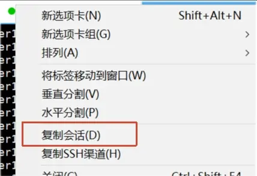

使用复制会话在另一个窗口输入命令。
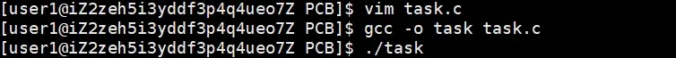
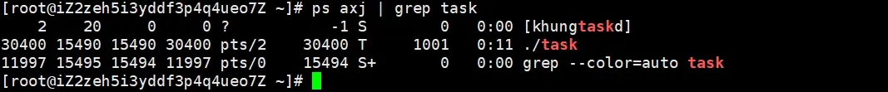
这样我们就查到了刚刚运行的程序的进程，但是这么多属性我们怎么知道哪个是哪个？我们可以使用`;`或`&&`来同时执行两条指令。  
使用`ps axj | head 1 ; ps axj | grep 对应的可执行程序`或`ps axj | head 1 && ps axj | grep 对应的可执行程序`来查找进程
```bash
 PPID   PID  PGID   SID TTY      TPGID STAT   UID   TIME COMMAND
    2    20     0     0 ?           -1 S        0   0:00 [khungtaskd]
15595 15631 15631 15595 pts/1    15631 R+    1001   0:03 ./task
11997 15640 15639 11997 pts/0    15639 R+       0   0:00 grep --color=auto task
[root@iZ2zeh5i3yddf3p4q4ueo7Z ~]# 
```
./task是我们刚刚运行的程序，grep --color=auto task是什么东西？grep是个命令，查找的时候也是一个进程，所以会自己把自己找出来，再加一个管道`|`,跟上命令`grep -v grep`反向筛选就能去掉显示grep了。

使用ctrl+c快捷键可以杀掉进程，使用`kill -9 进程编号`指令也可以杀掉指定进程。
```bash
[user1@iZ2zeh5i3yddf3p4q4ueo7Z PCB]$ ./task 
^C
[user1@iZ2zeh5i3yddf3p4q4ueo7Z PCB]$ 
```
我们运行的所有指令在系统里也都是进程，系统里执行任务都是通过进程执行的，windows系统里完成各种任务也是进程，手机上的所有操作也是进程。所以在Linux系统里用户是以进程的方式来访问操作系统的，我们在系统里使用各种指令就是在给系统布置任务，所以**进程**也可以被称为**任务**。

除了`ps`指令，我们也可以通过`/proc`系统文件夹查看进程的信息，`/proc`文件夹里都是内存的数据，这也符合Linux里一切皆文件。
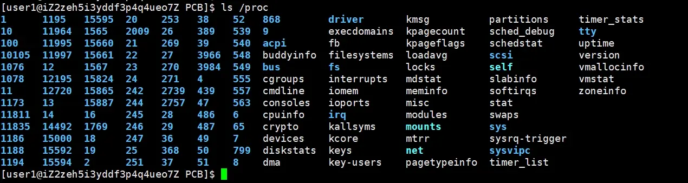


`/proc`系统文件夹里记录着当前系统里所有进程的信息，这些蓝色的数字是目录，每个数字目录代表着特定进程的PID，数字目录里的内容包含着进程在运行时的动态属性，一旦该进程退出，该目录会被系统自动移除。进入目录里可以看到进程的各种属性。
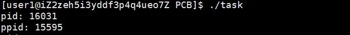
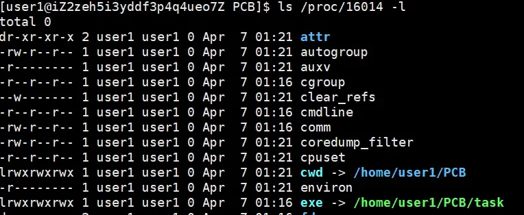
进程在启动时知道自己是从哪里来的，exe会记录下可执行文件名以及绝对路径。假如把进程所对应的可执行文件删除，进程竟然还能运行，因为删除的是磁盘上的文件，但是可执行文件已经拷贝到内存里运行了。
exe上面还有一个cwd，是current work dir的缩写，进程在启动时会记录下来自己的当前路径，当进程运行时需要根据文件名找文件时就会使用cwd路径加上文件名寻找，未指定路径时创建文件就在cwd路径下创建，也就是在当前路径下寻找或创建，可以使用`chdir`指令修改cwd路径，这样进程在寻找或创建文件时，就会在修改后的路径下寻找或创建。


Linux里所有的进程都是被它的父进程创建的，所有的进程组成一颗进程树。
```bash
[user1@iZ2zeh5i3yddf3p4q4ueo7Z PCB]$ ./task
pid: 17687
ppid: 15595
^C
[user1@iZ2zeh5i3yddf3p4q4ueo7Z PCB]$ ./task
pid: 17688
ppid: 15595
^C
[user1@iZ2zeh5i3yddf3p4q4ueo7Z PCB]$ ./task
pid: 17689
ppid: 15595
^C
[user1@iZ2zeh5i3yddf3p4q4ueo7Z PCB]$ 
```
多次启动上面的的程序，可以发现每次启动的pid都不一样，但是父进程却相同，这个父进程是什么东西？我们使用`ps axj | head -1 ; ps axj| grep 15595`来查询一下。
```bash
[user1@iZ2zeh5i3yddf3p4q4ueo7Z PCB]$ ps axj | head -1 ; ps axj| grep 15595
 PPID   PID  PGID   SID TTY      TPGID STAT   UID   TIME COMMAND
15594 15595 15595 15595 pts/1    15595 Ss+   1001   0:00 -bash
15595 15686 15686 15595 pts/1    15595 T     1001   3:08 ./task
15595 17673 17673 15595 pts/1    15595 T     1001   0:00 ./task
15707 17693 17692 15707 pts/2    17692 S+    1001   0:00 grep --color=auto 15595
[user1@iZ2zeh5i3yddf3p4q4ueo7Z PCB]$ 
```
进程15594是bash，其实就是Linux的外壳shell程序，命令行解释器bash本质就是一个进程，执行命令时bash会创建一个子进程执行，命令进程的父进程都是bash。


> [!TIP]
> 操作系统会给每个登录用户分配一个bash


#### 通过系统调用创建进程


我们可以通过系统调用`fork()`来创建进程。
```c
#include <stdio.h>
#include <sys/types.h>
#include <unistd.h>
int main()
{
    int ret = fork();
    printf("hello proc : %d!, ret: %d\n", getpid(), ret，getppid());
    sleep(1);
    return 0;
}
```
```bash
[user1@iZ2zeh5i3yddf3p4q4ueo7Z PCB]$ gcc -o fork fork.c 
[user1@iZ2zeh5i3yddf3p4q4ueo7Z PCB]$ ./fork
hello proc : 17899!, ret: 17900
hello proc : 17900!, ret: 0
[user1@iZ2zeh5i3yddf3p4q4ueo7Z PCB]$ 
```
运行发现`printf`打印了两次，子进程的pid是0。  
一个进程由PCB加自己的代码和数据组成，创建子进程必然要创建一个子进程的PCB，创建子进程时一般直接拷贝一份父进程的PCB，大部分属性都是一样的，父进程的PCB指向自己的数据和代码，子进程的PCB也指向父进程的数据和代码，所以子进程被调度之后，就会执行父进程之后的代码；子进程没有自己的代码和数据，因为程序没有新加载新的代码和数据，子进程的PCB类似于浅拷贝。

`fork()`有两个返回值，创建进程成功后把子进程的pid返回给父进程，返回0给子进程，创建进程失败则只返回-1，假如想让父子进程执行不同的代码逻辑，可以使用`fork()`的返回值判断父子进程，再安排执行不同的代码。
```c
#include <stdio.h>
#include <sys/types.h>
#include <unistd.h>
int main()
{
    int ret = fork();
    if(ret < 0){
        perror("fork");
        return 1;
    }
    else if(ret == 0){          //子进程
        printf("我是子进程 : %d!, ret: %d,我的父进程是：%d!\n", getpid(), ret,getppid());
    }else{                      //父进程
        printf("我是父进程 : %d!, ret: %d\n", getpid(), ret);
    }
    sleep(1);
    return 0;
}
```
```bash
[user1@iZ2zeh5i3yddf3p4q4ueo7Z PCB]$ gcc -o fork fork.c 
[user1@iZ2zeh5i3yddf3p4q4ueo7Z PCB]$ ./fork
我是父进程 : 18507!, ret: 18508
我是子进程 : 18508!, ret: 0,我的父进程是：18507!
[user1@iZ2zeh5i3yddf3p4q4ueo7Z PCB]$ 
```
运行之后可以看到父子进程执行了不同的代码。子进程只有一个父进程，一个父进程可能有多个子进程，所以父进程需要`fork()`返回的子进程pid来区分不同子进程。  
为什么`fork()`函数会返回两次？`fork()`函数内部已经创建子进程完毕时还没有到`return`语句，但是这时已经有父子两个进程了，都会执行`return`语句，所以`return`语句就会返回两次。  
为什么`ret`既等于0又大于0，让`else if`和`else`内部的代码都执行呢？进程具有独立性，一个进程挂了不影响另一个进程，代码是只读的，父子进程共享，数据也是默认父子进程共享，但是父子任何一方要修改数据，操作系统就会把修改的数据在底层再拷贝一份，让目标进程修改这个拷贝，这就是**写时拷贝**，父子进程的数据以**写时拷贝**的方式各自有一份。


### 进程状态


进程状态本质就是task_struct内的一个整数，我们可以在源代码中查看。


点击[这个](https://elixir.bootlin.com/linux/v2.6.18/source/fs/proc/array.c#L131)，[这个](https://git.kernel.org/pub/scm/linux/kernel/git/torvalds/linux.git/tree/fs/proc/array.c?h=v2.6.18&id=3752aee96538b582b089f4a97a26e2ccd9403929)，还有[这个](https://github.com/torvalds/linux/blob/v2.6.18/fs/proc/array.c)网页查看2.6.18版本里的源代码。

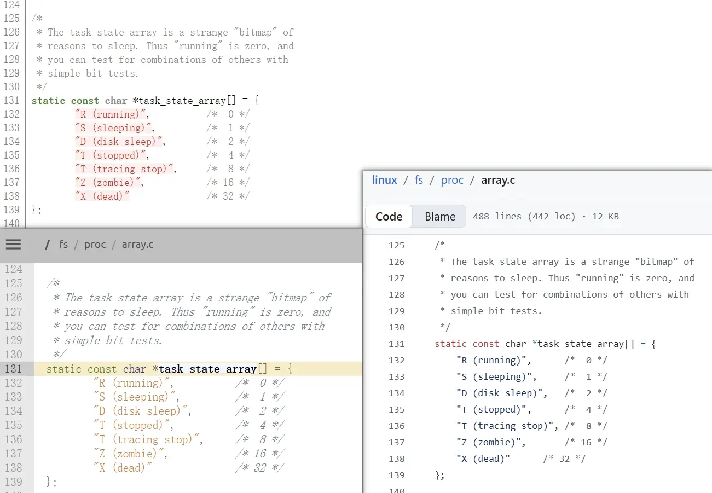


可以看到进程状态挺多，而且可以相互之间转换。


#### 运行状态


一个进程能够被CPU运行，本质是每个CPU都要在系统内部维护调度队列，一个CPU一个调度队列，CPU要选择进程运行，就是在选择特点进程的PCB来运行，一个task_struct里都有指针指向对应的代码和数据；在操作系统学科有一种调度算法叫FIFO(先进先出)算法，就是让CPU安装调度队列顺序依次执行。


只要进程在CPU调度队列中，就是R(running)**运行状态**，running状态要么是CPU正在运行要么就是在调度队列里排队。


#### 阻塞状态

有时候一些程序需要用户输入。
```cpp
#include <iostream>
int main() {
    int a;
    double b;
    std::cin >> a >> b;   // 从键盘读取两个数
    std::cout << "a = " << a << ", b = " << b << std::endl;
    return 0;
}
```
程序运行到`std::cin`时不是在等待用户输入，而是在等待键盘硬件就绪，在用户没按下键盘时，我们称键盘硬件不就绪，程序就得等。  
**阻塞状态**(sleeping)指的就是等待某种设备或资源就绪。比如磁盘在忙IO压力大等待，等待键盘按下等等情况。操作系统要对软硬件资源进行管理，先描述再管理，可以对硬件创建一个类似task_struct的东西，包含硬件的所有属性，再连成链表，对硬件的管理就变成了对硬件链表进行管理。每一个硬件struct里也有指针，连起来形成硬件的等待队列，假如CPU执行程序要读键盘，检查键盘状态，但是没有任何按键按下，所以程序无法执行，操作系统把这个进程从CPU上拿下移出运行队列，PCB连接到特定设备的等待队列里，移出调度队列该进程就永远不会被调度，那么这个进程就处于**阻塞状态**。

从运行到阻塞的本质是把PCB链入到不同的队列结构当中。

当键盘上有按键按下，键盘处于就绪状态，操作系统第一时间知道后就把键盘的struct属性里的状态属性设置为就绪，并检查等待队列，发现等待队列里指针不为空，就将该等待队列里进程的状态设置成运行状态，并转移到运行队列。

> [!NOTE]
> 进程状态的变化，表现之一就是要在不同的队列中进行流动，本质都是数据结构的增删查改。

#### 挂起状态

挂起是操作系统里比较极端的情况。磁盘中会有一个swap分区，假设计算机的内存资源严重不足了，内存资源吃紧时，操作系统会把不会被调度的阻塞进程的资源和代码从内存转移到swap分区中，只保留PCB在内存里，此时我们称这些只有PCB的进程的状态为**阻塞挂起**；一旦内存资源足够，操作系统会把对应进程被换入磁盘swap分区的代码和数据重新加载到内存，这就是swap的换入和换出操作。  

当把阻塞进程全部换入swap分区内存还是不够怎么办，操作系统就只能把运行队列末端的进程也换入swap分区，此时我们称这时进程为**运行挂起**状态。挂起本质是把进程换入到swap分区里。

##### 内核链表的管理

> [!IMPORTANT]
> 查看源码可以发现，Linux内核里定义的task_struct的指针直接指向另一个task_struct的成员指针，不指向task_struct结构体的开头，通过内存对齐的偏移量来读取其他成员变量的数据。task_struct里多放几个类似的指针成员变量，再链接不同的task_struct，这样就实现了一个task_struct既在全局的双链表里又在运行队列里，同时属于多种不同的数据结构。

#### 查看进程状态
运行一个循环的hello world
```c
#include <stdio.h>
#include <unistd.h>
int main()
{
    while(1)
    {
    printf("hello world\n");
    }
    return 0;
}
```

状态后的`+`代表进程是在前台运行，后台的进程状态就不带`+`。  
hello一直在运行，但是查询进程状态发现大部分查询出来的状态hello都是S+状态，少部分是R+状态，把`printf`删掉查询时就全部是R+状态了，这是什么情况？  
在Linux系统里R (running)代表运行状态，S (sleeping)代表阻塞状态，CPU运行非常快，`printf`可以运行很多次，但是外设跟不上`printf`的速度，程序只能等待外设就绪，所以就变成了阻塞状态，少部分查询到运行状态代表在查询时`printf`正在输出，所以是运行状态，删掉`printf`后程序不需要等待外设了可以一直运行，所以查询时就全是运行状态。


从源代码可以看出，Linux系统的进程还有其他几个状态：
- t (tracing stop)是追踪状态，在调试时打断点程序运行到断点处停止时就处于这个状态。
- T (stopped)代表程序的暂停状态，hello程序一直打印hello world时使用ctrl+z快捷键就使程序暂停进入T (stopped暂停)状态，T (stopped)一般是用来止损的，操作系统不想让进程执行操作，但是又不能直接杀掉进程，所以就暂停进程，交给用户来处理问题。
- D (disk sleep)磁盘休眠状态，S状态可称为可中断休眠，浅睡眠，S状态的进程可以直接杀掉，进程会响应，D (disk sleep)磁盘休眠状态，可称为不可中断休眠，深睡眠，D状态的进程一般在往磁盘写入数据，等待磁盘响应，但是等待时又没法工作，如果在内存紧张时杀掉不干活的写入进程会导致数据丢失，所以D状态就是用来保护进程不被杀掉的，D状态一般在大量磁盘IO操作时出现。
- X (dead)是死亡状态，表示进程要结束了。


#### 僵尸进程

Z (zombie)，表示僵尸状态，进程快死不死了，我们创建子进程就是拿来干活的，要是子进程退出了，父进程需要获取相关信息，看看活干得怎么样，在子进程退出之后，父进程获取相关信息之前，就是Z僵尸状态。  
C语言的`main`函数都有一个`return 0`来表示程序正常退出，一个进程在退出时也会有类似的东西，让父进程知道退出状态，退出信息都储存在task_struct里。


运行以下程序来模拟僵尸进程。
```c
#include <stdio.h>
#include <stdlib.h>

int main()
{
    pid_t id = fork();
    if(id < 0){
        perror("fork");
        return 1;
    }
    else if(id > 0){ //parent
        printf("parent[%d] is sleeping...\n", getpid());
        sleep(30);
    }else{
        printf("child[%d] is begin Z...\n", getpid());
        sleep(5);
        exit(EXIT_SUCCESS);
    }
    return 0;
}
```

我们就可以看到pid为19237的子进程为僵尸状态了。
```bash
[user1@iZ2zeh5i3yddf3p4q4ueo7Z PCB]$ ps axj | head -1 ; ps axj| grep zombic
 PPID   PID  PGID   SID TTY      TPGID STAT   UID   TIME COMMAND
15595 19236 19236 15595 pts/1    19236 S+    1001   0:00 ./zombic
19236 19237 19236 15595 pts/1    19236 Z+    1001   0:00 [zombic] <defunct>
15707 19246 19245 15707 pts/2    19245 S+    1001   0:00 grep --color=auto zombic
[user1@iZ2zeh5i3yddf3p4q4ueo7Z PCB]$ 
```

如果父进程一直不管，不回收，不获取子进程退出信息，那么僵尸状态的子进程会一直存在，那么就会导致**内存泄漏**。进程退出了操作系统会自动释放所有资源，一些需要长期运行的进程（常驻进程）一但发生内存泄漏没法通过退出进程来解决，所以在编译前就要考虑好。操作系统也是个软件，假如内部发生内存泄漏影响就比较大，出现了僵尸进程只能由用户来处理。


### 进程优先级
待更新。。。

### 进程切换


