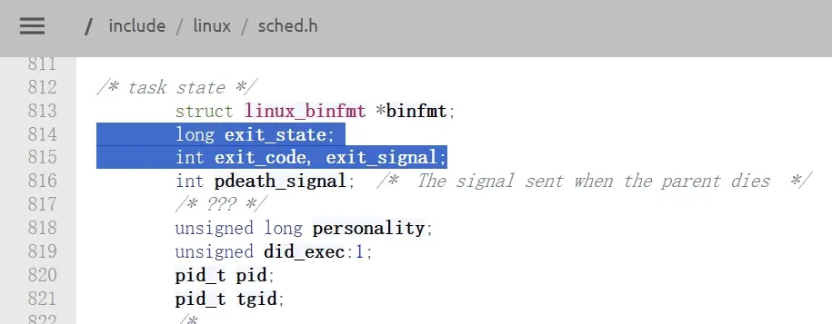
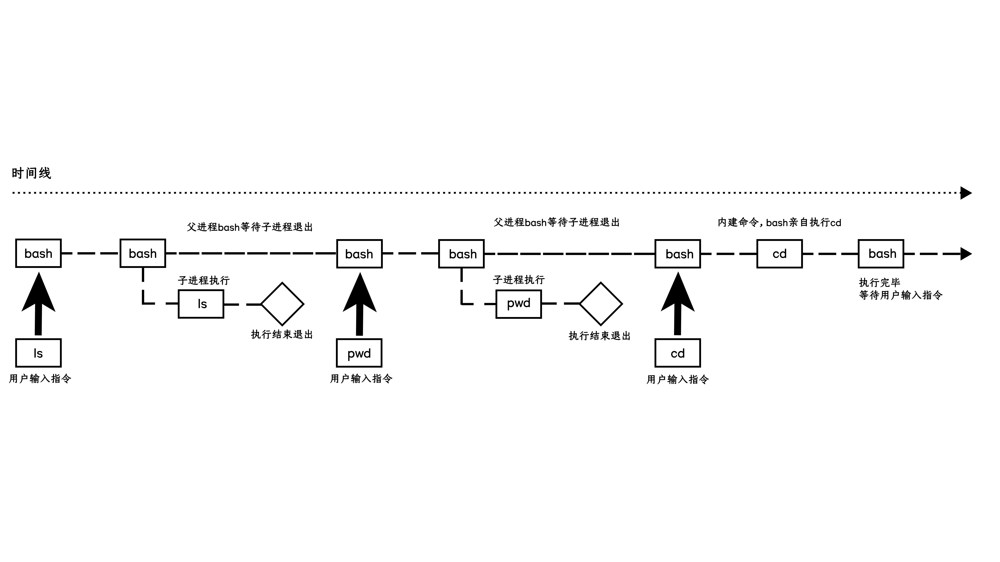

---

date: 2026-04-10T00:00:00+08:00
lastmod: 2026-04-15T00:00:00+08:00
title: '【Linux】06 - 进程控制'


tags:
  - 进程控制

categories:
  - Linux
   

---


# 进程控制


## 进程创建

### fork函数

linux中`fork`函数是非常重要的函数，它从已存在进程中创建一个新进程。新进程为子进程，而原进程为父进程，给子进程返回0，父进程返回子进程pid，创建进程失败返回-1。

进程调用`fork`，当控制转移到内核中的`fork`代码后，内核会做：
- 分配新的内存块和内核数据结构给子进程
- 将父进程部分数据结构内容拷贝至子进程
- 添加子进程到系统进程列表当中
- `fork`函数返回，开始调度器调度

父子进程相对独立，假如父进程创建的子进程是另一款操作系统，这样我们就可以在Linux系统里运行起来其他操作系统，这就是内核级虚拟机的原理。

#### fork的常规用法

我们创建一个子进程一般有两种用法，一种是创建子进程来执行代码的一部分，比如使用`if else`分流，父子进程各自执行后续代码的一部分，另一种是创建子进程去执行全新的程序，比如在命令行中执行命令，父进程bash会创建一个子进程来执行命令。

#### fork调用失败

fork函数调用失败可能有多种原因，比如操作系统创建进程数据结构失败，或者加载到内存失败，总之失败原因都是内存空间不足。

### 写时拷贝

通常父子代码共享，父子再不写入时，数据也是共享的，当任意一试图写入，便以写时拷贝的方式各自一份副本。  
修改前父子的页表相同，代码和数据地址指向同一块物理地址，创建子进程前父进程页表的代码区是只读的，数据区可以读写，创建子进程后父进程页表的代码和数据权限都被修改为只读的，子进程直接拷贝父进程的页表，权限也是一样的；当有进程要修改数据时，操作系统发现访问的数据区是只读的，这时就会触发写时拷贝。也就是说操作系统是通过页表的权限来知道有子进程要修改数据，进而执行写时拷贝。

假如不采用写时拷贝的话创建子进程时就要深拷贝父进程的所有数据，速度会慢，而且当子进程只修改少部分变量时子进程的数据大部分和父进程相同，却在内存里存了两份。所以写时拷贝可以减少子进程创建的成本和内存空间的浪费。


## 进程终止

### 进程退出的场景

- 代码运行完毕结果正确
- 代码运行完毕结果不正确
- 代码异常终止

子进程也是进程，父进程需要知道子进程的运行结果来进行下一步决策。

在c/c++里我们用`main`函数作为程序入口
```c
int main()
```
`main`函数的返回值，通常表明程序的执行情况，运行完毕结果正确返回0，运行完毕结果不正确返回非0，有些编译器在不写返回值时也能编译通过，默认返回值是0。一般的返回值是通过寄存器返回的。  
张三考试成绩好的时候回家爸妈不会问为什么成绩好，考得差的时候回家爸妈会连着问为什么考这么差，代码也是一样，成功运行的时候没人问为什么成功，运行失败了就要寻找失败原因。运行成功返回0，失败返回非0，如返回1代表没权限，返回2代表访问的文件不存在等待，使用不同的返回值代表不同的错误原因。

`main`函数的返回值一般返回给父进程，使用`echo $?`可以查看`main`函数的返回值。使用bash运行可执行程序时，可执行程序的父进程就是bash，父进程bash需要知道子进程运行得正常还是不正常，所以要获得子进程的退出码。`$?`的含义是打印最近一个进程退出的退出码，`main`函数的返回值我们称为退出码。进程的退出码要写入到进程的`task_struct`内，所以父进程读取僵尸进程的PCB就能获取到退出码。`echo $?`命令执行时也是一个进程，假如连续两次使用`echo $?`命令，第二个`echo $?`命令输出的就是第一个`echo $?`命令的退出码。  
运行指令`ls -l 不存在的文件`，会报错，此时使用`echo $?`查看退出码就会得到2，C语言准备了一套退出码给用户使用，如果不想使用C语言提供的，也可以自定义退出码。总之代码执行完毕结果，结果对不对由进程的退出码决定。

一旦代码运行出异常，退出码就无意义了，就像考试正常结束看分数就知道结果怎么样，但是考试作弊被抓着了考试的分数也就不重要了。一旦进程出现异常，一般是进程收到了信号。  

### 进程常见退出方法

正常终止（可以通过`echo $?`查看进程退出码）：
1. 从`main`函数返回
2. 调用`exit()`
3. 调用`_exit()`


#### exit和_exit
`main`函数结束，进程退出，其他函数，只表示自己函数调用完成，返回。C语言的`exit()`函数可以使进程退出，函数的参数就是退出码。任何地方调用`exit()`函数，都表示进程结束，并返回退出码给父进程，后续代码不执行，函数不返回。进程退出的具体做法就是`main`函数返回和调用`exit()`函数这两个。

`exit()`是C语言提供的，`_exit()`是系统调用，由操作系统提供。

运行以下程序，使用`exit()`函数退出进程
```c
#include <stdio.h>
#include <stdlib.h>        //包含头文件
int main()
{
printf("hello");
exit(0);
}
```
```bash
[user1@iZ2zeh5i3yddf3p4q4ueo7Z ~]$  ./hello
hello[user1@iZ2zeh5i3yddf3p4q4ueo7Z ~]$
```
可以看到刷新了缓冲区后进程退出。

运行以下程序，使用系统调用`_exit()`退出进程
```c
#include <stdio.h>
#include <unistd.h>         //包含头文件
int main()
{
printf("hello");
_exit(0);
}
```
```bash
[user1@iZ2zeh5i3yddf3p4q4ueo7Z ~]$  ./hello
[user1@iZ2zeh5i3yddf3p4q4ueo7Z ~]$
```
可以看到进程退出前并没有刷新缓冲区。


进程调用`exit()`函数退出，会进行缓冲区的刷新，使用`_exit()`退出，不会进行缓冲区的刷新。  
`exit()`是库函数，`_exit()`是系统调用，库函数和系统调用是上下层的关系，库函数会使用系统调用来完成任务。只有操作系统能决定进程是否退出，所以库函数`exit()`就是封装了系统调用`_exit()`。  
使用`_exit()`退出，不会进行缓冲区的刷新，说明缓冲区不在操作系统内部，缓冲区其实是库缓冲区，是C语言提供的。


## 进程等待

### 进程等待的必要性

- 子进程退出，父进程如果不管不顾，就可能造成“僵尸进程’的问题，进而造成内存泄漏。
- 另外，进程一旦变成僵尸状态，那就刀枪不入，杀人不眨眼”的kill-9也无能为力，因为谁也没有办法杀死一个已经死去的进程。
- 最后，父进程派给子进程的任务完成的如何，我们需要知道。如，子进程运行完成，结果对还是不对，或者是否正常退出。
- 父进程通过进程等待的方式，**回收子进程资源**，**获取子进程退出信息**，其中回收子进程资源是最重要的，获取子进程退出信息是可选项。

### 进程等待的方式

进程等待是一种父进程通过`wait`的方式或`waitpid`的方式来等待子进程的，这种方式就叫进程等待。


#### wait和waitpid

`wait`和`waitpid`都需要头文件`<sys/types.h> <sys/wait.h>`，`pid_t wait(int* status);`的参数是返回型参数，需要放一个`int`的地址，`wait`会把返回信息放在这个`int`里，如果不需要返回值可以放一个空指针；`wait`会等待任意一个退出的子进程。`wait`的返回值是目标僵尸子进程的pid，失败时返回-1。  
如果在等待子进程，子进程没有退出，父进程会阻塞在`wait`调用处，类似`scanf`函数等待键盘。


`waitpid`相比于`wait`会有更多参数，父进程可以获取到更多信息。`pid_ t waitpid(pid_t pid, int *status, int options);`的返回值和`wait`一模一样，都是返回子进程的pid；`int options`参数是用来阻塞控制的；`pid_t pid`参数是用来选择子进程的，传入对应的子进程pid父进程就会等待相应子进程的pid，如果大于0就是子进程的pid，传入-1就是和`wait`一样等待任意子进程，如果传入不存在的pid那么就会等待失败。  

#### status参数

`int *status`参数与`wait`的相同，都是返回型参数，`status`看起来是一个整数，但是内部被分成了不同的区域，一个`int`整型有4个字节，共32个比特位，`status`的高16位不使用，第8到15位表示进程的退出码，获取退出码需要将`status`右移8位，再按位与上16进制数`0xFF`(`0xFF`前24个比特位全0，后8个比特位是1)，就能得到退出码了。

为什么不使用一个全局变量储存退出码？子进程退出的信息也属于子进程的数据，子进程要修改变量时发生写时拷贝，父进程无法拿到，所以父进程必须使用系统调用才能拿到。

Linux系统里存在很多信号，使用`kill -l`可以查看，当代码没有执行完毕异常终止时，`status`的低7个比特位会保存异常时对应的信号编号，没有异常时7个比特位全0，一旦低7个比特位不全为0，就代表异常退出，这时退出码就无意义。将`status`按位与上16进制数`0x7F`(`0xFF`前25个比特位全0，后7个比特位是1)，就能得到异常时对应的信号编号。


运行以下程序
```c
#include <sys/wait.h>
#include <stdio.h>
#include <stdlib.h>
#include <string.h>
#include <errno.h>

int main( void )
{
    pid_t pid;
    if ( (pid=fork()) == -1 )
        perror("fork"),exit(1);
    if ( pid == 0 ){
        sleep(20);
        exit(10);
    } else {
        int st;
        int ret = wait(&st);
        
        if ( ret > 0 && ( st & 0X7F ) == 0 ){ // 正常退出
            printf("child exit code:%d\n", (st>>8)&0XFF);
        } else if( ret > 0 ) {  // 异常退出
            printf("sig code : %d\n", st&0X7F );                
        }
    }
}
```
正常退出时会打印出退出码，异常退出时（如ctrl+c杀进程或出现解引用野指针等）会打印出异常对应的信号编号。


子进程退出时要进入僵尸状态，操作系统会把子进程的退出信息放在进程的PCB里，父进程通过系统调用`wait`或`waitpid`来找到子进程的PCB，进而拿到子进程的退出信息，`getpid`和`getppid`也是类似的原理。  
在Linux2.6.18版本的源代码[^1]可以看到`long exit_state;`和`int exit_code, exit_signal;`，这就是用来储存对应退出信息的。


自己进行位运算还是太麻烦了，系统提供了对应的宏来给我们直接使用，
- `WIFEXITED(status)`：若为正常终进程返回的状态，则为真。（查看进程是否是正常退出）
- `WEXITSTATUS(status)`：若WIFEXITED非零，提取进程退出码（查看进程的退出码，等于`(status>>8)&0XFF`）
- 


[^1]: 在bootlin的[网站](https://elixir.bootlin.com/linux/v2.6.18/source/include/linux/sched.h)和Linux内核官网的这个[网页](https://git.kernel.org/pub/scm/linux/kernel/git/torvalds/linux.git/tree/include/linux/sched.h?h=v2.6.18&id=3752aee96538b582b089f4a97a26e2ccd9403929)以及GitHub的这个[网页](https://github.com/torvalds/linux/blob/v2.6.18/include/linux/sched.h) 都能查看Linux2.6.18版本的源代码


#### options参数

`options`可以设置一些选项，默认为0代表阻塞状态，设置为`WNOHANG`就代表如果子进程没有退出就立即返回，这种特性我们称为**非阻塞调用**。


假设期末要考试了，学渣张三啥也不会，就跑到学霸李四家楼下打电话，准备叫李四下来请他吃饭，顺便帮自己复习一下，张三就打电话问李四好了没，李四说没好再等我复习一下，张三立即挂断电话，然后等了30秒又打电话问李四好了没，李四说没好再等我复习一下，张三又立即挂断电话，就这样张三打了好几轮电话后李四准备好了就出门一起吃饭去了。在这个过程中，张三是用户，李四是操作系统，打电话就是一次函数调用，打一次电话检测一次李四的状态，没好时张三立即挂断电话，函数立即返回，过一会再打一次电话，这种状态我们称为**非阻塞轮询**。在这个场景里，张三也可以是父进程，李四是子进程，父进程不断打电话问子进程子进程的状态。  
准备到第二门考试了，张三又来找李四，张三打电话问李四好了没，李四说没好再等我复习一下，这次张三说电话别挂，上次不断打电话用了好多话费，李四说行行行，最后张三和李四一起复习去了。在这个过程里，张三打打电话一直没挂，这种状态我们称为**阻塞调用**。


轮询其实就是一个循环，把`options`设置为`WNOHANG`时，返回值`pid_t`大于0代表等待结束，等于0代表调用结束，但子进程没有退出，小于0代表等待失败。

张三在非阻塞调用李四时会立即挂断电话，在挂断电话到打下一个电话的这段时间里张三可以干一些其他事情，比如自己看一下考试复习资料。非阻塞调用可以让等待方做自己的事情，张三和李四可以并发在运行，所以非阻塞调用效率会更高一些，因为两个进程单位时间内可以做更多事情。非阻塞在英文里一般叫做Non Block


父进程运行以下循环
```c
while (1)
{
    int status = 0;
    pid_t rid = waitpid(id, &status,WNOHANG);
    if(rid> 0)
    {
    printf("等待成功, rid:%d, exit code:%d, exit signal:%d\n",rid, (status>>8)&0xFF, status&0x7F) ;// rid
    break;
    }
    else if(rid == 0)
    {
        printf（"本轮调用结束，子进程没有退出\n"）;
        sleep(1);
    }
    else
    {
        printf（"等待失败\n"）;
        break;
    }
}
```
当子进程未退出时，父进程会一直轮询子进程状态，直到子进程退出，在等待的同时还可以进行其他任务。


## 进程程序替换


当我们在bash命令行里输入`sleep 1000`指令执行后，发现bash就一直处于阻塞状态，没法执行指令

在程序替换的过程中，并没有创建新的进程，只是把当前进程的代码和数据用新的程序的代码和数据覆盖式的进行替换。

当进程调用一种`exec`函数时，该进程的用户空间代码和数据完全被新程序替换，从新程序的启动例程开始执行。调用`exec`并不创建新进程，所以调用`exec`前后该进程的`pid`并未改变。

运行下面的程序
```c
#include <unistd.h>
#include <stdio.h>

int main(void) {
    printf("我是个进程\n");
    printf("运行execl前: PID = %d\n", getpid());
    printf("Now calling execl to run 'ls -al'...\n");

    // execl 参数：
    // 1. 完整路径："/bin/ls"
    // 2. 程序名（argv[0]）："ls"
    // 3. 命令行参数："-al"
    // 4. 参数结束标志：(char *)NULL
    execl("/usr/bin/ls", "ls", "-al",NULL);
    printf("我是一个一个进程");
    
    // 只有当 execl 失败时才会执行下面的代码
    perror("execl failed");
    return 1;
}
```
```bash
[user1@iZ2zeh5i3yddf3p4q4ueo7Z execl]$ gcc -o execl execl.c
[user1@iZ2zeh5i3yddf3p4q4ueo7Z execl]$ ./execl 
我是个进程
运行execl前: PID = 1688
Now calling execl to run 'ls -al'...
total 24
drwxrwxr-x  2 user1 user1 4096 Apr 13 18:58 .
drwx------ 16 user1 user1 4096 Apr 13 18:53 ..
-rwxrwxr-x  1 user1 user1 8568 Apr 13 18:58 execl
-rw-rw-r--  1 user1 user1  573 Apr 13 18:58 execl.c
[user1@iZ2zeh5i3yddf3p4q4ueo7Z execl]$ 
```
`execl`函数会覆盖替换后面的代码，所以下面的`printf("我是一个一个进程");`不会执行，被替换了，一旦程序替换成功，后面的代码不会执行。假如替换失败会返回-1，`exec`系列的函数成功没有返回值，只有错误时才会返回。所以`exec`系列的函数都不需要做返回值判断，返回了就是失败。


### exec系列

`exec`系列的函数有多种

#### execl
`int execl(const char *path, const char *arg, ...);`，参数`const char *path`代表路径+程序名，告诉函数要执行谁，`const char *arg, ...`代表可变参数列表，命令怎么写后面的参数就怎么填，使用逗号分隔选项。比如执行ls指令，`int n = execl("/usr/bin/ls", "ls", -a , -l ,NULL);`，也可以把选项都放在一起`execl("/usr/bin/ls", "ls", -al ,NULL)`，命令怎么写参数就怎么填。第一个参数代表要执行谁，后面的参数代表想要怎么执行。可以想象为把字符串的参数一个一个传给字符串，这种情况称为list，类似于把参数以链表的形式传过去，所以`execl`里的l就指的是list。`execl`最后一个参数必须以`NULL`结尾，表明参数传递完成。

如果不想让`execl`把程序替换掉，可以使用`fork`创建一个新的子进程，让子进程进行程序替换，

```c
#include <unistd.h>
#include <stdio.h>
#include <sys/wait.h>   // 提供 waitpid
#include <stdlib.h>     // 提供 exit

int main(void) {
    pid_t pid = fork();

    if (pid < 0) {
        perror("fork failed");
        return 1;
    }

    if (pid == 0) {
        // 子进程代码
        printf("我是子进程，PID = %d\n", getpid());
        printf("子进程调用 execl 运行 'ls -al'...\n");
        sleep(1);   // 保留你原来的 sleep，便于观察输出顺序

        execl("/usr/bin/ls", "ls", "-al", NULL);
        // 只有 execl 失败才会执行到这里
        perror("子进程 execl failed");
        exit(1);
    } else {
        // 父进程代码
        printf("我是父进程，PID = %d，我的子进程 PID = %d\n", getpid(), pid);
        printf("父进程等待子进程结束...\n");

        int status;
        waitpid(pid, &status, 0);

        if (WIFEXITED(status)) {
            printf("子进程正常结束，退出码 = %d\n", WEXITSTATUS(status));
        } else {
            printf("子进程异常结束\n");
        }
        printf("父进程继续执行，我是一个一个进程\n");
    }

    return 0;
}
```
```bash
[user1@iZ2zeh5i3yddf3p4q4ueo7Z execl]$ gcc -o execl execl.c
[user1@iZ2zeh5i3yddf3p4q4ueo7Z execl]$ ./execl 
我是父进程，PID = 2443，我的子进程 PID = 2444
父进程等待子进程结束...
我是子进程，PID = 2444
子进程调用 execl 运行 'ls -al'...
total 24
drwxrwxr-x  2 user1 user1 4096 Apr 13 20:12 .
drwx------ 16 user1 user1 4096 Apr 13 18:53 ..
-rwxrwxr-x  1 user1 user1 8768 Apr 13 20:12 execl
-rw-rw-r--  1 user1 user1 1167 Apr 13 20:12 execl.c
子进程正常结束，退出码 = 0
父进程继续执行，我是一个一个进程
[user1@iZ2zeh5i3yddf3p4q4ueo7Z execl]$ 
```
进程具有独立性，父子进程相互独立，子进程修改数据时发生写时拷贝，在这里我们可以理解为子进程调用`execl`，数据和代码都发生写时拷贝，新的代码和数据加载到物理内存，子进程的页表映射到新的地址，父子进程彻底分离。

程序运行要加载，加载要有加载器，加载器就是要把程序加载到内存里，任何一个程序要加载到内存里首先要变成进程，所以程序的加载本质就是一个动态加载进程的过程。我们可以简单理解为`exec`系列的接口属于加载器的范围。

`execl`既然能替换系统的指令，那是不是也可以替换我们自己写的程序？只要可执行，一切能转化为进程运行的程序都能替换！  
创建一个C++的程序
```cpp
#include <iostream>
int main()
{    
    std::cout<<"hello C++"<<std::endl;
    return 0;
}
```
在execl里填写刚刚编译链接生成的可执行文件
```c
execl("/home/user1/execl/othercpp", "othercpp", NULL);
```

```bash
[user1@iZ2zeh5i3yddf3p4q4ueo7Z execl]$ ./execl 
我是父进程，PID = 3404，我的子进程 PID = 3405
父进程等待子进程结束...
我是子进程，PID = 3405
子进程调用 execl 运行 'othercpp'...
hello C++
子进程正常结束，退出码 = 0
父进程继续执行，我是一个一个进程
[user1@iZ2zeh5i3yddf3p4q4ueo7Z execl]$ 
```
这样就成功创建子进程替换我们自己的程序了。不止C++的可执行程序，python，java等语言的可执行程序都能替换，只要是进程就能替换。替换的时候没有创建新进程，查看pid可以确认。


#### execlp
`int execlp(const char *file, const char *arg, ...);`，`execlp`里面的p是环境变量PATH的意思，不需要告诉函数执行的程序的具体路径，只需要文件名就可以了，因为`execlp`会自动在环境变量PATH中查找指定的命令，比如替换ls指令，`execl("ls", "ls", "-al",NULL);`，不需要填ls可执行程序的路径了。看上去有两个`"ls", "ls"`，是不是重复多余了，其实这两个ls的的含义不一样，第一个ls告诉函数要执行谁，第二个ls告诉函数要怎么执行。


#### execv

`int execv(const char *path, char *const argv[]);`，这里的参数`const char *path`含义与`execl`的相同，告诉函数要执行谁。`execv`的v是vector，其实就是数组的意思。参数`char *const argv[]`就是要求提供一个命令行参数表，其实就是一个指针数组。使用`execv`前要先创建并初始化好数组。
```c
char *const argv[] = {(char *const)"ls",(char *const)"-l",(char *const)"-a",NULL}
execv("/usr/bin/ls",argv);
```
**main函数的参数**其实就是像这样传过来的，是父进程在传给子进程。


#### execvp
`int execvp(const char *file, char *const argv[]);`，其实就是execv加上了p的版本，用法差不多。
```c
char *const argv[] = {(char *const)"ls",(char *const)"-l",(char *const)"-a",NULL}
execvp(argv[0],argv);
```


#### execvpe
`int execvpe(const char *file, char *const argv[], char *const envp[]);`，前两个参数和上面的一样，参数`char *const envp[]`需要传一个我们自己的环境变量，要求被替换的子进程使用全新的env列表，会把老的环境变量全部覆盖掉。如果不想覆盖掉旧的环境变量，可以使用`putenv(char *string)`来新增环境变量，再使用execvp没有e就行了，子进程和父进程共享数据，所以子进程能拿到父进程的环境变量。  
假如就是要在使用execvpe的同时不覆盖旧的环境变量，那么也可以使用一个循环遍历旧的环境变量，使用`putenv(char *string)`把旧的环境变量一个个添加进我们自己自定义的环境变量，然后再添加我们自己需要新增的环境变量。


#### execve
execve是系统调用，由Linux系统提供。其他exec函数都封装了系统调用。
`int execve(const char *filename, char *const argv[], char *const envp[]);`


## 自主Shell命令行解释器

在登录时系统会自动创建一个shell来给用户使用。我们也可以创建一个自己的shell来使用。


在登录后，会蹦出来这么一个玩意（命令行提示符）来让我们输入命令，包含一对方括号，用户名，主机名，$或#提示符，cd切换工作目录后还会显示目录名。
```bash
[user1@iZ2zeh5i3yddf3p4q4ueo7Z ]$ 
```
在用户输入命令后，bash会执行以下操作，创建子进程，让子进程替换命令程序执行命令，父进程等待子进程完成，如此循环往复。有些命令没法让子进程完成，如cd切换目录命令，如果让子进程干的话就只会切换子进程的路径，所以只能由shell自己来做，不创建子进程，这类需要shell自己完成的命令我们称为内建命令。





bash的一个循环可以分为以下几步
1. 输出命令行提示符
2. 获取用户输入的命令
3. 命令行分析 "ls -a -l" -> "ls" "-a" "-l"
4. 检测并处理内建命令
5. 执行命令


```cpp
#define COMMAND_SIZE 1024
#define FORMAT "[%s@%s %s]# "

//命令行参数表
#define MAXARGC 128
char *g_argv[MAXARGC];
int g_argc = 0; 

char cwd[1024];
char cwdenv[1024];

// last exit code
int lastcode = 0;

int main()
{
    // shell 启动的时候，从系统中获取环境变量
    // 我们的环境变量信息应该从父shell统一来
    InitEnv();

    while(true)
    {
        // 1. 输出命令行提示符
        PrintCommandPrompt();

        // 2. 获取用户输入的命令
        char commandline[COMMAND_SIZE];
        if(!GetCommandLine(commandline, sizeof(commandline)))
            continue;

        // 3. 命令行分析 "ls -a -l" -> "ls" "-a" "-l"
        if(!CommandParse(commandline))
            continue;
        //PrintArgv();

        // 检测别名
        // 4. 检测并处理内键命令
        if(CheckAndExecBuiltin())
            continue;

        // 5. 执行命令
        Execute();
    }
    return 0;
}
```


### 环境变量表

shell自己有两张表，一张命令参数表，一张环境变量表。直接使用系统的环境变量表无法自定义修改，所以创建shell进程后需要初始化自己的环境变量表。
```cpp
void InitEnv()
{
    extern char **environ;               //声明外部全局变量
    memset(g_env, 0, sizeof(g_env));     //清空自定义数组
    g_envs = 0;                          //计数器归零

    //获取环境变量
    for(int i = 0; environ[i]; i++)      //遍历系统环境表
    {
        //g_env[i] = (char*)malloc(strlen(environ[i])+1);
        //strcpy(g_env[i], environ[i]);
        g_env[i] = strdup(environ[i]);   //复制每个字符串
        g_envs++;                        //计数
    }
    g_env[g_envs] = NULL;                //设置结束标志

    //2. 导成环境变量 
    for(int i = 0; g_env[i]; i++)        //遍历自定义数组
    {
        putenv(g_env[i]);                //导入到当前进程环境
    }
    environ = g_env;                    //接管全局 environ 指针
}
```
使用`strdup`来代替`malloc + strcpy`会更简洁一些。


### 输出命令行提示符


```bash
[user1@iZ2zeh5i3yddf3p4q4ueo7Z ]$ 
```

打印出的这些东西在环境变量里都有，可以使用`getenv`来获取。
```cpp
#define COMMAND_SIZE 1024
#define FORMAT "[%s@%s %s]# "
//获取用户名
const char *GetUserName()
{
    const char *name = getenv("USER");
    return name == NULL ? "None" : name;
}

//获取主机名
const char *GetHostName()
{
    const char *hostname = getenv("HOSTNAME");
    return hostname == NULL ? "None" : hostname;
}

//获取当前路径
const char *GetPwd()
{
    const char *pwd = getenv("PWD");
    return pwd == NULL ? "None" : pwd;
}

void MakeCommandLine(char cmd_prompt[], int size)
{
    snprintf(cmd_prompt, size, FORMAT, GetUserName(), GetHostName(), GetPwd());
}
//输出命令行提示符
void PrintCommandPrompt()
{
    char prompt[COMMAND_SIZE];
    MakeCommandLine(prompt, sizeof(prompt));
    printf("%s", prompt);
    fflush(stdout);                  
}
```
`snprintf`是 C 标准库中一个安全格式化输出到字符串的函数。它的全称是 “safe printf into string”，用来将格式化的数据写入一个字符数组，并且绝不会溢出缓冲区。`int snprintf(char *str, size_t size, const char *format, ...);`，其中`str`是	目标缓冲区（字符数组），`size`是缓冲区的大小（字节数），`format`是格式化字符串（类似 printf），`...`是可变参数，填充到`format`中的占位符，返回值是成功写入的字符数，不包含`\0`，`snprintf`最多写入 `size-1` 个字符，并强制添加 `\0`。


`snprintf`将命令行提示符写入字符数组`prompt`的过程：
1. `snprintf` 解析格式串 `[%s@%s %s]#` 。
2. 遇到第一个 %s，读取第一个参数 "user"，写入 [user。
3. 遇到字符 @，直接写入 @。
4. 遇到第二个 %s，读取第二个参数 "iZ2zeh5i3yddf3p4q4ueo7Z"，写入 iZ2zeh5i3yddf3p4q4ueo7Z。
5. 遇到空格，写入空格。
6. 遇到第三个 %s，读取第三个参数 "/home/user1"，写入 /home/user1。
7. 写入剩下的字符 ]#。
8. 在末尾自动添加 '\0'。

字符数组`prompt`填写完毕后`printf("%s", prompt);`打印，`fflush(stdout);`刷新缓冲区显示出来。


### 获取用户输入的命令

用户会在命令行提示符后输入命令并按下回车键执行，我们需要获取用户输入的命令，并填入字符数组`char commandline[COMMAND_SIZE];`中，有时用户没有输入任何命令直接按回车键，这里需要做判断，如果只按了回车就跳过本轮循环。
```cpp
#define COMMAND_SIZE 1024

//将用户输入的字符串填入数组
bool GetCommandLine(char *out, int size)
{
    // 从ls -a -l 变成 "ls -a -l\n" 字符串
    char *c = fgets(out, size, stdin);
    if(c == NULL) return false;
    out[strlen(out)-1] = 0; // 清理\n
    if(strlen(out) == 0) return false;
    return true;
}
```
`fgets`是 C 标准库中用于从文件流中安全读取一行字符串的函数。在 myshell 项目中，它被用来从标准输入（键盘）读取用户键入的命令行。`char *fgets(char *s, int size, FILE *stream);`，参数`s`存放读取结果的字符缓冲区（目标数组），参数`size`是缓冲区的大小（最多读取 size-1 个字符），参数`stream`是输入流指针，通常为 `stdin`（标准输入）、文件指针等。在这里我们使用`stdin`（标准输入）从键盘读取。  
1. `fgets`从指定的流中读取字符，直到发生以下情况之一停止：
    - 读到了换行符 `\n`（换行符本身也会被存入缓冲区）。
    - 已经读取了 size-1 个字符。
    - 遇到了文件末尾（EOF）或发生读取错误。
2. 停止后，它会在字符串末尾自动添加一个空字符 `\0`，使其成为一个合法的 C 字符串。
3. 如果因为换行符而停止，`\n` 会被保留在缓冲区中（这是与 gets 的重要区别）。

`if(c == NULL) return false;`，如果用户按下 Ctrl+D（表示输入结束），`fgets` 返回 `NULL`，函数返回 `false`，通知主循环没有获取到有效命令，主循环会跳过后面的代码重新显示命令行提示符等待下一次输入。

使用`fgets`读取指令后，`\n`会被保留在缓冲区中，为了方便后面的步骤，需要去掉`\n`，将最后一个字符直接赋值为0，假如用户没输入任何指令，只按了回车，那么字符数组`commandline`就只有一个`\n`,一样会被赋值为0，假如只按了回车键，那么去掉`\n`就只剩空字符串了，`if(strlen(out) == 0)`会判断是否为空字符串，是空字符串会直接返回`false`，通知主循环没有获取到有效命令，重新进行下一轮循环等待指令。


### 命令行分析

在这一步我们需要将用户输入的指令字符串拆分为指令和选项。
```cpp
//命令行参数表
#define MAXARGC 128
char *g_argv[MAXARGC];
int g_argc = 0; 

// 3. 命令行分析，从 "ls -a -l" 分隔为 "ls" "-a" "-l"
bool CommandParse(char *commandline)
{
#define SEP " "
    g_argc = 0;
    g_argv[g_argc++] = strtok(commandline, SEP);
    while((bool)(g_argv[g_argc++] = strtok(nullptr, SEP)));
    g_argc--;
    return g_argc > 0 ? true:false;
}
```
shell会创建一张命令行参数表，用来储存命令行参数。  

`strtok`是 C 标准库中用于分割字符串的函数，它的名字来源于 string tokenizer（字符串标记化）。`char *strtok(char *str, const char *delim);`，参数`str`是要分割的字符串。第一次调用时传入待分割的源字符串；后续调用传入`NULL`以继续分割同一字符串，参数`delim	`是分隔符字符串，包含所有可能的分隔字符（例如空格、制表符等）。成功时返回指向下一个子串（令牌）的指针；没有更多令牌时返回 `NULL`。

`g_argc = 0;`，`g_argc`每次初始化为0；`g_argv[g_argc++] = strtok(commandline, SEP);`获取第一个参数并存入`g_argv[0]`;`while((bool)(g_argv[g_argc++] = strtok(nullptr, SEP)));`循环获取剩下的命令行参数，`strtok`传入空指针，继续分隔同一字符串，遇到空格就返回指针并填入`g_argv`，`g_argc++`是后置++，在前面的步骤都完成后再+1，循环到分割完毕时`strtok`返回空指针并填入数组，空指针强制类型转换为`bool`类型就是`false`，此时`while`循环结束。由于结束时`g_argc++`还会执行一次，导致参数个数把空指针也算在内，多了一个，所以还需要`g_argc--;`。

最后判断参数个数，大于0返回`true`，小于等于0返回`false`通知主循环没有获取到有效命令，跳过后面的代码重新显示命令行提示符等待下一次输入。在上一步获取命令已经做过不输入指令的判断了，这里再判断一次是不是多余了？其实这里再判断一次可以增强代码的健壮性，假如某一天上一步的代码更新了，但是更新出了新bug出来导致原理判断没输入指令的逻辑失效了，那么这里就可以完成没有输入指令的判断，上个步骤的bug没有影响到整个程序正常运行，这就是代码健壮性更好的表现。

### 检测并处理内键命令


在这里目前只考虑`cd`命令和`echo`命令，其他内建命令可以考虑日后再扩展。

`cd`命令的核心是使用系统调用`chdir`来改变进程工作路径。
```cpp
char cwd[1024];       // 全局缓冲区，存储当前目录路径
char cwdenv[1024];    // 全局缓冲区，存储 "PWD=路径" 字符串

const char *GetPwd()
{
    //const char *pwd = getenv("PWD");
    const char *pwd = getcwd(cwd, sizeof(cwd));
    if(pwd != NULL)
    {
        snprintf(cwdenv, sizeof(cwdenv), "PWD=%s", cwd);
        putenv(cwdenv);
    }
    return pwd == NULL ? "None" : pwd;
}

const char *GetHome()
{
    const char *home = getenv("HOME");
    return home == NULL ? "" : home;
}


bool Cd()
{
    int n=0;
    const char *oldpwd = GetPwd();          // 获取当前工作目录

    if(g_argc == 1)
    {
        std::string home = GetHome();
        if(home.empty()) return true;
        n = chdir(home.c_str());
        if(n==-1){std::cerr << "cd: chdir error" << std::endl;return true;}
        setenv("OLDPWD", oldpwd, 1); //更新OLDPWD环境变量
        GetPwd();
    }
    else if(g_argc == 2)
    {
        std::string where = g_argv[1];
        // cd - / cd ~
        if(where == "-")
        {
        const char *old = getenv("OLDPWD");

        if (old == nullptr)
        {
            std::cerr << "cd: OLDPWD not set" << std::endl;
            return true;
        }
        n = chdir(old);
        if(n==-1){std::cerr << "cd: chdir error" << std::endl;return true;}
        std::cout << old << std::endl; 
        setenv("OLDPWD", oldpwd, 1); //更新OLDPWD环境变量
        GetPwd();
        }
        else if(where == "~")
        {
        std::string home = GetHome();
        if(home.empty()) return true;
        n = chdir(home.c_str());
        if(n==-1){std::cerr << "cd: chdir error" << std::endl;return true;}
        setenv("OLDPWD", oldpwd, 1); //更新OLDPWD环境变量
        GetPwd();
        }
        else
        {
            n = chdir(where.c_str());
            if(n==-1){std::cerr << "cd: chdir error" << std::endl;return true;}
            setenv("OLDPWD", oldpwd, 1); //更新OLDPWD环境变量
            GetPwd();
        }
    }
    else
    {
        std::cerr << "cd: too many arguments" << std::endl;
        return true;
    }
    return true;
}
```

`chdir`是change directory 的缩写，`int chdir(const char *path);`，参数`const char *path`是一个C风格字符串，以`\0`结尾。`home`和`where`都是`std::string`类型，使用`.c_str()`返回内部储存的字符串指针，用来给系统调用`chdir()`传参。  
在这里我们需要修改`GetPwd()`函数，因为cd命令会改变当前工作路径，所以`GetPwd()`还需要同步更新环境变量里的工作路径，在这里把`GetPwd()`修改为使用系统调用`getcwd()`获取工作路径，然后使用`snprintf`构造字符串 `PWD=/当前/路径`，并存入`cwdenv`，最后`putenv(cwdenv)`将该字符串添加到进程的环境变量表中。  
`cd -`会回到上个工作目录，所以我们还需要记录并更新上一次的工作目录。在这里使用`oldpwd`记录当前工作目录，切换目录成功就使用`setenv`函数更新OLDPWD环境变量，切换目录失败直接返回`true`。`cd`和`cd ~`都是切换到家目录，使用`home.c_str()`传参给`chdir()`。


```cpp
// last exit code
int lastcode = 0;

void Echo()
{
    if(g_argc == 1)
    {
    std::cout << std::endl;
    }
    else if(g_argc == 2)
    {
        // echo "hello world"
        // echo $?
        // echo $PATH
        std::string opt = g_argv[1];
        if(opt == "$?")
        {
            std::cout << lastcode << std::endl;
            lastcode = 0;
        }
        else if(opt[0] == '$')
        {
            std::string env_name = opt.substr(1);
            const char *env_value = getenv(env_name.c_str());
            if(env_value)
            std::cout << env_value << std::endl;
        }
        else
        {
            std::cout << opt << std::endl;
        }
    }
    else if(g_argc > 2)
    {   
        int n = 1; 
        for (int i = 1; i < g_argc; ++i) {
            std::cout << g_argv[i];
            if (i < g_argc - 1)
                std::cout << " ";
        }
        std::cout << std::endl;

    }
}
```
在这里`Echo()`函数支持三个功能，打印出字符串，打印出指定的环境变量，以及打印上一个程序的退出码。`echo`没有参数时打印一个空行，参数为`$?`则打印退出码，参数为`$环境变量`则打印环境变量。退出码`lastcode`是全局变量，负责记录退出码。

```cpp
// 4. 检测并处理内键命令
bool CheckAndExecBuiltin()
{
    std::string cmd = g_argv[0];
    if(cmd == "cd")
    {
        Cd();
        return true;
    }
    else if(cmd == "echo")
    {
        Echo();
        return true;
    }
    return false;
}
```
只要命令是`cd`或`echo`，执行完毕后一律返回`true`通知主循环本轮循环结束，跳过后面的代码进行下一轮循环。


### 创建子进程执行命令

```cpp
// 5. 创建子进程执行命令
int Execute()
{
    pid_t id = fork();
    if(id == 0)
    {
        //子进程
        execvp(g_argv[0], g_argv);
        exit(1);
    }
    int status = 0;
    // 父进程
    pid_t rid = waitpid(id, &status, 0);
    if(rid > 0)
    {
        lastcode = WEXITSTATUS(status);
    }
    return 0;
}
```
`fork()`创建子进程执行命令，子进程使用`execvp`进程替换执行命令，假如替换失败则会执行`exit(1);`直接退出，父进程使用`waitpid`等待子进程执行完毕，`status`记录子进程的退出码，`waitpid`返回退出码是通过返回型参数实现的，所以这里传的是`status`的地址。


### 完整代码展示

需要使用C++11及以上标准编译。编译后运行即可执行基本的指令，目前还有许多细节可优化，如不支持重定向功能，不支持命令别名（如ll命令等），日后可优化。
```cpp
#include <iostream>       
#include <cstdio>         
#include <cstdlib>        
#include <unistd.h>       
#include <sys/wait.h>     
#include <sys/types.h>    
#include <string>
#include <cstring>
#include <cerrno>


#define COMMAND_SIZE 1024
#define FORMAT "[%s@%s %s]# "

//命令行参数表
#define MAXARGC 128
char *g_argv[MAXARGC];
int g_argc = 0; 

char cwd[1024];
char cwdenv[1024];

// last exit code
int lastcode = 0;

//环境变量表
#define MAX_ENVS 100
char *g_env[MAX_ENVS];
int g_envs = 0;


void InitEnv()
{
    extern char **environ;               //声明外部全局变量
    memset(g_env, 0, sizeof(g_env));     //清空自定义数组
    g_envs = 0;                          //计数器归零

    //获取环境变量
    for(int i = 0; environ[i]; i++)      //遍历系统环境表
    {
        //g_env[i] = (char*)malloc(strlen(environ[i])+1);
        //strcpy(g_env[i], environ[i]);
        g_env[i] = strdup(environ[i]);   //复制每个字符串
        g_envs++;                        //计数
    }
    g_env[g_envs] = NULL;                //设置结束标志

    //2. 导成环境变量 
    for(int i = 0; g_env[i]; i++)        //遍历自定义数组
    {
        putenv(g_env[i]);                //导入到当前进程环境
    }
    environ = g_env;                    //接管全局 environ 指针
}

//获取用户名
const char *GetUserName()
{
    const char *name = getenv("USER");
    return name == NULL ? "None" : name;
}

//获取主机名
const char *GetHostName()
{
    const char *hostname = getenv("HOSTNAME");
    return hostname == NULL ? "None" : hostname;
}

//获取当前路径
const char *GetPwd()
{
    //const char *pwd = getenv("PWD");
    const char *pwd = getcwd(cwd, sizeof(cwd));
    if(pwd != NULL)
    {
        snprintf(cwdenv, sizeof(cwdenv), "PWD=%s", cwd);
        putenv(cwdenv);
    }
    return pwd == NULL ? "None" : pwd;
}

void MakeCommandLine(char cmd_prompt[], int size)
{
    snprintf(cmd_prompt, size, FORMAT, GetUserName(), GetHostName(), GetPwd());
}
//1.输出命令行提示符
void PrintCommandPrompt()
{
    char prompt[COMMAND_SIZE];
    MakeCommandLine(prompt, sizeof(prompt));
    printf("%s", prompt);
    fflush(stdout);                  
}


//2.将用户输入的字符串填入数组
bool GetCommandLine(char *out, int size)
{
    // 从ls -a -l 变成 "ls -a -l\n" 字符串
    char *c = fgets(out, size, stdin);
    if(c == NULL) return false;
    out[strlen(out)-1] = 0; // 清理\n
    if(strlen(out) == 0) return false;
    return true;
}


// 3. 命令行分析，从 "ls -a -l" 分隔为 "ls" "-a" "-l"
bool CommandParse(char *commandline)
{
#define SEP " "
    g_argc = 0;
    g_argv[g_argc++] = strtok(commandline, SEP);
    while((bool)(g_argv[g_argc++] = strtok(nullptr, SEP)));
    g_argc--;
    return g_argc > 0 ? true:false;
}


const char *GetHome()
{
    const char *home = getenv("HOME");
    return home == NULL ? "" : home;
}


bool Cd()
{
    int n=0;
    const char *oldpwd = GetPwd();          // 获取当前工作目录
    if(g_argc == 1)
    {
        std::string home = GetHome();
        if(home.empty()) return true;
        n = chdir(home.c_str());
        if(n==-1){std::cerr << "cd: chdir error" << std::endl;return true;}
        setenv("OLDPWD", oldpwd, 1); //更新OLDPWD环境变量
        GetPwd();
    }
    else if(g_argc == 2)
    {
        std::string where = g_argv[1];
        // cd - / cd ~
        if(where == "-")
        {
        const char *old = getenv("OLDPWD");

        if (old == nullptr)
        {
            std::cerr << "cd: OLDPWD not set" << std::endl;
            return true;
        }
        n = chdir(old);
        if(n==-1){std::cerr << "cd: chdir error" << std::endl;return true;}
        std::cout << old << std::endl; 
        setenv("OLDPWD", oldpwd, 1); //更新OLDPWD环境变量
        GetPwd();
        }
        else if(where == "~")
        {
        std::string home = GetHome();
        if(home.empty()) return true;
        n = chdir(home.c_str());
        if(n==-1){std::cerr << "cd: chdir error" << std::endl;return true;}
        setenv("OLDPWD", oldpwd, 1); //更新OLDPWD环境变量
        GetPwd();
        }
        else
        {
            n = chdir(where.c_str());
            if(n==-1){std::cerr << "cd: chdir error" << std::endl;return true;}
            setenv("OLDPWD", oldpwd, 1); //更新OLDPWD环境变量
            GetPwd();
        }
    }
    else
    {
        std::cerr << "cd: too many arguments" << std::endl;
        return true;
    }
    return true;
}

void Echo()
{
    if(g_argc == 1)
    {
    std::cout << std::endl;
    }
    else if(g_argc == 2)
    {
        // echo "hello world"
        // echo $?
        // echo $PATH
        std::string opt = g_argv[1];
        if(opt == "$?")
        {
            std::cout << lastcode << std::endl;
            lastcode = 0;
        }
        else if(opt[0] == '$')
        {
            std::string env_name = opt.substr(1);
            const char *env_value = getenv(env_name.c_str());
            if(env_value)
            std::cout << env_value << std::endl;
        }
        else
        {
            std::cout << opt << std::endl;
        }
    }
    else if(g_argc > 2)
    {   
        int n = 1; 
        for (int i = 1; i < g_argc; ++i) {
            std::cout << g_argv[i];
            if (i < g_argc - 1)
                std::cout << " ";
        }
        std::cout << std::endl;

    }
}

// 4.检测并处理内键命令
bool CheckAndExecBuiltin()
{
    std::string cmd = g_argv[0];
    if(cmd == "cd")
    {
        Cd();
        return true;
    }
    else if(cmd == "echo")
    {
        Echo();
        return true;
    }
    return false;
}

// 5. 创建子进程执行命令
int Execute()
{
    pid_t id = fork();
    if(id == 0)
    {
        //子进程
        execvp(g_argv[0], g_argv);
        exit(1);
    }
    int status = 0;
    // 父进程
    pid_t rid = waitpid(id, &status, 0);
    if(rid > 0)
    {
        lastcode = WEXITSTATUS(status);
    }
    return 0;
}


int main()
{
    // shell 启动的时候，从系统中获取环境变量
    // 我们的环境变量信息应该从父shell统一来
    InitEnv();

    while(true)
    {
        // 1. 输出命令行提示符
        PrintCommandPrompt();

        // 2. 获取用户输入的命令
        char commandline[COMMAND_SIZE];
        if(!GetCommandLine(commandline, sizeof(commandline)))
            continue;

        // 3. 命令行分析 "ls -a -l" -> "ls" "-a" "-l"
        if(!CommandParse(commandline))
            continue;

        // 4. 检测并处理内键命令
        if(CheckAndExecBuiltin())
            continue;

        // 5. 执行命令
        Execute();
    }
    return 0;
}
```

