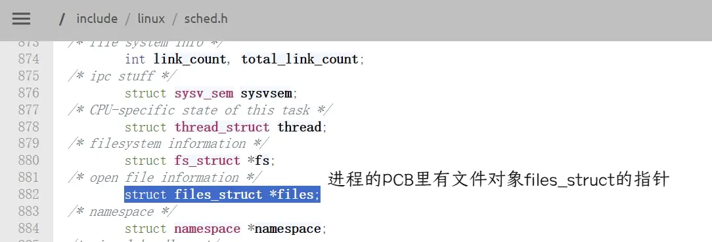
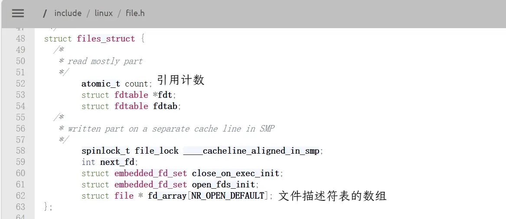
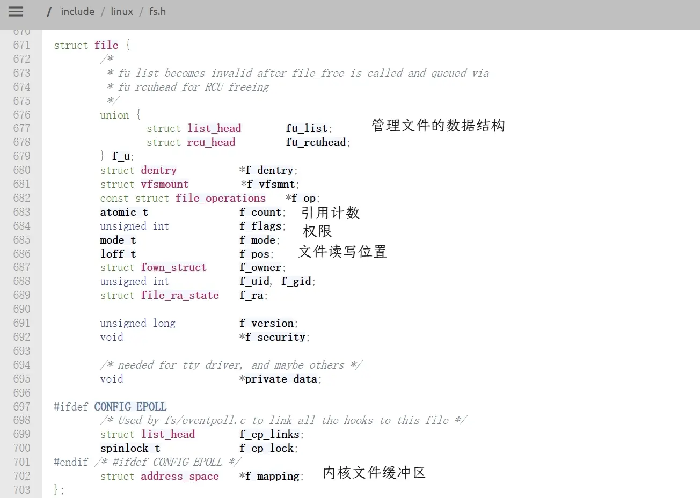
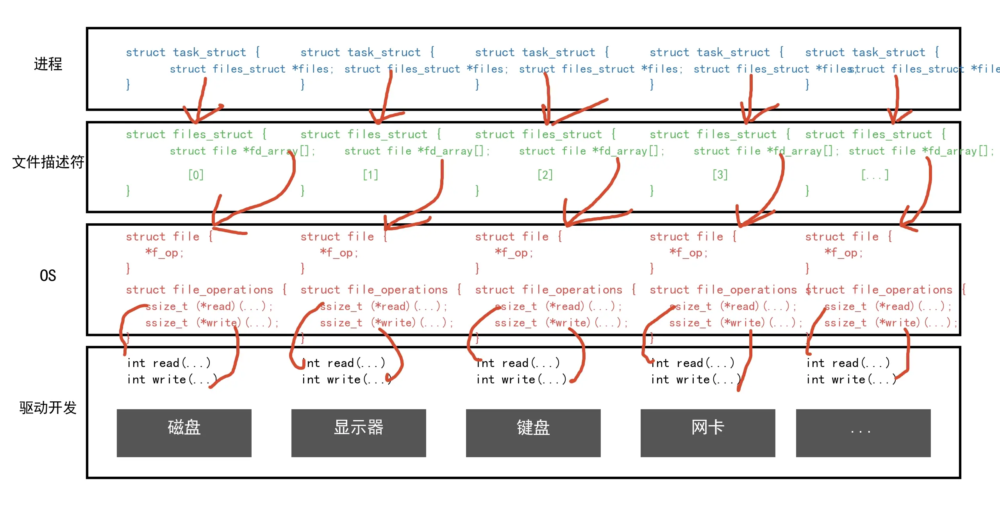

---

date: 2026-04-14T00:00:00+08:00
lastmod: 2026-04-14T00:00:00+08:00
title: '【Linux】07 - 基础IO'


tags:
  - IO
  - 一切皆文件
  - 缓冲区

categories:
  - Linux
  
---

# 基础IO

## 文件


一个大小为0的空文件在磁盘上也要占据空间。文件=内容+属性，虽然内容为空，但是文件的创建时间，权限等属性还是需要存储的，所以还是要占磁盘空间。所有的文件操作本质是文件内容操作和文件属性操作。

文件在磁盘上，磁盘是个外设，磁盘是永久性存储介质，和内存不同，内存断电就会丢失所有数据，磁盘不会，因此文件在磁盘上的存储是永久性的。访问文件本质就是在系统和外设之间进行IO（输入输出）操作，读写文件就是读写磁盘。

Linux里一切皆文件，Linux系统里把显示器，键盘，网卡等外设全部抽象成文件。

文件按加载情况可以分为两类，一类是在内存中被打开的文件，另一类是在磁盘中没被打开的文件。  
访问文件，需要先打开文件，进程调用 `open` 系统调用打开文件，只有执行了打开操作，文件才被进程打开，是进程在打开文件。对文件的操作本质是进程在对文件操作。操作系统负责管理所有的硬件，磁盘的管理者是操作系统，C语言或者其他语言提供的库函数底层是封装了系统提供的系统调用来打开文件。  
一个进程可能会打开多个文件，系统里又在同时运行多个进程，被打开的文件数量可能会非常多，所以操作系统要对这些文件进行管理，怎么管理？**先描述，再组织**。

## C语言文件接口


### 打开文件

```c
#include <stdio.h>
int main()
{
    FILE *fp = fopen("hello.txt", "w");   //打开失败则返回空指针
    if(!fp){
        printf("fopen error!\n");
    }
    fclose(fp);
    return 0;
}
```
执行`fopen`时会默认在程序的当前工作路径下查找文件。


### 写文件
```c
#include <stdio.h>
#include <string.h>
int main()
{
    FILE *fp = fopen("hello.txt", "w");   //打开失败则返回空指针
    if(!fp){
        printf("fopen error!\n");
    }
    const char *msg ="hello log: ";
    int c = 10;
    while(c)
    {
        char buff[128];
        snprintf(buff,sizeof(buff),"%s%d\n",msg,c--);
        fwrite(buff, strlen(buff), 1, fp);
    }
    fclose(fp);
    return 0;
}
```


### 读文件

```c
#include <stdio.h>

int main() {
    FILE *fp = fopen("hello.txt", "r");
    if (!fp) {
        perror("fopen");
        return 1;
    }

    char line[128];
    while (fgets(line, sizeof(line), fp)) {
        printf("%s", line);   // line 已含换行符，printf 不需要再加 \n
    }

    fclose(fp);
    return 0;
}
```

修改一下我们可以写一个自己的cat命令。
```c
#include <stdio.h>

int main(int argc, char *argv[]) {
    char line[128];

    // 无参数：从标准输入读取
    if (argc == 1) {
        while (fgets(line, sizeof(line), stdin))
            printf("%s", line);
        return 0;
    }

    // 有参数：逐个打开文件并输出内容
    for (int i = 1; i < argc; i++) {
        FILE *fp = fopen(argv[i], "r");
        if (!fp) continue;          // 打开失败，直接跳过（不报错）
        while (fgets(line, sizeof(line), fp))
            printf("%s", line);
        fclose(fp);
    }
    return 0;
}
```


### 输出消息到显示器上的几种方法

```c
#include <stdio.h>
#include <string.h>
int main() {
    printf("hello printf\n");
    fprintf(stdout, "hello fprintf\n");

    const char *msg = "hello fwrite\n";
    fwrite(msg, strlen(msg), 1, stdout);
    return 0;
}
```
向显示器打印，本质就是向显示器文件写入，因为Linux里一切皆文件。

### stdin stdout stderr


C默认会打开三个输入输出流，分别是`stdin`，`stdout`，`stderr`，仔细观察发现，这三个流的类型都是`FILE*`，`fopen`返回值类型是文件指针。  
`stdin`叫标准输入，对应键盘文件，`stdout`叫标准输出，`stderr`叫标准错误，这两个都对应显示器文件。

我们使用编译器编译代码时，编译器会往代码里面加一些东西，就是把`stdin`，`stdout`，`stderr`这三个文件依次打开。程序是做数据处理的，要有一种默认的输入和输出，打开这三个文件就提供了默认的数据源和数据结果。


### 打开文件的方式
使用`man fopen`指令可以看到`fopen`打开文件的各种方式。
```bash
       r      Open text file for reading.  The stream is positioned at the beginning of the file.

       r+     Open for reading and writing.  The stream is positioned at the beginning of the file.

       w      Truncate  file  to zero length or create text file for writing.  The stream is positioned at the begin‐
              ning of the file.

       w+     Open for reading and writing.  The file is created if it does not exist,  otherwise  it  is  truncated.
              The stream is positioned at the beginning of the file.

       a      Open  for appending (writing at end of file).  The file is created if it does not exist.  The stream is
              positioned at the end of the file.

       a+     Open for reading and appending (writing at end of file).  The file is created if  it  does  not  exist.
              The initial file position for reading is at the beginning of the file, but output is always appended to
              the end of the file.
```

以r只读方式打开文件时，文件必须存在。  
以r+读写方式打开文件时，文件必须存在。打开后指针在开头，你可以在任意位置**覆盖**已有数据，但不能自动扩展文件大小。

以w只写方式打开文件时，如果文件不存在会创建文件，默认会清空文件，写文件时会从文件开头开始写。输出重定向操作`>`第一步是打开文件，打开时会清空，所以每次重定向操作内容都是全新的。  
以w+读写方式打开文件时，如果文件不存在会创建文件，默认会清空文件，写文件时会从文件开头开始写，写完后，再把指针移到开头读取刚才写的内容。

以a追加方式打开文件时，文件不存在则新建文件，写文件会向文件结尾写入。追加重定向`>>`的本质其实也是以a方式打开。  
以a追加方式打开文件时，读取位置在开头，写入位置强制在末尾。


把字符串写入文件时就不需要把`\0`也写入文件，因为`\0`是C语言的关系，和文件没关系。

## 系统文件IO

文件在磁盘上，硬件设备由操作系统管理，操作系统才能对文件进行读写操作，Linux提供了系统调用`open`来打开文件。

### 传递标志位的方法


一个int整型有4个字节32个比特位，可以在二进制的int整型里每一个比特位都只放一个1，其他位置全部放0，这样我们就得到了32个标志位，与32个比特位一一对应。由于标志位的二进制里只要一个1，所以转换为10进制时结果都是2的幂。

### 文件的系统调用
#### open

Linux提供的系统调用`open`有两种，`int open(const char *pathname, int flags);`是打开已存在的文件，`int open(const char *pathname, int flags, mode_t mode);`是创建新文件或打开文件（当`flags`包含`O_CREAT`时）。`const char *pathname`:是要打开或创建的文件路径。成功时返回一个非负整数，即文件描述符 (File Descriptor, fd)，失败时返回-1。`int flags`是标志位，有`O_RDONLY`只读打开，`O_WRONLY`只写打开，`O_RDWR`读写打开，`O_APPEND`每次写操作前，文件偏移量自动移至文件末尾，也就是在末尾写入，`O_TRUNC`	若文件存在且以写方式打开，将长度截为0，也就是清空文件内容，`O_CREAT`是若文件不存在则创建，还有一些其他的标志位这里没有展示。这些标志位其实都是宏，背后都是整数。


运行下面的代码。
```c
#include <stdio.h>
#include <sys/types.h>
#include <sys/stat.h>
#include <fcntl.h>

int main() {
    int f = open("hello.txt",O_CREAT | O_WRONLY );
    if(f==-1) {return 1;}
    return 0;
}
```
运行后会创建hello.txt文件，使用`ll`指令查看。
```bash
[user1@iZ2zeh5i3yddf3p4q4ueo7Z cfile]$ ll hello.txt 
-r-S-ws--T 1 user1 user1 0 Apr 16 20:15 hello.txt
[user1@iZ2zeh5i3yddf3p4q4ueo7Z cfile]$ 
```
这个hello.txt文件的权限怎么回事，全乱套了。原因是新建文件时必须在系统调用`open`里设置权限。也就是设置参数`mode_t mode`
修改一下`open`的参数。
```c
int f = open("hello.txt",O_CREAT | O_WRONLY ,0666);
```
```bash
[user1@iZ2zeh5i3yddf3p4q4ueo7Z cfile]$ ll hello.txt 
-rw-rw-r-- 1 user1 user1 0 Apr 16 20:19 hello.txt
[user1@iZ2zeh5i3yddf3p4q4ueo7Z cfile]$ 
```
再创建文件时权限就是正常的了。眼尖的可能已经发现这不对吧，这权限也不是我们设置的0666啊，系统默认有一个权限掩码umask对权限进行设置，如果需要自定义权限，我们可以使用`umask(0);`来设置自己的掩码为0。


#### close

打开了文件我们需要关闭。使用系统调用`int close(int fd);`来关闭文件。参数`int fd`就是使用`open`打开文件时的返回值（文件描述符）。
```c
int f = open("hello.txt",O_CREAT | O_WRONLY ,0666);
close(f);
```


#### write

打开了文件我们需要向文件内写入。使用系统调用`ssize_t write(int fd, const void *buf, size_t count);`来向文件内写入，参数`int fd`是文件描述符，参数`const void *buf`是指向待写入数据的内存缓冲区指针，参数`size_t count`是期望写入的字节数；返回值是实际写入的字节数。

```c
const char *msg ="hello oldfe666";
int f = open("hello.txt",O_CREAT | O_WRONLY ,0666);
write(f,msg,strlen(msg));
```

向文件内写入时不需要带上`\0`。  
运行代码结束后我们就得到了一个hello.txt文件，内容为"hello oldfe666"，但是我们修改一下msg然后再写入呢
```c
const char *msg ="666";
```
保存再运行代码，发现hello.txt文件的内容变成了"666lo oldfe666"。这是因为在打开文件时没有告诉系统要清空文件。  
在这里再修改一下`open`的参数。
```c
int f = open("hello.txt",O_CREAT | O_WRONLY | O_TRUNC,0666);
```
这样打开文件时就会清空，hello.txt文件的内容就只有"666"了。  
假如需要追加写入，需要传`O_APPEND`标志位，但是`O_APPEND`和`O_TRUNC`又清空又追加，在一起有矛盾，所以`O_APPEND`和`O_TRUNC`往往是互斥的。
```c
int f = open("hello.txt",O_CREAT | O_WRONLY | O_APPEND,0666);  //追加写
```
C语言的库函数封装了系统调用，所以w选项最后就被转换为`O_WRONLY | O_TRUNC`，a选项最后就被转换为`O_WRONLY | O_APPEND`。

---

`write`的第二个参数是`void *`类型，既可以文本写入也可以二进制写入，直接写入整型变量文件会显示乱码，因为写入的是二进制，要写入整型以文本形式显示需要把整型值转换为字符串再写入。文本写入或二进制写入是语言层的概念，C语言提供的库函数会格式化输入自动转为字符串类型，系统不关心写入类型。

#### read

打开了文件我们需要读取文件内容。使用系统调用`ssize_t read(int fd, void *buf, size_t count);`来读取文件内容，参数`int fd`是文件描述符，参数`void *buf`是向接收数据的内存缓冲区指针，参数`size_t count`是期望读取的最大字节数；成功会返回读取到的字节数，返回0表示读取到文件结尾了，返回-1代表读取失败。

```c
int f = open("hello.txt",O_RDONLY);  
while ((n = read(fd, buffer, sizeof(buffer) - 1)) > 0) {
        buffer[n] = '\0';  
        printf("%s", buffer);
    }
```

打开文件代表文件存在不需要创建，那么也就不需要控制权限，标志位只需要传`O_RDONLY`就行了。


### 文件描述符

使用`open`打开一个文件会返回文件描述符。
```c
int f1 = open("log1.txt",O_CREAT | O_WRONLY | O_APPEND,0666);  
printf("%d",f1);

int f2 = open("log2.txt",O_CREAT | O_WRONLY | O_APPEND,0666);  
printf("%d",f2);

int f3 = open("log3.txt",O_CREAT | O_WRONLY | O_APPEND,0666);  
printf("%d",f3);
```
打开后可以发现，文件描述是从3开始的，后面依次往下递增，0，1，2号文件去哪里了？0，1，2号文件叫做标准输入，标准输出，标准错误，也就是程序启动时自动打开的三个文件。C语言里面的`fopen`函数返回值是，`FILE*`,`*`是指针，`FILE`是C语言提供的一个结构体，里面有文件的各种属性。在操作系统这一层只认识文件描述符，`FILE`里封装了文件描述符。

打印出`stdin`，`stdout`，`stderr`的文件描述符。
```c
printf("%d",stdin->_fileno);
printf("%d",stdout->_fileno);
printf("%d",stderr->_fileno);
```


其他语言里也有类似的东西，都是封装了系统调用，操作系统这一层只认识文件描述符。在语言层封装了系统调用可以提升跨平台可移植性，在不同的系统之间都只需要一样的代码。语言层增加可移植性可以让更多人使用。

---

文件描述符从0开始依次往上增长，很像数组下标。一个进程可能打开多个文件，系统里有很多被打开的文操作系统需要对这些文件进行管理。


类似进程的PCB，操作系统会给每个被打开的文件创建一个结构体对象struct file，包含文件的权限，读写选项位置，文件缓冲区等各种属性。操作系统把每个struct file连起来组成链表，对文件的管理就变成了对链表的增删查改。  
每个文件都有自己的文件缓冲区，加载时文件内容会被加载到缓冲区。  
一个进程可能会打开多个文件，创建新进程时操纵系统除了给进程创建页表，还要给进程创建文件描述符表，会包含一个指针数组，数组内的指针指向文件的struct file，进程PCB里会有个指针`struct file_struct *`指向文件的struct file。这样进程就能找到对应的文件了。

用户使用`open`打开文件时，操作系统会创建一个struct file，然后在文件描述符表里找一个没用过的下标，把struct file的地址填进去。使用`read`读取文件时，系统找到对应的文件，把文件缓冲区里的数据拷贝到用户的buffer里，`read`函数本质是拷贝函数。  
如果要修改文件，CPU会执行指令修改在内存中文件缓冲区的内容，然后再写入到磁盘里。对任何文件内容对任何操作，都必须先把文件加载到操作系统内核对应的文件缓冲区里，加载的过程其实就是磁盘到内存的拷贝。


### 重定向原理

```c
close(0)
int f0 = open("log0.txt",O_CREAT | O_WRONLY | O_APPEND,0666);  
printf("%d",f0);
close(1)
int f1= open("log1.txt",O_CREAT | O_WRONLY | O_APPEND,0666);  
printf("%d",f1);
close(2)
int f2 = open("log2.txt",O_CREAT | O_WRONLY | O_APPEND,0666);  
printf("%d",f2);
```
假如把0，1，2号文件关闭了，log0.txt，log1.txt等文件就会使用0，1，2号文件描述符。文件描述符的分配原则是分配最小的，没有被使用的，作为新的fd给用户。  
假如把代表标准输出的1号关闭了，那么打开log1.txt文件时就会被分配1号文件描述符，向显示器打印的内容就会被写入到log1.txt文件里，这个就是重定向的原理。  
重定向是在操纵系统层做的狸猫换太子，重定向其实就是更改文件描述符表的指针指向，数组下标不变。

但是先关闭再打开文件太麻烦了，有没有什么简单又快速的重定向方法。我们可以使用系统调用`int dup2(int oldfd, int newfd);`来完成重定向操作，`int oldfd`是想要重定向的文件描述符表下标，`int newfd`是重定向目标的文件描述符表下标。如`dup2(fd, 1)`就是把文件描述符表里下标为fd的指针拷贝覆盖下标1的指针，最后的结果是下标fd和下标1的指针都指向log1.txt。

常见的重定向有：`>`，`>>`，`<`。这几个重定向的区别都是由`open`的标志位区分的。
- 输出重定向`>`对应的标志位是`O_WRONLY | O_CREAT | O_TRUNC`
- 追加重定向`>>`对应的标志位是`O_WRONLY | O_CREAT | O_APPEND`
- 输入重定向`<`对应的标志位是`O_RDONLY`

重定向=打开文件的方式+`dup2()`。再加上`main`函数的参数我们就可以实现对指定的文件进行重定向操作，也就是实现自己的`>`，`>>`，`<`。


`dup2(fd, 1)`会使用下标为fd的指针拷贝覆盖下标1的指针，那么标准输出标准输出要怎么关闭？文件的struct file内部会维护一个引用计数，一个文件可以被多个进程打开，有进程关闭文件时其实就是引用计数--，使用`dup2(fd, 1)`时会自动给1下标的标准输出的引用计数--，所以不需要手动管理。

---

运行以下代码。
```cpp
#include<cstdio>
#include<iostream>

int main()
{
    //向标准输出打印,stdin,cout,对应1号文件
    printf("hello printf\n");
    std::cout<<"hello cout"<<std::endl;

    //向标准错误打印,stderr,cerr,对应2号文件
    fprintf(stderr,"hello stderr\n");
    std::cerr<<"hello cerr"<<std::endl;
    
    return 0;
}
```
```bash
[user1@iZ2zeh5i3yddf3p4q4ueo7Z cfile]$ g++ -o test2 test2.cc 
[user1@iZ2zeh5i3yddf3p4q4ueo7Z cfile]$ ./test2
hello printf
hello cout
hello stderr
hello cerr
[user1@iZ2zeh5i3yddf3p4q4ueo7Z cfile]$ ./test2 > test2.txt
hello stderr
hello cerr
[user1@iZ2zeh5i3yddf3p4q4ueo7Z cfile]$ cat test2.txt
hello printf
hello cout
[user1@iZ2zeh5i3yddf3p4q4ueo7Z cfile]$ 
```
直接运行程序可以正常打印出所有消息，但是使用重定向输出到test2.txt文件里时只有标准输出写入到文件里，标准错误继续输出到显示器上。因为重定向`>`只做了标准输出的重定向，没做标准错误的重定向。  
假如想让标准错误也重定向，需要修改一下指令。使用`./test2 1> test2.txt 2>test2.txt`指令来让标准输出和标准错误都重定向到test2.txt文件。
```bash
[user1@iZ2zeh5i3yddf3p4q4ueo7Z cfile]$ cat test2.txt
hello stderr
hello cerr
[user1@iZ2zeh5i3yddf3p4q4ueo7Z cfile]$ 
```
但是第二个重定向输出时会先清空文件，我们可以使用`./test2 1> test2.txt 2>>test2.txt`来让标准错误进行追加重定向，但是这样指令太长了，使用`./test2 1> test2.txt 2>&1`可以做到一样的效果。
```bash
[user1@iZ2zeh5i3yddf3p4q4ueo7Z cfile]$ ./test2 1> test2.txt 2>&1
[user1@iZ2zeh5i3yddf3p4q4ueo7Z cfile]$ cat test2.txt
hello printf
hello cout
hello stderr
hello cerr
[user1@iZ2zeh5i3yddf3p4q4ueo7Z cfile]$ 
```
`./test2 1> test2.txt 2>&1`这条命令里，`1> test2.txt` 将标准输出（文件描述符 1）重定向到 `test2.txt`；`2>&1` 将标准错误（文件描述符 2）重定向到标准输出当前指向的位置（即 test2.txt），这样文件描述符表下标1和2对应的指针都指向test2.txt文件，这样就做到了标准输出和标准错误都重定向到test2.txt文件。

可以通过重定向能力，把常规消息和错误消息进行分离。

---

查看Linux内核2.6.18版本的源代码[^1]，可以看见内核创建的文件结构体对象。



查看源代码可以清楚看到，进程的`task_struct`内有`files_struct`的指针，进程通过这个指针找到`files_struct`并访问文件描述符表数组，通过数组内储存的`*file`指针来找到对应的文件对象`struct file`。操作系统通过`task_struct`管理进程，通过`struct file`管理文件，两者是解耦的，通过`files_struct`联系。  
通过`file`可以找到文件属性的数据结构，也可以找到里对应的文件缓冲区`struct address_space	*f_mapping;`，加载文件时就是把文件从磁盘拷贝到缓冲区，操作系统把内存分为一个个4KB大小的块来管理，内存也有用来管理的对应的数据结构。


[^1]: 在bootlin的[网站](https://elixir.bootlin.com/linux/v2.6.18/source/include/linux/sched.h)和Linux内核官网的这个[网页](https://git.kernel.org/pub/scm/linux/kernel/git/torvalds/linux.git/tree/include/linux/sched.h?h=v2.6.18&id=3752aee96538b582b089f4a97a26e2ccd9403929)以及GitHub的这个[网页](https://github.com/torvalds/linux/blob/v2.6.18/include/linux/sched.h) 都能查看Linux2.6.18版本的源代码


## 一切皆文件


一切皆文件是Linux设计的结果。

计算机里有不同的外设，如屏幕，键盘，磁盘，网卡等，这些外设的读写方法都不一样，操作系统负责管理所有软硬件设备，要管理硬件设备，也可以像管理进程和文件一样创建一个硬件的结构体对象struct decice，对象内包含了各种硬件设备的状态属性读写方法等，再把这些对象连起来组成链表来管理。`struct file`里通过函数指针回调来访问对应硬件设备的读写方法；访问设备，都是通过函数指针指向的方法进行访问的，函数指针类型命名，参数，都一样。对于进程来说访问文件都是使用了系统调用，访问不同硬件设备上的文件都使用相同的系统调用，系统里通过一层struct file软件封装来让进程认为一切皆文件。进程只要能找到`struct file`就能访问硬件，不需要关心底层硬件设备的差异，这就是Linux的VFS虚拟文件系统。  
进程通过`struct file`使用相同的系统调用就能调用到不同硬件设备对应的读写方法，这就相当于是C语言版本的**多态**，`struct file`就相当于基类。





上面的图由python生成。
```python
import matplotlib.pyplot as plt
from matplotlib.patches import Rectangle

# 解决中文乱码问题
plt.rcParams['font.sans-serif'] = ['WenQuanYi Zen Hei', 'SimHei']
plt.rcParams['axes.unicode_minus'] = False

plt.figure(figsize=(16, 10), dpi=150)
ax = plt.gca()
ax.set_xlim(0, 10)
ax.set_ylim(0, 12)
ax.axis('off')

# 绘制四个层级的大框
task_struct_layer = Rectangle((0.8, 9.5), 9, 2.0, ec='black', fc='white', lw=2)
files_struct_layer = Rectangle((0.8, 7.0), 9, 2.2, ec='black', fc='white', lw=2)
os_layer = Rectangle((0.8, 4.0), 9, 2.7, ec='black', fc='white', lw=2)
driver_layer = Rectangle((0.8, 0.5), 9, 3.2, ec='black', fc='white', lw=2)
ax.add_patch(task_struct_layer)
ax.add_patch(files_struct_layer)
ax.add_patch(os_layer)
ax.add_patch(driver_layer)

# 左侧层级标签
ax.text(0.4, 10.5, "进程", fontsize=12, weight='bold', ha='center')
ax.text(0.4, 8.1, "文件描述符", fontsize=12, weight='bold', ha='center')
ax.text(0.4, 5.3, "OS", fontsize=14, weight='bold', ha='center')
ax.text(0.4, 2.1, "驱动开发", fontsize=12, weight='bold', ha='center')

# 设备列表
devices = [
    {"name": "磁盘", "x": 1.2, "fd": "0"},
    {"name": "显示器", "x": 3.0, "fd": "1"},
    {"name": "键盘", "x": 4.8, "fd": "2"},
    {"name": "网卡", "x": 6.6, "fd": "3"},
    {"name": "...", "x": 8.2, "fd": "..."}
]

# 为每个设备绘制结构
for dev in devices:
    x = dev["x"]
    fd = dev["fd"]

    # --- 第1层：task_struct ---
    ax.text(x, 10.8, "struct task_struct {", fontsize=11, color='#337ab7', ha='left')
    ax.text(x+0.2, 10.4, "    struct files_struct *files;", fontsize=10, color='#337ab7', ha='left')
    ax.text(x, 10.0, "}", fontsize=11, color='#337ab7', ha='left')

    # --- 第2层：files_struct（内部包含 fd_array）---
    ax.text(x, 8.8, "struct files_struct {", fontsize=11, color='#5cb85c', ha='left')
    # 将 fd_array 画在结构体内部，体现包含关系
    ax.text(x+0.2, 8.4, "    struct file *fd_array[];", fontsize=10, color='#5cb85c', ha='left')
    # 在结构体内部标注具体的 fd 索引
    ax.text(x+0.6, 7.8, f"    [{fd}]", fontsize=10, color='#5cb85c', ha='center')
    ax.text(x, 7.4, "}", fontsize=11, color='#5cb85c', ha='left')

    # --- 第3层：struct file & file_operations ---
    ax.text(x, 6.3, "struct file {", fontsize=11, color='#d9534f', ha='left')
    ax.text(x+0.2, 5.9, "*f_op;", fontsize=11, color='#d9534f', ha='left')
    ax.text(x, 5.5, "}", fontsize=11, color='#d9534f', ha='left')

    ax.text(x, 5.0, "struct file_operations {", fontsize=11, color='#d9534f', ha='left')
    ax.text(x+0.2, 4.6, "ssize_t (*read)(...);", fontsize=10, color='#d9534f', ha='left')
    ax.text(x+0.2, 4.2, "ssize_t (*write)(...);", fontsize=10, color='#d9534f', ha='left')
    ax.text(x, 3.8, "}", fontsize=11, color='#d9534f', ha='left')

    # --- 第4层：驱动开发 ---
    ax.text(x, 3.2, "int read(...)", fontsize=11, ha='left')
    ax.text(x, 2.8, "int write(...)", fontsize=11, ha='left')

    # 设备框
    dev_rect = Rectangle((x-0.1, 1.0), 1.4, 1.2, color='#555555', ec='white', lw=1)
    ax.add_patch(dev_rect)
    ax.text(x+0.6, 1.6, dev["name"], fontsize=14, color='white', weight='bold', ha='center')

plt.tight_layout()
plt.show()
```


## 缓冲区


### 缓冲区是什么

缓冲区就是内存里的一段空间，用来缓存输入或输出的数据。

### 缓存区机制的作用

缓冲区就相当于菜鸟驿站，张三在家打游戏，快递员把快递送到菜鸟驿站，张三去菜鸟驿站取就行了。假如没有菜鸟驿站，来一个快递张三就要暂停手上的事情去拿快递，快递员也必须等待张三来拿快递，对于双方来说效率都不高，有了菜鸟驿站双方就提高自己的效率。


### 缓冲类型


C语言里有语言层用户级的C标准库缓冲区，Linux系统里有文件内核缓冲区，当发生强制刷新，或者刷新条件满足，或者进程退出时，标准库会把库缓冲区里的内容拷贝到系统里的文件内核缓冲区。`FILE`是C语言提供的一个结构体，里面封装了文件描述符，缓冲区等，标准库的缓冲区就在`FILE`结构体里。C语言里任何一个文件都有缓冲区，因为每个文件都有`FILE`对象。

强制刷新，即使用`fflush()`来强制刷，进程退出就是退出时刷新，那么刷新条件满足是什么？  
系统里存在不同的刷新方式：
1. 立即刷新，无缓冲，也可以称为写透模式WT
2. 缓冲区满了再刷新，也称为全缓冲
3. 行刷新，这种缓冲方式称为行缓冲

为什么标准库也有自己的缓冲区，因为调用系统调用也是有成本的，如果没有库缓冲区就会频繁使用系统调用，降低效率，所以标准库也提供了库缓冲区来提高效率。比如张三需要下楼倒垃圾，一次丢一个瓶子下一次楼，一次丢一整袋垃圾也是下一次楼，每次下楼都是有成本的，所以就需要垃圾桶（缓冲区）来提高效率。普通文件使用的使用刷新方式一般都是全缓冲，尽可能提高效率，显示器文件采用的是行刷新，用来打印消息。Linux系统里文件内核缓冲区的刷新方式由操作系统决定，因为需要面对多种情况，刷新调度方式也更复杂一些。进程不需要关系操作系统如何调度文件内核缓冲区，可以认为只要把数据交给操作系统，就相当于交给了硬件了。  
数据交给系统，交给硬件，本质全是拷贝。计算机数据流动的本质:一切皆拷贝。


运行以下代码
```c
#include <stdio.h>
#include <unistd.h>
#include <fcntl.h>
#include <string.h>

int main() {
    // 1. 关闭标准输出描述符 (fd = 1)
    close(1);

    // 2. 打开文件，由于 1 是最小未用描述符，open 将返回 1
    int fd = open("log.txt", O_CREAT | O_WRONLY | O_APPEND, 0666);
    // 此时 fd == 1，所有向标准输出的操作都会进入 log.txt

    // 3. 库函数 printf：输出进入 FILE* 缓冲区（默认全缓冲）
    printf("fd: %d\n", fd);
    printf("hello world\n");
    printf("hello world\n");
    printf("hello world\n");

    // 4. 系统调用 write：绕过库缓冲区，直接写入文件描述符
    const char *msg = "hello write\n";
    write(fd, msg, strlen(msg));

    // 5. 关键点：若直接退出，printf 缓冲区数据将丢失（未刷新）
    //    close(fd);  // 仅关闭描述符，不刷新 stdio 缓冲
    //    fflush(stdout);  // 显式刷新可保留 printf 内容
    //    fclose(stdout);  // fclose 会自动刷新缓冲区

    // 演示丢失效果：不做任何刷新，直接关闭描述符并退出
    close(fd);
    return 0;
}
```
运行完毕后可以发现log.txt文件里只有hello write。只有 `write` 调用的输出被写入文件。四个 `printf` 的输出虽然在程序执行时已进入 `stdout` 缓冲区，但由于标准输出被重定向到普通文件（从行缓冲变成全缓冲），且程序退出前未调用 `fflush` 或 `fclose`，缓冲区内容随进程结束而丢失。进程退出前已经执行了`close(fd);`库缓冲区想找文件内核缓冲区也找不着，自然没法拷贝缓冲区内容。


运行以下代码
```c
#include <stdio.h>
#include <unistd.h>
#include <fcntl.h>
#include <string.h>

int main() {
    // 重定向标准输出到文件，使库函数变为全缓冲
    close(1);
    int fd = open("output.txt", O_CREAT | O_WRONLY | O_TRUNC, 0666);
    // 此时 fd == 1，所有标准输出写入文件

    // 库函数（数据暂存在 FILE* 缓冲区）
    printf("hello printf\n");
    fprintf(stdout, "hello fprintf\n");
    const char *s = "hello fwrite\n";
    fwrite(s, strlen(s), 1, stdout);

    // 系统调用（直接写入内核，无用户态缓冲）
    const char *ss = "hello write\n";
    write(1, ss, strlen(ss));

    // 关键：fork 复制进程空间，包括未刷新的库函数缓冲区
    fork();

    // 进程结束前刷新缓冲区（否则可能丢失数据）
    fflush(stdout);
    close(fd);
    return 0;
}
```
运行后查看output.txt文件的内容，发现库函数都打印了两次，系统调用只打印了一次，这是什么原因？

创建子进程时子进程也有自己的缓冲区，缓冲区内容和父进程的相同，父子进程各自拥有一份相同的待输出内容。在创建子进程前，三个库函数调用的输出仍位于stdout缓冲区中（因为重定向到文件导致变为全缓冲），未写入内核。打印时会输出两次，而系统调用`write`会直接输出到系统的文件内核缓冲区，所以子进程的缓冲区内没有`write`打印的消息，只有父进程会打印。  
若不重定向直接输出到显示器，那么刷新方式为行刷新，由于每个输出字符串均以 `\n` 结尾，缓冲会在创建子进程前被刷新，此时创建子进程不会复制任何缓冲数据，输出不会重复。


#### 实现模拟封装
基于上面的知识，我们可以封装简单的glibc文件接口。
```c
#include <stdio.h>
#include <unistd.h>
#include <fcntl.h>
#include <string.h>
#include <stdlib.h>

// 缓冲区大小（小一些以快速触发刷新）
#define BUFFER_SIZE 8

// 模拟 FILE 结构体
typedef struct {
    int fd;                 // 底层文件描述符
    char buf[BUFFER_SIZE];  // 用户态缓冲区
    int buf_used;           // 缓冲区已用字节数
} MYFILE;

// 模拟 fopen：打开文件并初始化 MYFILE
MYFILE *my_fopen(const char *pathname, const char *mode) {
    int flags = O_CREAT | O_WRONLY | O_TRUNC;
    int fd = open(pathname, flags, 0666);
    if (fd < 0) return NULL;

    MYFILE *fp = (MYFILE *)malloc(sizeof(MYFILE));
    if (!fp) {
        close(fd);
        return NULL;
    }
    fp->fd = fd;
    fp->buf_used = 0;
    memset(fp->buf, 0, BUFFER_SIZE);
    return fp;
}

// 模拟 fflush：将缓冲区内容写入文件描述符
int my_fflush(MYFILE *fp) {
    if (fp->buf_used > 0) {
        ssize_t n = write(fp->fd, fp->buf, fp->buf_used);
        if (n < 0) return -1;
        fp->buf_used = 0;
    }
    return 0;
}

// 模拟 fwrite：先写入缓冲区，满时自动刷新
size_t my_fwrite(const void *ptr, size_t size, size_t nmemb, MYFILE *fp) {
    const char *data = (const char *)ptr;
    size_t total = size * nmemb;
    size_t written = 0;

    while (written < total) {
        // 缓冲区剩余空间
        int space = BUFFER_SIZE - fp->buf_used;
        if (space == 0) {
            // 缓冲区满，刷新
            if (my_fflush(fp) < 0) break;
            space = BUFFER_SIZE;
        }
        int copy = (total - written < space) ? (total - written) : space;
        memcpy(fp->buf + fp->buf_used, data + written, copy);
        fp->buf_used += copy;
        written += copy;
    }
    return written;
}

// 模拟 fclose：刷新缓冲区并关闭文件描述符
int my_fclose(MYFILE *fp) {
    if (!fp) return -1;
    my_fflush(fp);
    close(fp->fd);
    free(fp);
    return 0;
}

// 主函数演示：对比库函数封装与系统调用
int main() {
    // 1. 使用我们封装的接口（带缓冲区）
    MYFILE *fp = my_fopen("test.txt", "w");
    if (!fp) {
        perror("my_fopen");
        return 1;
    }

    // 写入短数据（小于缓冲区，不会立即写入磁盘）
    my_fwrite("Hello", 1, 5, fp);
    my_fwrite(" ", 1, 1, fp);
    my_fwrite("World", 1, 5, fp);
    // 此时缓冲区未满，内容尚未写入文件

    // 2. 直接用系统调用 write 写入（立即落盘）
    write(fp->fd, "\nDirect write\n", 14);

    // 3. 关闭文件（会触发缓冲区刷新）
    my_fclose(fp);

    return 0;
}
```

