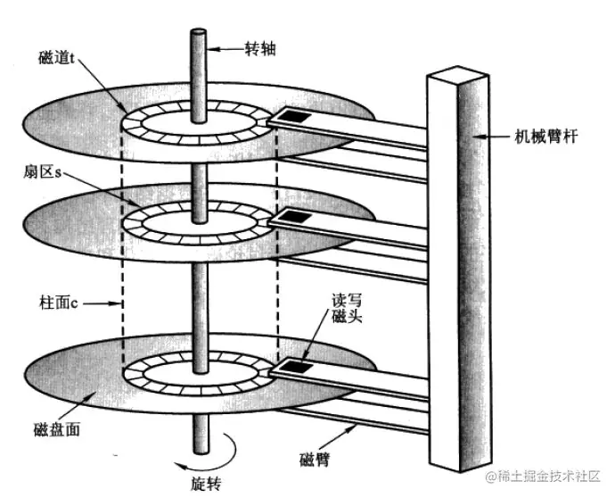
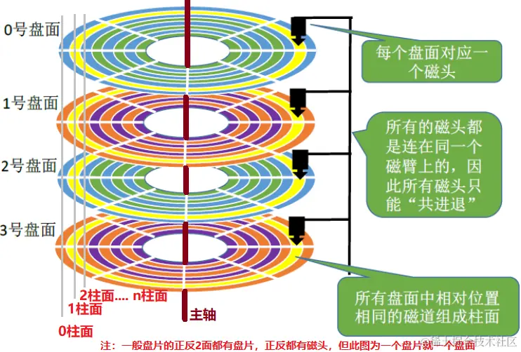
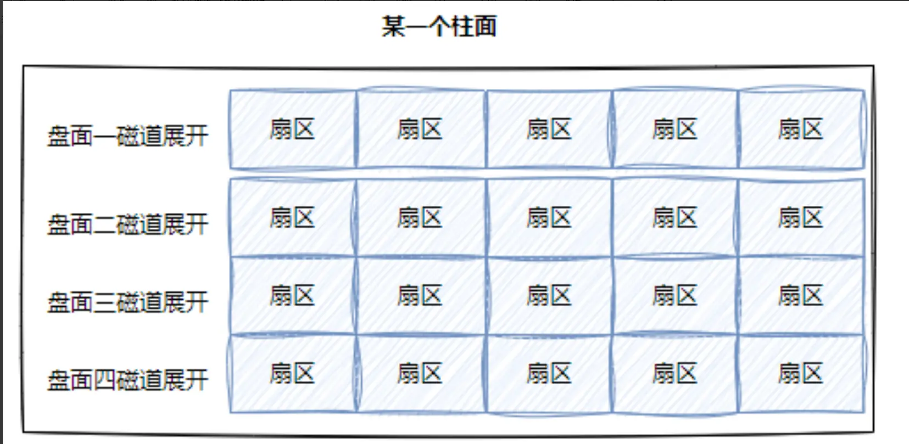
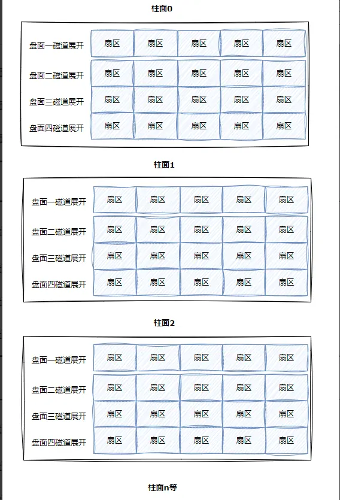
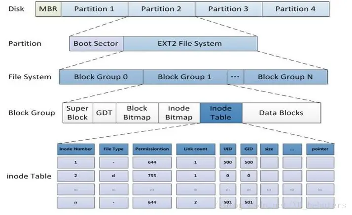
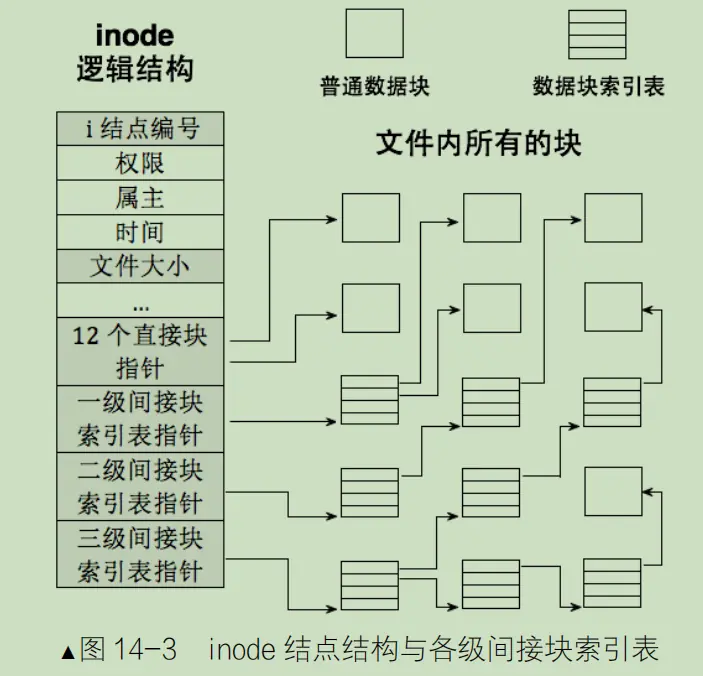

---

date: 2026-04-17T00:00:00+08:00
lastmod: 2026-04-19T00:00:00+08:00
title: '【Linux】08 - 文件系统'

mermaid: true
math: true
tags:
  - 文件
  - 磁盘
  - ext2
  - 软硬链接

categories:
  - Linux
   

---

# 文件系统
被打开的文件在内存里，没有打开的文件储存在磁盘上，文件系统的工作就是让我们能找到文件。

## 磁盘


### 磁盘工作原理


机械磁盘是计算机中唯一的一个机械设备，属于外设的一种。

机械磁盘容量大，价格较低，是服务器存储中不可或缺的设备。服务器待的房间叫机房，许多个机房集中在一起就是数据中心，我们使用的微信QQ抖音等应用都是由各个公司机房里面的服务器提供服务。磁铁在高温环境下会退磁，机械磁盘退磁后就会丢失数据，所以机房怕着火。
> [!TIP]
> 关于服务器的组成可以观看这个视频：[为什么它被称为互联网之魂？服务器硬件知识科普](https://www.bilibili.com/video/BV1D3411i7RD)


机械磁盘由主要由盘面和读取磁头组成，一个盘面上划分了许多扇区，扇区是机械磁盘读写的最小单位，主轴上有许多盘片，相同半径的扇区组成一个柱面。不同品牌的磁盘扇区大小不同，有的扇区是512字节，有的扇区是4KB，下面以512字节的扇区为例。磁盘的磁头是同进退的，所以磁盘写入的时候，是向柱面进行批量写入的。





> [!TIP]
> 关于磁盘工作原理可以观看其他优质讲解视频：  
> [3D动画演示机械硬盘工作原理，教你如何选购高性能硬盘](https://www.bilibili.com/video/BV1vw411s7YV) https://www.bilibili.com/video/BV1vw411s7YV  
> [用最好的动画为你讲解--机械硬盘的原理](https://www.bilibili.com/video/BV1bDpEz6EPA) https://www.bilibili.com/video/BV1bDpEz6EPA  
> 有些服务器还会使用高速的固态硬盘(SSD))来加快文件读写，可以观看视频了解flash的存储原理  
> [你的U盘，其实是个监狱｜flash存储原理：固态硬盘，U盘，SD卡](https://www.bilibili.com/video/BV1i54y1M7oi) https://www.bilibili.com/video/BV1i54y1M7oi


### 扇区定位


如果想要找到某一个扇区读写数据，需要先定位扇区所在的柱面(cylinder)，然后再找对应读写的磁头(header)，最后才能找到想要读写的扇区(sector)，这种定位方法叫CHS地址定位。


在机械磁盘诞生之前计算机还在使用磁带储存数据。


磁带可以拉长为一整条，我们可以把磁带看作一个超长的一维数组。逻辑上我们可以把磁盘想象成为卷在一起的磁带，把磁盘的每一个盘面按磁道分开拉直，再把所有扇区盘成一排，也可以组成一个超长的一维数组，这样每一个扇区都有一个下标，我们叫做LBA（Logical Block Address）地址，其实就是线性地址。操作系统使用这个LBA地址来访问扇区，这样在操作系统看来磁盘就是线性结构。


把一个磁道展开，就形成了一个一维数组。


把一个柱面展开，就形成了一个二维数组。



把所有柱面展开，就形成了一个三维数组。




CHS地址定位其实在逻辑上就相当于定位三维数组某一个数据的过程。

操作系统使用LBA地址，磁盘使用CHS地址，LBA地址和CHS地址之间的转换由磁盘的固件（硬件电路等系统）来完成。

#### CHS地址和LBA地址相互转换


CHS转LBA：  
LBA= 柱面号C *（磁头数 * 每磁道扇区数）+ 磁头号H * 每磁道扇区数 + 扇区号S - 1  
磁头数*每磁道扇区数=单个柱面的扇区总数，扇区号通常是从1开始的，而在LBA中，地址是从0开始的，柱面和磁道都是从0开始编号的  
总柱面，磁道个数，扇区总数等信息，在磁盘内部会自动维护，上层开机的时候，会获取到这些参数。


LBA转CHS：
柱面号 C = LBA // (磁头数 × 每磁道扇区数)  
磁头号 H = [ LBA % (磁头数 × 每磁道扇区数) ] // 每磁道扇区数  
扇区号 S = ( LBA % 每磁道扇区数 ) + 1  

其中，// 表示整除（取整数商），% 表示取余数


从此往后，在磁盘使用者看来，根本就不关心CHS地址，而是直接使用LBA地址，磁盘内部自己转换。  
所以从现在开始，磁盘就可以看作是一个元素为扇区的一维数组，数组的下标就是每一个扇区的LBA地址。操作系统使用磁盘，就可以用一个数字访问磁盘扇区了。


## 文件系统概念和ext2文件系统
Linux 支持多种文件系统，如 ext2、ext3、ext4、XFS、Btrfs 等。ext2 是早期 Linux 的经典文件系统，结构清晰，适合用于理解文件系统的基本原理。ext3/ext4 在 ext2 基础上增加了日志（Journal）等特性以提升可靠性与性能，但磁盘布局思想一脉相承。
### 块
操作系统的文件系统访问磁盘，不以扇区为单位，而是以“块”为单位，因为以扇区为单位效率低，“块”一般是4KB大小(可以调整)，“块”是文件存取的最小单位。假如一个扇区的大小为512字节，那么8个扇区就组成了一个“块”。

### 分区
文件系统的载体是分区，不同的分区可以使用不同的文件系统。  
假如一个磁盘有1024GB大小，那么为了方便管理，可以把磁盘分为一个个区域，就像一个国家的面积太大了，必然要划分次一级的行政区划管理。假如分一个区的大小为256GB，那么这个磁盘就可以分为4个区。但是一个区域也很大，Linux里还可以继续把一个区划分为一个个组来管理。使用分治的思想，把整个磁盘的管理就一步步划分为对一个个组的管理。


### 块组的内部构成
一个组里储存着不同的数据，Linux里文件的内容和属性是分开存储的，一个分组的基本单位数据块Block是4KB。



Block Group里的最小的基本单位是数据块Block，4KB大小。文件的内容储存在Data Blocks里，文件属性储存在inode Table里。Linux中，任何文件都要有自己的属性集合，文件的属性本质就是一个struct结构体，这个结构体我们称为inode，里面包含了文件的类型，大小，权限等属性，结构体 inode 的大小通常为 128 字节（不同文件系统可能不同，如 ext4 默认为 256 字节），但同一文件系统中所有 inode 大小相同。一个4KB的数据块可以保存32个inode。  
文件名不保存在inode中。

每个文件都有自己的inode编号来区分，使用`ls -li`指令可以查看编号。
```bash
[user1@iZ2zeh5i3yddf3p4q4ueo7Z 111]$ ls -li
total 64
922940 drwxrwxr-x 3 user1 user1  4096 Apr  2 21:01 222
927303 drwxrwxr-x 2 user1 user1  4096 Apr  1 16:51 def
927245 -rwxrwxr-x 1 user1 user1  8408 Apr  1 15:54 hello
928053 -rwxrwxr-x 1 user1 user1  8592 Apr  9 01:52 test
922935 -rw-rw-r-- 1 user1 user1   528 Apr  9 01:52 test.c
927238 -rw-rw-r-- 1 user1 user1 16929 Apr  1 15:35 test.i
927240 -rw-rw-r-- 1 user1 user1  1672 Apr  1 15:48 test.o
927239 -rw-rw-r-- 1 user1 user1   592 Apr  1 15:43 test.s
[user1@iZ2zeh5i3yddf3p4q4ueo7Z 111]$ 
```


一个Data Blocks里面有非常多的4KB大小的数据块Block来存储文件内容，但是如果我们需要新建文件，怎么知道哪个Block用过了哪个数据块Block没用过呢？块位图(Block Bitmap)就是用来区分的，Block Bitmap中记录着DataBlock中哪个数据块已经被占用，哪个数据块没有被占用，使用位图的方式储存，类似传递标志位的方法。同样的，我们也需要知道inode Table里哪个数据块Block用过了，和块位图(Block Bitmap)类似，inode位图(Inode Bitmap)就是用来区分的inode Table里Block的状态。删除文件其实就是在块位图(Block Bitmap)和inode位图(Inode Bitmap)里把待删除文件的数据块Block标记为未使用，这就是我们感觉删除文件特别快的原因，假如误删文件了，最好是不要进行任何写入操作，以免覆盖待恢复文件的数据。  
GDT (Group Descriptor Table)是块组描述符表，描述块组属性信息，整个分区分成多个块组就对应有多少个块组描述符。每个块组描述符存储一个块组的描述信息，如在这个块组中从哪里开始是inode Table，从哪里开始是Data Blocks，空闲的inode和数据块还有多少个等等。块组描述符在每个块组的开头都有一份拷贝。   
超级块(Super Block)，存放文件系统本身的结构信息，描述整个分区的文件系统信息。记录的信息主要有：block和inode的总量，未使用的block和inode的数量，一个block和inode的大小，最近一次挂载的时间，最近一次写入数据的时间，最近一次检验磁盘的时间等其他文件系统的相关信息。因为每个块Block的大小是固定4KB的，决定总数就知道了每个Data Block，Block Bitmap，等等组里的所有信息。Super Block的信息被破坏，可以说整个文件系统结构就被破坏了。  
超级块(Super Block)表示的是一个分区的整体情况，一个分区没有储存过文件，Data Blocks和inode Table全空，对应的Block Bitmap，Inode Bitmap也没有任何信息，使用组之前就应该把Super Block，GDT等管理信息全部初始化写入到磁盘中，一个分区那么多组都要进行相同的操作，这个过程叫**格式化**。为什么格式化后所有文件就清空了，因为格式化后管理信息全部清零，Block Bitmap和Inode Bitmap会标记所有Block都是未使用的状态，文件数据全没了。格式化的本质就是写入文件系统的管理信息。  
不是所有的分组都有Super Block，只有个别分组会有，不同组的Super Block内容完全相同，因为Super Block一旦出问题，整个文件系统都没法工作，为了防止意外，所以Super Block会在多个组内都有备份，Super Block出问题了可以从其他组的备份恢复。

inode和数据块Block是跨组编号的，不能跨分区，因为其他分区可能是不同的文件系统。所以，在同一个分区内inode编号和Block块号都是唯一的，拿着一个文件的inode，就可以找到文件的所有内容，因为每个组的Block数量是已知的，通过一些简单的运算就能找到文件的inode对应的分组。计算机在开机时操作系统要把已挂载的分区的超级块、块组描述符等核心元数据读入内存，以便后续进行文件操作，要修改文件需要把文件加载到内存里，同样的要修改文件系统的管理消息也需要先加载到内存里。

### inode和data block映射

当文件很大时，inode和block的映射有三级间接索引来储存文件。这样文件=内容+属性，就都能找到了

### 目录与文件名与路径解析

目录也是一个文件，和其他文件一样也按上面的方式保存，目录文件也有自己的inode和内容，磁盘里不存在目录结构，只有目录文件。我们平时使用文件名访问文件的时候，其实都是带上了路径的，没有显示指定路径时进程就通过环境变量储存的信息自动加上当前工作目录来访问文件。目录文件里会放上文件名和inode的映射关系，文件的文件名保存在当前文件所属的目录的数据内容当中。通过路径+文件名访问文件，就是先打开所在的路径，读取对应目录里面的数据内容，得到文件名和inode的映射关系，通过文件名找到inode，再通过inode进行文件的查找。我们访问任何文件都必须得有路径。  

### 路径缓存
假如访问任何文件都从根目录/进行路径解析，那就是一直在进行大量的磁盘IO，降低了效率。为了提高效率，操作系统在进行路径解析的时候，会把我们历史访问的所有的目录(路径)形成一颗多叉树，进行保存，这样就形成了Linux系统的树状目录结构，打开的文件是目录的话，由操作系统自己在内存中进行路径维护。比如使用find指令从根目录查找文件时，第一次会有点慢，需要加载一会，之后第二第三次查找时由于有了缓存，展示查找结果就非常快。Linux中，在内核中维护树状路径结构的内核结构体叫做：`struct dentry`。Linux 内核通过目录项缓存（dentry cache）维护已解析过的路径组件，其核心结构体就是 `struct dentry`，可将路径名快速映射到对应的 inode，从而避免频繁的磁盘 I/O。


### 挂载分区
我们能通过inode找到文件，那么怎么知道文件是在哪个分区下的？磁盘进行分区，并且每个分区格式化后，我们依然无法直接使用这个分区。我们的分区，一定是要个特定的一个目录进行关联，通过进入这个目录，就相当于进入这个分区，这种关联我们称为挂载。分区写入文件系统，无法直接使用，需要和指定的目录关联，进挂载才能使用。访问文件时可以根据访问目标文件的"路径前缀"准确判断在哪个分区。


## 软硬链接

### 软链接
软链接是一个独立的文件，软链接文件和被引用的文件的inode不同，可以理解为windows系统里的快捷方式。文件=内容+属性，软链接的内容是保存了的目标文件路径。使用`ls -l`指令查看软链接文件，文件权限前的第一个字母是l，代表这是一个软链接文件。


### 硬链接

硬链接不是独立的文件，硬链接的inode和被引用的文件相同。硬链接本质是一组新的文件名和目标inode编号的映射关系。文件新增一个硬链接会让文件的引用计数属性+1。硬链接可以用来给文件备份，删除文件时会先让引用计数-1，直到最后引用计数被减为0了才会删除文件。新建一个空目录时，其硬链接计数为 2（因为目录自身和其中的 `.` 条目）。当在该目录下创建子目录后，子目录中的 `..` 条目会增加父目录的链接计数，每创建一个子目录，父目录的硬链接计数就 +1 。例如：创建第 1 个子目录后，父目录计数变为 3；创建第 2 个后，变为 4，依此类推。
硬链接的另一个重要限制是：**不能跨文件系统创建**。因为 inode 编号仅在当前分区内唯一，硬链接本质是共享 inode，因此源文件和链接必须在同一个挂载分区下。  
硬链接只能给普通文件进行建立，Linux系统只支持给目录建立软链接，不支持任何用户给目录建立硬链接，目录的硬链接由操作系统来管理。Linux系统的目录结构是一颗多叉树，假如允许用户建立目录的硬链接，比如在某个目录下新建根目录的硬链接，这样会形成环状目录，出现路径环问题，破坏目录结构的多叉树结构。操作系统为了防止`.`和`..`在局部出现路径环问题，对`.`和`..`做了特殊处理。