---

date: 2026-04-19T00:00:00+08:00
lastmod: 2026-04-21T00:00:00+08:00
title: '【Linux】09 - 库制作与原理'


tags:
  - 库
  - 链接
  - ELF

categories:
  - Linux
   

---


# 库制作与原理

## 什么是库

库是写好的现有的，成熟的，可以复用的代码。现实中每个程序都要依赖很多基础的底层库，不可能每个的代码都从零开始，因此库的存在意义非同寻常。

假如C语言不提供标准库，每个人需要打印消息时都要自己从头写一个`printf`函数，这样效率就太低了，而且每个人写的`printf`也不一样，标准库就可以把这些常用的函数统一起来。

Linux里的静态库后缀是`.a`动态库的后缀是`.so`、windows系统里静态库后缀是`.lib`动态库的后缀是`.dll`。编译出可执行程序的最后一步是通过链接器进行链接，也就是把一堆`.o`后缀的文件连在一起形成可执行文件。库就是打包在一起的`.o`后缀文件，在链接这一步库和我们的代码链接最后形成可执行文件。所有的库(无论是动还是静)，本质都是源文件对应的`.o`。 
库是被其他文件链接的，没有`main`函数。


## 动静态库
### 静态库

使用gcc的 `-c` 选项来让源文件生成同名的`.o`后缀文件，使用`ar`命令可以把我们生成的一堆`.o`文件打包成静态库文件，如`ar -rc libmystdio.a my_stdio.o my_string.o`，rc 表示(replace and create)，执行这条命令我们就把`my_stdio.o my_string.o`文件打包为`libmystdio.a`静态库文件了。同时我们还需要提供头文件，头文件其实是源文件的使用方法说明文档。  
Linux里静态库的文件名必须遵循 lib前缀 + 库名 + .a后缀 的格式。例如库名为 `mystdio`，则生成的文件名为 `libmystdio.a`。  
`.a`静态库，本质是一种归档文件，不需要使用者解包，而用gcc/g++直接进行链接即可。


现在已经生成了我们自己的静态库文件`libmystdio.a`，可以把静态库文件和对应的头文件安装到系统的静态库目录下，其实就是拷贝，安装后使用`gcc main.c -lmystdio`来链接生成对应的可执行文件。但是安装到系统路径下还是不太方便，如果头文件和库文件和我们自己的源文件在同一个路径下，可以使用`gcc main.c -L . -l mystdio -o main`，`-L`选项告诉gcc要去哪里找库，`-l`选项告诉gcc要链接什么库，填的库名不需要带上前缀lib和后缀`.a`。假如头文件和库文件在其他目录下，可以使用`gcc main.c -I 头文件路径 -L 库文件路径 -l mystdio`来链接。C语言的标准库是默认的，不需要显示命令指定。


### 动态库

使用 gcc 的 `-shared` 选项将位置无关的目标文件（通常由 `gcc -c -fPIC` 生成）打包为动态库，如`gcc -shared -fPIC my_stdio.o my_string.o -o libmystdio.so`。注意：编译生成 `.o` 时需加上 `-fPIC` 选项，以生成位置无关代码，这是动态库能被多个进程共享的基础。gcc既可以生成可执行程序，又可以生成动态库。使用动态库时，链接阶段和静态库命令一致，同样使用 `-L` 和 `-l` 选项，如`gcc main.c -L . -l mystdio -o main`。在生成时指定了路径，仅仅是告诉了gcc动态库的路径，运行时由于操作系统不知道动态库的路径，会报错。  

想要让程序能找到我们自己的动态库有4种方法：
1. 可以把动态库安装到系统路径里，如`sudo cp libmystdio.so /usr/lib64/`但是需要root权限，而且可能污染系统目录。
2. 创建软链接，如`sudo ln -s /真实路径/libmystdio.so /usr/lib/libmystdio.so`，效果和直接拷贝相同。
3. 修改环境变量LD_LIBRARY_PATH，将动态库所在的目录路径添加到LD_LIBRARY_PATH环境变量当中即可，但是这种修改是临时的，重新登陆终端时就会重置，除非修改shell读取的系统的环境变量配置文件。
4. 修改配置文件，在 `/etc/ld.so.conf.d/` 下新建 `自定义文件名.conf` 文件，写入库所在目录的绝对路径，然后执行 `sudo ldconfig` 更新缓存。永久有效，且无需污染系统默认目录。


### 动静态库结论

只有静态库时只能静态链接，只有动态库时只能动态链接。动静态库都存在时gcc默认使用动态库，如果需要强制全静态链接时可以加上`-static`选项，并且要保证静态库存在。

在Linux系统里，默认情况下安装大部分的库，都优先安装动态库。

一个库有多个应用使用，比例一定是1：n的。

gcc可以生成可执行程序和动静态库，Visual Studio也可以。

## 目标文件

把.c文件编译为.o文件，整个过程是独立的，和其他任何文件没有关系，只有在链接时才和其他文件产生联系。假如这是一个大型项目，有一万个.c文件，其中一个.c文件更新了新代码，就只需要编译这个.c文件，然后再链接，不需要把其他9999个.c文件一起重新编译，这样就节约时间提升了效率。  
一些大型项目往往还可以分成几个不同的模块，每个模块都可以各自形成一个静态库，最后链接的时候再生成可执行文件。目标文件是一个二进制的文件，文件的格式是`ELF`，是对二进制代码的一种封装。
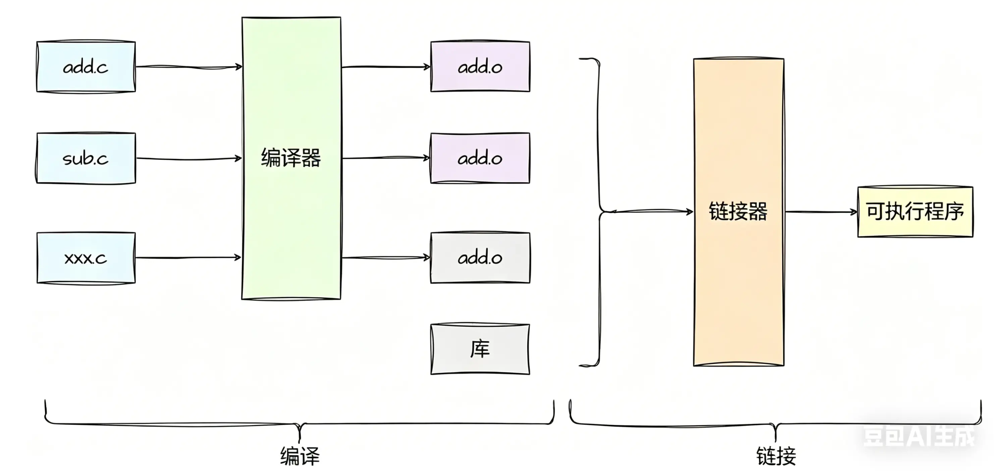


## ELF文件

动静态库，可执行程序，.o文件都是ELF格式的。

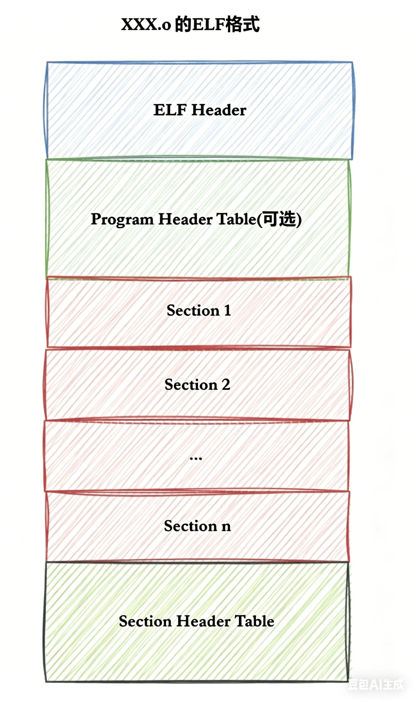


### ELF形成可执行文件

形成可执行文件在这里可以看为两步，第一步，将多份C/C++源代码，翻译成为目标.O文件+动静态库(ELF)，第二步，将多份.o文件section进行合并。链接形成可执行文件的本质其实是将ELF格式的.o文件里面的section进行合并，section有代码节和数据节，一合并就变成可执行文件，本质就是进行二进制文件的合并。
> [!TIP]
> 实际合并是在链接时进的，但是并不是这么简单的合并，也会涉及对库合并，此处不做过多追究。


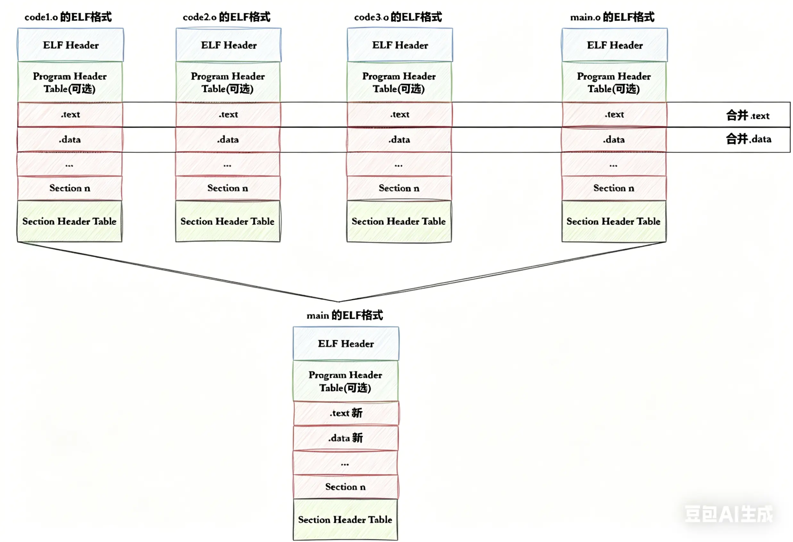


### ELF可执行文件加载

一个ELF会有多种不同的Section，在加载到内存的时候，也会进Section合并，形成segment。合并原则：相同属性，比如：可读，可写，可执，需要加载时申请空间等。这样，即便是不同的Section，在加载到内存中，可能会以segment的形式，加载到一起。

使用`readelf -S /bin/ls`命令可以查看ls指令可执行文件的Section Header Table（节头表）

```bash
[user1@iZ2zeh5i3yddf3p4q4ueo7Z ~]$ readelf -S /bin/ls
There are 30 section headers, starting at offset 0x1c3e8:

Section Headers:
  [Nr] Name              Type             Address           Offset
       Size              EntSize          Flags  Link  Info  Align
  [ 0]                   NULL             0000000000000000  00000000
       0000000000000000  0000000000000000           0     0     0
  [ 1] .interp           PROGBITS         0000000000400238  00000238
       000000000000001c  0000000000000000   A       0     0     1
  [ 2] .note.ABI-tag     NOTE             0000000000400254  00000254
       0000000000000020  0000000000000000   A       0     0     4
  [ 3] .note.gnu.build-i NOTE             0000000000400274  00000274
       0000000000000024  0000000000000000   A       0     0     4
  [ 4] .gnu.hash         GNU_HASH         0000000000400298  00000298
       0000000000000038  0000000000000000   A       5     0     8
  [ 5] .dynsym           DYNSYM           00000000004002d0  000002d0
       0000000000000c18  0000000000000018   A       6     1     8
  [ 6] .dynstr           STRTAB           0000000000400ee8  00000ee8
       0000000000000572  0000000000000000   A       0     0     1
  [ 7] .gnu.version      VERSYM           000000000040145a  0000145a
       0000000000000102  0000000000000002   A       5     0     2
  [ 8] .gnu.version_r    VERNEED          0000000000401560  00001560
       0000000000000090  0000000000000000   A       6     2     8
  [ 9] .rela.dyn         RELA             00000000004015f0  000015f0
       00000000000000d8  0000000000000018   A       5     0     8
  [10] .rela.plt         RELA             00000000004016c8  000016c8
       0000000000000ac8  0000000000000018  AI       5    24     8
  [11] .init             PROGBITS         0000000000402190  00002190
       000000000000001a  0000000000000000  AX       0     0     4
  [12] .plt              PROGBITS         00000000004021b0  000021b0
       0000000000000740  0000000000000010  AX       0     0     16
  [13] .text             PROGBITS         00000000004028f0  000028f0
       000000000001014a  0000000000000000  AX       0     0     16
  [14] .fini             PROGBITS         0000000000412a3c  00012a3c
       0000000000000009  0000000000000000  AX       0     0     4
  [15] .rodata           PROGBITS         0000000000412a60  00012a60
       0000000000003cce  0000000000000000   A       0     0     32
  [16] .eh_frame_hdr     PROGBITS         0000000000416730  00016730
       0000000000000754  0000000000000000   A       0     0     4
  [17] .eh_frame         PROGBITS         0000000000416e88  00016e88
       0000000000002704  0000000000000000   A       0     0     8
  [18] .init_array       INIT_ARRAY       000000000061a328  0001a328
       0000000000000008  0000000000000008  WA       0     0     8
  [19] .fini_array       FINI_ARRAY       000000000061a330  0001a330
       0000000000000008  0000000000000008  WA       0     0     8
  [20] .jcr              PROGBITS         000000000061a338  0001a338
       0000000000000008  0000000000000000  WA       0     0     8
  [21] .data.rel.ro      PROGBITS         000000000061a340  0001a340
       0000000000000a68  0000000000000000  WA       0     0     32
  [22] .dynamic          DYNAMIC          000000000061ada8  0001ada8
       0000000000000200  0000000000000010  WA       6     0     8
  [23] .got              PROGBITS         000000000061afa8  0001afa8
       0000000000000048  0000000000000008  WA       0     0     8
  [24] .got.plt          PROGBITS         000000000061b000  0001b000
       00000000000003b0  0000000000000008  WA       0     0     8
  [25] .data             PROGBITS         000000000061b3c0  0001b3c0
       0000000000000240  0000000000000000  WA       0     0     32
  [26] .bss              NOBITS           000000000061b600  0001b600
       0000000000000d20  0000000000000000  WA       0     0     32
  [27] .gnu_debuglink    PROGBITS         0000000000000000  0001b600
       0000000000000010  0000000000000000           0     0     4
  [28] .gnu_debugdata    PROGBITS         0000000000000000  0001b610
       0000000000000cb8  0000000000000000           0     0     1
  [29] .shstrtab         STRTAB           0000000000000000  0001c2c8
       000000000000011a  0000000000000000           0     0     1
Key to Flags:
  W (write), A (alloc), X (execute), M (merge), S (strings), I (info),
  L (link order), O (extra OS processing required), G (group), T (TLS),
  C (compressed), x (unknown), o (OS specific), E (exclude),
  l (large), p (processor specific)
[user1@iZ2zeh5i3yddf3p4q4ueo7Z ~]$ 
```
一个文件我们可以想象为一个超长的一维数组，只需要知道每个Section相对于起始位置的偏移量以及Section的长度，就能获取这个Section的数据。比如编号13的位置是.text，就是代码，根据对应的Address和Offset数据就能读取.text的内容。  
.data里面放的是定义好的全局数组或变量，.bss里面放的是未初始化的全局数组或变量，为了节约空间，只描述变量的数量，加载到内存时再开辟空间全设为0，所以未初始化的全局变量默认值都是0。  
.symtab是Symbol Table符号表，就是源码里面那些函数名，变量名和代码的对应关系。可以看做一个char类型的一维数组，储存了程序里出现的各种符号，比如`char lable[]="hello worle\0funtion\0abc\0"`，每个符号末尾都是`\0`，这样只需要记录起始偏移量就可以读取。


Section合并，形成segment时不是随便合并的，也不是让操作系统合并的，是需要文件自己定义合并方式。怎样合并由程序头表Program Header Table来决定。  
使用`readelf -l /bin/ls`命令可以查看ls指令可执行文件的程序头表Program Header Table
```bash
[user1@iZ2zeh5i3yddf3p4q4ueo7Z ~]$ readelf -l /bin/ls

Elf file type is EXEC (Executable file)
Entry point 0x404324
There are 9 program headers, starting at offset 64

Program Headers:
  Type           Offset             VirtAddr           PhysAddr
                 FileSiz            MemSiz              Flags  Align
  PHDR           0x0000000000000040 0x0000000000400040 0x0000000000400040
                 0x00000000000001f8 0x00000000000001f8  R E    8
  INTERP         0x0000000000000238 0x0000000000400238 0x0000000000400238
                 0x000000000000001c 0x000000000000001c  R      1
      [Requesting program interpreter: /lib64/ld-linux-x86-64.so.2]
  LOAD           0x0000000000000000 0x0000000000400000 0x0000000000400000
                 0x000000000001958c 0x000000000001958c  R E    200000
  LOAD           0x000000000001a328 0x000000000061a328 0x000000000061a328
                 0x00000000000012d8 0x0000000000001ff8  RW     200000
  DYNAMIC        0x000000000001ada8 0x000000000061ada8 0x000000000061ada8
                 0x0000000000000200 0x0000000000000200  RW     8
  NOTE           0x0000000000000254 0x0000000000400254 0x0000000000400254
                 0x0000000000000044 0x0000000000000044  R      4
  GNU_EH_FRAME   0x0000000000016730 0x0000000000416730 0x0000000000416730
                 0x0000000000000754 0x0000000000000754  R      4
  GNU_STACK      0x0000000000000000 0x0000000000000000 0x0000000000000000
                 0x0000000000000000 0x0000000000000000  RW     10
  GNU_RELRO      0x000000000001a328 0x000000000061a328 0x000000000061a328
                 0x0000000000000cd8 0x0000000000000cd8  R      1

 Section to Segment mapping:
  Segment Sections...
   00     
   01     .interp 
   02     .interp .note.ABI-tag .note.gnu.build-id .gnu.hash .dynsym .dynstr .gnu.version .gnu.version_r .rela.dyn .rela.plt .init .plt .text .fini .rodata .eh_frame_hdr .eh_frame 
   03     .init_array .fini_array .jcr .data.rel.ro .dynamic .got .got.plt .data .bss 
   04     .dynamic 
   05     .note.ABI-tag .note.gnu.build-id 
   06     .eh_frame_hdr 
   07     
   08     .init_array .fini_array .jcr .data.rel.ro .dynamic .got 
[user1@iZ2zeh5i3yddf3p4q4ueo7Z ~]$ 
```

There are 9 program headers, starting at offset 64，翻译一下就是有9个program headers，偏移量是64。查看03编号的program headers，发现包含了.data .bss，说明把已初始化变量和未初始化变量放在一起了。查看03编号，包含了.text .rodata，说明把代码和只读数据放一起了。  
程序头表Program Header Table告诉操作系统哪些模块可以被加载进内存。加载进内存之后哪些分段是可读可写，哪些分段是只读，哪些分段是可执行的，Flags这一列就代表权限，操纵系统读取Flags的数据把权限填写到页表里。


一个可执行程序由一个个Section数据节构成，链接时要形成新的节头表Section Header Table，同时要填充程序头表Program Header Table，把哪些数据节合并记录下来，当程序运行时操作系统就会读取程序头表Program Header Table，根据Program Header Table来把Section数据节加载到内存里，此时就完成了加载的过程。程序在加载前就把加载方式写在Program Header Table里了。


> [!TIP]
> 为什么要将section合并成为segment？
> Section合并的主要原因是为了减少页面碎，提高内存使用效率。如果不进合并，假设页面大小为4096字节（内存块基本大小，加载，管理的基本单位），如果.text部分为4097字节，.init部分为512字节，那么它们将占3个页，合并后，它们只需2个页面。  
> 此外，操作系统在加载程序时，会将具有相同属性的section合并成一个的segment，这样就可以实现不同的访问权限，从而优化内存管理和权限访问控制。


对于节头表Section Header Table：链接时需要把所有.o文件里面的section合并，每个section起始结束位置改变了，需要更新节头表Section Header Table。  
对于程序头表Program Header Table：会告诉操作系统，如何加载可执行文件，完成进程内存的初始化。一个可执行程序的格式中，一定有 program header table。  
一个在链接时作用，一个在运行加载时作用。


ELF Header是整个ELF格式的相关管理信息，使用`readelf -h /bin/ls`命令可以查看ls指令可执行文件的ELF Header。
```bash
[user1@iZ2zeh5i3yddf3p4q4ueo7Z ~]$ readelf -h /bin/ls
ELF Header:
  Magic:   7f 45 4c 46 02 01 01 00 00 00 00 00 00 00 00 00 
  Class:                             ELF64
  Data:                              2's complement, little endian
  Version:                           1 (current)
  OS/ABI:                            UNIX - System V
  ABI Version:                       0
  Type:                              EXEC (Executable file)
  Machine:                           Advanced Micro Devices X86-64
  Version:                           0x1
  Entry point address:               0x404324
  Start of program headers:          64 (bytes into file)
  Start of section headers:          115688 (bytes into file)
  Flags:                             0x0
  Size of this header:               64 (bytes)
  Size of program headers:           56 (bytes)
  Number of program headers:         9
  Size of section headers:           64 (bytes)
  Number of section headers:         30
  Section header string table index: 29
[user1@iZ2zeh5i3yddf3p4q4ueo7Z ~]$ 
```
Magic是用来说明自己是什么东西的，操作系统会根据Magic来判断文件是什么格式的。几乎所有的二进制文件开头都会声明自己是什么格式的，webp图片zip压缩包mp3音乐等等开头都有自己的Magic来说明自己是什么格式的文件。  
从下半部分的信息ELF Header还会记录Program Header和section header的起始位置与大小。

   
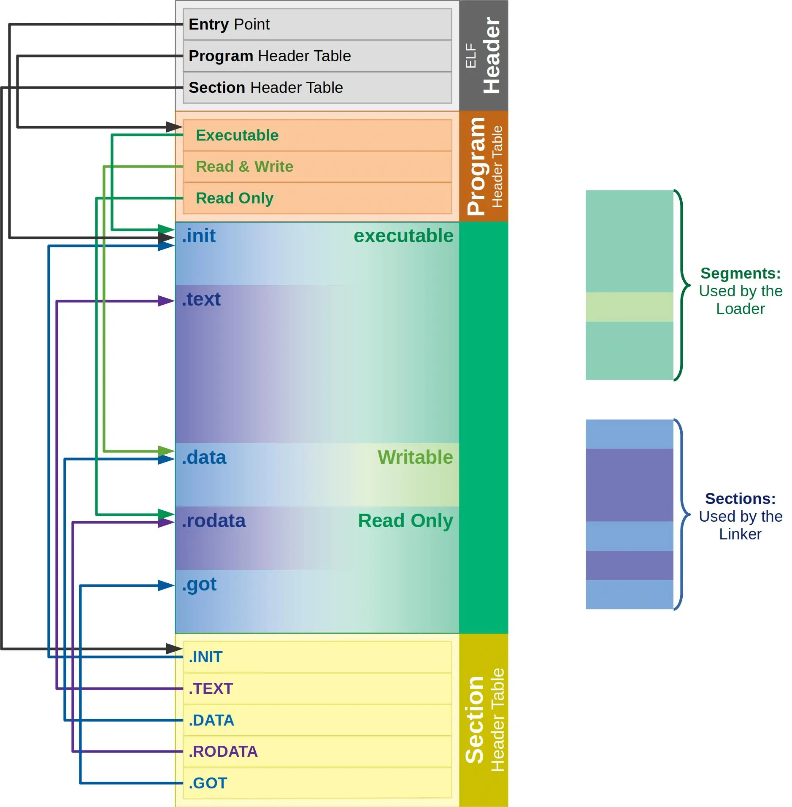


## 连接与加载

### 静态链接

无论是自己的.o文件，还是静态库中的.o文件，本质都是把.o文件进行连接的过程，所以研究静态链接，本质就是研究.o文件是如何链接的。


创建以下两个.c文件并编译为.o文件
```c
//main.c
#include<stdio.h>
void run();
int main()
{
    printf("hello world!\n");
    run();
    return 0;
}
```
```c
//run.c
#include<stdio.h>
void run() 
{
    printf("running...\n");
}
```

使用`objdump -d`命令：将代码段（.text）进行反汇编查看。
```bash
[user1@iZ2zeh5i3yddf3p4q4ueo7Z ku]$ objdump -d main.o

main.o:     file format elf64-x86-64


Disassembly of section .text:

0000000000000000 <main>:
   0:	55                   	push   %rbp
   1:	48 89 e5             	mov    %rsp,%rbp
   4:	bf 00 00 00 00       	mov    $0x0,%edi
   9:	e8 00 00 00 00       	callq  e <main+0xe>
   e:	b8 00 00 00 00       	mov    $0x0,%eax
  13:	e8 00 00 00 00       	callq  18 <main+0x18>
  18:	b8 00 00 00 00       	mov    $0x0,%eax
  1d:	5d                   	pop    %rbp
  1e:	c3                   	retq   
[user1@iZ2zeh5i3yddf3p4q4ueo7Z ku]$ objdump -d run.o

run.o:     file format elf64-x86-64


Disassembly of section .text:

0000000000000000 <run>:
   0:	55                   	push   %rbp
   1:	48 89 e5             	mov    %rsp,%rbp
   4:	bf 00 00 00 00       	mov    $0x0,%edi
   9:	e8 00 00 00 00       	callq  e <run+0xe>
   e:	5d                   	pop    %rbp
   f:	c3                   	retq   
[user1@iZ2zeh5i3yddf3p4q4ueo7Z ku]$ 
```

在main.o文件的反汇编查看到`13:	e8 00 00 00 00       	callq  18 <main+0x18>`，e8就是汇编callq命令对应的机器码，后面的数字是地址，e8 00 00 00 00地址是全0，说明main.o文件还不知道`run();`在哪里，甚至`run();`都不知道，因为编译时各个文件是相互独立的，互不知道其他文件的内容，因此只能先将地址设为0。查看两个.o文件的printf函数对应的汇编callq命令，地址也是全0，说明此时两个文件都没链接上C标准库。

使用`readelf -s`命令查看两个文件的符号表。
```bash
[user1@iZ2zeh5i3yddf3p4q4ueo7Z ku]$ readelf -s main.o

Symbol table '.symtab' contains 12 entries:
   Num:    Value          Size Type    Bind   Vis      Ndx Name
     0: 0000000000000000     0 NOTYPE  LOCAL  DEFAULT  UND 
     1: 0000000000000000     0 FILE    LOCAL  DEFAULT  ABS main.c
     2: 0000000000000000     0 SECTION LOCAL  DEFAULT    1 
     3: 0000000000000000     0 SECTION LOCAL  DEFAULT    3 
     4: 0000000000000000     0 SECTION LOCAL  DEFAULT    4 
     5: 0000000000000000     0 SECTION LOCAL  DEFAULT    5 
     6: 0000000000000000     0 SECTION LOCAL  DEFAULT    7 
     7: 0000000000000000     0 SECTION LOCAL  DEFAULT    8 
     8: 0000000000000000     0 SECTION LOCAL  DEFAULT    6 
     9: 0000000000000000    31 FUNC    GLOBAL DEFAULT    1 main
    10: 0000000000000000     0 NOTYPE  GLOBAL DEFAULT  UND puts
    11: 0000000000000000     0 NOTYPE  GLOBAL DEFAULT  UND run
[user1@iZ2zeh5i3yddf3p4q4ueo7Z ku]$ readelf -s run.o

Symbol table '.symtab' contains 11 entries:
   Num:    Value          Size Type    Bind   Vis      Ndx Name
     0: 0000000000000000     0 NOTYPE  LOCAL  DEFAULT  UND 
     1: 0000000000000000     0 FILE    LOCAL  DEFAULT  ABS run.c
     2: 0000000000000000     0 SECTION LOCAL  DEFAULT    1 
     3: 0000000000000000     0 SECTION LOCAL  DEFAULT    3 
     4: 0000000000000000     0 SECTION LOCAL  DEFAULT    4 
     5: 0000000000000000     0 SECTION LOCAL  DEFAULT    5 
     6: 0000000000000000     0 SECTION LOCAL  DEFAULT    7 
     7: 0000000000000000     0 SECTION LOCAL  DEFAULT    8 
     8: 0000000000000000     0 SECTION LOCAL  DEFAULT    6 
     9: 0000000000000000    16 FUNC    GLOBAL DEFAULT    1 run
    10: 0000000000000000     0 NOTYPE  GLOBAL DEFAULT  UND puts
[user1@iZ2zeh5i3yddf3p4q4ueo7Z ku]$ 
```
可以看见main.o里puts和run都是UND（Undefined）未定义的，run.o里puts是未定义的，在链接时main.o拿着未定义的run在run.o里面找找找，就能找到已定义的run。链接后再使用`readelf -s`命令查看符号表，就不是未定义的了，使用`objdump -d`命令再查看反汇编，callq命令e8后面跟着的地址就不是全0了。  
最终，两个.o的代码段合并到了一起，并进了统一的编址：链接的时候，会修改.o中没有确定的函数地址，在合并完成之后，进相关call地址，完成代码调用。为什么.o文件叫可重定位目标文件，因为函数地址可以修改。


静态链接就是把库中的.0进合并，和上述过程一样。  
所以链接其实就是将编译之后的所有目标文件连同用到的一些静态库运时库组合，拼装成一个独立的可执行件。其中就包括我们之前提到的地址修正，当所有模块组合在一起之后，链接器会根据我们的.文件或者静态库中的重定位表找到那些需要被重定位的函数全局变量，从而修正它们的地址。这其实就是静态链接的过程。

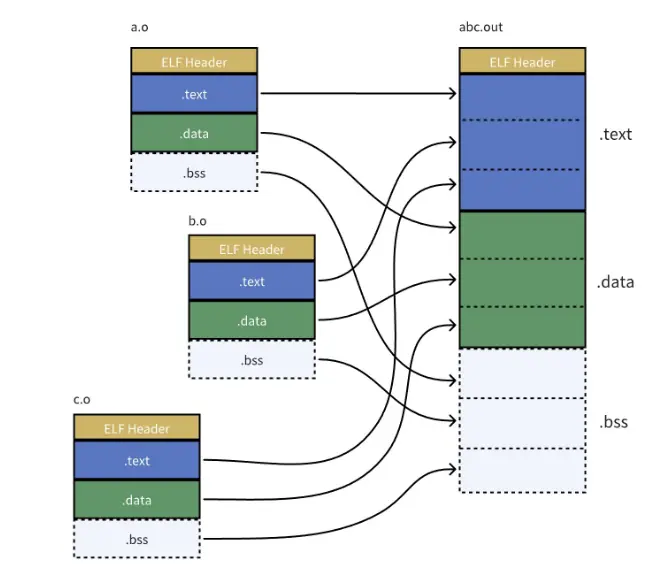


### ELF加载与进程地址空间

#### 逻辑地址与虚拟地址

一个可执行程序，如果没有被加载到内存中，该可执行程序，也有地址。  
对程序的各个函数函数变量，都记录下相对于起始地址的偏移量，访问时使用偏移量访问，这样对可执行程序，完成在磁盘上的编址，磁盘上的地址我们称为逻辑地址。当代操作系统使用“平坦模式”，即从0开始编址，编址起始偏移量都从0开始。平坦模式是操作系统的一个概念。


使用`objdump -S`指令查看可执行文件main.exe的反汇编。
```bash
[user1@iZ2zeh5i3yddf3p4q4ueo7Z ku]$ objdump -S main.exe 

main.exe:     file format elf64-x86-64


Disassembly of section .init:

00000000004003e0 <_init>:
  4003e0:	48 83 ec 08          	sub    $0x8,%rsp
  4003e4:	48 8b 05 0d 0c 20 00 	mov    0x200c0d(%rip),%rax        # 600ff8 <__gmon_start__>
  4003eb:	48 85 c0             	test   %rax,%rax
  4003ee:	74 05                	je     4003f5 <_init+0x15>
  4003f0:	e8 3b 00 00 00       	callq  400430 <__gmon_start__@plt>
  4003f5:	48 83 c4 08          	add    $0x8,%rsp
  4003f9:	c3                   	retq   

Disassembly of section .plt:

0000000000400400 <.plt>:
  400400:	ff 35 02 0c 20 00    	pushq  0x200c02(%rip)        # 601008 <_GLOBAL_OFFSET_TABLE_+0x8>
  400406:	ff 25 04 0c 20 00    	jmpq   *0x200c04(%rip)        # 601010 <_GLOBAL_OFFSET_TABLE_+0x10>
  40040c:	0f 1f 40 00          	nopl   0x0(%rax)

0000000000400410 <puts@plt>:
  400410:	ff 25 02 0c 20 00    	jmpq   *0x200c02(%rip)        # 601018 <puts@GLIBC_2.2.5>
  400416:	68 00 00 00 00       	pushq  $0x0
  40041b:	e9 e0 ff ff ff       	jmpq   400400 <.plt>

0000000000400420 <__libc_start_main@plt>:
  400420:	ff 25 fa 0b 20 00    	jmpq   *0x200bfa(%rip)        # 601020 <__libc_start_main@GLIBC_2.2.5>
  400426:	68 01 00 00 00       	pushq  $0x1
  40042b:	e9 d0 ff ff ff       	jmpq   400400 <.plt>

0000000000400430 <__gmon_start__@plt>:
  400430:	ff 25 f2 0b 20 00    	jmpq   *0x200bf2(%rip)        # 601028 <__gmon_start__>
  400436:	68 02 00 00 00       	pushq  $0x2
  40043b:	e9 c0 ff ff ff       	jmpq   400400 <.plt>

Disassembly of section .text:

0000000000400440 <_start>:
  400440:	31 ed                	xor    %ebp,%ebp
  400442:	49 89 d1             	mov    %rdx,%r9
  400445:	5e                   	pop    %rsi
  400446:	48 89 e2             	mov    %rsp,%rdx
  400449:	48 83 e4 f0          	and    $0xfffffffffffffff0,%rsp
  40044d:	50                   	push   %rax
  40044e:	54                   	push   %rsp
  40044f:	49 c7 c0 d0 05 40 00 	mov    $0x4005d0,%r8
  400456:	48 c7 c1 60 05 40 00 	mov    $0x400560,%rcx
  40045d:	48 c7 c7 2d 05 40 00 	mov    $0x40052d,%rdi
  400464:	e8 b7 ff ff ff       	callq  400420 <__libc_start_main@plt>
  400469:	f4                   	hlt    
  40046a:	66 0f 1f 44 00 00    	nopw   0x0(%rax,%rax,1)

0000000000400470 <deregister_tm_clones>:
  400470:	b8 3f 10 60 00       	mov    $0x60103f,%eax
  400475:	55                   	push   %rbp
  400476:	48 2d 38 10 60 00    	sub    $0x601038,%rax
  40047c:	48 83 f8 0e          	cmp    $0xe,%rax
  400480:	48 89 e5             	mov    %rsp,%rbp
  400483:	77 02                	ja     400487 <deregister_tm_clones+0x17>
  400485:	5d                   	pop    %rbp
  400486:	c3                   	retq   
  400487:	b8 00 00 00 00       	mov    $0x0,%eax
  40048c:	48 85 c0             	test   %rax,%rax
  40048f:	74 f4                	je     400485 <deregister_tm_clones+0x15>
  400491:	5d                   	pop    %rbp
  400492:	bf 38 10 60 00       	mov    $0x601038,%edi
  400497:	ff e0                	jmpq   *%rax
  400499:	0f 1f 80 00 00 00 00 	nopl   0x0(%rax)

00000000004004a0 <register_tm_clones>:
  4004a0:	b8 38 10 60 00       	mov    $0x601038,%eax
  4004a5:	55                   	push   %rbp
  4004a6:	48 2d 38 10 60 00    	sub    $0x601038,%rax
  4004ac:	48 c1 f8 03          	sar    $0x3,%rax
  4004b0:	48 89 e5             	mov    %rsp,%rbp
  4004b3:	48 89 c2             	mov    %rax,%rdx
  4004b6:	48 c1 ea 3f          	shr    $0x3f,%rdx
  4004ba:	48 01 d0             	add    %rdx,%rax
  4004bd:	48 d1 f8             	sar    %rax
  4004c0:	75 02                	jne    4004c4 <register_tm_clones+0x24>
  4004c2:	5d                   	pop    %rbp
  4004c3:	c3                   	retq   
  4004c4:	ba 00 00 00 00       	mov    $0x0,%edx
  4004c9:	48 85 d2             	test   %rdx,%rdx
  4004cc:	74 f4                	je     4004c2 <register_tm_clones+0x22>
  4004ce:	5d                   	pop    %rbp
  4004cf:	48 89 c6             	mov    %rax,%rsi
  4004d2:	bf 38 10 60 00       	mov    $0x601038,%edi
  4004d7:	ff e2                	jmpq   *%rdx
  4004d9:	0f 1f 80 00 00 00 00 	nopl   0x0(%rax)

00000000004004e0 <__do_global_dtors_aux>:
  4004e0:	80 3d 4d 0b 20 00 00 	cmpb   $0x0,0x200b4d(%rip)        # 601034 <_edata>
  4004e7:	75 11                	jne    4004fa <__do_global_dtors_aux+0x1a>
  4004e9:	55                   	push   %rbp
  4004ea:	48 89 e5             	mov    %rsp,%rbp
  4004ed:	e8 7e ff ff ff       	callq  400470 <deregister_tm_clones>
  4004f2:	5d                   	pop    %rbp
  4004f3:	c6 05 3a 0b 20 00 01 	movb   $0x1,0x200b3a(%rip)        # 601034 <_edata>
  4004fa:	f3 c3                	repz retq 
  4004fc:	0f 1f 40 00          	nopl   0x0(%rax)

0000000000400500 <frame_dummy>:
  400500:	48 83 3d 18 09 20 00 	cmpq   $0x0,0x200918(%rip)        # 600e20 <__JCR_END__>
  400507:	00 
  400508:	74 1e                	je     400528 <frame_dummy+0x28>
  40050a:	b8 00 00 00 00       	mov    $0x0,%eax
  40050f:	48 85 c0             	test   %rax,%rax
  400512:	74 14                	je     400528 <frame_dummy+0x28>
  400514:	55                   	push   %rbp
  400515:	bf 20 0e 60 00       	mov    $0x600e20,%edi
  40051a:	48 89 e5             	mov    %rsp,%rbp
  40051d:	ff d0                	callq  *%rax
  40051f:	5d                   	pop    %rbp
  400520:	e9 7b ff ff ff       	jmpq   4004a0 <register_tm_clones>
  400525:	0f 1f 00             	nopl   (%rax)
  400528:	e9 73 ff ff ff       	jmpq   4004a0 <register_tm_clones>

000000000040052d <main>:
  40052d:	55                   	push   %rbp
  40052e:	48 89 e5             	mov    %rsp,%rbp
  400531:	bf f0 05 40 00       	mov    $0x4005f0,%edi
  400536:	e8 d5 fe ff ff       	callq  400410 <puts@plt>
  40053b:	b8 00 00 00 00       	mov    $0x0,%eax
  400540:	e8 07 00 00 00       	callq  40054c <run>
  400545:	b8 00 00 00 00       	mov    $0x0,%eax
  40054a:	5d                   	pop    %rbp
  40054b:	c3                   	retq   

000000000040054c <run>:
  40054c:	55                   	push   %rbp
  40054d:	48 89 e5             	mov    %rsp,%rbp
  400550:	bf fd 05 40 00       	mov    $0x4005fd,%edi
  400555:	e8 b6 fe ff ff       	callq  400410 <puts@plt>
  40055a:	5d                   	pop    %rbp
  40055b:	c3                   	retq   
  40055c:	0f 1f 40 00          	nopl   0x0(%rax)

0000000000400560 <__libc_csu_init>:
  400560:	41 57                	push   %r15
  400562:	41 89 ff             	mov    %edi,%r15d
  400565:	41 56                	push   %r14
  400567:	49 89 f6             	mov    %rsi,%r14
  40056a:	41 55                	push   %r13
  40056c:	49 89 d5             	mov    %rdx,%r13
  40056f:	41 54                	push   %r12
  400571:	4c 8d 25 98 08 20 00 	lea    0x200898(%rip),%r12        # 600e10 <__frame_dummy_init_array_entry>
  400578:	55                   	push   %rbp
  400579:	48 8d 2d 98 08 20 00 	lea    0x200898(%rip),%rbp        # 600e18 <__init_array_end>
  400580:	53                   	push   %rbx
  400581:	4c 29 e5             	sub    %r12,%rbp
  400584:	31 db                	xor    %ebx,%ebx
  400586:	48 c1 fd 03          	sar    $0x3,%rbp
  40058a:	48 83 ec 08          	sub    $0x8,%rsp
  40058e:	e8 4d fe ff ff       	callq  4003e0 <_init>
  400593:	48 85 ed             	test   %rbp,%rbp
  400596:	74 1e                	je     4005b6 <__libc_csu_init+0x56>
  400598:	0f 1f 84 00 00 00 00 	nopl   0x0(%rax,%rax,1)
  40059f:	00 
  4005a0:	4c 89 ea             	mov    %r13,%rdx
  4005a3:	4c 89 f6             	mov    %r14,%rsi
  4005a6:	44 89 ff             	mov    %r15d,%edi
  4005a9:	41 ff 14 dc          	callq  *(%r12,%rbx,8)
  4005ad:	48 83 c3 01          	add    $0x1,%rbx
  4005b1:	48 39 eb             	cmp    %rbp,%rbx
  4005b4:	75 ea                	jne    4005a0 <__libc_csu_init+0x40>
  4005b6:	48 83 c4 08          	add    $0x8,%rsp
  4005ba:	5b                   	pop    %rbx
  4005bb:	5d                   	pop    %rbp
  4005bc:	41 5c                	pop    %r12
  4005be:	41 5d                	pop    %r13
  4005c0:	41 5e                	pop    %r14
  4005c2:	41 5f                	pop    %r15
  4005c4:	c3                   	retq   
  4005c5:	90                   	nop
  4005c6:	66 2e 0f 1f 84 00 00 	nopw   %cs:0x0(%rax,%rax,1)
  4005cd:	00 00 00 

00000000004005d0 <__libc_csu_fini>:
  4005d0:	f3 c3                	repz retq 

Disassembly of section .fini:

00000000004005d4 <_fini>:
  4005d4:	48 83 ec 08          	sub    $0x8,%rsp
  4005d8:	48 83 c4 08          	add    $0x8,%rsp
  4005dc:	c3                   	retq   
[user1@iZ2zeh5i3yddf3p4q4ueo7Z ku]$ 

```
最左侧的就是ELF的虚拟地址，其实，严格意义上应该叫做逻辑地址(起始地址+偏移量)，但是我们认为起始地址是0.也就是说，其实虚拟地址在我们的程序还没有加载到内存的时候，就已经把可执行程序进行统一编址了。从0开始编址不代表0地址一定要使用，查看左边的地址我们可以看到从4003e0开始，往下地址都是依次递增的，也可以称为线性地址。

从0开始，很像之前几篇提到过的虚拟地址空间，其实虚拟地址空间不仅仅是进程看待内存的方式，磁盘上的可执行程序，代码和数据编址其实就是虚拟地址的统一编址。当程序编译好的时候，存在磁盘里时的地址就是虚拟地址了。

进程的`mm_struct`、`vm_area_struct`在进程刚刚创建的时候，初始化数据从哪里来的？从ELF各个segment来，每个segment有自己的起始地址和自己的长度，用来初始化内核结构中的`[start，end]`等范围数据，另外在用详细地址，填充页表。  
链接时就是在把多个.o文件的segment合并之后进行统一编址。


所以虚拟地址机制，不光光操作系统要支持，编译器也要支持。

#### 重新理解进程虚拟地址空间


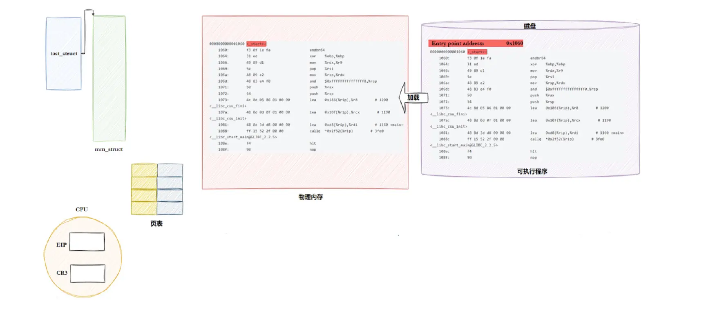


程序在加载到内存前虚拟地址就存在磁盘里了，加载后，操作系统给进程创建了task_struct和mm_struct，mm_struct有一个代码区，这个代码区必须要有起始和结束地址，代码加载到内存也要有自己的物理地址，页表负责映射物理和虚拟地址。CPU内部存在EIP，读取ELF Header里面的Entry point address，Entry point address记录的就是程序的入口地址，入口地址会被加载到CPU的EIP里，CPU根据虚拟地址查页表得到物理地址，读取物理地址的内容。进入CPU的地址全部都是虚拟地址，CPU再也不关心物理地址了，只认为从全0地址到全F地址统一编址，和磁盘上的视角一模一样。  
在内存在CPU内部用的叫虚拟地址，磁盘上叫逻辑地址，其实就是一个东西的两个名字。操作系统叫虚拟地址空间，编译器叫绝对编址，操作系统和编译器就达到统一了。


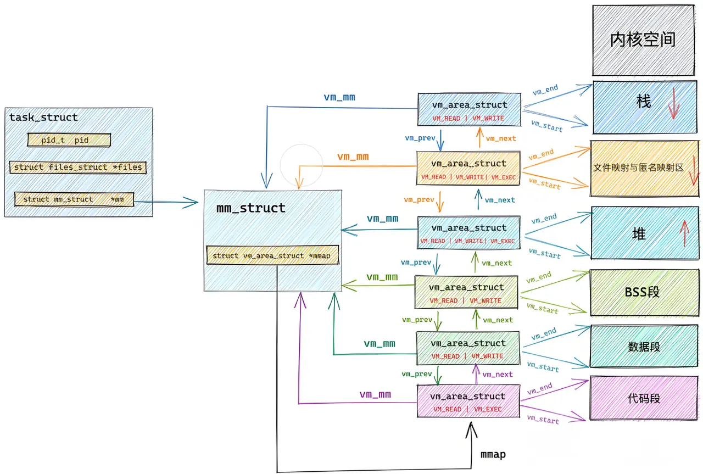


mm_struct里又把每个区域的起始结束位置串起来，形成链表，对各个区域内存的管理就变成对这个链表的管理。

#### 程序的加载


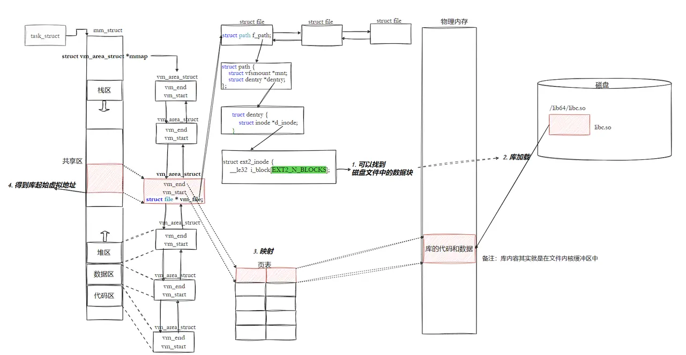
（忽略上面的库，把库替换为可执行程序，过程是类似的）  
有了上面的认识，我们可以了解程序是如何加载的了。操纵系统第一步要先加载可执行程序的管理信息，创建内核数据结构task_struct，构建地址空间形成mm_struct，构建页表，然后加载程序的代码和数据，使用ELF格式的管理信息初始化mm_struct的各个vm_area_struct，加载后物理地址和虚拟地址都有了，填写页表构建映射关系。操作系统如何找到可执行文件？可执行文在文件管理部分就相当于struct file，通过struct file一步步往下找找到inode，根据inode读取磁盘上的块block，然后就能读取数据了开始加载了。先通过文件管理找到文件，然后通过进程管理创建PCB，最后通过内存管理构建物理地址和虚拟地址映射关系，三个子系统之间是解耦的但是又相互配合。


### 动态链接与动态库加载

#### 进程如何看到动态库以及如何共享

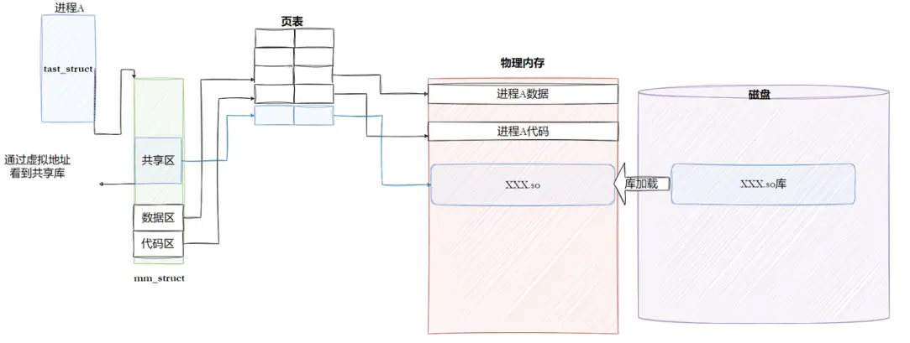

程序和动态库是两个独立的文件，程序运行时需要查找动态库。动态库也需要加载，加载时通过当前进程的页表映射到进程虚拟地址空间的共享区，程序需要调用库时，只需要跳转到共享区，完成后再返回。  
库函数调用就两步：
1. 被进程看到：动态库映射到进程的地址空间
2. 被进程调用：在进程的地址空间中进行跳转


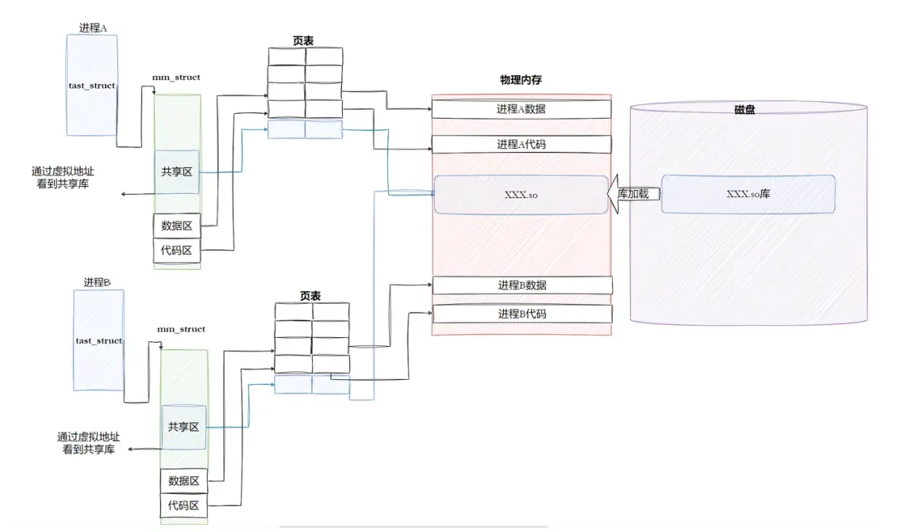

假如有两个进程需要同一个动态库，动态库会通过两个进程的页表分别映射到进程各自的共享区。

动态库的本质是把系统层面上公共的代码抽出来，不会在内存中重复，节约了内存空间，所有动态库也可以叫做共享库。

#### 动态链接

动态链接其实远比静态链接要常用得多。gcc默认使用动态链接。
```bash
[user1@iZ2zeh5i3yddf3p4q4ueo7Z ku]$ ldd main.exe 
	linux-vdso.so.1 =>  (0x00007ffc08d5e000)
	libc.so.6 => /lib64/libc.so.6 (0x00007f75831de000)
	/lib64/ld-linux-x86-64.so.2 (0x00007f75835ac000)
[user1@iZ2zeh5i3yddf3p4q4ueo7Z ku]$ 
```
libc.so.6去掉前后缀就，库名就是c，代表的是C语言标准库，里面提供了常用的标准输入输出文件字符串处理等等这些功能。  
那为什么编译器默认不使用静态链接呢？静态链接会将编译产生的所有自标文件，连同用到的各种库，合并形成一个独立的可执行文件，它不需要额外的依赖就可以运行。照理来说应该更加方便才对是吧?   
静态链接最大的问题在于生成的文件体积大，并且相当耗费内存资源。随着软件复杂度的提升，我们的操作系统也越来越臃肿，不同的软件就有可能都包含了相同的功能和代码，显然会浪费大量的硬盘空间。  
这个时候，动态链接的优势就体现出来了，我们可以将需要共享的代码单独提取出来，保存成一个独立的动态链接库，等到程序运的时候再将它们加载到内存，这样不但可以节省空间，因为同一个模块在内存中只需要保留一份副本，可以被不同的进程所共享。

动态链接到底是如何工作的？？  
首先要交代一个结论，**动态链接实际上将链接的整个过程推迟到了程序加载的时候**。比如我们去运一个程序，操作系统会首先将程序的数据代码连同它用到的一系列动态库先加载到内存，其中每个动态库的加载地址都是不固定的，操作系统会根据当前地址空间的使用情况为它们动态分配一段内存。当动态库被加载到内存以后，一旦它的内存地址被确定，我们就可以去修正动态库中的那些函数跳转地址了。


##### 程序被编译器动了手脚

查看依赖时，处理标准库，我们发现程序还依赖于这个东西`/lib64/ld-linux-x86-64.so.2 (0x00007f75835ac000)`，这个相当于加载器提供的方法。

在C/C++程序中，当程序开始执行时，它首先并不会直接跳转到`main`函数。实际上，程序的入口点是`_start`，这是一个由C运行时库（通常是glibc）或链接器（如ld）提供的特殊函数。  
在`_start` 函数中，会执行一系列初始化操作，这些操作包括：
1. 设置堆栈：为程序创建一个初始的堆栈环境。
2. 初始化数据段：将程序的数据段（如全局变量和静态变量）从初始化数据段复制到相应的内存位置，并清零未初始化的数据段。
3. 动态链接：这是关键的一步，`_start`函数会调用动态链接器的代码来解析和加载程序所依赖的动态库（sharedlibraries）。动态链接器会处理所有的符号解析和重定位，确保程序中的函数调用和变量访问能够正确地映射到动态库中的实际地址。
4. 调用`__libc_start_main`：一旦动态链接完成，`_start` 函数会调用`__libc_start_main` （这是glibc提供的—个函数）。 `__libc_start_main` 函数负责执行一些额外的初始化工作，比如设置信号处理函数、初始化线程库（如果使用了线程）等。
5. 调用main函数：最后，`__libc_start_main`函数会调用程序的`main`函数，此时程序的执行控制权才正式交给用户编写的代码。
6. 处理main函数的返回值：当main函数返回时， `__libc_start_main`会负责处理这个返回值，并最终调用`_exit`函数来终止程序。

动态链接器：
- 动态链接器（如ld-linux.so）负责在程序运行时加载动态库。
- 当程序启动时，动态链接器会解析程序中的动态库依赖，并加载这些库到内存中。
环境变量和配置文件：
- Linux系统通过环境变量（如LD_LIBRARY_PATH）和配置文件（如/etc/ld.so.Conf及其子配置文件）来指定动态库的搜索路径。
- 这些路径会被动态链接器在加载动态库时搜索。
缓存文件：
- 为了提高动态库的加载效率，Linux系统会维护一个名为/etc/ld.so.cache的缓存文件。
- 该文件包含了系统中所有已知动态库的路径和相关信息，动态链接器在加载动态库时会首先搜索这个缓存文件。 


---

其实就是在程序启动之后，程序的`_start`函数会调用Linux的加载器，把需要的动态库加载到内存。


##### 动态库中的相对地址


动态库为了随时进行加载，为了支持并映射到任意进程的任意位置，对动态库中的方法，统一编址，采用相对编址的方案进行编制的(其实可执行程序也一样，都要遵守平坦模式，只不过exe是直接加载的)。  
动态库也是ELF，我们也理解成为起始地址(0)+偏移量，使用`objdump -S 库的路径 | less`指令可以查看库的反汇编。
```bash
[user1@iZ2zeh5i3yddf3p4q4ueo7Z ~]$ objdump -S /lib64/libc-2.17.so | less


/lib64/libc-2.17.so:     file format elf64-x86-64


Disassembly of section .plt:

000000000001f910 <.plt>:
   1f910:       ff 35 f2 76 3a 00       pushq  0x3a76f2(%rip)        # 3c7008 <_GLOBAL_OFFSET_TABLE_+0x8>
   1f916:       ff 25 f4 76 3a 00       jmpq   *0x3a76f4(%rip)        # 3c7010 <_GLOBAL_OFFSET_TABLE_+0x10>
   1f91c:       0f 1f 40 00             nopl   0x0(%rax)

000000000001f920 <*ABS*+0x8f950@plt>:
   1f920:       ff 25 f2 76 3a 00       jmpq   *0x3a76f2(%rip)        # 3c7018 <_GLOBAL_OFFSET_TABLE_+0x18>
   1f926:       68 0c 00 00 00          pushq  $0xc
   1f92b:       e9 e0 ff ff ff          jmpq   1f910 <.plt>

000000000001f930 <*ABS*+0xb57d0@plt>:
   1f930:       ff 25 ea 76 3a 00       jmpq   *0x3a76ea(%rip)        # 3c7020 <_GLOBAL_OFFSET_TABLE_+0x20>
   1f936:       68 0b 00 00 00          pushq  $0xb
   1f93b:       e9 d0 ff ff ff          jmpq   1f910 <.plt>

000000000001f940 <realloc@plt>:
   1f940:       ff 25 e2 76 3a 00       jmpq   *0x3a76e2(%rip)        # 3c7028 <realloc@@GLIBC_2.2.5+0x3413e8>
   1f946:       68 00 00 00 00          pushq  $0x0
   1f94b:       e9 c0 ff ff ff          jmpq   1f910 <.plt>

000000000001f950 <malloc@plt>:
   1f950:       ff 25 da 76 3a 00       jmpq   *0x3a76da(%rip)        # 3c7030 <malloc@@GLIBC_2.2.5+0x3418f0>
   1f956:       68 01 00 00 00          pushq  $0x1
:
```

观察左边的地址可以发现库里的地址也是从上往下递增的，按顺序依次编址。可执行程序从0开始编址，动态库映射到虚拟地址空间，确定起始地址和偏移量，也能找到任何一个方法的地址。

##### 程序如何与动态库映射起来

动态库也是一个文件，要访问也是要被先加载，要加载也是要被打开的。  
让我们的进程找到动态库的本质：也是文件操作，不过我们访问库函数，通过虚拟地址进跳转访问的，所以需要把动态库映射到进程的地址空间中。


程序加载时先执行`_start`函数，`_start`函数要找到程序需要的动态库，ELF里的符号表会记录下需要的动态库，所以在编译链接时就要告诉编译器动态库的位置。因为都是ELF格式，加载动态库的过程和加载可执行程序差不多，根据struct file一步步往下找到在磁盘上的文件位置，然后加载到内存，动态库里面也是采用绝对编址的，库里面的地址不当成虚拟地址，我们当成库中方法的偏移量。与此同时库也有自己的大小，那么就创建一个vm_are_struct插入到内存管理的链表中，用库的大小和起始地址初始化vm_are_struct里的vm_end和vm_start，库也有虚拟地址，通过页表映射到mm_struct的共享区，得到库的起始虚拟地址，再加上偏移量就能访问库中任意一个方法了。


##### 程序如何调用库函数


库已经被我们映射到了当前进程的地址空间中库的虚拟起始地址我们也已经知道了，库中每一个方法的偏移量地址我们也知道。  
访问库中任意方法，只需要知道库的起始虚拟地址+法偏移量即可定位库中的方法。并且，整个调用过程，是从代码区跳转到共享区，调完毕在返回到代码区，整个过程完全在进程地址空间中进行的。


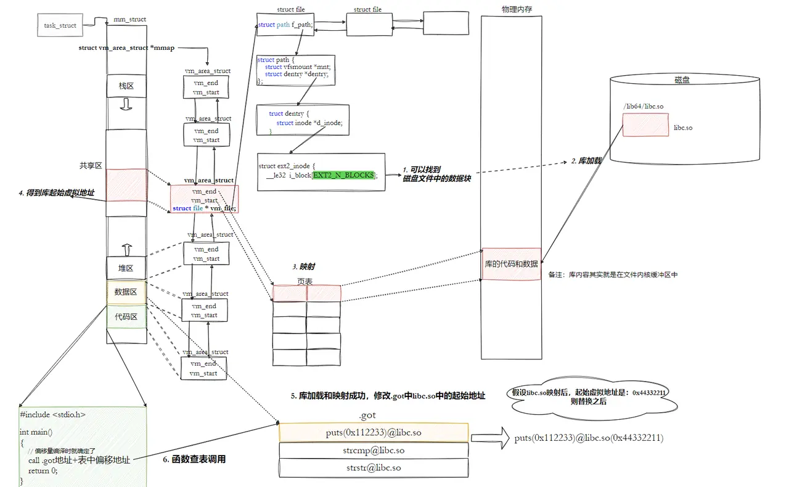


偏移量在编译时就确定了，因为编译时要对代码进行编址，库加载和映射成功后，要修改代码区，将调用的库函数的名字修改为库起始地址+偏移量来访问。


##### 全局偏移量表GOT(global offset table) 


也就是说，我们的程序运行之前，先把所有库加载并映射，所有库的起始虚拟地址都应该提前知道。
然后对我们加载到内存中的程序的库函数调用进地址修改，在内存中二次完成地址设置（这个叫做加载地址重定位）。


等等，修改的竟然是代码区，代码区在进程中不是只读的吗？怎么能修改呢？

代码区确实是只读的，不可修改。  
所以，动态链接采用的做法是在`.data`（可执行程序或者库自己）中专门预留一片区域用来存放函数的跳转地址，它也被叫做全局偏移表GOT，表中每一项都是本运行模块要引用的一个全局变量或函数的地址。因为`.data`区域是可读写的，所以可以支持动态进行修改。


我们的可执行程序在编址时，代码就是代码区，数据区里额外开了一块区域，这个区域里保存的就是要用的库函数的偏移量和库名称，在链接时GOT表就存在了，在代码区里也不用库的起始地址和偏移量，代码区填写的是表的起始地址+表当中的偏移量。将来可执行程序需要用的所有库，用到的所有方法全部都更新到表里。可执行程序再也不关心自己要访问哪个库了，变成了要知道访问的方法在表里的位置。把动态库加载进来后，库在mm_struct里的起始虚拟地址初始化了，更改GOT表中库的地址，此时代码不做更改，也可以找到库当中的方法了，这就是**加载重定向**的原理。

由于代码段只读，我们不能直接修改代码段。但有了GOT表，代码便可以被所有进程共享。但在不同进程的地址空间中，各动态库的绝对地址、相对位置都不同。**反映到GOT表上，就是每个进程的每个动态库都有独立的GOT表，所以进程间不能共享GOT表。**  
在单个`.so`下，由于GOT表与`.text` 的相对位置是固定的，我们完全可以利用CPU的相对寻址来找到GOT表。  
在调用函数的时候会首先查表，然后根据表中的地址来进行跳转，这些地址在动态库加载的时候会被修改为真正的地址。库也是由多个`.o`文件打包构成的，编址时从0开始，认为所有的方法编址全是偏移量，就可以把库加载到内存的任意位置，被映射到进程的任意虚拟地址空间，通过修改GOT表就可以动态找到库。   
这种方式实现的动态链接就被叫做`PIC地址无关代码`。换句话说，我们的动态库不需要做任何修改，被加载到任意内存地址都能够正常运行，并且能够被所有进程共享，这也是为什么之前我们给编译器指定-fPIC参数的原因，因为PIC=相对编址+GOT。

##### 库间依赖

不仅仅有可执行程序调用库，库也会调用其他库。库之间是有依赖的，如何做到库和库之间互相调用也是与地址无关的呢？和可执行程序一样，库中也有.GOT，这也就是为什么大家为什么都是ELF的格式的原因。


由于动态链接在程序加载的时候需要对大量函数进行重定位，这一步显然是非常耗时的。为了进一步降低开销，我们的操作系统还做了一些其他的优化，比如**延迟绑定**，或者也叫PLT（过程连接表（ProcedureLinkageTable））。与其在程序一开始就对所有函数进重定位，不如将这个过程推迟到函数第一次被调用的时候，因为绝大多数动态库中的函数可能在程序运行期间一次都不会被使用到。
思路是：GOT中的跳转地址默认会指向一段辅助代码，它也被叫做桩代码/stup。在我们第一次调用函数的时候，这段代码会负责查询真正函数的跳转地址，并且去更新GOT表。于是我们再次调用函数的时候，就会直接跳转到动态库中真正的函数实现。

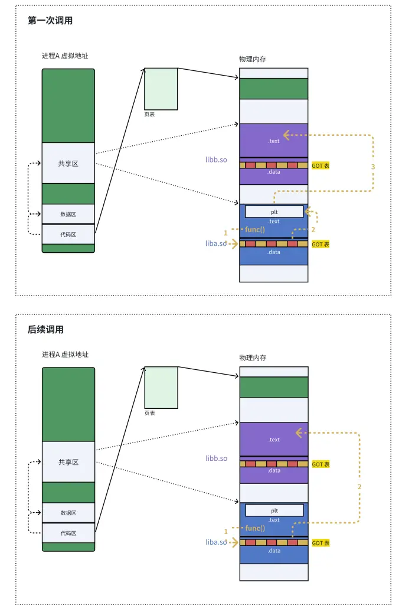

解析依赖关系的时候，就是加载并完善互相之间的GOT表的过程


---

总而言之，动态链接实际上将链接的整个过程，比如符号查询、地址的重定位从编译时推迟到了程序的运行时，它虽然牺牲了一定的性能和程序加载时间，但绝对是物有所值的。因为动态链接能够更有
效的利用磁盘空间和内存资源，以极大方便了代码的更新和维护，更关键的是，它实现了二进制级别的代码复用。

#### 总结


静态链接的出现，提高了程序的模块化水平。对于一个大的项目，不同的人可以独立地测试和开发自己的模块。通过静态链接，生成最终的可执行文件。  
我们知道静态链接会将编译产生的所有目标文件，和用到的各种库合并成一个独立的可执行文件，其中我们会去修正模块间函数的跳转地址，也被叫做编译重定位(也叫做静态重定位)。  
而动态链接实际上将链接的整个过程推迟到了程序加载的时候。比如我们去运一个程序，操作系统会首先将程序的数据代码连同它用到的一系列动态库先加载到内存，其中每个动态库的加载地址都是不固定的，但是无论加载到什么地方，都要映射到进程对应的地址空间，然后通过.GOT方式进行调用(运行重定位，也叫做动态地址重定位)。