---

date: 2026-04-22T00:00:00+08:00
lastmod: 2026-05-01T00:00:00+08:00
title: '【Linux】10 - 进程间通信'

tags:
  - 进程
  - 管道
  - 共享内存
  - 消息队列
  - 信号量
  - systemV

categories:
  - Linux
   

---


# 进程间通信


## 进程间通信介绍

### 进程间通信目的

进程之间相互独立，当需要多个进程相互协作时必定需要进程间通信。

- 数据传输：一个进程需要将它的数据发送给另一个进程。
- 资源共享：多个进程之间共享同样的资源。
- 通知事件：一个进程需要向另一个或一组进程发送消息，通知它（它们）发生了某种事件（如进程终正时要通知父进程）。
- 进程控制：有些进程希望完全控制另一个进程的执（如Debug进程），此时控制进程希望能够拦截另一个进程的所有陷入和异常，并能够及时知道它的状态改变。

### 进程间通信的方式
进程间通信（IPC,Inter-Process Communication）是指运行在同一台计算机或不同计算机上的多个进程之间进行数据交换和通信的技术。由于每个进程都有自己的地址空间，它们无法直接访问彼此的数据，因此需要通过特定的机制来实现通信。IPC是操作系统和多进程编程中的一个重要概念，广泛应用于分布式系统、多任务操作系统以及各种应用程序之间，IPC 是实现多进程协作的基础。


进程间通信的本质：是先让不同的进程，先看到同一份资源（内存），然后才有通信的条件。早期的进程间通信是单机的，在一台机器上实现进程间通信，后来随着技术发展，进程间通信的技术也拓展到网络范畴了，网络本质也是共享的资源。  
进程间通信看到的同一份资源不是由任何一个进程提供的，因为进程之间相互独立，所以共享的资源只能由操作系统提供，操作系统也提供了相关的系统调用，系统调用也要设计统一的通信接口。慢慢的这些接口就发展成为了各种统一的标准。

以下对主流 IPC 技术进行系统介绍。
1. 管道（Pipe）与命名管道（FIFO）
  - 管道是最古老的 IPC 形式，分为匿名管道和命名管道。
  - 匿名管道
    - 原理：在内核中开辟一块缓冲区，一个进程写入，另一进程读取，数据流向是单向的。
    - 使用方式：通过 pipe() 系统调用创建，返回两个文件描述符（fd[0]读端、fd[1]写端），只能在具有亲缘关系的进程间使用（如父子进程通过 fork 继承）。
    - 特点：面向字节流，自带同步（读空时阻塞、写满时阻塞），生命周期随进程结束而销毁。
  - 命名管道（FIFO）
    - 原理：通过一个文件系统路径名（如 mkfifo 创建）标识的管道，允许任意两个进程通信，无需亲缘关系。
    - 特点：同样半双工（单向），但可通过打开两个 FIFO 实现双向通信。

2. 消息队列（Message Queue）
  - 原理：在内核中维护一个消息链表，进程可以向队列发送带有类型字段的数据块（消息），接收方可按类型选择性读取。
  - 系统调用：msgget、msgsnd、msgrcv、msgctl（System V 标准），或 POSIX 消息队列 mq_open。
  - 优点：消息有边界，不必像管道那样处理流的分割。支持按类型优先级读取，可多对多通信。
  - 缺点：消息大小和队列总长度受限，内核态内存占用较高。

3. 共享内存（Shared Memory）
  - 原理：多个进程将同一块物理内存映射到各自的虚拟地址空间，直接读写该内存区域，无需内核中转数据。   
  - 效率：是最快的 IPC 方式，适合大数据量、高频交换场景（如音视频流处理）。    
  - 同步问题：共享内存本身不提供同步，需配合信号量或互斥锁来避免竞态条件。
  - 实现形式：
    - System V 共享内存：shmget、shmat、shmdt。
    - POSIX 共享内存：shm_open、mmap。
    - 内存映射文件（mmap + MAP_SHARED）。
    
4. 信号量（Semaphore）
  - 性质：严格来说信号量是进程同步机制，而非数据交换手段，但常与共享内存搭配使用。
  - 原理：内核维护一个整型计数器，进程通过 P 操作（减一，若值为负则阻塞）和 V 操作（加一，唤醒等待者）来控制对临界资源的访问。
  - 分类：
    - System V 信号量：操作复杂，支持多资源、撤销操作。
    - POSIX 命名/无名信号量：接口更简洁，适合线程或进程同步。

5. 信号（Signal）
  - 原理：一种异步通知机制，一个进程向另一个进程发送一个信号编号（如 SIGKILL、SIGUSR1），目标进程可在任何时候收到并执行预设的处理函数或采取默认动作。
  - 限制：   
    - 能传递的信息极少（仅信号编号），无法传输大量数据。
    - 不可靠信号（早期 Unix）可能丢失，可靠信号队列有限。
  - 用途：主要用于进程控制（终止、挂起）、异常通知（段错误、除零）等。

6. 套接字（Socket）
  - 范围：不仅可用于同一主机进程间通信（Unix Domain Socket），也是网络通信的标准接口。
  - Unix Domain Socket
    - 基于文件系统路径名（.sock 文件）寻址，不经过网络协议栈，效率高于 TCP 环回。
    - 支持面向流（SOCK_STREAM）和数据报（SOCK_DGRAM）两种模式，可传输文件描述符。
  - 网络 Socket：使 IPC 扩展到不同主机的进程间通信。

7. 其他 IPC 技术
  - 内存映射文件（Memory-Mapped File），通过 mmap 将磁盘文件映射到内存，多个进程映射同一文件即可共享数据，利用文件系统持久化。
  - D-Bus，桌面环境（Linux）中的高级 IPC 框架，提供消息总线、服务激活和对象接口描述，常用于应用程序与系统服务交互。
  - RPC（远程过程调用），抽象层更高的 IPC，让调用远端进程的函数像调用本地函数一样（如 gRPC、Thrift、CORBA）。


## 管道

我们经常在命令里使用管道`|`来连接两个命令，在命令行里管道`|`会把上一条指令的结果输出给下一条指令，那么什么是管道？  
管道是Unix中最古老的进程间通信的形式。  
我们把从一个进程连接到另一个进程的一个数据流称为一个“管道”。  


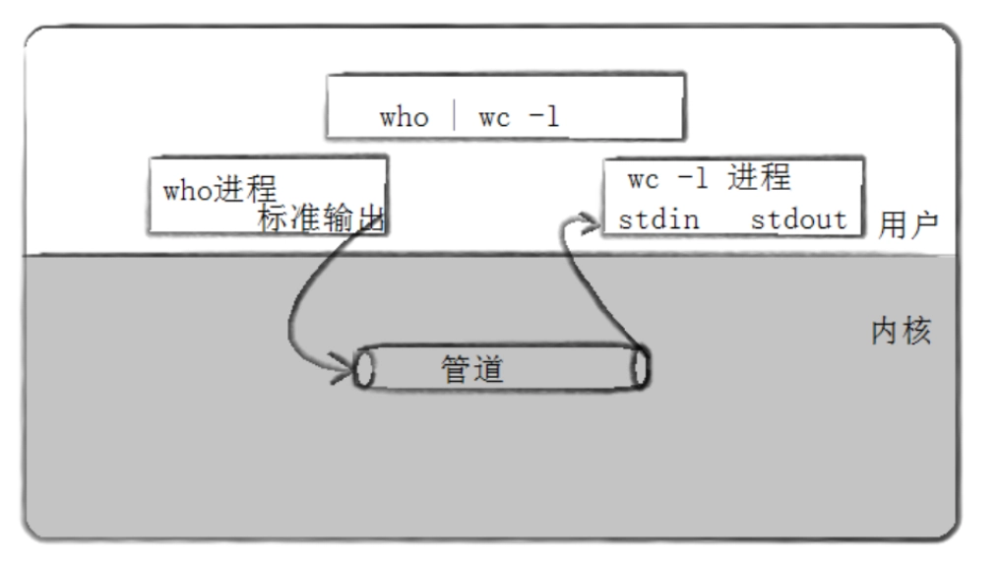

## 匿名管道


### 匿名管道原理

在早期，Linux工程师们在想，能不能基于已有的技术，直接进行进程间通信。工程师们把目光投向了文件系统，把文件的缓冲区拿出来，让两个进程都能看到不就可以实现通信了吗。由操作系统在内存创建一个管道文件，因为管道文件是内存级的，也不需要文件名，所以被称为**匿名管道**，管道文件是内存级的，不需要写入到磁盘，两个进程都可以访问管道文件，这样就实现了通信。管道文件是被操作系统单独设计的，有自己的系统调用，同时实现管道时Linux工程师们也复用了一部分文件系统的代码。


匿名管道，通常用来做父子进程通信。父进程先使用系统调用创建管道文件，以读写两种方式打开，分别返回读和写的文件描述符，写入到父进程的文件描述符表里。随后父进程创建子进程，子进程直接拷贝父进程的文件描述符表，相当于浅拷贝，文件描述符表里的文件描述符也指向同一个管道文件。这个管道文件只能用来做单向通信，也就是一个进程写另一个进程读，所以父子进程就关掉各自不需要的文件描述符，分别进行写和读操作。


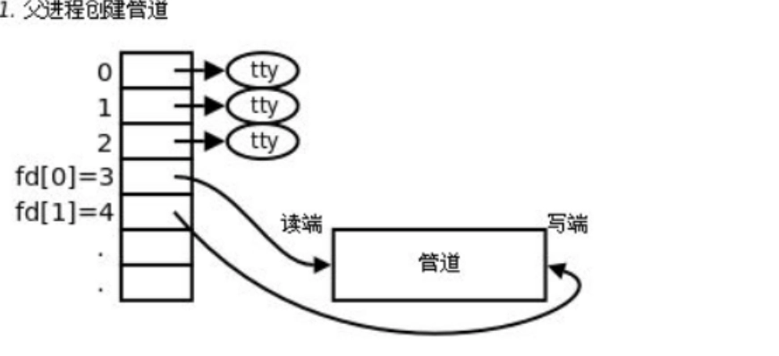

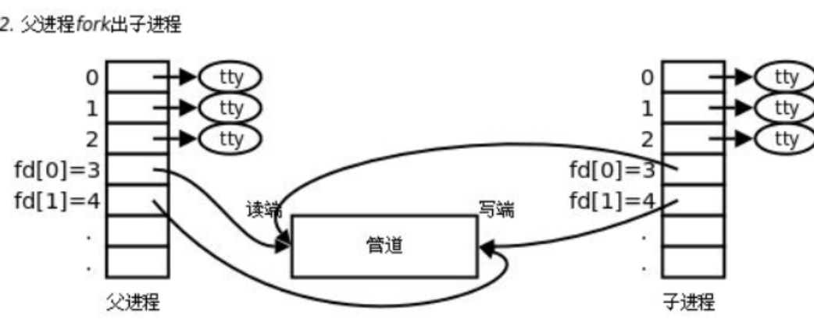

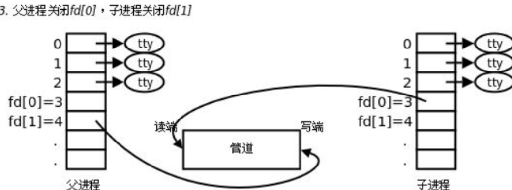


创建匿名管道的系统调用是`int pipe(int pipefd[2]);`，创建成功返回0，失败则返回-1，`pipefd[2]`是输出型参数，创建成功时`pipefd[0]`是管道读端文件描述符（只读），`pipefd[1]`是管道写端文件描述符（只写）。创建管道文件不需要提供文件路径，因为管道文件是内存级的，也不需要文件名，所以叫**匿名管道**。

运行下面的代码。
```cpp
#include <iostream>
#include <unistd.h>
#include <sys/wait.h>
#include <cstring>

int main() {
    int pipefd[2]={0};
    pid_t pid;
    char buffer[100];
    
    // 创建管道
    if (pipe(pipefd) == -1) 
    {
        std::cerr<<"pipe error"<<std::endl;
        return 1;
    }
    //pipefd[0]是读端，pipefd[1]是写端
    std::cout<<"pipefd[0]:"<<pipefd[0]<<std::endl;
    std::cout<<"pipefd[1]:"<<pipefd[1]<<std::endl;

    pid = fork();
    
    if (pid < 0) 
    {
        std::cerr<<"fork error"<<std::endl;
        return 1;
    }
    
    if (pid == 0) {
        // 子进程：写入数据
        close(pipefd[0]);  // 关闭读端
        
        const char *msg = "Hello from child!";
        write(pipefd[1], msg, strlen(msg) + 1);
        
        close(pipefd[1]);
    } else {
        // 父进程：读取数据
        close(pipefd[1]);  // 关闭写端
        
        ssize_t n = read(pipefd[0], buffer, sizeof(buffer));
        if (n > 0) {
            buffer[n] = '\0';
            std::cout << "父进程收到: " << buffer << std::endl;
        }
        
        close(pipefd[0]);
        wait(nullptr);
    }
    
    return 0;
}
```

```bash
user1@iZ2zeh5i3yddf3p4q4ueo7Z:~/mypipe$ make
g++ -o pipetest pipetest.cc -std=c++11
user1@iZ2zeh5i3yddf3p4q4ueo7Z:~/mypipe$ ./pipetest 
pipefd[0]:3
pipefd[1]:4
父进程收到: Hello from child!
```
我们可以看到管道文件的文件描述符分别返回3和4，因为012已经被占用了。

管道有几个特点：
1. 匿名管道，只能用来进行具有血缘关系的进程进行进程间通信（常用与父子进程）。
2. 管道文件自带同步机制，一个进程写完另一个进程才能读。
3. 管道是面向字节流的，写进程写入慢读进程读取快时就是写入一次输出一次，写进程写入快读进程读取慢时，怎么读取和怎么写入没有关系，取决于读进程的行为。
4. 管道是单向通信的，刚开始设计时就设计为单向通信，然后才因为单向通信的特性命名为管道。在任何时刻一个发一个收称为半双工，任何时刻双方可以同时收发称为全双工。管道属于半双工的特殊情况。
5. 管道文件的生命周期是随进程的。两个进程都退出了管道也就被关闭了。


按照进程的读写速度和进程状态还可以把管道通信分为4种情况
1. 写慢读快，读取进程就要阻塞，等待写进程。
2. 写快读慢，写满了的时候写进程就要阻塞，等待读进程。
3. 写入进程关，读取进程继续读时，read就会读取直到返回0，表示读取到文件末尾。
4. 读取进程关，写入进程继续写时，写入进程在写入没有意义，操作系统为了不浪费资源，不做没有意义的事情。操作系统会发送异常信号13(SIGPIPE)杀掉写入进程。
   

### 管道的容量和原子性

管道不是无限大的，也有自己的容量。
运行下面的代码可以输出管道文件的字节数。
```c
#define _GNU_SOURCE
#include <unistd.h>
#include <fcntl.h>
#include <stdio.h>

int main() {
    int fd[2];
    pipe(fd);
    int size = fcntl(fd[0], F_GETPIPE_SZ);
    printf("%d\n", size);
    close(fd[0]);
    close(fd[1]);
    return 0;
}
```
```bash
user1@iZ2zeh5i3yddf3p4q4ueo7Z:~/pipe$ gcc -o pipe_size pipe_size.c 
user1@iZ2zeh5i3yddf3p4q4ueo7Z:~/pipe$ ./pipe_size 
65536
user1@iZ2zeh5i3yddf3p4q4ueo7Z:~/pipe$ 
```
输出65536，换算一下就是64KB，管道的默认容量是64KB。


使用`man 7 pipe`指令查看手册可以看到：
```bash
 PIPE_BUF
       POSIX.1 says that write(2)s of less than PIPE_BUF bytes must be atomic: the output data is written to the pipe
       as  a contiguous sequence.  Writes of more than PIPE_BUF bytes may be nonatomic: the kernel may interleave the
       data with data written by other processes.  POSIX.1 requires PIPE_BUF to be at least 512  bytes.   (On  Linux,
       PIPE_BUF  is  4096 bytes.)
```
这段说明了当请求写入的字节数 `≤ PIPE_BUF` 时，`write()` 是原子的，Linux上`PIPE_BUF`通常是 4096 字节。  
什么是原子的？原子性意味着：数据要么完整地写入管道（如果空间足够），要么一点都不写入（如果空间不足且管道是阻塞模式，调用会阻塞直到能完整写入；如果是非阻塞模式，则返回错误 EAGAIN），而且绝不会与其他进程的数据交叉。总结就是要么不写，要么写完。

### 基于匿名管道的进程池

一个父进程创建多个管道，再创建相同数量的子进程。父进程写入子进程读，当父进程没有写入时所有子进程都会阻塞等待父进程，往里写就可以唤醒子进程，这样就相当于暂停和唤醒子进程了。我们可以提前规定好任务码，如1代表下载任务，2代表上传任务，3代表输出日志等等，父进程传入任务码子进程就会执行任务码对应的任务。

```cpp
//人工智能生成
#include <unistd.h>
#include <sys/epoll.h>
#include <sys/wait.h>
#include <fcntl.h>
#include <cstring>
#include <vector>
#include <stdexcept>
#include <iostream>
#include <cassert>

// 任务结构体（定长）
struct Task {
    int id;
    int data;   // 示例：求平方
};

// 结果结构体（定长，且须与 Task 的 id 对应）
struct Result {
    int id;
    int value;  // 平方值
};

// 子进程信息
struct Worker {
    pid_t pid;
    int task_fd;    // 父进程写入任务
    int result_fd;  // 父进程读取结果
    bool idle;      // 是否空闲
};

class ProcessPool {
public:
    // 构造函数，创建 num_workers 个子进程
    explicit ProcessPool(size_t num_workers) {
        workers_.reserve(num_workers);
        for (size_t i = 0; i < num_workers; ++i) {
            create_worker();
        }
        // 创建 epoll 实例
        epoll_fd_ = epoll_create1(0);
        if (epoll_fd_ == -1) {
            throw std::runtime_error("epoll_create1 failed");
        }
        // 将所有结果管道注册到 epoll
        for (const auto& w : workers_) {
            add_result_fd(w.result_fd);
        }
    }

    // 禁止拷贝
    ProcessPool(const ProcessPool&) = delete;
    ProcessPool& operator=(const ProcessPool&) = delete;

    ~ProcessPool() {
        shutdown();
    }

    // 提交一个任务，返回是否成功分配（若无空闲子进程则失败）
    bool submit(const Task& task) {
        for (auto& w : workers_) {
            if (w.idle) {
                // 向子进程写入任务
                ssize_t n = write(w.task_fd, &task, sizeof(task));
                if (n != sizeof(task)) {
                    std::cerr << "Failed to write task to worker " << w.pid << std::endl;
                    return false;
                }
                w.idle = false;
                return true;
            }
        }
        return false; // 所有子进程忙
    }

    // 非阻塞地收集所有已完成的结果
    // 返回收集到的结果数量
    int collect(std::vector<Result>& results) {
        const int MAX_EVENTS = workers_.size();
        epoll_event events[MAX_EVENTS];

        // 使用 epoll_wait 检查可读的结果管道（超时设为 0 立刻返回）
        int nfds = epoll_wait(epoll_fd_, events, MAX_EVENTS, 0);
        if (nfds < 0) {
            if (errno == EINTR) return 0;
            throw std::runtime_error("epoll_wait failed");
        }

        for (int i = 0; i < nfds; ++i) {
            int fd = events[i].data.fd;
            // 找到对应的 worker
            Worker* worker = nullptr;
            for (auto& w : workers_) {
                if (w.result_fd == fd) {
                    worker = &w;
                    break;
                }
            }
            if (!worker) continue;

            // 读取结果（定长，假设一次 read 能读出一个完整结构体）
            Result res;
            ssize_t n = read(fd, &res, sizeof(res));
            if (n == 0) {
                // 子进程关闭了写端（异常情况）
                std::cerr << "Worker " << worker->pid << " closed result pipe\n";
                worker->idle = false; // 不再使用
                // 从 epoll 移除该 fd
                epoll_ctl(epoll_fd_, EPOLL_CTL_DEL, fd, nullptr);
                close(fd);
                worker->result_fd = -1;
            } else if (n == sizeof(Result)) {
                results.push_back(res);
                worker->idle = true;   // 标记空闲，可接收新任务
            } else if (n < 0) {
                if (errno != EAGAIN && errno != EWOULDBLOCK) {
                    perror("read result");
                }
            } else {
                std::cerr << "Partial read on result fd " << fd << std::endl;
            }
        }
        return results.size();
    }

    // 等待并收集所有子进程的结果（阻塞，直到所有提交的任务返回）
    // 仅适用于任务数已知且无新任务提交的情况
    void wait_all(std::vector<Result>& results, int expected_tasks) {
        while (results.size() < static_cast<size_t>(expected_tasks)) {
            collect(results);
        }
    }

    // 关闭池：通知所有子进程退出，并回收资源
    void shutdown() {
        if (shutdown_done_) return;
        shutdown_done_ = true;

        // 关闭所有任务写端，子进程将 read 到 0 后退出
        for (auto& w : workers_) {
            if (w.task_fd >= 0) {
                close(w.task_fd);
                w.task_fd = -1;
            }
        }

        // 等待所有子进程退出
        for (auto& w : workers_) {
            if (w.pid > 0) {
                waitpid(w.pid, nullptr, 0);
                w.pid = 0;
            }
            // 关闭剩余的结果读端
            if (w.result_fd >= 0) {
                epoll_ctl(epoll_fd_, EPOLL_CTL_DEL, w.result_fd, nullptr);
                close(w.result_fd);
                w.result_fd = -1;
            }
        }
        if (epoll_fd_ >= 0) {
            close(epoll_fd_);
            epoll_fd_ = -1;
        }
        workers_.clear();
    }

private:
    std::vector<Worker> workers_;
    int epoll_fd_ = -1;
    bool shutdown_done_ = false;

    // 创建一个子进程并建立管道
    void create_worker() {
        int task_pipe[2];
        int result_pipe[2];

        if (pipe(task_pipe) != 0) throw std::runtime_error("task pipe failed");
        if (pipe(result_pipe) != 0) {
            close(task_pipe[0]); close(task_pipe[1]);
            throw std::runtime_error("result pipe failed");
        }

        pid_t pid = fork();
        if (pid < 0) {
            close(task_pipe[0]); close(task_pipe[1]);
            close(result_pipe[0]); close(result_pipe[1]);
            throw std::runtime_error("fork failed");
        }

        if (pid == 0) {
            // 子进程
            close(task_pipe[1]);   // 关闭父进程用的写端
            close(result_pipe[0]); // 关闭父进程用的读端
            worker_loop(task_pipe[0], result_pipe[1]);
            // 退出
            close(task_pipe[0]);
            close(result_pipe[1]);
            _exit(0);
        } else {
            // 父进程
            close(task_pipe[0]);   // 关闭子进程用的读端
            close(result_pipe[1]); // 关闭子进程用的写端

            // 将任务写端设为非阻塞（可选，但推荐）
            int flags = fcntl(task_pipe[1], F_GETFL, 0);
            fcntl(task_pipe[1], F_SETFL, flags | O_NONBLOCK);

            // 将结果读端设为非阻塞
            flags = fcntl(result_pipe[0], F_GETFL, 0);
            fcntl(result_pipe[0], F_SETFL, flags | O_NONBLOCK);

            Worker w;
            w.pid = pid;
            w.task_fd = task_pipe[1];
            w.result_fd = result_pipe[0];
            w.idle = true;
            workers_.push_back(w);
        }
    }

    // 子进程工作循环
    static void worker_loop(int task_fd, int result_fd) {
        Task task;
        ssize_t n;
        while ((n = read(task_fd, &task, sizeof(task))) == sizeof(task)) {
            // 处理任务：计算平方
            Result res;
            res.id = task.id;
            res.value = task.data * task.data;
            // 发送结果
            // 注意：如果写阻塞，子进程会停住，父进程会检测到结果管道可读而继续
            ssize_t w = write(result_fd, &res, sizeof(res));
            if (w != sizeof(res)) {
                // 父进程可能已关闭读端，退出循环
                break;
            }
        }
        // read 返回 0 或出错：父进程关闭了 task_fd，正常退出
    }

    // 将结果 fd 加入 epoll 监听
    void add_result_fd(int fd) {
        epoll_event ev{};
        ev.events = EPOLLIN;     // 可读
        ev.data.fd = fd;
        if (epoll_ctl(epoll_fd_, EPOLL_CTL_ADD, fd, &ev) == -1) {
            throw std::runtime_error("epoll_ctl ADD failed");
        }
    }
};

// ========== 使用示例 ==========
int main() {
    const size_t NUM_WORKERS = 4;
    ProcessPool pool(NUM_WORKERS);

    // 提交 10 个任务
    for (int i = 0; i < 10; ++i) {
        Task t;
        t.id = i;
        t.data = i * 2;
        // 轮询直到有空闲子进程
        while (!pool.submit(t)) {
            // 先收集部分结果，以便释放子进程
            std::vector<Result> res;
            pool.collect(res);
            for (const auto& r : res) {
                std::cout << "Result: id=" << r.id << ", square=" << r.value << std::endl;
            }
        }
    }

    // 收集所有剩余结果
    std::vector<Result> all_results;
    pool.wait_all(all_results, 10);
    for (const auto& r : all_results) {
        std::cout << "Final: id=" << r.id << ", square=" << r.value << std::endl;
    }

    // pool 析构会自动 shutdown
    return 0;
}
```


多个子进程之间需要进行负载均衡，不然可能会出现一进程有难多进程围观的现象，这样就是负载不均衡。为了保持多个进程之间分配的工作相对均衡，最简单的策略是轮询空闲子进程，记录哪个进程在忙，把任务分配到不忙的进程上。负载均衡还有其他策略，如随机分配和添加负载指标。  
创建子进程时子进程会直接拷贝父进程的文件描述符表，父进程的文件描述符表会有多个指向其他管道的文件描述符，子进程直接拷贝时也有，如果不关闭就相当于管道文件不只有父进程是写打开状态，父进程退出了由于还有其他子进程打开了管道文件的写端，所以管道文件对应的子进程会一直处于读取阻塞等待状态无法退出，所以创建子进程时要关掉多余的文件，只保留自己的。


## 命名管道

匿名管道只能用来进行具有血缘关系的进程之间进行通信，如果两个进程不相关，可以使用命名管道进行通信。


假如有两个进程打开了同一个文件，操作系统不会在内存中加载两次文件，因为没必要，两个进程的struct file都指向同一个文件即可，这样也节约了内存空间。所以父子进程都可以向同一个显示器文件进行打印。  
两个进程打开了同一个文件，也是让不同的进程看到同一份资源，那么也可以进行进程间通信。打开同一个路径下的同一个文件，而且文件有名字，所以可以保证两个进程访问的是同一个文件。因为这个文件有文件名，所以叫做命名管道。文件有自己的文件缓冲区，管道文件只会被打开，不需要把缓冲区刷新到磁盘。命名管道本质上是管道（内核缓冲区）在文件系统中的一个“名片”，核心仍然是内核中的环形缓冲区，而非磁盘文件。


使用 `mkfifo 管道名` 命令即可创建命名管道（FIFO）

```bash
user1@iZ2zeh5i3yddf3p4q4ueo7Z:~/fifo$ mkfifo my_pipe
user1@iZ2zeh5i3yddf3p4q4ueo7Z:~/fifo$ ls -l my_pipe 
prw-rw-r-- 1 user1 user1 0 Apr 27 21:29 my_pipe
user1@iZ2zeh5i3yddf3p4q4ueo7Z:~/fifo$ 
```
权限前的首字母是p，代表这是一个管道文件，占用空间是0字节，操作系统会对管道文件做特殊处理。


我们还可以使用系统调用`int mkfifo(const char *pathname, mode_t mode);`来创建管道，`pathname`是要创建的命名文件路径（绝对路径或相对路径），`mode`是创建命名文件的权限位（例如 0666），同时还受进程 `umask` 的影响，最终权限为` mode & ~umask`，创建成功返回 0，失败返回 -1。使用系统调用`int unlink(const char *pathname);`来删除管道。  
运行以下代码，使用命名管道来模拟服务端进程和客户端进程之间通信。打开两个窗口，一个运行server服务端，一个运行client客户端，客户端输入消息服务端可以接收。
```cpp
//让两个进程看到同一个管道文件，创建一个新的comm.hpp头文件分别引入
#pragma once
#define     FIFO_FILE "fifo"
```
```cpp
//server.cc
#include <sys/types.h>
#include <sys/stat.h>
#include <unistd.h>
#include <fcntl.h>
#include <iostream>
#include <string>
#include "comm.hpp"

int main()
{
    umask(0);                        // 自定义umaks用来替换系统的umaks
    int f = mkfifo(FIFO_FILE, 0666); // 设置权限，0666就是rw-rw-rw-
    if (f != 0)
    {
        std::cerr << "mkfifo error" << std::endl;
        return 1;
    }

    // 打开文件，write方没有执行open的时候，read方，就要在open内部进行阻塞，直到有人把管道文件打开了，open才会返回
    int fd = open(FIFO_FILE, O_RDONLY);
    if (fd < 0)
    {
        std::cerr << "open error" << std::endl;
        return 2;
    }

    char buffer[2048];

    std::cout << "open success：" << std::endl;

    while (true)
    {
        int n = read(fd, buffer, sizeof(buffer) - 1);
        if (n > 0)
        {
            buffer[n] = 0;
            std::cout << "client say：" << buffer << std::endl;
        }
        else if (n == 0)
        {
            std::cout << "all quit"  << std::endl;
            break;
        }
        else
        {
            std::cerr << "read error" << std::endl;
            break;
        }
        
    }

    close(fd);

    int u = unlink(FIFO_FILE);

    if (u == 0)
    {
        std::cout << "remove fifo success" << std::endl;
    }
    else
    {
        std::cout << "remove fifo failed" << std::endl;
    }
    return 0;
}
```
```cpp
//client.cc
#include <sys/types.h>
#include <sys/stat.h>
#include <unistd.h>
#include <fcntl.h>
#include <iostream>
#include <string>
#include "comm.hpp"

int main()
{
    int fd = open(FIFO_FILE, O_WRONLY);
    if (fd < 0)
    {
        std::cerr << "open error" << std::endl;
        return 2;
    }

    std::string message;
    int cut =1;
    pid_t id = getpid();

    while (true)
    {
        std::cout<<"please enter# "<<std::endl;
        std::getline(std::cin,message);
        message += (", message number:"+ std::to_string(cut++) + ",[" +std::to_string(id) + "]" );
        int n = write(fd,message.c_str(),message.size());
    }
    close(fd);
    return 0;
}
```


```bash
user1@iZ2zeh5i3yddf3p4q4ueo7Z:~/fifo$ ./client 
please enter# 
123
please enter# 
666
please enter# 
114514
please enter# 
^C
user1@iZ2zeh5i3yddf3p4q4ueo7Z:~/fifo$ 
```
```bash
user1@iZ2zeh5i3yddf3p4q4ueo7Z:~/fifo$ ./server 
open success：
client say：123, message number:1,[63625]
client say：666, message number:2,[63625]
client say：114514, message number:3,[63625]
all quit
remove fifo success
user1@iZ2zeh5i3yddf3p4q4ueo7Z:~/fifo$ 
```
在客户端输入消息，服务端可以接收。

---
命名管道的特点和匿名管道相同，只有一点不同，命名管道可以用来进行两个不相关的进程之间进行通信。


## systemV

systemV是一种标准，Linux内核支持此标准，专门设计了IPC通信模块。systemV规定了通信接口设计，原理等，systemV的不同通信方式都有相似性。

进程间通信的本质是让不同进程看到同一份资源，systemV也是如此。

### systemV 共享内存

共享内存就是让两个进程使用同一块物理内存。首先在物理内存申请一块空间，进程A也在自己的虚拟地址开一块一样大的空间，然后通过页表映射物理内存地址和虚拟地址，进程B也是如此。这样进程A和B就都看到了同一份内存资源，可以进行通信了。  
操作系统负责管理计算机的软硬件资源，所以申请物理内存和页表映射等工作都是操作系统来完成，用户通过系统调用来使用共享内存。  
释放共享内存时，进程A和B分别释放在虚拟地址中申请的空间，页表的映射关系也没了，操作系统把物理内存中没人用的共享内存释放。


系统内可能会有多个进程在使用多块共享内存来进行通信，操作系统需要管理这些同时存在的共享内存，使用先描述再组织的方式来管理。共享内存一定要有对应的描述共享内存的内核结构体对象以及物理内存。进程和共享内存的关系就是内核数据结构之间的关系。

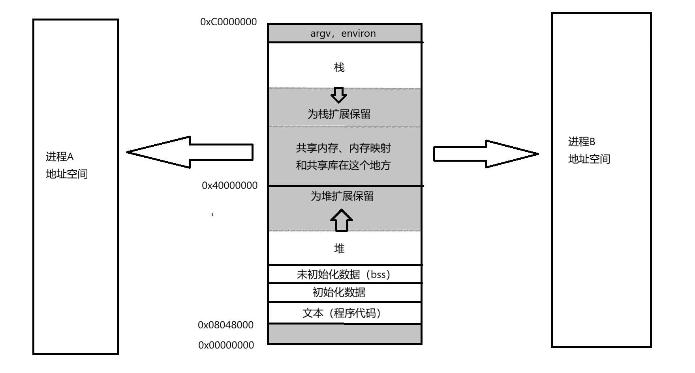


#### 共享内存的接口和特点


使用系统调用`shmget`可以申请共享内存。
```c
#include <sys/ipc.h>
#include <sys/shm.h>

int shmget(key_t key, size_t size, int shmflg);
```
参数`size`是创建共享内存的大小。`shmflg`是标记位，通常有两种，`IPC_CREAT`和`IPC_EXCL`，是一种宏，使用`int`当作位图的方式传递；`IPC_CREAT`代表创建共享内存，如果目标共享内存不存在，就创建，否则打开这个已经存在的共享内存，并返回，`IPC_EXCL`单独使用无意义，必须和`IPC_CREAT`组合使用，`IPC_CREAT | IPC_EXCL`代表如果要创建的共享内存不存在就创建，如果已经存在`shmget`就会出错返回，保证只要成功返回那么一定是新创建的共享内存，同时`shmflg`还可以设置权限，如`IPC_CREAT | IPC_EXCL | 0666`就是设置权限为`0666`。  
参数`key`是共享内存的标识符。不同的进程要使用共享内存来通信，那么就要保证看到的是同一块共享内存，需要标识符来保证共享内存的唯一性。`key`用来区分不同的共享内存，`key`是在用户层创建，传入给操纵系统。假如由操作系统创建`key`，那么为了让进程A和B看到同一块共享内存，进程A必须要把`key`交给进程B，但是把`key`交给进程B又需要实现进程间通信，所以就要由用户来创建`key`，指定进程A和B使用相同的`key`。在命名管道里两个进程打开同一个文件，而同路径下的文件具有唯一性，那么两个进程打开的肯定是同一个管道文件了，共享内存的`key`就相当于标识共享内存的唯一性。

进程结束了，如果没有删除共享内存，共享内存资源会一直存在。共享内存资源的生命周期随内核，如果沒有显示的删除，即便进程退出了，IPC资源依旧被占用。
创建共享内存后可以使用`ipcs -m`指令来查看。`perms`是权限，`nattch`是一共有多少个进程关联，`bytes`是共享内存的大小。
```bash
user1@iZ2zeh5i3yddf3p4q4ueo7Z:~/sharemm$ ipcs -m

------ Shared Memory Segments --------
key        shmid      owner      perms      bytes      nattch     status      
0x52037e7f 0          user1      666        4096       0                       
```
共享内存在创建时，大小必须是4KB（4096字节）的整数倍，操作系统对内存管理的最小单位是4KB，假如申请4097字节大小的共享内存，操作系统会在内存里分配两个4KB大小的块给共享内存使用，剩下的4095字节被浪费了无法使用。  
如果要删除或控制共享内存，不能使用`key`，`key`只给操作系统来区分唯一性，指令本质是运行在用户层的，删除或控制共享内存需要使用`shmid`。  
使用系统调用`shmctl`可以删除或控制共享内存。
```c
#include <sys/ipc.h>
#include <sys/shm.h>

int shmctl(int shmid, int cmd, struct shmid_ds *buf);
```
参数`shmid`就是共享内存的`shmid`，`cmd`就是传入的命令，传入`IPC_RMID`就是删除共享内存。

使用系统调用`shmat`来把当前进程的虚拟地址和共享内存进行映射。`at`是关联，挂接的含义，`shmat`就是将共享内存挂接到进程的地址空间中。
```c
#include <sys/types.h>
#include <sys/shm.h>

void *shmat(int shmid, const void *shmaddr, int shmflg);
```
返回值是共享内存在虚拟地址空间的起始虚拟地址，参数`shmid`就是要映射的共享内存的`shmid`，参数`shmaddr`是虚拟地址，指定固定地址进行挂接，一般可设为`NULL`让操作系统自动选择未占用的地址空间区域，参数`shmflg`是附加选项标志，设为0是默认行为，没有特殊要求（读写映射），如果需要让共享内存是只读的可以设为`SHM_RDONLY`。

`shmat`和`malloc`很相似，都是在虚拟地址空间内申请内存，调用`shmat`成功后在使用上和`malloc`申请的空间一样。  
读写共享内存没有调用系统调用，共享区属于用户空间，可以让用户直接使用。共享内存是进程间通信中速度最快的方式，映射之后读写可以之间被其他进程看到，不需要使用系统调用获取或写入内容。假如先开一块共享内存空间，把磁盘上的文件加载到共享内存里，那么就可以让进程访问了，共享内存就是动态库加载的底层原理，只不过动态库加载的时候会使用其他系统调用。


共享内存的优点是快，缺点是两个进程之间没有同步机制，会出现数据不一致，共享内存没有对共享内存中数据的保护机制。如果我们要保护数据，可以在两个进程之间再创建一个命名管道，再通过管道通知另外一个进程进行读写操作。

#### 使用共享内存通信示例
运行以下代码来让进程使用共享内存进行通信，并使用命名管道进行通知。
```cpp
//Shm.hpp
#pragma once
#include <sys/ipc.h>
#include <sys/shm.h>
#include <sys/types.h>

#include <cstdio>
#include <iostream>
#include <string>
#include <unistd.h>

const int gdefaultid = -1;
const int gsize = 4096;
const std::string pathname(".");
const int projid = 114514;
const int gmode = 0666;

#define CREATER "creater"
#define USER "user"

#ifndef ERR_EXIT
#define ERR_EXIT(m) do{perror(m);exit(EXIT_FAILURE);} while (0)
#endif

class Shm
{
public:
    Shm(const std::string &pathname, int projid, const std::string &usertype)
        : _shmid(gdefaultid),
          _size(gsize),
          _start_mem(nullptr),
          _usertype(usertype)
    {
        _key = ftok(pathname.c_str(), projid);
        if (_key < 0)
        {
            ERR_EXIT("ftok");
        }
        printf("key : 0x%x\n", _key);
        if (_usertype == CREATER)
        {
            Create();
        }
        else if (_usertype == USER)
        {
            Get();
        }
        Attach();
    }

    void CreateHelper(int flag)
    {

        // 共享内存的生命周期随内核，进程退出前需要显式删除
        //_shmid = shmget(k,_size,IPC_CREAT | IPC_EXCL | gmode);
        _shmid = shmget(_key, _size, flag);
        if (_shmid < 0)
        {
            ERR_EXIT("shmget");
        }
        printf("_shmid : %d\n", _shmid);
    }

    void *VirtualAddr()
    {
        printf("VirtualAddr: %p\n", _start_mem);
        return _start_mem;
    }

    int Size()
    {
        return _size;
    }

    ~Shm()
    {
        if(_usertype == CREATER)
        {
            Destroy();
        }
    }

private:
    void Create()
    {
        // 创建的是全新的共享内存
        CreateHelper(IPC_CREAT | IPC_EXCL | gmode);
    }

    void Attach()
    {
        _start_mem = shmat(_shmid, nullptr, 0);
        if ((long long)_start_mem < 0)
        {
            ERR_EXIT("shmat");
        }
        printf("attach success\n");
    }

    void Get()
    {
        CreateHelper(0);
    }

    void Destroy()
    {
        if (_shmid == gdefaultid)
        {
            return;
        }

        int n = shmctl(_shmid, IPC_RMID, nullptr);
        if (n == 0)
        {
            printf("shmctl delete shm:%d success\n", _shmid);
        }
        else
        {
            ERR_EXIT("shmctl");
        }
    }

    int _shmid;
    key_t _key;
    int _size;
    void *_start_mem;
    std::string _usertype;
};
```

```cpp
// fifo.hpp
#pragma once

#include <sys/types.h>
#include <sys/stat.h>
#include <fcntl.h>
#include <unistd.h>
#include <string>
#include <cstdio>
#include <cstdlib>
#include <cerrno>

// 默认使用 "fifo"，可在包含前 #define FIFO_FILE "fifo"
#ifndef FIFO_FILE
#define FIFO_FILE "fifo"
#endif

#ifndef ERR_EXIT
#define ERR_EXIT(m) do { perror(m); exit(EXIT_FAILURE); } while(0)
#endif

class Fifo
{
public:
    // 创建管道文件（只需一端调用）
    static void Make()
    {
        if (mkfifo(FIFO_FILE, 0666) < 0)
        {
            if (errno != EEXIST)
                ERR_EXIT("mkfifo");
        }
    }

    // 删除管道文件（通常由 server 退出时清理）
    static void Remove()
    {
        if (unlink(FIFO_FILE) < 0 && errno != ENOENT)
            perror("unlink fifo");
    }

    // 打开管道，flags 为 O_RDONLY 或 O_WRONLY
    Fifo(int flags) : _fd(-1)
    {
        _fd = open(FIFO_FILE, flags);
        if (_fd < 0)
            ERR_EXIT("open fifo");
    }

    ~Fifo()
    {
        if (_fd >= 0)
            close(_fd);
    }

    // 阻塞读
    ssize_t Read(void *buf, size_t count)
    {
        ssize_t n = read(_fd, buf, count);
        if (n < 0) ERR_EXIT("read fifo");
        return n;
    }

    // 写
    ssize_t Write(const void *buf, size_t count)
    {
        ssize_t n = write(_fd, buf, count);
        if (n < 0) ERR_EXIT("write fifo");
        return n;
    }

private:
    int _fd;
};
```

```cpp
//server.cc
#include "Shm.hpp"
#include "fifo.hpp"

int main()
{
    Shm shm(pathname, projid, CREATER);

    char *mem = (char *)shm.VirtualAddr();

    // 2. 初始化 FIFO（创建 + 只读打开）
    Fifo::Make();        // 创建管道文件
    Fifo fifo(O_RDONLY); // 打开读端，会阻塞直到 client 打开写端

    int count = 1;
    while (true)
    {
        char sig;
        ssize_t n = fifo.Read(&sig, 1);
        if (n == 0)        // FIFO 写端关闭，退出
            break;

        printf("%s\n", mem);
    }

    return 0;
}
```

```cpp
//client.cc
#include "Shm.hpp"
#include "fifo.hpp"

int main()
{

    Shm shm(pathname, projid, USER);

    char *mem = (char *)shm.VirtualAddr();

    Fifo fifo(O_WRONLY);

    int ind = 0;
    for (char i = 'A'; i <= 'Z'; i++, ind += 2)
    {
        mem[ind] = i;
        mem[ind + 1] = i;
        mem[ind + 2] = '\0';   // 结束符

        char sig = 1;
        fifo.Write(&sig, 1);
        sleep(1);
    }

    return 0;
}
```
运行后client会按顺序连续写两个字母，server会在写入后再读取，client写入到Z后server会读到0，进而退出。


### systemV 消息队列


System V 消息队列是Linux下一种报文模式的进程间通信机制。与共享内存（直接读写数据传输快，需额外同步）和 FIFO（字节流，需自行切分消息）不同，消息队列提供了基于消息的异步、带类型的数据传输，内核负责消息的缓冲和定位。

进程间通信就是让两个进程看到同一份资源，操作系统提供一个队列结构，进程A把自己要发送的消息拷贝到队列里，操作系统在队列里给进程A的消息新建一个节点，进程B也可以使用相同的方式发送消息，每个进程都可以往队列里发送多条消息，其他进程访问队列就可以得到消息，实现进程间通信。为了区分哪个消息是哪个进程发的，进程往队列发送消息时还需要添加消息类型，用来标识是谁发送的消息，当进程发现标识符不是自己的就可以读取了。消息队列提供了一种，一个进程给另一个进程发送有类型数据块的方式。

消息队列是由操纵系统提供的，可能会有多个进程在使用多个消息队列进行通信，操作系统就要对这些队列进行管理，使用先描述再组织的方式来管理。  
和共享内存相似，两个进程使用同一个`key`来保证两个进程看到的是同一个消息队列。

使用`msgget`可以创建或获取消息队列。
```c
#include <sys/types.h>
#include <sys/ipc.h>
#include <sys/msg.h>

int msgget(key_t key, int msgflg);
```
参数`key`同共享内存，`msgflg`也同共享内存，有`IPC_CREAT`和`IPC_EXCL`。


使用`msgctl`来删除或控制消息队列。
```c
#include <sys/types.h>
#include <sys/ipc.h>
#include <sys/msg.h>

int msgctl(int msqid, int cmd, struct msqid_ds *buf);
```
使用方式同共享内存。

使用系统调用`msgrcv`和`msgsnd`来收发数据。
```c
#include <sys/types.h>
#include <sys/ipc.h>
#include <sys/msg.h>

ssize_t msgrcv(int msqid, void *msgp, size_t msgsz, long msgtyp, int msgflg);
int msgsnd(int msqid, const void *msgp, size_t msgsz, int msgflg);
```
`msqid`是消息队列的`msqid`，和共享内存的`shmid`相似，`msgp`是指向用户定义的消息结构体的指针。  
System V 消息结构要求第一个字段是 `long` 型消息类型，后面是真实数据，例如：
```c
struct my_msgbuf {
    long mtype;        // 必须 > 0，用作接收选择的类型
    char mtext[100];   // 任意内容
};
```

在发送消息系统调用`msgsnd`中，`msgsz`：消息正文的大小（即 `msgp` 结构中除 `mtype` 外的数据长度）。不能超过系统上限 `MSGMAX`（通常 8192 字节）。`msgflg`：控制发送行为：0（默认）：若队列已满（达到 `MSGMNB` 上限或系统总消息数限制），调用阻塞直到有空间可用。`IPC_NOWAIT`：若队列满，立即返回错误，`errno = EAGAIN`。成功返回 0。失败返回 -1。  
在接收消息系统调用`msgrcv`中，`msqid`：队列 ID。`msgp`：指向与 `msgsnd` 相同结构的缓冲区，接收的消息将填入此处。`msgsz`：`msgp` 中数据缓冲区的最大长度。若真实消息正文 > `msgsz`：若未设 `MSG_NOERROR`，调用失败，`errno = E2BIG`。若设置了 `MSG_NOERROR`，则截断消息正文至 `msgsz`，不报错。`msgtyp`：消息选择类型，影响接收行为的核心参数：`msgtyp` = 0：接收队列中的第一条消息（无论其类型）。`msgtyp > 0`：接收该类型（等于 `msgtyp`）的第一条消息。`msgtyp < 0`：接收类型小于等于 `abs(msgtyp)` 的最小类型消息。例如 `msgtyp = -5` 会接收类型 `≤ 5` 且类型值最小的第一条消息。`msgflg`：标志位：0（默认）：若队列中没有符合 msgtyp 条件的消息，阻塞直到有符合条件的消息到达。`IPC_NOWAIT`：若没有符合条件的消息，立即返回 -1，`errno = ENOMSG`。`MSG_NOERROR`：允许截断超过 `msgsz` 的消息（见上面说明）。`MSG_EXCEPT`（Linux 特有）：当 `msgtyp > 0`时，接收不等于 `msgtyp` 的第一个类型的消息。即“除指定类型以外的第一条消息”。成功返回实际读入的数据字节数（即放入 `msgp` 中除 `mtype` 外的数据长度），失败返回 -1。


和共享内存类似，使用命令`ipcs -q`可以查看当前所有消息队列，使用`ipcrm -q msqid`可以删除`msqid`对应的消息队列。


### systemV 信号量

共享内存就是两个进程都能看到同一份内存（资源），但是共享内存没有保护机制，可能会出现数据不一致的问题，信号量就是解决这个问题的一种方案。

#### 并发编程概念

- 多个执行流(进程),能看到的同一份公共资源：共享资源，比如共享内存等。
- 被保护起来的共享资源叫做**临界资源**。
- 保护的式常见：互斥与同步。
- 任何时刻，只允许一个执流访问资源，叫做互斥。
- 多个执行流，访问临界资源的时候，具有一定的顺序性，叫做同步。
- 系统中某些资源一次只允许一个进程使用，称这样的资源为临界资源或互斥资源。
- 在进程中涉及到互斥资源的程序段叫临界区。我们写的代码=访问临界资源的代码(临界区)+不访问临界资源的代码(非临界区)。
- 所谓的对共享资源进行保护，本质是对访问共享资源的代码进行保护。


造成数据不一致问题的原因是共享资源没有被保护和各个进程的代码访问了共享资源。
在一个项目里，大部分不访问公共资源代码称为非临界区，与数据不一致问题无关，只有一小部分代码会访问公共资源称为临界区。保护（约束）临界区代码就是变相保护临界资源。  
互斥是保护临界资源的一种方式，任何时刻只允许一个执流访问资源。比如上厕所，一个坑位同时只能有一个人使用，或者是ATM机，同一时刻只能有一个人操作。厕所隔间的门有锁，有些独立的ATM机也是一个个小房间，门上也有锁。加上锁以后就可以防止其他人打扰。  
还有一种方法是同步，就像没有独立隔间的ATM机，每个人排队等候，一个人操作完了下一个人继续操作，具有顺序性。例如上面共享内存中使用命名管道来进行同步。


#### 原子性

原子性是说明只有两个状态，要么不做，要么做完。比如微信里发红包，对方要么没收红包，要么就是已经收下了红包。在有隔间的ATM机里取钱，外面的人要么等待，要么进入隔间操作ATM机，那么对于外面排队的人来说，在ATM隔间里操作的人的动作就是原子的。

如果有一个临界资源，想通过临界区来保护，进程A和进程B都需要在访问临界区前申请锁，锁本身也要被共享，所以申请锁的时候必须是原子的，要么申请成功要么申请失败。


### 信号量

信号量本质是一个计数器，用来表明临界资源中资源数量的多少。


张三开了一家电影院，里面有数个放映厅，放映厅就是一个临界资源。张三卖电影票最怕票卖多了和票号重复。放映厅里面的座位是有限的，李四买到票了，票上对应的座位就是他的，就算李四最后没去看电影，其他人也不能访问他的座位，买票本质就是对资源的预订机制，想访问临界资源都要买票。  
共享内存也是一个大放映厅，把一块大共享内存像放映厅一样划分为各个不同的区域，只要各个进程不访问同一个位置(票号重复)，同时访问共享内存的进程总数不过多（票卖多了），就能实现多个进程同时并发访问资源不出问题，提高了效率。  
信号量本质是一个计数器，假如某进程想要访问资源，需要先申请信号量，申请时信号量要-1，如果-1后信号量的值还是大于0，那么就允许进程访问资源。如果某进程申请信号量失败，那么就要被阻塞挂起。进程访问资源前要申请信号量，本质是对资源的预订机制。只要进程A申请信号量成功了，资源就给进程A了，即使不用，其他进程也无法访问，没有进程和进程A抢。

信号量本身就算共享资源，申请时需要-1，这个过程必须是原子的，信号量有自己的一套机制来实现原子性。申请时-1称为P操作，使用完毕时+1称为V操作，P操作和V操作都是原子的，进程通过PV操作来完成资源的预订机制。

后来张三给电影院添加了VIP放映厅，整个放映厅只有一个座位，那么这个放映厅的信号量就可以设为1，这个放映厅的状态只有有人和没人两种，里面有人时外面的人只能排队等待。信号量只有1或者0两态的信号量，叫做二元信号量。二元信号量的本质就是互斥。进程A使用资源时其他进程B进程C等都无法打扰，只能阻塞挂起。

访问公共资源时只有两种场景，当资源被整体使用时，就该使用二元信号量，当资源被划分为多块使用时，使用的就是多元信号量。

信号量也是一个结构体，里面包含了锁，计数器，进程PCB等待队列的指针等，锁用于保护计数器的原子性，等待队列指针用于让进程阻塞挂起。


要访问信号量，那么每个进程都得看到同一个信号量，不是只有传输数据才是进程间通信，进程之间相互通知也属于进程间通信。


#### 信号量的接口


使用系统调用`semget`来创建信号量。  
```c
#include <sys/types.h>
#include <sys/ipc.h>
#include <sys/sem.h>

int semget(key_t key, int nsems, int semflg);
```
`key`和`semflg`同共享内存，参数`nsems`是集合中信号量的数量，创建时必须 >0；仅获取已存在集合时可填 0。创建成功返回信号量集合标识符（`semid`，非负整数），失败返回 -1，并设置 errno。  
创建信号量时可以同时创建多个，这些信号量组合到一起就是信号量集。  


使用系统调用`semop`来进行原子操作信号量（P / V 操作）
```c
#include <sys/types.h>
#include <sys/ipc.h>
#include <sys/sem.h>

int semop(int semid, struct sembuf *sops, size_t nsops);
```
参数：  
`semid`：信号量集合标识符。  
`sops`：指向 `sembuf` 结构数组的指针，描述要进行的操作。  
`nsops`：数组中操作的数量。  
返回值：成功返回 0，失败返回 -1。  
struct sembuf 结构体：
```c
struct sembuf {
    unsigned short sem_num; // 信号量在集合中的索引（从0开始）
    short          sem_op;  // 操作值：
                            // >0 : V 操作，信号量值增加 sem_op
                            // <0 : P 操作，信号量值减少 |sem_op|；若不够减则阻塞
                            // =0 : 等待信号量值变为0
    short          sem_flg; // 标志位：
                            // 0 : 默认，阻塞等待
                            // IPC_NOWAIT : 非阻塞，若无法完成则立即返回错误
                            // SEM_UNDO : 进程退出时自动撤销操作
};
```


使用系统调用`semctl`来删除或控制信号量。  
```c
#include <sys/types.h>
#include <sys/ipc.h>
#include <sys/sem.h>

int semctl(int semid, int semnum, int cmd, ... /* union semun arg */);
```
`semid`：信号量集合标识符。  
`semnum`：操作针对的信号量在集合中的索引（从 0 开始）。对于 `IPC_RMID` 等全局命令，此参数被忽略（通常填 0）。  
`cmd`：控制命令，常用：  
- `IPC_RMID`：立即删除信号量集合，释放系统资源。  
- `SETVAL`：将某个信号量的值设置为指定值（需要第四个参数 `union semun`）。  
- `GETVAL`：返回某个信号量的当前值。  
- `IPC_STAT / IPC_SET`：获取/设置集合的内核属性结构 `semid_ds`。  
可选第四个参数：union semun，定义如下：  

```c
union semun {
    int              val;         // 用于 SETVAL
    struct semid_ds *buf;         // 用于 IPC_STAT / IPC_SET
    unsigned short  *array;       // 用于 GETALL / SETALL
};
```
（某些系统中 `union semun` 可能在头文件中未定义，需要用户自己定义。）  
返回值：  
`GETVAL`：返回信号量值。  
其他命令：成功返回 0，失败返回 -1。  

信号量的初始化不在创建时，需要使用`semctl`来设置信号量的初始值，即在参数`cmd`里使用`SETVAL`。

---


和共享内存类似，操作系统也需要管理所有的信号量。使用先描述，再组织的方式管理。共享内存，消息队列，信号量在操作系统里都是使用`key`来区分唯一性，操作系统把这三个东西当作同一种资源。这三个东西的结构体开头都一样，所以可以放在同一个数组里的指针进行管理。当需要用的时候，再对指针进行强制类型转换，这就实现了C语言版本的多态。


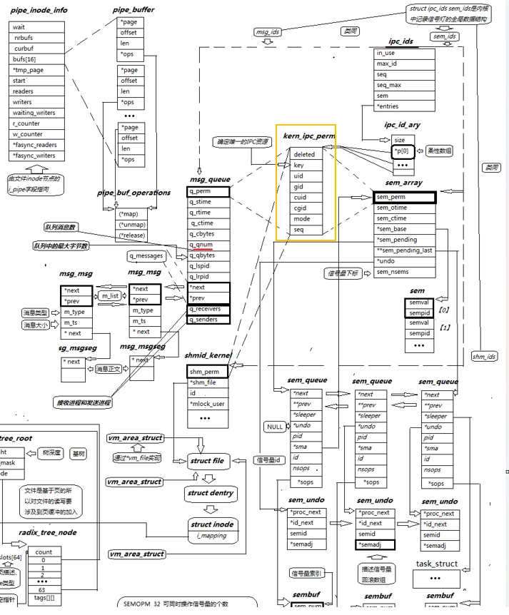


1. 通用 IPC 结构
- `ipc_ids`: 这是一个全局管理结构，用于管理系统中所有的 IPC 资源（消息、信号量、共享内存）。
    - 它包含一个 `ipc_id_ary` 指针数组（图中 *p[0] 指向的柔性数组），用于索引具体的 IPC 对象。
    - 它负责分配唯一的 ID 和管理资源的生命周期。
- `kern_ipc_perm`: 这是一个嵌入在具体 IPC 对象（如 msg_queue, sem_array, shmid_kernel）中的通用权限结构。
    - 它包含了所有 IPC 对象共有的元数据：权限模式、用户 ID、组 ID、创建者信息等。
    - 作用：实现了不同 IPC 类型的统一权限管理和查找。
2. 消息队列
- `msg_queue`: 代表一个具体的消息队列。
  - 包含 `kern_ipc_perm` 用于权限控制。
  - 包含统计信息（如 `q_cbytes` 当前字节数，`q_qnum` 消息数量）。
  - 关键指针：`q_messages` 指向实际的消息链表。
- `msg_msg`: 代表队列中的一条具体消息。
    - 包含消息类型 `m_type` 和消息大小 m_ts。
    - 通过 `next` 和 `prev` 指针形成双向链表。
    - 如果消息体过大，会使用 `msg_msgseg` 结构进行分段存储。
3. 信号量
- `sem_array`: 代表一个信号量集合（集）。
    - 包含 `kern_ipc_perm`。
    - 包含 `sem_nsems`，表示该集合中有多少个具体的信号量。
    - 关键指针：`*sem_base` 指向具体的信号量数组。
- `sem`: 具体的信号量单元。
    - 包含 `semval`（信号量的值）和 `sempid`（最后一次操作该信号量的进程 ID）。
- `sem_queue`: 用于管理等待信号量的进程队列。当进程请求资源失败（如 P 操作导致值小于 0）时，会被挂在这个等待队列上。
4. 共享内存
- `shmid_kernel`: 内核视角的共享内存标识符。
    - 包含 `kern_ipc_perm`。
    - 关键指针：`*shm_file` 指向底层的文件系统 `struct file`。这体现了 Linux "一切皆文件" 的设计哲学，共享内存底层也是基于 tmpfs 文件系统实现的。
- `vm_area_struct`: 这是内存管理的关键结构。当进程将共享内存映射到自己的地址空间时，会创建或更新这个结构，建立虚拟内存区域与底层文件的映射关系。


这三个结构体：`msg_queue`、`sem_array`、`shmid_kernel`，它们都在内存的起始位置嵌入了 `kern_ipc_perm` 结构。因为 `kern_ipc_perm` 总是位于子结构体的起始地址（偏移量为 0），所以指向子结构体的指针和指向其第一个成员（父结构体）的指针，其数值地址是完全一样的。这意味着，内核可以使用一个通用的 `struct kern_ipc_perm *` 指针来指向任何类型的 IPC 对象（无论是消息队列、信号量还是共享内存），这就实现了向上转型。

图中右上角的 `ipc_ids` 结构体管理着所有的 IPC 资源。  
`ipc_ids` 中的 `entries` 或数组 `*p[0]` 实际上存储的是指向 `kern_ipc_perm` 的指针，结构体地址和结构体首元素的地址相同。当系统调用（如 `msgsnd`, `semop`, `shmat`）通过 ID 查找资源时，内核首先找到的是通用的 `kern_ipc_perm`。  
类型识别：内核通过检查 `kern_ipc_perm` 中的元数据（或者通过容器宏 container_of）来确定这个通用指针到底属于哪种具体类型。如果是消息队列，就将其转换回 `msg_queue` 指针。如果是信号量，就将其转换回 `sem_array` 指针。  
这样就实现了多态。

查看Linux内核2.6.18版本的源代码[^1]，可以看见内核的进程通信结构体对象，从源代码中可以看到进程通信结构的各种属性，创建时返回的id就是柔性数组的下标。


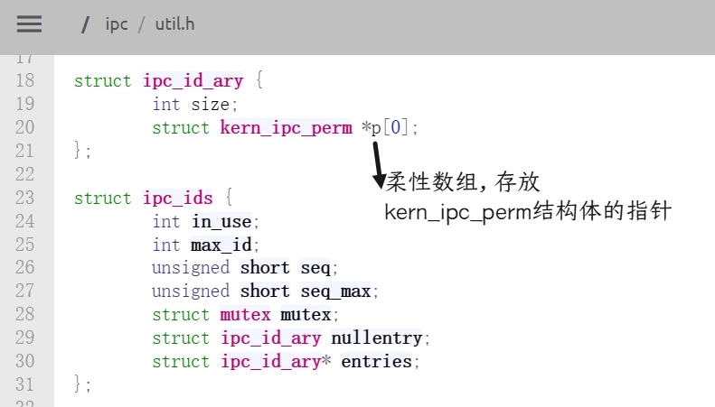

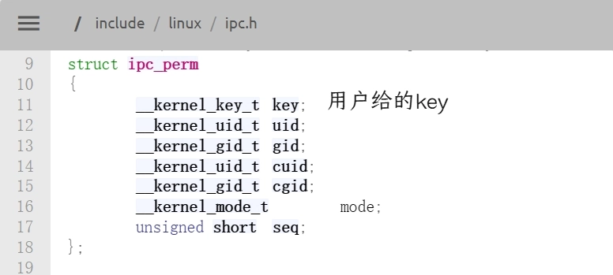

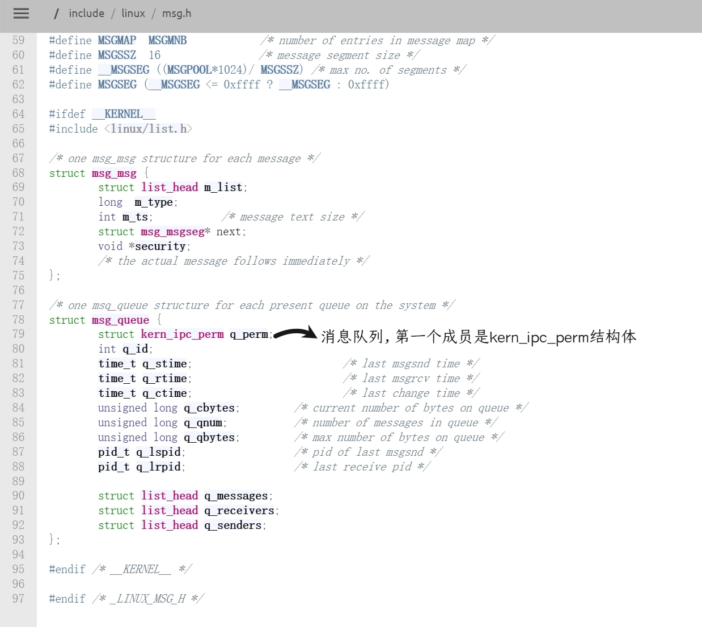

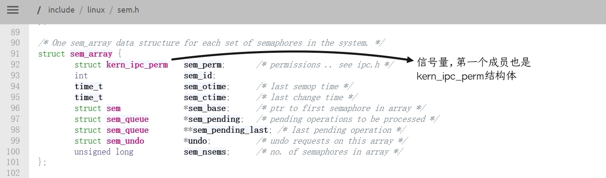

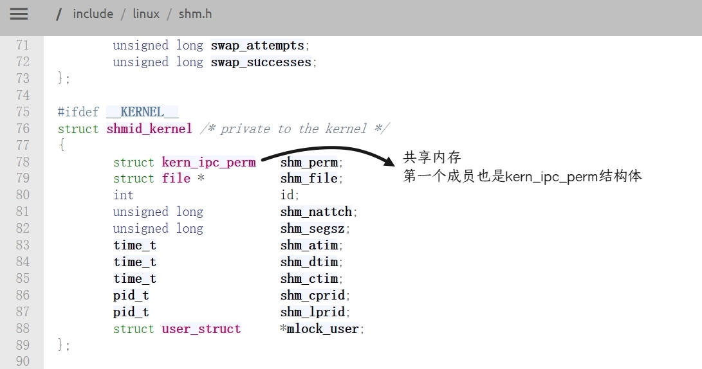


[^1]: 在bootlin的[网站](https://elixir.bootlin.com/linux/v2.6.18/source/ipc/util.h)和Linux内核官网的这个[网页](https://git.kernel.org/pub/scm/linux/kernel/git/torvalds/linux.git/tree/ipc/util.h?h=v2.6.18&id=3752aee96538b582b089f4a97a26e2ccd9403929)以及GitHub的这个[网页](https://github.com/torvalds/linux/blob/v2.6.18/ipc/util.h) 都能查看Linux2.6.18版本的源代码

---

ChatGPT Images 2生成，有部分文本错乱，仅供参考。


